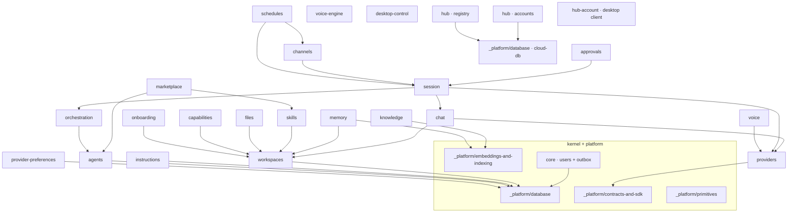

# Vynel — Code Documentation

This is the **as-built** documentation for Vynel: a guided tour of every module in the
codebase, written from the code on disk. It exists so a fresh session — human or Claude — can
understand what the system *is*, how each piece *works*, and how the pieces *connect*, without
re-reading the whole repo.

Read it like a book. The [product domains](#part-1--product-domains) are the chapters; the
[session spine](#part-1b--the-session-spine), the [hub](#part-1c--the-hub-cloud), the
[kernel](#part-2--the-kernel), the [platform](#part-3--platform), and the
[app shells](#part-4--app-shells) are the machinery the chapters stand on.

> **Companion docs (the *why*):** this set covers *what is* and *how it's built*. The product
> vision lives in `docs/vision.md`; the locked architecture in `docs/architecture.md`; the
> per-module build advice in `docs/module-notes/<module>.md`. Those answer *why* and *what next*;
> this set answers *what* and *how*.

## How each module is documented

Every module folder holds exactly two files:

| File | Holds | Rule |
|---|---|---|
| **`overview.md`** | What the module is and does — purpose, capabilities, responsibilities, vocabulary, rules, lifecycle. | Plain language. No code, no file paths. |
| **`structure.md`** | How its code is built and wired — file map, schema, operations, routes, the end-to-end pipeline, and its connections to other modules. | A *map*: tables, real `path:line` anchors, Mermaid diagrams. |

If you only need the idea, read `overview.md`. If you're about to change code, read `structure.md`.
Each file ends with a provenance line stamping the date it was mapped.

A unit may carry one optional third file, **`followup.md`** — open bugs and deliberately-deferred
items for that unit, each stamped with how it was established (probed / reviewed / read). It exists
so a known defect lives next to the code map instead of in a commit message nobody re-reads. Add one
only when there is something real to record, and close an item by fixing it and deleting the entry.

Three exist today: [`session-communication`](./session-communication/followup.md),
[`nodes`](./nodes/followup.md) and [`call-audio`](./call-audio/followup.md). **`nodes` and
`call-audio` have only that file** — their `overview.md` / `structure.md` pairs are unwritten, and
each folder stands as a marker that one is owed. A followup may legitimately arrive before the pair
does; findings should not wait on documentation.

## The shape of the system

Vynel is a **modular monolith**: features are `@vynel/<feature>` packages over one shared
`@vynel/db` kernel, imports point **down only**, and the runnable `apps/` are thin adapters that
never get imported by packages. The AI runtime is reached only through the provider seam.

`core` + the platform groups underpin everything. `workspaces` + `providers` are the next layer;
`chat` sits on both and `session` wraps `chat` into the turn runtime; `approvals` guards every
irreversible tool use. `memory` / `knowledge` / `skills` / `files` / `capabilities` /
`instructions` hang off `workspaces`. `marketplace` installs into `skills` + `agents`;
`orchestration` delegates across `agents`; `channels` carry turns outward and `schedules` fire
them on a clock; `onboarding` walks a new user through it all. The **hub** (`accounts`, `registry`)
is a separate cloud system over its own Postgres kernel; `hub-account` is the desktop's client for it.

## Part 1 — Product domains

The desktop features — the chapters of the book.

| Module | What it is | Docs |
|---|---|---|
| `workspaces` | Workspaces and their kinds — each a user-chosen folder Vynel adopts; the tenancy boundary. | [overview](./workspaces/overview.md) · [structure](./workspaces/structure.md) |
| `providers` | The `AiAgentProvider` seam + registry; the Claude SDK runtime is quarantined behind it. | [overview](./providers/overview.md) · [structure](./providers/structure.md) |
| `provider-preferences` | The user's preferred provider default (built + tested; no runtime consumer wired yet). | [overview](./provider-preferences/overview.md) · [structure](./provider-preferences/structure.md) |
| `chat` | Chat sessions, live SSE history, persistence, search. (The turn *runner* lives in `session`.) | [overview](./chat/overview.md) · [structure](./chat/structure.md) |
| `approvals` | The approval-card system — a user-scoped global queue every irreversible tool use routes through. | [overview](./approvals/overview.md) · [structure](./approvals/structure.md) |
| `memory` | Visible, tagged memory — editable facts with embeddings; the reserved `context` tag drives standing context. | [overview](./memory/overview.md) · [structure](./memory/structure.md) |
| `knowledge` | The file-watched index of workspace documents (directory + single-file sources); hybrid search. | [overview](./knowledge/overview.md) · [structure](./knowledge/structure.md) |
| `skills` | Vynel-layer skills — install/scope/settings, mirrored to `.claude/skills/` on disk. | [overview](./skills/overview.md) · [structure](./skills/structure.md) |
| `marketplace` | Read-only browse/install storefront over the catalog; installs dispatch into skills + agents. | [overview](./marketplace/overview.md) · [structure](./marketplace/structure.md) |
| `channels` | External access — Telegram per-user bots, sender allowlists, inbound/outbound queues. | [overview](./channels/overview.md) · [structure](./channels/structure.md) |
| `schedules` | Cron-driven heartbeats — briefings, summaries, recurring tasks; each fires a turn on a clock. | [overview](./schedules/overview.md) · [structure](./schedules/structure.md) |
| `onboarding` | First-launch wizard — a coordinator that seeds profile, workspace, memory, skill via injected deps. | [overview](./onboarding/overview.md) · [structure](./onboarding/structure.md) |
| `files` | Workspace file manager (browse/preview/edit) + an append-only activity audit; path-contained. | [overview](./files/overview.md) · [structure](./files/structure.md) |
| `capabilities` | Per-workspace capability toggles (catalog-first, default-on) that gate MCP tools + prompt contributions. | [overview](./capabilities/overview.md) · [structure](./capabilities/structure.md) |
| `instructions` | The notebook — curated *playbooks* the assistant opens on demand (always-on instructions are deferred). | [overview](./instructions/overview.md) · [structure](./instructions/structure.md) |
| `desktop-control` | Desktop "senses" — notifications + accessibility read/act, as an MCP surface (built; not yet wired into turns). | [overview](./desktop-control/overview.md) · [structure](./desktop-control/structure.md) |
| `voice` | The pure, headless decision logic of the spoken assistant (wake, turn-taking, relay). | [overview](./voice/overview.md) · [structure](./voice/structure.md) |
| `voice-engine` | The local STT / TTS / VAD engine (sherpa-onnx models); model-agnostic contracts. | [overview](./voice-engine/overview.md) · [structure](./voice-engine/structure.md) |

## Part 1b — The session spine

The "one brain, many hands" backbone: everything is a session; roots delegate to leaves.

| Module | What it is | Docs |
|---|---|---|
| `session` | The Session primitive + the turn runtime (reaches the model only through the provider seam) + delegation composition. | [overview](./session/overview.md) · [structure](./session/structure.md) |
| `agents` | Agent definitions — curated seed + `AgentRow`→SDK mapping + per-session composition + the `.claude/agents/` disk mirror. | [overview](./agents/overview.md) · [structure](./agents/structure.md) |
| `orchestration` | The delegation engine — the durable job queue, routing (request-down / report-up), the partial-session-id trace. | [overview](./orchestration/overview.md) · [structure](./orchestration/structure.md) |
| `session-communication` | *(cross-cutting)* How sessions talk to each other — the one messaging verb, its four voices, ambient addressing, and the delivery pipeline. Spans the three rows above plus `chat` and the MCP layer. | [overview](./session-communication/overview.md) · [structure](./session-communication/structure.md) · [followup](./session-communication/followup.md) |

## Part 1c — The hub (cloud)

Vynel's server-side second system — a **separate** app over its own Postgres kernel.

| Module | What it is | Docs |
|---|---|---|
| `accounts` | Cloud-side auth — argon2 passwords, EdDSA tokens, refresh-token families, entitlements/tiers, provisioned accounts. | [overview](./accounts/overview.md) · [structure](./accounts/structure.md) |
| `registry` | The authoritative marketplace store — publishers/items/versions, byte-immutable publish, tier-gated download. | [overview](./registry/overview.md) · [structure](./registry/structure.md) |
| `hub-account` | The desktop's client for the hub — HTTP client + OS-keyring vault + offline entitlement verify + session status. | [overview](./hub-account/overview.md) · [structure](./hub-account/structure.md) |

## Part 2 — The kernel

| Module | What it is | Docs |
|---|---|---|
| `core` | The single local user (identity backbone every row carries) + the shared outbox relay. | [overview](./core/overview.md) · [structure](./core/structure.md) |

## Part 3 — Platform

The shared machinery every module stands on. Grouped: each folder covers several small packages.

| Group | Covers | Docs |
|---|---|---|
| `_platform/database` | `db` (desktop SQLite kernel) + `cloud-db` (hub Postgres kernel) — Drizzle client, dialect seam, functional repos, migrations, the outbox, real-DB testing. | [overview](./_platform/database/overview.md) · [structure](./_platform/database/structure.md) |
| `_platform/embeddings-and-indexing` | `embeddings` (MiniLM model) + `indexer` (document parsers + chunker) — the shared file→text→chunks→vector pipeline. | [overview](./_platform/embeddings-and-indexing/overview.md) · [structure](./_platform/embeddings-and-indexing/structure.md) |
| `_platform/contracts-and-sdk` | `contracts` (Zod + value catalogs) + `sdk` (the generated `vynel.*` client) + `mcp-contract` (`McpFeatureDescriptor`) — the boundary seams; the routes→OpenAPI→SDK pipeline. | [overview](./_platform/contracts-and-sdk/overview.md) · [structure](./_platform/contracts-and-sdk/structure.md) |
| `_platform/primitives` | `errors` (the `VynelError` taxonomy) + `logger` + `testing` (`withTestDatabase`) + `ui` (shared Vue components + tokens). | [overview](./_platform/primitives/overview.md) · [structure](./_platform/primitives/structure.md) |
| `_platform/tool-policy` | The tool governance layer spanning both systems: the declared catalog + generated snapshot, surfaces/card classes/tier + capability gates, the three-layer resolve (code → baked operator map → user override), the release-build bake, and the two editing surfaces (portal matrix + Tool access panel). | [overview](./_platform/tool-policy/overview.md) · [structure](./_platform/tool-policy/structure.md) |

## Part 4 — App shells

How the runnable apps boot and wire the packages together. Thin adapters — no business logic.

| App | What it is | Docs |
|---|---|---|
| `_apps/local-api` | The on-device Hono daemon — mounts every feature's routes, resolves the user, runs all background services in-process, serves the UI + SSE. | [overview](./_apps/local-api/overview.md) · [structure](./_apps/local-api/structure.md) |
| `_apps/local-web` | The Vue 3 desktop client — vue-query over the generated SDK, the sections framework, the Claude-identity experience. | [overview](./_apps/local-web/overview.md) · [structure](./_apps/local-web/structure.md) |
| `_apps/mcp` | The MCP integration layer — route-derived tools, the in-process `vynel` server, the external stdio adapter. | [overview](./_apps/mcp/overview.md) · [structure](./_apps/mcp/structure.md) |
| `_apps/worker` | The standalone cron worker (a split-process twin — **not launched on the desktop**; local-api runs the same jobs in-process). | [overview](./_apps/worker/overview.md) · [structure](./_apps/worker/structure.md) |
| `_apps/cli` | The command-line surface over the same generated SDK the web app uses. | [overview](./_apps/cli/overview.md) · [structure](./_apps/cli/structure.md) |
| `_apps/cloud-api` | The hub server — accounts/auth + the marketplace registry + platform webhooks, over the Postgres kernel. | [overview](./_apps/cloud-api/overview.md) · [structure](./_apps/cloud-api/structure.md) |
| `_apps/cloud-admin-web` | The marketplace admin portal — a Vue SPA for catalog curation + account management. | [overview](./_apps/cloud-admin-web/overview.md) · [structure](./_apps/cloud-admin-web/structure.md) |
| `_apps/voice` | The voice/Jarvis daemon — the imperative shell owning audio I/O, composing `voice` + `voice-engine`. | [overview](./_apps/voice/overview.md) · [structure](./_apps/voice/structure.md) |
| `_apps/desktop` | The Tauri (Rust) shell — spawns the local-api daemon as a sidecar, hosts the main + Jarvis-overlay windows. | [overview](./_apps/desktop/overview.md) · [structure](./_apps/desktop/structure.md) |

## Phase-1 wiring notes (read before trusting an "events" section)

The documentation surfaced a few system-wide facts worth stating once, here:

- **The outbox is write-only in Phase 1.** Every feature correctly co-commits its lifecycle events
  into `outbox_events` in one transaction (invariant #5 holds), but `OUTBOX_CONSUMERS` is empty and
  nothing calls `dispatchOutboxEvents` in production. So every doc's *"Events published"* is real and
  every *"Events consumed"* is "none yet." Consumers written ahead of the dispatcher (memory's
  chat-cleanup, channels' schedule-run-completed, and others) are tested but dormant.
- **A few units are built-but-unwired at the whole-leaf level** — `provider-preferences` and
  `desktop-control` are landed and green but no running turn imports them yet; each doc says so.
- **The desktop runs no `apps/worker`** — background ticks (embeddings, purges, channel/schedule
  loops) run in-process inside `local-api`'s services; the worker app is a split-process twin.

## Keeping this current

These docs are **as-built** — true the day they were mapped, and only as true as the next change
leaves them. The discipline that keeps them honest:

- Every file carries a provenance footer (`Mapped from the code on disk, <date>`). When you change a
  module, update its `overview.md` + `structure.md` and bump that line.
- **Code wins.** If a doc and the code disagree, the code is right and the doc is stale — fix the doc.
  Each `structure.md` has a *Config & gotchas* section already recording where build-time notes drifted.
- New module → new folder with the same two files; add a row to the right table above.
- The `overview` / `structure` skills (`.claude/skills/`) are the playbooks; the `wh` agent runs them.

---
*As-built documentation for Vynel — 18 product domains + 3 session-spine modules (+1 cross-cutting
seam) + 3 hub modules + 1 kernel + 5 platform groups + 9 app shells. Mapped from the code on disk,
2026-07-14; `session-communication` added 2026-08-16.*
