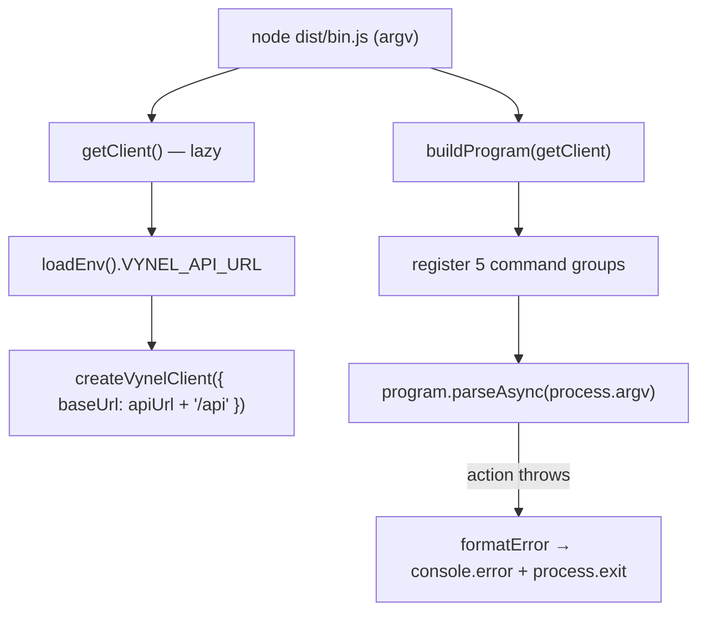
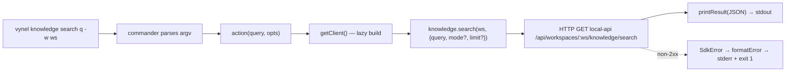

# CLI — Structure

> The code map and connections for the `apps/cli` shell. For the concepts behind it, see [overview.md](./overview.md).
>
> Folders touched: `apps/cli/src/` · consumes `@vynel/sdk` · talks HTTP to the running `apps/local-api` daemon.

`apps/cli` (`@vynel/cli`) is a **thin adapter app**, not a feature package: it owns no schema, no repositories, no core logic. It is a [commander](https://github.com/tj/commander.js) program that maps `vynel <group> <command>` argv onto the namespaced `@vynel/sdk` client and pretty-prints the typed result. All logic lives behind the SDK and the API — the CLI only parses, dispatches, and formats. Deps: `@vynel/sdk`, `commander ^15`, `zod ^3` (`apps/cli/package.json`).

## File map

► = entry point.

| Path | Role |
|---|---|
| ► `apps/cli/src/bin.ts` | executable entry (`bin.vynel` → `dist/bin.js`) — builds the real `VynelClient` **lazily** from env, `parseAsync(process.argv)`, maps a thrown command error to stderr + exit code |
| `apps/cli/src/index.ts` | `buildProgram(getClient)` — side-effect-free; names the program, sets version, registers the 5 command groups. Injected client factory makes it unit-testable |
| `apps/cli/src/env.ts` | Zod-validated env — the single `process.env` read; `VYNEL_API_URL` (default `http://localhost:8998`) |
| `apps/cli/src/output.ts` | `printResult` (JSON to stdout) + `formatError` — pure `unknown → { message, exitCode }`, `SdkError`-aware |
| `apps/cli/src/knowledge-commands.ts` | `vynel knowledge …` — 8 commands: search / list / get / status / reindex / add-source / sources / remove-source |
| `apps/cli/src/skills-commands.ts` | `vynel skills …` — 7 commands: list / available / install / uninstall / enable / disable / synchronize |
| `apps/cli/src/channels-commands.ts` | `vynel channels …` — 7 commands: list / mine / get / allowed-senders / enable / disable / disconnect |
| `apps/cli/src/schedules-commands.ts` | `vynel schedules …` — 8 commands: list / mine / templates / runs / enable / disable / delete / fire-now |
| `apps/cli/src/marketplace-commands.ts` | `vynel marketplace …` — 2 commands: list / get (read-only surface) |
| `apps/cli/src/output.test.ts` | `formatError` / `printResult` unit tests |
| `apps/cli/src/{knowledge,skills,channels,schedules,marketplace}-commands.test.ts` | per-group tests driving `buildProgram` against a stub client — no server, no process |

No `schema/`, `repositories/`, MCP descriptor, worker, or web surface — this app has none. The sections below reflect what is actually on disk.

## Boot & wiring

The whole app is two files of wiring: `bin.ts` (real world) + `index.ts` (pure program). The split exists so tests build the program against a stub without spawning a process or a server.



1. `bin.ts` calls `buildProgram(getClient)` (`index.ts`), then `.parseAsync(process.argv)`.
2. `getClient()` is **lazy + memoized** (`client ??= …`, `bin.ts:14-21`): the SDK client is only built when a command action fires, so `vynel --help` / `--version` need no env and no running API.
3. When first needed, `loadEnv()` (`env.ts`) reads + Zod-validates `VYNEL_API_URL`, the trailing slashes are stripped, and `createVynelClient({ baseUrl: \`${apiUrl}/api\` })` targets the gateway's `/api` mount (`bin.ts:14-21`).
4. `buildProgram` (`index.ts:14`) sets `name('vynel')`, `version('0.0.0')`, then calls the five `register…Commands(program, getClient)` functions. Each attaches a `program.command('<group>')` with its subcommands; every action closes over `getClient`.
5. On success, each action prints via `printResult`. On failure, the thrown value bubbles out of `parseAsync`; `bin.ts`'s `.catch` runs `formatError` and exits non-zero. (commander itself prints + exits for its own parse/help/version errors — this catch is for errors thrown inside a command action, e.g. `SdkError`.)

## Command surface

Every command follows one shape: parse args/flags → call one namespaced SDK method → `printResult`. `-w, --workspace <id>` is a **required** option on every workspace-scoped command; the `mine` commands (channels/schedules) drop it and read the user-scoped surface. Numeric flags (`--limit`) coerce through a local `toInt` (`InvalidArgumentError` on non-integer).

| Group | Command | SDK call | Notes |
|---|---|---|---|
| **knowledge** | `search <query>` | `knowledge.search` | `-m` mode ∈ fts/semantic/hybrid (`.choices`), `-l` limit |
| | `list` | `knowledge.listDocuments` | `-k` kind ∈ 8 document kinds, `-l` limit |
| | `get <documentId>` | `knowledge.getDocument` | document + chunks |
| | `status` | `knowledge.getStatus` | indexer status |
| | `reindex` | `knowledge.reindex` | force-reindex the workspace |
| | `add-source <path>` (alias `add-directory`) | `knowledge.addSource` | `-g` → `scope: 'global'` else `'workspace'` |
| | `sources` | `knowledge.listSources` | workspace + user-global |
| | `remove-source <sourceId>` | `knowledge.removeSource` | stops watching + purges docs |
| **skills** | `list` / `available` | `skills.listInstalled` / `listAvailable` | |
| | `install <skillId>` | `skills.install` | `-s` scope ∈ user/workspace, **mandatory** |
| | `uninstall <installedSkillId>` | `skills.uninstall` | 204 → prints `{ uninstalled: id }` |
| | `enable` / `disable <installedSkillId>` | `skills.enable` / `disable` | |
| | `synchronize` | `skills.synchronize` | re-sync provider on disk |
| **channels** | `list` | `channels.list` | workspace-scoped |
| | `mine` | `channelsUser.list` | user-scoped, both scopes, **no `-w`** |
| | `get <channelId>` | `channelsUser.get` | user-scoped get-one (no workspace get-one route) |
| | `allowed-senders <channelId>` | `channels.listAllowedSenders` | |
| | `enable` / `disable <channelId>` | `channels.enable` / `disable` | |
| | `disconnect <channelId>` | `channels.disconnect` | 204 → prints `{ disconnected: id }` |
| **schedules** | `list` | `schedules.list` | |
| | `mine` | `schedulesUser.list` | user-scoped, both scopes, **no `-w`** |
| | `templates` | `schedules.listTemplates` | |
| | `runs <scheduleId>` | `schedules.listRuns` | `-l` limit |
| | `enable` / `disable <scheduleId>` | `schedules.enable` / `disable` | |
| | `delete <scheduleId>` | `schedules.delete` | 204 → prints `{ deleted: id }` |
| | `fire-now <scheduleId>` | `schedules.fireNow` | manual run |
| **marketplace** | `list` | `marketplace.listItems` | read-only |
| | `get <itemId>` | `marketplace.getItem` | read-only |

> **`channels connect` is intentionally omitted** — it carries a bot token, so it never gets a CLI verb (`channels-commands.ts:6-9`). The CLI surfaces reads + the *safe* mutations (enable/disable/disconnect/delete/fire-now); no credential-carrying writes.

## Pipeline — "run a command, get typed JSON"



1. `bin.ts` hands `process.argv` to the built program; commander routes to the matching subcommand action (e.g. `knowledge-commands.ts:38`).
2. The action reads args + `opts`, then calls the namespaced SDK method — the first call triggers the lazy client build.
3. `@vynel/sdk` issues the HTTP request against `${VYNEL_API_URL}/api…` — the running `local-api` gateway.
4. Success → `printResult` writes `JSON.stringify(payload, null, 2)` to stdout. Non-2xx → the SDK throws `SdkError`, which propagates to `bin.ts`'s catch → `formatError` → stderr `Error <status>: <message>` + `process.exit(1)`.

## Connections

**Summary:** the CLI is a pure **downstream leaf / adapter** — it imports one package (`@vynel/sdk`) and reaches the rest of Vynel only over HTTP to the running `local-api` daemon. Nothing imports `@vynel/cli`; it publishes/consumes no outbox events and owns no DB.

| Unit | Direction | Mechanism | What crosses |
|---|---|---|---|
| [`@vynel/sdk`](../../sdk/overview.md) | out | import | `createVynelClient`, `VynelClient` type, `SdkError`, all namespaced method calls |
| `commander` | out | import (npm) | `Command`, `Option`, `InvalidArgumentError` — parsing + dispatch |
| `zod` | out | import (npm) | env validation |
| `apps/local-api` | out | **HTTP** (runtime dep) | every command call hits `${VYNEL_API_URL}/api/…`; the daemon must be running |

**Events published/consumed:** none — the CLI has no outbox, no DB, no MCP descriptor.

```mermaid
flowchart LR
    cli[apps/cli] --> sdk[@vynel/sdk]
    cli -. HTTP /api .-> api[apps/local-api daemon]
    sdk --- api
```

## Config & gotchas

- **`VYNEL_API_URL`** (`env.ts`) is the only config — default `http://localhost:8998` (the local-api dev port). It is read in exactly one place per the coding standard; trailing slashes are stripped before the `/api` suffix is appended.
- **`/api` mount, deliberately.** `bin.ts` targets `${apiUrl}/api`, the gateway's one external surface. The comment warns that dispatching at root would let the voice-daemon proxy's `/voice/*` shadow the API's own voice routes (`bin.ts:15-17`).
- **Client is lazy so `--help`/`--version` work offline** — `getClient()` builds nothing until a command action fires (`client ??=`). Do not hoist the client build to module load or you break the no-server help path.
- **204 commands print a synthetic confirmation.** `uninstall` / `disconnect` / `delete` return no body; each awaits the call then `printResult`s `{ <verb>: id }` so the operator sees which id acted (e.g. `skills-commands.ts:53-55`).
- **Runtime dependency on a live daemon.** Every real command fails with an `SdkError` (or a connection error → generic `Error:` message, exit 1) if `local-api` isn't up. There is no retry, no spinner — output is raw JSON by design.
- **`.choices` guards, `as` casts.** commander validates enum options (`mode`, `kind`, `scope`) at runtime; the code then `as`-casts the string to the literal union — safe only because `.choices` already rejected anything else (see the inline `// safe:` comments).
- **`version('0.0.0')`** is a hardcoded placeholder (`index.ts:19`), matching `package.json`'s `0.0.0`; not wired to a real release version.

---
*Mapped from the code on disk, 2026-07-14. If you change this module, update this file and [overview.md](./overview.md).*
