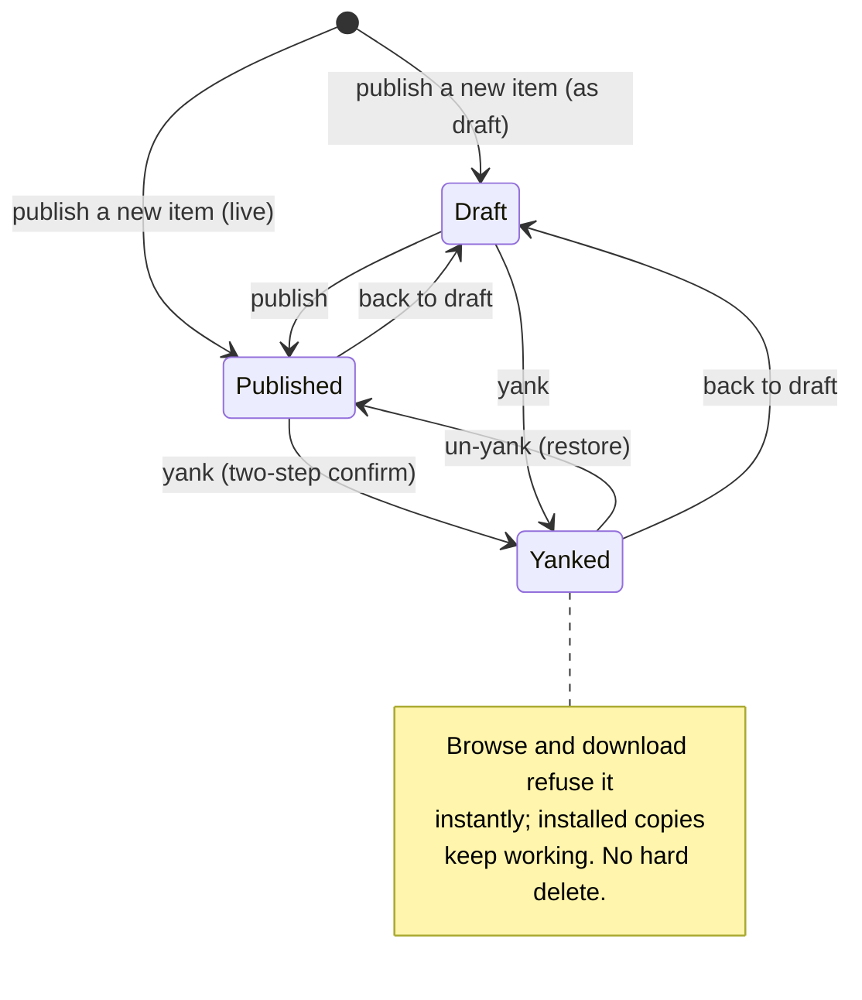

# cloud-admin-web — Overview

> The marketplace admin portal: a small in-browser console where a Vynel operator signs in, curates the catalog of installable items, and manages the hub's user accounts — the real tooling that replaces the token-guarded fallback routes and the publish CLI.
>
> **Status:** shipped (dev-run; hub-served hosting deferred) · **Depends on:** [cloud-api](../cloud-api/overview.md) (the hub it talks to), [registry](../../registry/overview.md) (the catalog engine), [accounts](../../accounts/overview.md) (identity & roles), [marketplace](../../marketplace/overview.md) (the content it curates) · **Code map:** [structure.md](./structure.md)

## Purpose

cloud-admin-web is the human face on the hub's admin surface. Everything the marketplace exposes to end users — the skills, agents, MCPs, rules, and plugins they browse and install — has to be published, versioned, and lifecycle-managed by *someone*; before this app that someone pasted a root token into curl commands and drove the publish CLI by hand. This portal turns those operations into a screen: sign in, see the whole catalog, publish a new item, bump a version, pull a bad one, and manage who has an account and what they can reach.

It is deliberately a **thin surface**. It holds no business logic of its own — no catalog rules, no artifact storage, no entitlement math. It parses a form, calls the hub, and renders the answer. All the real behavior lives behind the hub in the registry and accounts packages; the portal is the window, not the machinery. That separation is the whole point: the same publish path the CLI uses is the one the portal's upload button calls, so the two can never drift.

What makes it a distinct product surface rather than plumbing is **who it is for and how it gates**. It is an operator tool, not a user tool. The hub's sign-in door is generic — any account can pass it — but the admin surface opens per request only to accounts carrying the admin role, checked fresh on every call. A non-admin who signs in lands on a plain "this account isn't an admin" card rather than a broken screen.

## What it can do

- **Sign in** with an email and password against the hub's generic auth, holding the resulting session for the browser tab only.
- **Browse the whole catalog** — every item across all statuses and all kinds, filterable by kind, each row showing its status, minimum tier, latest version, and last-updated time.
- **Open one item** to see its full metadata, its complete version history, and its lifecycle controls on one page.
- **Edit an item's metadata** — display name, one-line description, category, icon, minimum tier, recommended scope — sending only the fields that actually changed.
- **Move an item through its lifecycle** — publish it, pull it (yank), or send it back to draft — with a two-step confirm guarding the destructive pull.
- **Publish a new item or version** — pick the artifact zip, fill the manifest and version details, and ship it under the curated Vynel Team publisher.
- **List every hub account** with its role, tier, and status.
- **Provision a new account**, which triggers the hub to send (or, in dev, log) a set-password link.
- **Change an account's role** (member ↔ admin), **its tier** (basic ↔ pro), and **enable or disable it** — the disable guarded by a two-step confirm because it kills every one of that account's sessions.

## Responsibilities

**Owns** — the operator's in-browser experience and nothing behind it: the sign-in screen, the catalog list and item-detail views, the metadata edit form, the lifecycle controls, the publish form, and the accounts table with its role/tier/status/provision controls. It owns the client-side admin session (an in-tab credential and the two shell reactions to auth failure), the single fetch path that carries the bearer and normalizes the hub's error envelope, and the query cache that keeps the views fresh. It owns no data — it renders what the hub returns.

**Does not own** —
- the catalog engine — publishing, versioning, artifact storage, tier-gating and lifecycle status transitions all live in [registry](../../registry/overview.md);
- account identity, the admin role, tiers, sign-in, and the set-password flow — [accounts](../../accounts/overview.md);
- the hub itself — request routing, the dual-door admin gate, and the `{code, message}` error envelope are [cloud-api](../cloud-api/overview.md)'s;
- what end users see and install from the published content — the desktop [marketplace](../../marketplace/overview.md);
- its own production hosting — serving the built app is a deferred hub concern (today it runs only against a dev proxy).

## Concepts & vocabulary

| Term | Meaning |
|---|---|
| **Admin** | An account carrying the admin role. Only admins reach this surface, and the role is re-checked fresh on every request, never trusted from the token. |
| **Admin session** | The signed-in operator's client state — an access token plus their email and name — held in per-tab session storage and never persisted beyond it. |
| **Dual-door gate** | The hub opens the admin surface two ways: a static server-to-server token (the CLI path) or a verified access token whose account is an active admin. The portal always uses the second door. |
| **Catalog item** | One publishable marketplace entry: an id, a kind, display metadata, a minimum tier, a recommended scope, a lifecycle status, and a version history. |
| **Kind** | What the item *is* — skill, agent, MCP, rule, or plugin. The catalog filters by it; the desktop app installs only some kinds today. |
| **Status** | An item's lifecycle stage — draft, published, or yanked. Only published items are visible and downloadable to users. |
| **Yank** | Pulling a published item: it stops browse and download instantly, but installed copies keep working. Deprecation, not deletion — the version number is never freed. |
| **Minimum tier** | The entitlement floor (basic or pro) an account needs to download the item. |
| **Recommended scope** | A hint about where an item belongs — user, workspace, both, or none. |
| **Publisher** | Who ships an item. v1 is curated-only: everything ships under the single Vynel Team publisher. |
| **Account tier / status** | A user account's entitlement level (basic/pro) and whether it is active or disabled. |
| **Not-an-admin card** | The full-page dead-end shown when a signed-in but non-admin account touches the admin surface. |

## Rules & invariants

- **The portal is a thin surface.** It carries no business logic — it parses a form, calls the hub, and renders the answer. Every rule about catalogs, tiers, and accounts is enforced behind the hub, never here.
- **The admin session lives in the browser tab only.** Credentials are held in session storage, scoped to one browser session; no refresh token is ever kept. Closing the tab signs the operator out. This is deliberate for an operator tool.
- **Two auth failures drive the shell.** A rejected-credential answer clears the session and drops the operator back to sign-in; a forbidden answer (signed in, not an admin) swaps the whole screen for the not-an-admin card. The sign-in door itself is generic — the admin gate is per request.
- **Every request leaves under one prefix.** All hub calls go out beneath a single `/api` path so the dev proxy and the future hub-served production mode see identical routes — dev equals prod paths.
- **Publishing is curated-only.** Every item and version ships under the one Vynel Team publisher; third-party publishing is out of scope.
- **Yanking is instant and reversible; deletion is not offered.** Pulling an item stops distribution the moment it lands, un-yanking restores it, and installed copies keep verifying throughout. The portal never hard-deletes and never frees a version number.
- **Destructive actions are two-step.** Yanking an item and disabling an account each require an explicit second confirm, because both have reach beyond the click.
- **Metadata edits are sparse.** Only the fields that actually changed are sent; an empty edit is refused, so Save stays disabled until something is dirty.
- **Signing out empties the cache.** The cached catalog and accounts are cleared with the session so the next operator on the same tab never flashes the previous one's data.

## Lifecycle

The concept that moves through states here is the catalog item, driven by the portal's lifecycle controls:

## Where it sits in the bigger picture

cloud-admin-web sits at the very top of the hub, the only surface built for the operator rather than the end user. It talks exclusively to [cloud-api](../cloud-api/overview.md), which routes its calls into [registry](../../registry/overview.md) for everything catalog and [accounts](../../accounts/overview.md) for everything identity — the portal itself imports none of that logic, only the shared wire contracts that describe the shapes crossing between them. The content it curates is exactly what the desktop [marketplace](../../marketplace/overview.md) later lets users browse and install; this app makes that content exist and keeps it healthy, while the desktop side makes it land. Among its `_apps` siblings — the [local-api](../local-api/overview.md) and [local-web](../local-web/overview.md) that serve the desktop experience — it is the odd one out: a cloud-side operator console rather than a piece of the on-device product, sharing the house patterns (a Vue plus vue-query single-page app) but pointed at the hub instead of the local machine.

---
*Mapped from the code on disk, 2026-07-14. If you change this module, update this file and [structure.md](./structure.md).*
