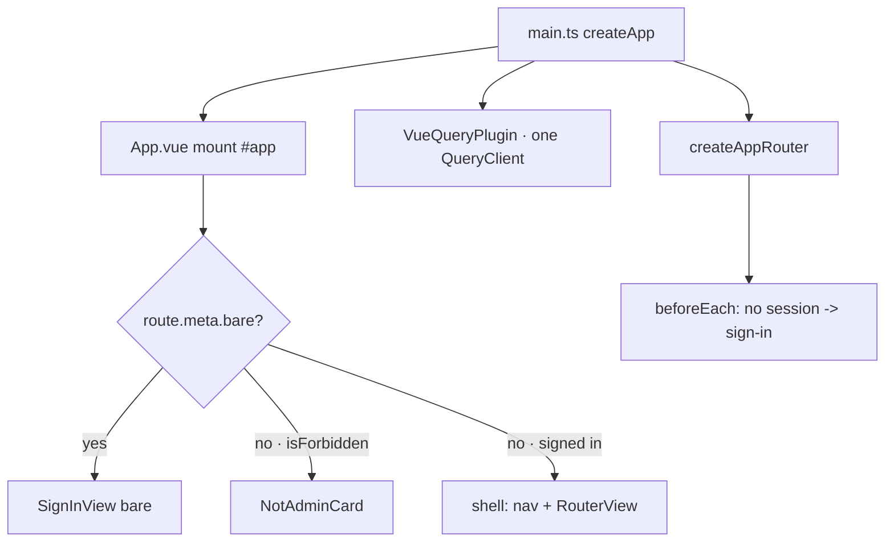
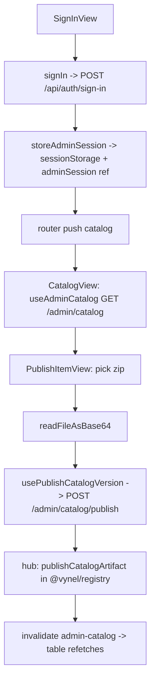
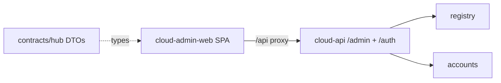

# cloud-admin-web — Structure

> The code map and connections for the `apps/cloud-admin-web` module — the hub marketplace **admin portal**. For the concepts behind it, see [overview.md](./overview.md).
>
> Folders touched: `apps/cloud-admin-web/src/` · calls `apps/cloud-api/src/routes/admin.ts` over `/api` · DTOs from `@vynel/contracts/hub/*`.

`cloud-admin-web` is an **app shell**, not a vertical-slice leaf — it owns no `schema/`, `repositories/`, or MCP descriptor. It is a thin Vue 3 + Vite SPA that curators use to manage the marketplace catalog and hub accounts: parse → call `cloud-api` `/admin/*` → render. All business logic lives on the hub in `@vynel/registry` / `@vynel/accounts`; this app only decodes transport and paints screens. Deps: `@tanstack/vue-query`, `vue`, `vue-router`, `lucide-vue-next`, `@vynel/contracts` (`apps/cloud-admin-web/package.json`).

## File map

► = entry point.

| Path | Role |
|---|---|
| ► `src/main.ts` | boot — `createApp(App)`, mounts the router + one `QueryClient` (staleTime 30s, retry 1, refetch-on-focus), loads `tokens.css` + `app.css`, mounts `#app` |
| ► `src/App.vue` | the shell — sidebar (Catalog / Accounts) + header (signed-in email, sign-out); swaps to `NotAdminCard` on 403, renders bare `RouterView` for sign-in; watches `isSignedIn` → redirect to sign-in |
| `src/router.ts` | `createAppRouter()` — 5 routes, lazy-imported; `beforeEach` guard bounces to sign-in when no session; `/` → catalog; `/sign-in` carries `meta.bare` |
| `src/lib/admin-api.ts` | **the one fetch home** — `adminApiFetch<T>` injects the bearer, prefixes `/api`, parses `{code,message}` errors into `AdminApiError`; 401 clears the session, 403 flips the forbidden flag |
| `src/lib/admin-session-state.ts` | module-scoped session refs — `adminSession` (from `sessionStorage`), `adminAccessForbidden`; `store`/`clearAdminSession`. A separate module so fetch-layer ↔ composable stay cycle-free |
| `src/lib/read-file-base64.ts` | `readFileAsBase64(file)` — FileReader → raw base64 (no data-URL prefix) for `artifactBase64`; handles `onerror` + `onabort` |
| `src/lib/format.ts` | `formatDate` (Intl, NaN-safe) + `formatBytes` |
| `src/composables/use-admin-session.ts` | `useAdminSession()` — reactive `session`/`isSignedIn`/`isForbidden` + `signIn` (POST `/auth/sign-in`) + `signOut` (clear + `queryClient.clear()`) |
| `src/composables/catalog/catalog-keys.ts` | vue-query key factory — `["admin-catalog","list"]` |
| `src/composables/catalog/use-admin-catalog.ts` | `useQuery` GET `/admin/catalog` → the FULL catalog (every status/version); the detail view reads its item out of this same cache entry (no per-item endpoint) |
| `src/composables/catalog/use-update-catalog-item.ts` | `useMutation` PATCH `/admin/catalog/:itemId` — sparse metadata patch |
| `src/composables/catalog/use-set-catalog-item-status.ts` | `useMutation` POST `/admin/catalog/:itemId/status` — draft/published/yanked |
| `src/composables/catalog/use-publish-catalog-version.ts` | `useMutation` POST `/admin/catalog/publish` — `PublishCatalogVersionInput` (publisher + item + version + `artifactBase64`); invalidates the catalog family |
| `src/composables/accounts/accounts-keys.ts` | key factory — `["admin-accounts","list"]` |
| `src/composables/accounts/use-admin-accounts.ts` | `useQuery` GET `/admin/accounts` → `HubAdminAccount[]` (allowlisted DTO) |
| `src/composables/accounts/use-provision-account.ts` | `useMutation` POST `/admin/accounts` — provision (triggers a set-password link) |
| `src/composables/accounts/use-grant-account-role.ts` | `useMutation` POST `/admin/accounts/:id/role` — member/admin |
| `src/composables/accounts/use-set-account-tier.ts` | `useMutation` POST `/admin/accounts/:id/tier` — basic/pro |
| `src/composables/accounts/use-set-account-status.ts` | `useMutation` POST `/admin/accounts/:id/status` — active/disabled |
| `src/views/SignInView.vue` | lone card (`meta.bare`) — email+password → `signIn` → push catalog; `AdminApiError` message surfaced |
| `src/views/CatalogView.vue` | catalog table — kind filter tabs (all/skill/agent/mcp/rule/plugin), status chips, latest version, row → item; "Add Marketplace Catalog" → publish |
| `src/views/CatalogItemView.vue` | item detail — reads item from the list cache; metadata form + status control + versions table |
| `src/views/PublishItemView.vue` | the publish form — kind picker with per-kind manifest prefill, zip → base64, POST publish |
| `src/views/AccountsView.vue` | accounts table + provision card; role/tier/status mutations; two-step confirm on disable |
| `src/components/NotAdminCard.vue` | full-page "not an admin" card (403), emits `sign-out` |
| `src/components/catalog/{KindChip,StatusChip,ItemMetadataForm,ItemStatusControl,ItemVersionsTable,PublishVersionForm}.vue` | catalog detail widgets — chips, dirty-tracked metadata form, two-step yank, versions table w/ sha copy, embedded publish-version form |
| `src/components/accounts/ProvisionAccountCard.vue` | provision form (email + display name) |
| `src/styles/{tokens,app.css}` | trimmed dark design tokens + app CSS (portal-local copy; folds into `@vynel/ui` when hub-served) |
| `index.html` · `vite.config.ts` · `vitest.config.ts` · `tsconfig*.json` | Vite entry, dev server + `/api` proxy, happy-dom test project, TS config |

Tests (colocated, `*.test.ts`, DOM): `src/app-shell.test.ts`, `views/{sign-in,catalog,accounts,publish-item}-view.test.ts`, `components/catalog/publish-version-form.test.ts`.

## Boot & wiring

1. `src/main.ts` — `createApp(App)`, `.use(createAppRouter())`, `.use(VueQueryPlugin, { queryClient })` (single client — server state lives in vue-query, no Pinia), CSS imports, `.mount("#app")`.
2. `src/router.ts:createAppRouter` — `createWebHistory`; `beforeEach` returns `{name:"sign-in"}` when `adminSession.value === null` and the target isn't sign-in.
3. `src/App.vue` — three top-level states off `useAdminSession()`: `route.meta.bare` (sign-in) · `isForbidden` (403 card) · signed-in shell. A `watch(isSignedIn)` performs the redirect half of the fetch-layer's "401 clears session" contract.
4. `src/lib/admin-session-state.ts` seeds `adminSession` from `sessionStorage` at module load, so a page refresh keeps the session (per-tab, `sessionStorage` only — see Gotchas).

## HTTP surface (consumed, not owned)

Every request goes through `adminApiFetch` (`src/lib/admin-api.ts`) as `` fetch(`/api${path}`) ``. In dev, Vite proxies `/api/*` → `http://localhost:8890` with the `/api` prefix stripped (`vite.config.ts`); the future hub-served prod mode mounts the same `/api` strip (the gateway "dev == prod paths" precedent). All `/admin/*` calls hit `apps/cloud-api/src/routes/admin.ts`, guarded by the dual-door `requireAdminAccess` (static `CLOUD_ADMIN_TOKEN` bearer OR a fresh-read admin-role JWT).

| Method | Path (hub-relative) | Purpose | Called by |
|---|---|---|---|
| POST | `/auth/sign-in` | exchange email+password for an access token | `use-admin-session.signIn` |
| GET | `/admin/catalog` | full catalog, all statuses + versions | `use-admin-catalog` |
| PATCH | `/admin/catalog/:itemId` | sparse metadata patch | `use-update-catalog-item` |
| POST | `/admin/catalog/:itemId/status` | draft ⇄ published ⇄ yanked | `use-set-catalog-item-status` |
| POST | `/admin/catalog/publish` | publish a new version (base64 zip, 16MB body cap) | `use-publish-catalog-version` |
| GET | `/admin/accounts` | all accounts (allowlisted DTO) | `use-admin-accounts` |
| POST | `/admin/accounts` | provision (set-password link) | `use-provision-account` |
| POST | `/admin/accounts/:id/role` | member/admin | `use-grant-account-role` |
| POST | `/admin/accounts/:id/tier` | basic/pro | `use-set-account-tier` |
| POST | `/admin/accounts/:id/status` | active/disabled | `use-set-account-status` |

Error contract: the hub answers `{code,message}` (the `jsonValidator` → `ValidationError` envelope); `toAdminApiError` parses it into `AdminApiError`. 401 (with a token present) → `clearAdminSession()`; 403 → `adminAccessForbidden = true`. Same 401 for wrong-token and bad-JWT (no door oracle); 403 only for a valid non-admin.

## Web surface

vue-query only — no Pinia. Two cache families keyed `["admin-catalog", …]` and `["admin-accounts", …]`; mutations invalidate their family (publish invalidates `adminCatalogKeys.all`). Session state lives in two plain module refs (`admin-session-state.ts`), read through `useAdminSession`.

- **Catalog** — `CatalogView` (kind-tab-filtered table off the one list query) → `CatalogItemView` (finds its item in the same cached list; metadata form, status control, versions table) + `PublishItemView` (dedicated publish route with per-kind manifest prefill).
- **Accounts** — `AccountsView` (list + provision card; role/tier/status mutations; two-step confirm on disable since it kills every device session).
- **Chrome** — `App.vue` shell (nav + header) around all authenticated views; `NotAdminCard` full-page on 403; `SignInView` bare.

## Pipeline — "sign in, then publish a catalog version"

1. `src/views/SignInView.vue` → `useAdminSession().signIn` → `adminApiFetch("/auth/sign-in")` (`use-admin-session.ts:25`); on success `storeAdminSession` writes `sessionStorage` + the `adminSession` ref, router pushes catalog.
2. `src/views/CatalogView.vue` → `useAdminCatalog` → GET `/admin/catalog`; every later mutation reads/invalidates this single cache entry.
3. `src/views/PublishItemView.vue` → `readFileAsBase64(zip)` (`lib/read-file-base64.ts`) → `usePublishCatalogVersion` → POST `/admin/catalog/publish` with the full `PublishCatalogVersionInput`.
4. `apps/cloud-api/src/routes/admin.ts:161` decodes base64 → `publishCatalogArtifact(db, artifactStore, …)` in `@vynel/registry` (the same function the `cloud:publish` CLI calls).
5. `onSuccess` invalidates `adminCatalogKeys.all` → the catalog table refetches.

## Connections

**Summary:** a pure **client shell** — no imports into it, no db, no outbox. It reaches the hub over HTTP only, and shares just wire DTOs with `@vynel/contracts`.

| Unit | Direction | Mechanism | What crosses |
|---|---|---|---|
| [cloud-api](../cloud-api/overview.md) `/admin` + `/auth` | out | HTTP over `/api` (dev proxy → :8890) | sign-in, catalog CRUD + publish, account provision/role/tier/status |
| `@vynel/contracts/hub/*` | out | import (types only) | `HubSessionResponse`, `HubAdminCatalogItem`, `HubAdminAccount`, `HubAccountRole`, `HubItemKind`, `HubTier` |
| [registry](../registry/overview.md) | out (indirect) | via cloud-api | publish/lifecycle handled hub-side; portal is a face |
| [accounts](../accounts/overview.md) | out (indirect) | via cloud-api | provision/role/tier/status handled hub-side |
| root vitest workspace | in | test project registration | `cloud-admin-web` happy-dom project in `vitest.workspace.ts` |

**Events published / consumed:** none — this app has no outbox; it is a browser client.

## Config & gotchas

- **Dev proxy, prefix-stripped.** `vite.config.ts` proxies `/api/*` → `http://localhost:8890` and strips `/api`; port is `strictPort: 8891`. Run: `pnpm --filter @vynel/cloud-admin-web dev`.
- **Session is `sessionStorage`-only, per tab.** `admin-session-state.ts` deliberately never persists a refresh token — the access token expires on its own; sign-out is a local clear + `queryClient.clear()` so the next account can't flash the previous one's data. Refresh-token persistence is non-scope until hub-served.
- **One catalog cache entry serves list + detail.** There is no per-item GET; `CatalogItemView` `.find()`s its item in the list query. Fine at admin scale; a stale list means a stale detail.
- **Two shell-level statuses are magic.** `adminApiFetch` alone owns the 401 (clear session) and 403 (forbidden card) reactions — views never handle them. A new call site inherits this for free.
- **Publish body cap.** The hub caps the publish body at 16MB (`admin.ts:39`) to cover the registry's 10MB artifact after base64 inflation; large zips 413 at the hub, not the client.
- **DRIFT vs module-notes.** `docs/module-notes/cloud-admin-web.md` says the list-accounts endpoint "doesn't exist yet" and describes only provision + role. Shipped code now has GET `/admin/accounts` plus `/tier` and `/status` account routes and their composables/`AccountsView` controls — the notes are behind the code here. Publish also has its own `PublishItemView`/route ("Add Marketplace Catalog"), not just an in-detail form.
- **Hub-served static hosting is still deferred.** No `/admin-app` static serve exists in `apps/cloud-api` yet (only a comment reference in `admin.ts`); today the portal is Vite-served in dev. Folding the trimmed `tokens.css` into `@vynel/ui` waits on that same arc.
- **Registered in the root gate.** `vitest.workspace.ts` includes `./apps/cloud-admin-web/vitest.config.ts` (happy-dom, 20s testTimeout, `passWithNoTests`), so `pnpm test` runs its DOM tests.

---
*Mapped from the code on disk, 2026-07-14. If you change this module, update this file and [overview.md](./overview.md).*
