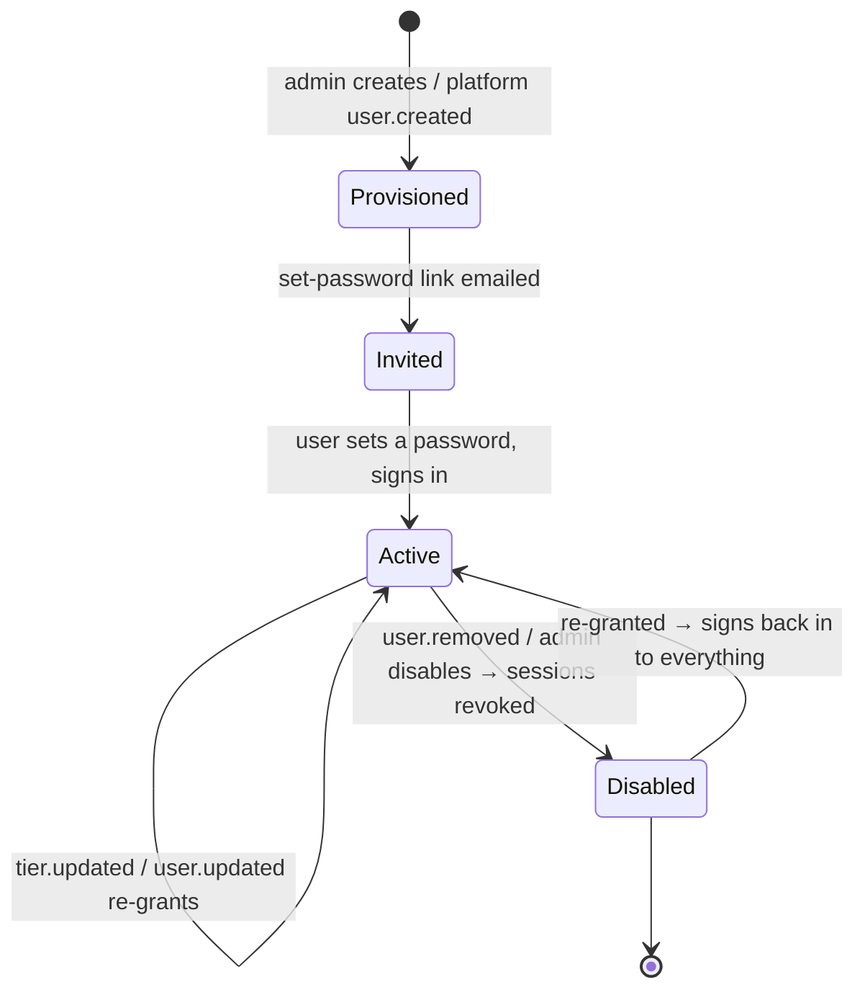

# Cloud API ("the hub") — Overview

> The hosted server the Vynel desktop app signs in to: it owns accounts and access tiers, provisions users on behalf of Chad's platform, and holds the curated marketplace catalog the app browses and installs from.
>
> **Status:** partial (auth · tiers · webhooks · catalog shipped; app-release/auto-update surface not yet mounted) · **Depends on:** [cloud-db](../../cloud-db/overview.md) (its own Postgres kernel), [accounts](../../accounts/overview.md), [registry](../../registry/overview.md), [contracts](../../contracts/overview.md) · **Code map:** [structure.md](./structure.md)

## Purpose

The hub is a **second system** that lives beside the desktop product in the same monorepo but runs on *our* servers, not the user's machine. Where the desktop daemon ([local-api](../local-api/overview.md)) is a loopback-only app over the user's private SQLite, the hub is a public hosted service over a separate Postgres database that holds **our** data: who has an account, what they've paid for, and the marketplace catalog we curate.

It exists because two things can only be trusted server-side. **Access tiers** decide which paid features a desktop unlocks — a check that has to happen somewhere the user can't patch. And the **marketplace** — the real, curated catalog of skills, agents, MCPs and rules — must be held and distributed from a place we control, with downloads gated by tier. The hub is that place.

Everything the hub does is a thin HTTP surface over two domain leaves. It parses and validates a request, checks who's calling, hands off to [accounts](../../accounts/overview.md) or [registry](../../registry/overview.md), and shapes the reply. The judgement it *owns* is transport-level: authenticating the caller, guarding admin doors, verifying platform webhooks, and applying the one deliberate policy asymmetry — browsing the catalog is generous, downloading from it is gated.

## What it can do

- **Sign a desktop in** with email and password, returning the token set a device needs to stay signed in and to prove its entitlements offline.
- **Refresh a session** so the user logs in once, not again and again — and **sign out**, dropping the device's stay-signed-in credential.
- **List and revoke a user's devices** — every signed-in machine is a named, revocable record.
- **Set a password from an email link** — the hub serves a plain hosted web page (not a terminal) where a newly provisioned or resetting user chooses their password; and it **accepts a password-reset request**, always answering the same way whether or not the email is known.
- **Browse the catalog** and **read one item's detail**, filtered by what the caller's tier may install.
- **Download an item's artifact** — the tier-gated moment, denied outright to a caller whose tier is below the item's minimum; a caller that already holds the exact bytes gets a "not modified" instead of a re-download.
- **Admin: provision and manage accounts** — create a provisioned account (which triggers its set-password invite), list accounts, change a user's role, tier, or active/disabled status.
- **Admin: run the catalog lifecycle** — publish a new item version (artifact and all), edit item metadata, and move an item between draft, published, and yanked.
- *(background)* **Accept platform webhooks** — the events by which Chad's platform tells the hub a user was created, updated, removed, or had their tier changed; each is authenticated, de-duplicated, and applied exactly once.
- *(background)* **Boot itself** — run its database migrations over a direct connection, then serve on the pooled one, and shut down cleanly on signal.

## Responsibilities

**Owns** — the hosted service and its request-time policy: the public HTTP surface and its boot / migrate / serve / graceful-shutdown lifecycle; deciding *who is calling* on every request (the signed-in-account guard, the admin **dual-door** — a static admin token *or* a signed-in account whose admin role is read fresh, and the webhook's signature check); the webhook contract *we* authored — HMAC signature over a timestamp plus the raw body, a replay window, and an exactly-once claim so platform retries are safe; the browse-generous / install-gated policy expressed at the catalog surface; conditional-request handling on downloads; the single map from typed domain errors to HTTP responses; the dev-time email fallback wiring; and the hosted set-password page the invite and reset links land on.

**Does not own** —
- **the account and session mechanics** — password hashing, sign-in, session rotation, device records, provisioning, tier and role resolution, and the token issuers all live in [accounts](../../accounts/overview.md); the hub only exposes them;
- **the catalog and artifact logic** — listing, publish validation, tier-authorization, and artifact storage all live in [registry](../../registry/overview.md);
- **the database schema and repositories** — the hub's own Postgres kernel is [cloud-db](../../cloud-db/overview.md); the product's shared SQLite `@vynel/db` is **never** imported here;
- **the wire shapes** the desktop and hub both speak — the DTOs live once in [contracts](../../contracts/overview.md) so the client and the routes can't drift;
- **the admin portal's UI** — that is a separate app, [cloud-admin-web](../cloud-admin-web/overview.md); the hub *backs* it (serves the admin API it calls), it does **not** serve the portal's assets — despite the module notes' "serving the admin portal" phrasing, no static portal serving exists here;
- **the desktop client** — [desktop](../desktop/overview.md) and its daemon are the callers; nothing under the hub app is imported by them, they meet only over HTTP.

## Concepts & vocabulary

| Term | Meaning |
|---|---|
| **Hub** | This service — the hosted server holding *our* data (accounts, entitlements, catalog), as opposed to the desktop daemon holding the *user's* data. |
| **Account** | One provisioned user. Carries an email, display name, a link back to the platform's own user id, a role, a tier, and an active/disabled status. |
| **Provisioning** | Accounts are not self-serve. They are created by an admin call or by the platform's `user.created` webhook; the user then receives a set-password invite. |
| **Tier** | The access level that decides which features unlock: `basic` (channels only) or `pro` (everything). Read fresh from the account on gated requests. |
| **Role** | `member` or `admin`. The admin role is one of the two ways through the admin door. |
| **Refresh token** | The long-lived, rotating "stay signed in" credential bound to a device — what spares the user from re-entering a password. |
| **Access / entitlement token** | The short-lived, signed proof a desktop verifies offline to know who the user is and what their tier unlocks. |
| **Device** | A named record of one signed-in machine (platform, app version, last seen). Listable and revocable per account. |
| **Platform webhook** | A signed event from Chad's payment/provisioning platform: one of `user.created` · `user.updated` · `user.removed` · `tier.updated`. |
| **Catalog item** | One marketplace entry, of a `kind`: `skill` · `agent` · `mcp` · `rule` · `plugin`. Carries a trust level (`verified` · `community` — v1 ships verified only), a minimum tier to install, and a `draft` · `published` · `yanked` status. |
| **Artifact** | The downloadable zip bundle for an item version, addressed by its content hash and gated at download time. |

## Rules & invariants

- **Two kernels, never crossed.** The hub reads and writes only its own Postgres database. The product's shared SQLite `@vynel/db` — the user's local data — is never imported here. Invariant "one shared `@vynel/db`" governs the product monolith; it does not govern this separate system.
- **The app is a thin adapter.** Routes parse, validate, identify the caller, and shape the reply — every rule of substance lives in a leaf. No business logic sits in a route.
- **Accounts are provisioned, never self-registered.** A desktop can only *sign in*; a first credential arrives as a set-password invite. The platform, or an admin, is the only source of new accounts — and the platform never sends a plaintext password.
- **Webhooks are authenticated, time-boxed, and exactly-once.** Every platform event must carry a valid signature over a fresh timestamp plus the exact raw bytes, fall inside the replay window, and be claimed once — a duplicate delivery is acknowledged without re-applying. With no secret configured, the surface is off.
- **Password-reset replies are constant-shaped.** The request is accepted the same way whether the email is known or not, and the work happens without blocking the reply — so response timing can't reveal whether an account exists.
- **Browse is generous, install is gated.** Reading the catalog fails *open* — a caller with no live account still browses as the base tier. Downloading fails *closed* — a caller without a live, active, sufficiently-tiered account is denied. The caller's tier is always read fresh from the database, never trusted from a possibly-stale token claim.
- **Admin has two doors, both fresh.** An admin request is authorized by a static admin token *or* by a signed-in account whose admin role is looked up live on each call.
- **Revoked means locked, not destroyed.** Disabling or removing an account revokes its sessions so the desktop logs out at its next online contact — but nothing the hub does touches the user's local data.

## Lifecycle

The hub hosts two domains and so has no single central object, but the concept it *defines the surface for* is an account's status, driven by the platform webhooks it owns.

## Where it sits in the bigger picture

The hub is the one Vynel process that does not run on the user's machine. It is a hosted Hono service over its own Postgres kernel ([cloud-db](../../cloud-db/overview.md)), exposing thin surfaces over two leaves — [accounts](../../accounts/overview.md) and [registry](../../registry/overview.md) — and speaking to the outside world only through DTOs shared in [contracts](../../contracts/overview.md).

Three parties talk to it. **Chad's platform** pushes provisioning and tier events in through signed webhooks — the hub never touches money, it only reacts to what the platform decides. The **[desktop](../desktop/overview.md) app** signs in, refreshes, and syncs the catalog across HTTP; it imports nothing from this app, and the hub imports nothing from it — the wire is the only seam. And the separate **[cloud-admin-web](../cloud-admin-web/overview.md)** portal calls the hub's admin surface to manage accounts and curate the catalog — the hub backs that portal's API but does not serve its pages. Alongside those, a publish command in [cli](../cli/overview.md) drives the same admin publish path to load the catalog. Not yet built: the app-release / auto-update manifest surface the module notes anticipate — the hub is ready to grow it, but it is not mounted today.

---
*Mapped from the code on disk, 2026-07-14. If you change this module, update this file and [structure.md](./structure.md).*
