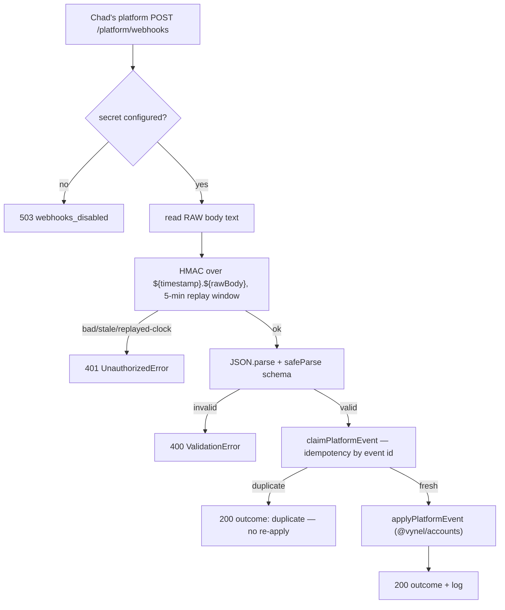

# Cloud API ("the hub") — Structure

> The code map and connections for the `apps/cloud-api` app shell. For the concepts behind it, see [overview.md](./overview.md).
>
> Folders touched: `apps/cloud-api/src/` · `apps/cloud-api/docker-compose.yml` · `scripts/src/cloud/` · leaves `@vynel/cloud-db` · `@vynel/accounts` · `@vynel/registry` · wire types `@vynel/contracts/hub/*`

`cloud-api` is an **app shell**, not a vertical-slice leaf: a thin Hono adapter that owns **no** schema, repositories, or business logic. Every rule lives in three sibling leaves — `@vynel/accounts` (sign-in, sessions, devices, tiers, roles, platform-event application, mail), `@vynel/registry` (catalog, versions, artifact store, publish + download gates), and the hub kernel `@vynel/cloud-db` (its OWN Postgres DB, separate from the product's `@vynel/db` by design — module-notes §2). This app does boot + wiring, transport decode/validate, auth middleware, rate limiting, and response shaping. It is a **hosted** service (Chad's servers, Docker) — unlike the loopback-only `local-api`, it binds `0.0.0.0` behind a reverse proxy.

## File map

► = entry point.

| Path | Role |
|---|---|
| ► `apps/cloud-api/src/server.ts` | boot — `loadEnv` → migrate on a direct pool-of-one → app on the pooled client → `serve` on `0.0.0.0:CLOUD_PORT` → SIGINT/SIGTERM graceful close |
| `apps/cloud-api/src/env.ts` | Zod-validated env (the ONE `process.env` site); base64-PEM decode transform, `CLOUD_*` vars |
| ► `apps/cloud-api/src/app.ts` | `createCloudApp` — the Hono app: single `VynelError` → HTTP `onError`, `/health`, mounts the five route groups |
| `apps/cloud-api/src/cloud-app-options.ts` | `CloudAppOptions` — the DI shape every route builder shares (db, logger, token issuers/verifier, mail, artifact store, secrets, test-seam `now`) |
| `apps/cloud-api/src/routes/auth.ts` | `/auth` — sign-in, refresh, sign-out, password-reset request, set-password, device list/revoke; per-email rate limiters |
| `apps/cloud-api/src/routes/admin.ts` | `/admin` — accounts provisioning/role/tier/status + catalog lifecycle + publish; whole subtree behind `requireAdminAccess` |
| `apps/cloud-api/src/routes/platform.ts` | `/platform/webhooks` — HMAC-signed + replay-windowed + idempotent platform events (user/tier lifecycle) |
| `apps/cloud-api/src/routes/catalog.ts` | `/catalog` — browse/detail (fail-open) + download (fail-closed, ETag/304); all behind `requireAccount` |
| `apps/cloud-api/src/routes/set-password-page.ts` | `/set-password` — the hosted invite/reset HTML page (dependency-free inline form → POSTs `/auth/set-password`) |
| `apps/cloud-api/src/middleware/require-account.ts` | access-JWT bearer guard (offline verify, claims → `c.var.account`) |
| `apps/cloud-api/src/middleware/require-admin.ts` | dual-door admin guard — static `CLOUD_ADMIN_TOKEN` bearer OR a signed-in `admin`-role account (role read FRESH) |
| `apps/cloud-api/src/middleware/rate-limit.ts` | fixed-window in-memory limiter, keyed per email |
| `apps/cloud-api/src/middleware/json-validator.ts` | `jsonValidator` — wraps `zValidator` to throw `ValidationError` (keeps the `{code,message}` envelope); `formatZodIssues` |
| `apps/cloud-api/docker-compose.yml` | local Postgres 16 for hub dev (`127.0.0.1:5433`, db `vynel_hub`); doubles as the on-server container reference |
| `scripts/src/cloud/generate-cloud-keys.ts` | `pnpm cloud:generate-keys` — prints the Ed25519 keypair as the two base64-PEM env lines |
| `scripts/src/cloud/publish-catalog-item.ts` | `pnpm cloud:publish` — zips a bundle dir → base64 → admin publish call |

*Tests (not in the map): `app.test.ts`, `hub-link.integration.test.ts`, `routes/{admin,catalog,platform}.test.ts`, `middleware/rate-limit.test.ts`.*

## Boot & wiring

The spine of an app shell. `server.ts:19` `boot()`:

1. **Env** — `loadEnv()` parses `process.env` once (cached). Missing/invalid → throw at boot.
2. **Migrate on the DIRECT connection** — `createCloudDatabase({ url: CLOUD_DIRECT_DATABASE_URL ?? CLOUD_DATABASE_URL, maxConnections: 1 })` → `runCloudMigrations` → `closeCloudDatabase`. The migrator bypasses any transaction-mode pooler (postgres-phase2.md §1); with no pooler the two URLs are identical.
3. **App on the POOLED client** — a second `createCloudDatabase({ url: CLOUD_DATABASE_URL })` feeds `createCloudApp(options)`.
4. **Serve** — `@hono/node-server` binds `hostname: '0.0.0.0'`, `port: CLOUD_PORT` (default 18890). **Contrast `local-api`, which is loopback-only** — the hub is public behind Chad's proxy.
5. **Shutdown** — SIGINT/SIGTERM → `server.close()` → `closeCloudDatabase(db)` → `process.exit(0)`.

**What boot injects into `CloudAppOptions`** (`server.ts:32-56`):

| Option | Built from | Note |
|---|---|---|
| `db` | pooled `createCloudDatabase` | the hub's own Postgres |
| `logger` | `pino({ level: LOG_LEVEL })` | |
| `accessTokens` | `createAccessTokenIssuer({ privateKeyPem: CLOUD_ACCESS_TOKEN_PRIVATE_KEY, ttl })` | short-lived access JWT |
| `accessTokenVerifier` | `createAccessTokenVerifier({ publicKeyPem: CLOUD_ACCESS_TOKEN_PUBLIC_KEY })` | offline verify |
| `entitlements` | `createEntitlementTokenIssuer({ privateKeyPem: CLOUD_ACCESS_TOKEN_PRIVATE_KEY, keyId: CLOUD_TOKEN_KEY_ID, ttl })` | ~7-day entitlement JWT |
| `mail` | `createLoggingAccountMailSender(logger)` | dev fallback — LOGS set-password links; swap for Resend/Postmark at deploy |
| `artifactStore` | `createFilesystemArtifactStore(CLOUD_ARTIFACT_DIR)` | fs impl; seam swappable (in-memory in tests, R2 future) — **not** runtime-selected |
| `linkBaseUrl` | `CLOUD_PUBLIC_BASE_URL` | where email links point |
| `adminToken` | `CLOUD_ADMIN_TOKEN` | static bearer for the admin door |
| `platformWebhookSecret` | `CLOUD_PLATFORM_WEBHOOK_SECRET` (optional) | absent = webhook surface answers 503 |

**Key wiring fact:** one private key does double duty — `CLOUD_ACCESS_TOKEN_PRIVATE_KEY` signs *both* the access-token issuer and the entitlement issuer (`server.ts:36,43`); the verifier takes the public key; only the entitlement issuer carries the `kid` (`CLOUD_TOKEN_KEY_ID`, default `hub-1`) for rotation overlap.

## Data & persistence — N/A here

Owned by the hub kernel `@vynel/cloud-db` (accounts, devices, sessions, platform-events; catalog tables under `@vynel/registry`). This app never issues raw SQL and imports the DB only as a type + factory. Migrations run at boot (see above) but are authored in the kernel. See the `cloud-db` / `accounts` / `registry` docs.

## Repositories & core operations — N/A here

Repositories are functional and live in the leaves; this shell only *calls* them. The route table below names the exact leaf function each route delegates to — that is the intended depth. Internals of `signInWithPassword`, `applyPlatformEvent`, `publishCatalogArtifact`, etc. belong to the sibling leaf docs.

## HTTP surface

Mounted in `app.ts:26-31`. Global `onError` maps `VynelError` → `{ code, message }` at `err.httpStatus`; anything else → logged 500 `internal_error`. `GET /health` is unguarded.

Middleware bundles:
- **`requireAccount`** (offline access-JWT verify) — the whole `/catalog` subtree + `/auth/devices*`.
- **`requireAdminAccess`** (dual-door: static token OR fresh admin role) — the whole `/admin` subtree.
- **`jsonValidator(schema)`** — every body-taking route (throws `ValidationError`, not raw zod).
- **rate limiters** — per-email fixed window on the two credential routes.

| Method | Path | Guard | Purpose | Delegates to |
|---|---|---|---|---|
| GET | `/health` | — | liveness | — |
| POST | `/auth/sign-in` | rate 5 / 5min per email | email+password sign-in → session bundle | `signInWithPassword` |
| POST | `/auth/refresh` | — | rotate refresh token → new session | `rotateSession` |
| POST | `/auth/sign-out` | — | revoke a refresh token | `signOut` |
| POST | `/auth/password-reset/request` | rate 3 / 15min per email | issue reset link — **fire-and-forget, always 202** (timing side-channel guard) | `requestPasswordReset` |
| POST | `/auth/set-password` | — | consume a set/reset token, set password | `confirmSetPassword` |
| GET | `/auth/devices` | `requireAccount` | list the account's devices | `listDevices` |
| DELETE | `/auth/devices/:deviceId` | `requireAccount` | revoke a device | `revokeDevice` |
| POST | `/admin/accounts` | `requireAdminAccess` | provision an account (201) + invite mail | `createProvisionedAccount` |
| GET | `/admin/accounts` | `requireAdminAccess` | list accounts for the portal | `listAccountsForAdmin` |
| POST | `/admin/accounts/:id/role` | `requireAdminAccess` | set member/admin | `assignAccountRole` |
| POST | `/admin/accounts/:id/tier` | `requireAdminAccess` | set basic/pro (+ expiry) | `assignAccountTier` |
| POST | `/admin/accounts/:id/status` | `requireAdminAccess` | active/disabled | `setAccountLifecycleStatus` |
| GET | `/admin/catalog` | `requireAdminAccess` | list all catalog items (incl. drafts) | `listCatalogForAdmin` |
| PATCH | `/admin/catalog/:itemId` | `requireAdminAccess` | edit item metadata | `updateCatalogItemMetadata` |
| POST | `/admin/catalog/:itemId/status` | `requireAdminAccess` | draft/published/yanked | `setCatalogItemLifecycleStatus` |
| POST | `/admin/catalog/publish` | `requireAdminAccess` + 16 MB body limit | publish an artifact (base64 zip) | `publishCatalogArtifact` |
| POST | `/platform/webhooks` | HMAC + replay + 16 KB body limit | platform lifecycle events | `claimPlatformEvent` → `applyPlatformEvent` |
| GET | `/catalog` | `requireAccount` | browse (fail-open, tier default `basic`) | `resolveActiveAccountTier` → `listCatalog` |
| GET | `/catalog/:itemId` | `requireAccount` | item detail (fail-open) | `getCatalogItemDetail` |
| GET | `/catalog/:itemId/versions/:version/download` | `requireAccount` | tier-gated download (fail-closed, ETag/304) | `authorizeCatalogDownload` → `loadCatalogArtifact` |
| GET | `/set-password/` | — | the hosted set-password HTML page | inline HTML |

## MCP surface — N/A

The hub exposes no `McpFeatureDescriptor`. It talks to the desktop and the admin portal over plain HTTP through `@vynel/contracts/hub/*` types.

## Worker / background jobs — none

No in-process ticks or `apps/worker`. All work is request-driven. Migrations run once at boot.

## Web surface — separate app, HTTP-only

`cloud-api` is the **backend for** `apps/cloud-admin-web`; it does **not** serve that UI's assets. In dev, `cloud-admin-web` is its own Vite server on `:18891` and proxies `/api/*` → `cloud-api` on `:18890` (`apps/cloud-admin-web/vite.config.ts`). Hub-served prod (mounting the built assets behind the same `/api` strip) is an explicit **future** comment there, not shipped. The desktop app likewise consumes the hub over HTTP only.

## Pipeline — a platform webhook, end to end (the thin-adapter thesis)



1. `routes/platform.ts:76` — `bodyLimit(16 KB)` caps the pre-auth body, then `secret === undefined` → `WebhooksDisabledError` (503).
2. `platform.ts:84` reads the **raw** body first — the HMAC covers exact bytes, not re-serialized JSON.
3. `verifySignature` (`platform.ts:41`) — checks the `x-vynel-timestamp` is within `REPLAY_WINDOW_SECONDS` (300), the `x-vynel-signature` is a 64-char hex sha256, then `timingSafeEqual` against `HMAC(secret, ${ts}.${rawBody})`.
4. Parse + `PlatformWebhookSchema.safeParse` (not `parse` — a raw `ZodError` would escape as a 500).
5. `claimPlatformEvent` (`@vynel/cloud-db`) records the event id; a duplicate returns `{ outcome: 'duplicate' }` without re-applying (exactly-once).
6. `applyPlatformEvent` (`@vynel/accounts`) does the real mutation (account create/update/remove, tier change) and, for `user.created`, sends the invite via `linkDeps.mail`.

## Connections

**Summary:** cloud-api is an **app shell / adapter** — it imports three leaves DOWN (`accounts`, `registry`, `cloud-db`) and shared (`errors`, `logger`, `contracts`), is imported by nothing (apps are never imported), and talks to its clients (desktop, admin portal, platform) only over HTTP. No outbox, no MCP, no product `@vynel/db`.

| Unit | Direction | Mechanism | What crosses |
|---|---|---|---|
| `@vynel/cloud-db` | out | import | `createCloudDatabase`, migrations, `close`, `listAccountsForAdmin`, `claimPlatformEvent` |
| `@vynel/accounts` | out | import | token issuers/verifier, mail sender, all `/auth` + `/admin/accounts` + platform-event + tier/role reads |
| `@vynel/registry` | out | import | `ArtifactStore` factory, catalog list/detail/publish, download gate |
| `@vynel/contracts/hub/*` | out | import (types) | `HubAdminAccount`, admin/catalog wire DTOs shared with the portal + desktop |
| `@vynel/errors` / `@vynel/logger` | out | import | `VynelError` subclasses for `onError`; structural logger |
| `apps/cloud-admin-web` | in | **HTTP** (`/api` proxy) | admin portal calls `/admin/*` |
| desktop app | in | **HTTP** | sign-in, refresh, catalog browse/download |
| Chad's platform | in | **HTTP** (HMAC) | `/platform/webhooks` lifecycle events |
| `scripts/src/cloud/*` | in | CLI → HTTP / keygen | `cloud:publish` calls `/admin/catalog/publish`; `cloud:generate-keys` mints the env keys |

**Events published:** none at the app layer — the hub has no outbox. **Events consumed:** none (the "events" it takes are inbound platform *webhooks*, deduped via the `claimPlatformEvent` table, not an outbox subscription).

```mermaid
flowchart LR
    plat[Chad's platform] -. HMAC HTTP .-> API[cloud-api shell]
    desk[desktop app] -. HTTP .-> API
    portal[cloud-admin-web] -. /api proxy .-> API
    cli[cloud:publish CLI] -. HTTP .-> API
    API --> acc[@vynel/accounts]
    API --> reg[@vynel/registry]
    API --> cdb[(@vynel/cloud-db · Postgres)]
```

## Config & gotchas

- **`cloud-admin-web` is NOT served by this app** — despite the module-notes phrasing, cloud-api is only the *backend*; the portal is a separate Vite app (`:18891`) proxying `/api` → `:18890`. Hub-served prod is a future comment in `vite.config.ts`. (Correction against the brief.)
- **Binds `0.0.0.0`** (`server.ts:58`) — a hosted, publicly reachable service behind a reverse proxy. Do not confuse with `local-api`'s loopback binding.
- **Base64-PEM env keys** — Ed25519 PEMs are multiline; both keys arrive base64-encoded of the full PEM text. `env.ts` decodes + asserts `-----BEGIN`. Generate with `pnpm cloud:generate-keys`.
- **One private key, two issuers** — `CLOUD_ACCESS_TOKEN_PRIVATE_KEY` signs both access + entitlement tokens; the `kid` (`CLOUD_TOKEN_KEY_ID`) is stamped by the entitlement issuer only, for rotation overlap.
- **Direct vs pooled DB URLs** — migrations run on `CLOUD_DIRECT_DATABASE_URL` (pool of one, then closed) to bypass a transaction-mode pooler; `CLOUD_DIRECT_DATABASE_URL` defaults to `CLOUD_DATABASE_URL` when there's no pooler.
- **Webhook secret optional** — unset `CLOUD_PLATFORM_WEBHOOK_SECRET` (min 32 chars) → `/platform/webhooks` answers 503; admin provisioning still works as the manual fallback.
- **Artifact store is fs, not selected** — boot always injects `createFilesystemArtifactStore(CLOUD_ARTIFACT_DIR)` (default `.data/cloud-artifacts`). The `ArtifactStore` seam permits other impls (in-memory tests, R2 later) but there is no runtime backend selection.
- **Dual-door admin, fresh role** — `requireAdminAccess` accepts the static `CLOUD_ADMIN_TOKEN` (server-to-server: the publish CLI, bootstrap grants) OR a signed-in account whose `admin` role is read FRESH from the DB every request — a demoted admin loses the surface immediately, not at token expiry.
- **Browse fail-open, download fail-closed** — catalog reads default a gone account to `basic`; the download gate denies a null/inactive tier. Both read the tier FRESH via `resolveActiveAccountTier`, never the ~7-day-stale token claim (module-notes §11).
- **Rate limiter is per-email + in-process** — single-container state; keyed per email (not IP — the hub sits behind a proxy where client IPs need forwarded-header trust). Revisit if the hub ever scales horizontally.
- **Password-reset always 202, fire-and-forget** — the issuance runs without `await` so a known email can't answer measurably slower than an unknown one (account-enumeration timing guard).
- **Local dev Postgres on 5433** — `pnpm --filter @vynel/cloud-api db:up` runs `docker-compose.yml` (Postgres 16, db `vynel_hub`), off the default 5432 to dodge a system Postgres. `db:down` keeps data; `down -v` resets.

---
*Mapped from the code on disk, 2026-07-14. If you change this module, update this file and [overview.md](./overview.md).*
