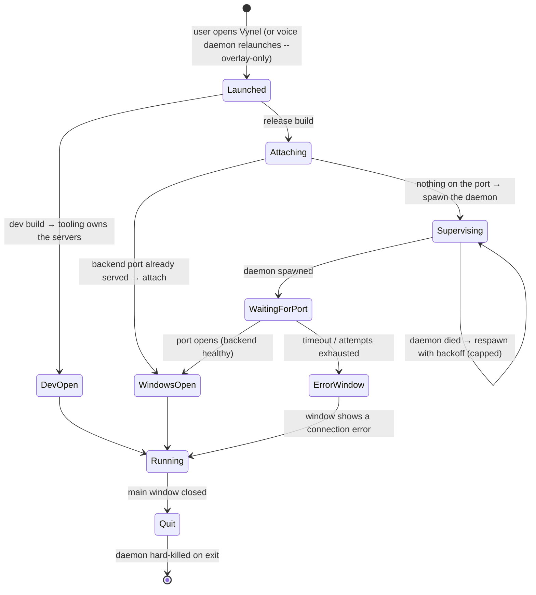

# Desktop — Overview

> The native window shell users actually double-click: a thin Tauri app that hosts Vynel on their machine — it starts the local backend, opens the windows, and paints the same web UI a browser would, wrapped in a real desktop frame.
>
> **Status:** shipped (D1) · installer (D2) pending · **Depends on:** [local-api](../local-api/overview.md) (the daemon it hosts), [local-web](../local-web/overview.md) (the UI it loads), [voice](../voice/overview.md) (wakes the Jarvis overlay) · **Code map:** [structure.md](./structure.md)

## Purpose

Desktop is Vynel's *skin* — the piece that turns a local web server and a set of Vue views into an application a non-technical person can install and launch. Everything the user sees is web UI; the shell's job is to make that UI feel and behave like a native program: a proper window with a title and a taskbar icon, a lifecycle tied to closing that window, and — crucially — a backend that is already running by the time the window appears.

What makes it its own surface rather than a launcher script is **the sidecar promise**. In a shipped build the shell owns the local backend: it starts the API daemon, waits for it to come up, supervises it if it dies, and kills it when the app quits. The user never sees a terminal, never starts a server, never learns that Vynel is "a Node process plus a web page." They open one thing and everything is there. The shell is deliberately kept as small as possible — window flags and daemon supervision, nothing more — because all real behavior lives in the web views it loads.

The shell runs in two very different modes. **In development** it assumes the developer's tooling already owns the API and the Vite dev server, so it does almost nothing but open windows pointed at the dev URL. **In a release build** it becomes a supervisor: it spawns the backend, health-checks it by watching for the port to open, and only then paints the windows against the daemon-hosted UI.

## What it can do

- **Open the main window** — a titled, resizable frame (with a sensible minimum size) that loads Vynel's root UI.
- **Open the Jarvis overlay** — a small, frameless, transparent, always-on-top, non-resizable window that loads the voice route and floats above other apps; the overlay's own web view drives its show / hide / park / drag behavior.
- **Launch overlay-only on wake** — when the voice daemon relaunches the app with the voice-only flag, only the Jarvis overlay opens and the full app stays closed, so speaking to Vynel doesn't pop a whole window.
- **Quit when the main window closes** — closing the main window exits the entire app, so no headless overlay (or backend) is left running after the user thinks Vynel is shut.
- *(background)* **Start the backend daemon** in release builds — locate the app's code, spawn the API server as a child process, and hand the windows the address it serves.
- *(background)* **Supervise the daemon** — if the backend dies unexpectedly, respawn it with backoff, up to a small fixed number of attempts before giving up and letting the window show a connection error.
- *(background)* **Attach instead of spawn** — if something is already serving the backend's port (e.g. a developer's running server), use that rather than starting a second one.
- *(background)* **Stop the daemon on exit** — hard-kill the child process when the app quits (the database's write-ahead log survives the abrupt stop).

## Responsibilities

**Owns** — the native process and its windows: the two window definitions and their flags (the main frame and the always-on-top voice overlay), the create-windows-only-after-the-backend-is-up ordering, the overlay-only launch path, the close-main-quits-app rule, and — in release builds — the entire lifecycle of the backend daemon it runs as a sidecar: finding the app's code, spawning the server as a child process, health-checking it by watching the loopback port, respawning it with capped backoff, and killing it on exit.

**Does not own** —
- any UI, screen, panel, or in-app behavior — every pixel is served by [local-web](../local-web/overview.md) and loaded into the web view;
- the backend itself — the routes, database, migrations, services, and the gateway that serves the built UI all belong to [local-api](../local-api/overview.md); the shell only *starts and stops* that process;
- what the voice overlay does once open — wake detection, speech, and the overlay's own window choreography belong to [voice](../voice/overview.md) and the overlay's web view;
- the packaged installer, bundled runtime, and auto-update — that is the still-pending D2 work (today's shipped app runs from a repo checkout).

## Concepts & vocabulary

| Term | Meaning |
|---|---|
| **The shell** | The native Tauri process itself — the window frame and process lifecycle, holding no UI of its own. |
| **Main window** | The primary Vynel frame: titled, resizable, loads the app's root UI. Closing it quits everything. |
| **Jarvis overlay** | The voice window: small, frameless, transparent, shadowless, non-resizable, always-on-top. Loads the voice route; manages its own show/hide/park/drag. |
| **The daemon (sidecar)** | The local backend server, run as a child process the shell owns in release builds. |
| **Dev mode vs. release mode** | Two behaviors. In dev the shell just opens windows against a developer-run server + dev UI; in release it starts and supervises the backend and loads the daemon-hosted UI. |
| **Overlay-only launch** | A launch mode (triggered by the voice daemon on wake) that opens *only* the Jarvis overlay, leaving the full app closed. |
| **The port probe** | Watching the backend's loopback port open as the signal that the daemon has finished booting — the shell's health check. |
| **D1 / D2** | Ship stages. D1 = the real desktop app, shipped, running from a repo checkout. D2 = the installer, bundled runtime, and lifecycle hardening — still to come. |

## Rules & invariants

- **The shell holds no UI.** Every window loads a route served elsewhere; if you're adding a screen, it belongs in the web app, not here. The shell only ever manages windows and the backend process.
- **Windows open only after the backend is up (in release).** Window creation lives in code, not static config, precisely so a release build can delay it until the daemon is listening — a window loading the backend address before anything serves it would freeze on an error page.
- **Closing the main window quits the whole app.** This keeps the promise that "closed" means closed — no orphaned overlay, no lingering backend. (This holds within a single process; multi-process cases — an overlay-only launch, or a second full instance sharing the first's daemon — are a known hole slated for D2.)
- **One backend, and the shell owns its life.** In release the shell starts the daemon, supervises it, and kills it on exit — unless the port is already served, in which case it attaches rather than spawning a rival.
- **The port opening is the "ready" signal.** The daemon binds its loopback port as the last step of a successful boot, so the shell treats that port becoming reachable as proof the backend is healthy, and gives up (showing the window with a visible connection error) rather than waiting forever.
- **Supervision is bounded.** A backend that can't hold its port — runtime missing, port stolen, crash loop — is respawned only a small fixed number of times with growing backoff, then abandoned, so the app never burns CPU forever on a hopeless restart.
- **In development the shell defers to the developer's tooling.** It spawns no backend and health-checks nothing; it assumes the dev server and dev UI are already running and simply opens the windows against them.

## Lifecycle

## Where it sits in the bigger picture

Desktop is the outermost ring of Vynel on a user's machine — the only piece they launch directly, and the one that makes all the others reachable. It hosts [local-api](../local-api/overview.md) as a sidecar process and loads [local-web](../local-web/overview.md) into its windows; in a shipped build the web UI it shows is the one the API's own gateway serves, so the shell is really just framing a self-contained local system. Its second window exists for [voice](../voice/overview.md): the always-on-top Jarvis overlay is how Vynel answers when spoken to, and the voice daemon can relaunch the shell in overlay-only mode so a wake word summons just that floating window. Everything conversational — memory, knowledge, chat, approvals — happens inside those web views, served by the backend the shell quietly keeps alive; the desktop app's whole contribution is making that backend start, stay up, and stop cleanly, wrapped in windows that feel native. The remaining work to make it a true consumer product — a real installer, a bundled runtime instead of a repo checkout, and hardened single-instance ownership — is the D2 stage still ahead.

---
*Mapped from the code on disk, 2026-07-14. If you change this module, update this file and [structure.md](./structure.md).*
