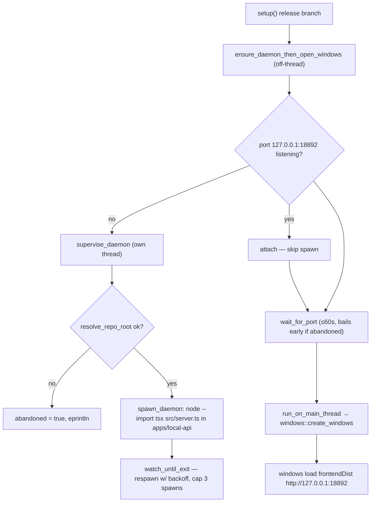
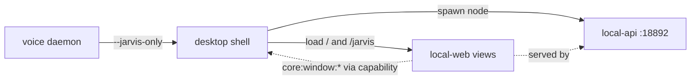

# Desktop shell — Structure

> The code map and boot sequence for the `apps/desktop` Tauri v2 shell. For the concepts behind it, see [overview.md](./overview.md).
>
> Folders touched: `apps/desktop/src-tauri/src/` · `apps/desktop/src-tauri/{capabilities,tauri.conf.json,Cargo.toml}` · reads from `apps/local-api/src/{server,gateway}.ts` · loads `apps/local-web` views · launched by `apps/voice/src/overlay/jarvis-window.ts`

`apps/desktop` is the **native app shell**, not a feature leaf — it owns no schema, repositories, routes, or MCP tools. It is a deliberately thin Rust (Tauri v2) wrapper whose only jobs are: **open the windows**, and (release only) **spawn + supervise the `local-api` daemon sidecar** that serves both the UI and the API. All UI behaviour lives in the `local-web` views the windows load. There is **no JS/TS entry** here — `package.json` only wires the `@tauri-apps/cli` (`tauri dev` / `tauri build`); the shell is Rust under `src-tauri/`.

## File map

`► ` = entry point.

| Path | Role |
|---|---|
| ► `src-tauri/src/main.rs` | Tauri entry — `main()` builds the app, reads the `--jarvis-only` arg, in `setup()` branches dev→`windows::create_windows` / release→`daemon::ensure_daemon_then_open_windows`; `on_window_event` quits when the `main` window closes; `RunEvent::Exit`→`daemon::stop()` |
| `src-tauri/src/daemon.rs` | the local-api sidecar lifecycle (release only) — port probe / spawn / supervise-with-backoff / hard-kill on exit. Global `Mutex<DaemonState>`. **Spawns ONLY `local-api`** — never `worker` or `voice` |
| `src-tauri/src/windows.rs` | window creation in code (so release can delay it until the daemon binds) — the `main` app window (unless `--jarvis-only`) + the always-on-top transparent `jarvis` overlay |
| `src-tauri/build.rs` | Tauri build hook — just `tauri_build::build()` |
| `src-tauri/tauri.conf.json` | app config — product/identifier, `devUrl` (`:18894`) vs `frontendDist` (`127.0.0.1:18892`), empty `windows: []` (windows are code-created), `bundle.active: false` |
| `src-tauri/capabilities/default.json` | Tauri v2 capability grant — the `jarvis` window's self-management permissions (show/hide/focus/set-position/start-dragging) |
| `src-tauri/Cargo.toml` | Rust manifest — crate `vynel-desktop`, edition 2021, deps `tauri = "2"` (default features), `tauri-build = "2"` |
| `apps/desktop/package.json` | pnpm shim — `@vynel/desktop`, `dev`/`build` = `tauri dev`/`tauri build`; dev-dep `@tauri-apps/cli ^2.1.0`. No app source |

> `src-tauri/Cargo.lock` and `src-tauri/target/` (the Cargo build cache) are build artifacts, not source.

## Boot & wiring

The shell has two boot paths chosen at compile time by `cfg!(debug_assertions)` (`main.rs:21`).

**Dev (`pnpm dev` / `tauri dev`)** — `pnpm dev` already owns the API + the Vite server, so `setup()` calls `windows::create_windows` immediately. Windows load `devUrl` = `http://localhost:18894` (Vite).

**Release (`tauri build`)** — the UI + API are served by the daemon, so windows must **not** open until the port is listening (a config-declared window would load `frontendDist` before anything serves it and freeze on an error page — the reason `tauri.conf.json` ships `windows: []` and window creation lives in Rust). `setup()` calls `daemon::ensure_daemon_then_open_windows`, which runs the whole wait **off-thread** so `setup()` returns and the event loop can paint.

### Release spawn sequence (`daemon.rs`)

1. **Probe** — `port_is_listening()` TCP-connects `127.0.0.1:18892` (300 ms). If already served (e.g. a running `pnpm dev`), the shell **attaches** and skips spawning (`daemon.rs:48`).
2. **Resolve repo root** — `resolve_repo_root()`: `VYNEL_DESKTOP_REPO_ROOT` env override first, else walk up from the exe until a dir contains `apps/local-api/src/server.ts` (`daemon.rs:185`). None found → `abandoned = true`, give up.
3. **Spawn** — `spawn_daemon()` runs `node --env-file-if-exists=<root>/.env --import tsx src/server.ts` with cwd `apps/local-api` (`daemon.rs:164`). On Windows, `CREATE_NO_WINDOW` (`0x0800_0000`) suppresses the console flash.
4. **Supervise** — `watch_until_exit()` polls `try_wait` every 500 ms; an unexpected exit respawns with linear backoff (`500 ms × attempt`), capped at `SPAWN_ATTEMPTS = 3` total spawns; exhaustion → `abandoned = true`.
5. **Wait** — `wait_for_port(60 s)` polls until the port binds (the daemon binds it **last**, after migrations + services — so the probe doubles as a health check) or `abandoned` short-circuits the wait.
6. **Open windows** — back on the **main thread** via `run_on_main_thread`, `windows::create_windows`. If the port never came up, windows open anyway and `local-web` shows a connection error.

### Window creation (`windows.rs`)

`create_windows(handle, jarvis_only)` builds up to two `WebviewWindow`s:

| Window | Label | URL (`WebviewUrl::App`) | Flags |
|---|---|---|---|
| Main app | `main` | `/` | 1280×800, min 960×600, standard chrome. **Skipped when `--jarvis-only`** |
| Jarvis overlay | `jarvis` | `/jarvis` | 420×560, `decorations(false)`, `transparent(true)`, `shadow(false)`, `always_on_top(true)`, `resizable(false)`, `skip_taskbar(false)` — always built |

The overlay manages its own show/hide/park/drag from the web side (`apps/local-web/src/composables/voice/tauri-overlay-window.ts`), which is exactly what the `jarvis-window` capability grants (`capabilities/default.json`).

### The `--jarvis-only` wake path

The voice daemon relaunches this same exe with `--jarvis-only` on a wake word when no window is connected (`apps/voice/src/overlay/jarvis-window.ts:75`). `main.rs:16` reads the flag; `create_windows` then builds **only** the overlay, leaving the full app closed. The daemon sidecar is still ensured in release because the overlay's UI is served by it.

### Shutdown

Closing the `main` window calls `AppHandle::exit(0)` (`main.rs:38`) — without this the hidden overlay would keep a headless process (and the daemon) alive after the user thinks Vynel is closed. `RunEvent::Exit` → `daemon::stop()` hard-kills the child (`TerminateProcess`; SQLite WAL survives it).

## Config & gotchas

- **Ports.** `frontendDist`/daemon port `18892` (matches `apps/local-api/src/env.ts` `PORT` default and the `DAEMON_ADDRESS` const in `daemon.rs:23`); `devUrl` `18894` (Vite). The whole sidecar mode hangs on `18892` — it's duplicated in three places (Rust const, `tauri.conf.json`, local-api env) and must stay in sync.
- **Env override.** `VYNEL_DESKTOP_REPO_ROOT` forces the repo root for the D1 checkout-run daemon; invalid values (no `apps/local-api`) are ignored with an `eprintln`.
- **Diagnostics are terminal-only.** The `eprintln!` daemon diagnostics are swallowed by a windowed release build — deferred to D2 (the Tauri log plugin). Launch from a terminal to see them.
- **`bundle.active: false`.** No installer/bundle is produced yet — this is intentional. See "Not here yet" below.
- **`csp: null` + `withGlobalTauri: true`.** CSP is disabled and the global `window.__TAURI__` bridge is on (the overlay composables call `core:window:*` directly).
- **The daemon spawns only `local-api`.** `worker` and `voice` are **not** spawned here — memory's maintenance jobs run in-process inside `local-api`, and voice runs as its own process that launches *this* shell (not the reverse).

### Not here yet (D2 installer + hardening)

The code carries explicit `D2:` markers for what's deferred:

- **Installer / bundle** — `bundle.active: false`; D2 swaps `node --import tsx` (checkout run) for the bundled runtime + built entry.
- **Single-instance ownership hole** (`main.rs:34–42`) — the close-quits-app promise only holds within ONE process. A `--jarvis-only` process has no `main` window (no exit path) and a second full instance that attaches to the first's daemon loses it when the first closes. D2: single-instance plugin + explicit daemon ownership.
- **Graceful daemon shutdown** — today is a hard `TerminateProcess`; a signal handshake + a Windows **Job Object** (kill-on-close, to close the exit-mid-`CreateProcess` sliver at `daemon.rs:109`) is the D2-robust answer.
- **Log plugin** — replaces the terminal-only `eprintln!` diagnostics.

## Connections

**Summary:** the shell is a **pure adapter (a top-of-graph app)** — nothing in `packages/` or `apps/` imports it. It reaches *out* to launch/serve the API and load the UI, and is launched *in* by the voice daemon.

| Unit | Direction | Mechanism | What crosses |
|---|---|---|---|
| [local-api](../local-api/overview.md) | out | spawned child process | `node --import tsx src/server.ts`; probes/serves `127.0.0.1:18892` (see `gateway.ts`) |
| [local-web](../local-web/overview.md) | out | webview URL load | `main`→`/`, `jarvis`→`/jarvis`; overlay control via `composables/voice/tauri-overlay-window.ts` |
| [voice](../../voice/overview.md) | in | process launch | `jarvis-window.ts` runs this exe `--jarvis-only` on wake |
| Tauri v2 runtime | out | crate dep | `tauri = "2"` — `Builder`, `WebviewWindowBuilder`, `AppHandle`, capability system |

---
*Mapped from the code on disk, 2026-07-14. If you change this module, update this file and [overview.md](./overview.md).*
