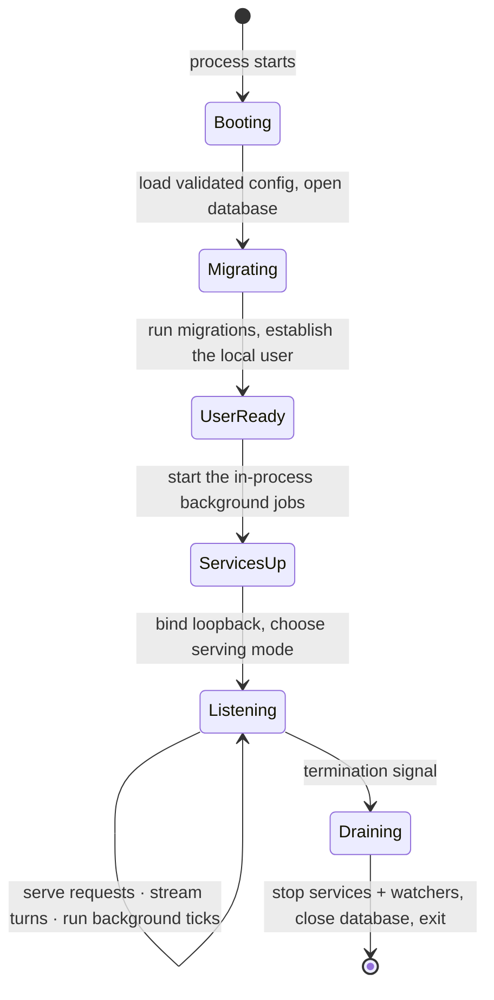

# local-api — Overview

> The on-device HTTP daemon that is Vynel's front door: it mounts every feature's routes over the one shared database, resolves the local user, runs all the background work in-process, and — in the packaged app — serves the desktop UI and streams each chat turn back to it.
>
> **Status:** shipped · **Depends on:** the [db](../../core/overview.md) kernel and, as the surface that mounts them all, every `@vynel` feature package (representative: [chat](../../chat/overview.md), [session](../../session/overview.md), [memory](../../memory/overview.md), [knowledge](../../knowledge/overview.md), [schedules](../../schedules/overview.md), [channels](../../channels/overview.md), [providers](../../providers/overview.md), [hub-account](../../hub-account/overview.md)) · **Code map:** [structure.md](./structure.md)

## Purpose

local-api is the single process the whole desktop experience talks to. Everything a user or the assistant does — send a chat message, browse memory, register a knowledge source, schedule a task, connect a channel — arrives here as an HTTP request against `127.0.0.1`, and every feature's logic lives in a package *below* this app. The daemon itself holds **no business logic**: it is a thin surface that wires the shared database into each request, mounts each feature's routes, maps typed domain errors to HTTP responses, and streams long-running turns back over SSE.

What makes it more than a router is that on a single-user desktop **there is no separate worker process**. So this same daemon also *hosts* the background work: it starts the timers that drive memory and knowledge maintenance, the channels loop, the per-minute schedule poll, the delegation tick, and the stale-approval reaper. They run inside the api process precisely because they need to re-enter the api's own routes to run a turn — the daemon dispatches those headless turns against itself through an in-process re-entry seam, never crossing the network.

In the packaged app the daemon is also the **gateway**: it fronts the api under one mount, proxies voice traffic to the voice daemon, and serves the built web UI directly from this port (the desktop shell loads its windows from here). In development that same gateway is a transparent superset of the bare api, with the dev server fronting the UI instead.

## What it can do

- **Answer the whole product API** — mount each feature's routes, both workspace-scoped (`/workspaces/:id/...`) and user-scoped/global, over one shared database, with request-scoped dependency injection.
- **Resolve who's asking** — establish the single local user on every request (the Phase-1 auth seam), and resolve the target workspace on workspace-scoped routes.
- **Stream a chat turn** — run a conversation turn and pipe its normalized events back to the caller as a live SSE stream, so the UI renders tokens, tool cards, and approvals as they happen.
- **Guard access at the edge** — a first-launch gate (block ordinary routes until onboarding completes), per-feature capability/entitlement tier gates, and a single typed-error-to-HTTP translation for every failure.
- **Serve the desktop UI** — when a built web bundle is present, host it (with SPA fallback for navigations) so the desktop shell renders from this port; otherwise run api-only behind the dev server.
- **Proxy voice** — forward the voice overlay channel (wake events, synthesis, session end) to the local voice daemon, returning a clear error when it isn't running.
- **Re-enter itself for headless turns** — expose an in-process request seam so background jobs (schedules, channels, delegation) run a full turn through the api's own route stack without a network hop.
- **Publish an OpenAPI spec** — emit the machine-readable API description that the typed client and MCP/SDK generators consume.
- *(background)* **Run all maintenance in-process** — memory embeddings + retention purge, knowledge watcher-restore + indexing ticks, the channels poll/process/deliver loop, the schedule fire poll, the delegation claim-and-run tick, the stale-approval reaper, and (when a hub is configured) the account-session refresh and catalog sync.

## Responsibilities

**Owns** — the process itself: the boot sequence (load validated config → open the database → run migrations → establish the local user → listen on loopback → drain on shutdown); the HTTP front door and the mounting of every feature's route bundle; per-request dependency injection of the shared database, logger, and the shared singletons; the *scheduling* of the in-process background jobs (their timers and lifecycle, not their logic); the gateway (api mount, voice proxy, static UI hosting, SPA fallback); SSE transport shaping for live turns; user and workspace resolution at the request boundary; the gate middlewares (first-launch, feature/tier); the one typed-error-to-HTTP mapping; the OpenAPI spec; and the in-process re-entry seam that lets headless turns call the api's own routes.

**Does not own** — the actual behavior behind any route. Each feature's logic, schema, and rules live in its own package:
- conversations, sessions, and turn machinery — [chat](../../chat/overview.md), [session](../../session/overview.md), [orchestration](../../orchestration/overview.md);
- the visible brain — [memory](../../memory/overview.md), [knowledge](../../knowledge/overview.md), the [notebook](../../instructions/overview.md);
- scheduled tasks, channels, and delegation logic — [schedules](../../schedules/overview.md), [channels](../../channels/overview.md), [orchestration](../../orchestration/overview.md) (this app only runs their ticks);
- approvals, capabilities, skills, agents, the marketplace — [approvals](../../approvals/overview.md), [capabilities](../../capabilities/overview.md), [skills](../../skills/overview.md), [agents](../../agents/overview.md), [marketplace](../../marketplace/overview.md);
- reaching the AI runtime — only through the provider seam ([providers](../../providers/overview.md)); the api never touches the SDK runtime directly;
- the assistant's tools — the [mcp](../mcp/overview.md) surface, which the in-process turns compose and re-enter through;
- the desktop UI it serves — [local-web](../local-web/overview.md), built elsewhere and merely hosted here;
- the account link and its cloud — [hub-account](../../hub-account/overview.md) and the hub itself;
- the voice overlay it proxies — the [voice-engine](../../voice-engine/overview.md) daemon;
- the shared database, migrations, and repositories — the [db](../../core/overview.md) kernel.

## Concepts & vocabulary

| Term | Meaning |
|---|---|
| **The daemon** | This process — the long-running local HTTP server bound to loopback that every surface talks to. |
| **The api app** | The inner route tree: every feature's routes mounted over the shared database, with the typed-error handler and the OpenAPI spec. |
| **The gateway** | The outer front door that wraps the api app — routes the api mount, the voice proxy, and (in the packaged app) the static UI. |
| **Sidecar mode** | The packaged mode: a built web bundle exists, so the gateway serves the whole desktop UI from this port and the desktop shell loads its windows from here. |
| **Dev mode** | No built bundle: the gateway is a transparent superset of the bare api, and a separate dev server fronts the UI. |
| **In-process service** | A background job the daemon starts at boot and stops on shutdown (maintenance ticks, the channels loop, schedule poll, delegation tick, approvals reaper) — there is no separate worker on the desktop. |
| **Re-entry seam** | The in-process request dispatcher stashed per request so a headless background turn can call the api's own routes without a network hop. |
| **Headless turn** | A conversation turn run by a background job (a fired schedule, an inbound channel message, a routed delegation) rather than a user at the UI. |
| **User resolution** | The Phase-1 auth seam: every request is attributed to the single local user; Phase 2 replaces this with real authentication. |
| **The gates** | Edge middlewares that can refuse a request before it reaches a route — first-launch (until onboarding is done) and per-feature capability/tier gates. |

## Rules & invariants

- **No business logic in the app.** Every route parses, validates, calls into a feature package, and shapes the response. All real logic lives in `packages/`; this app is a surface over them.
- **Loopback-only and unauthenticated in Phase 1.** The daemon binds `127.0.0.1` and attributes every request to the one local user. Network exposure and real auth are a deliberate Phase-2 change, not a gap to patch now.
- **The desktop runs one process for the work.** There is no separate worker; every background job runs in-process — because each needs to re-enter the api to run a turn, and sub-minute cadences belong beside that machinery.
- **Headless turns re-enter through the api, never around it.** Background jobs dispatch turns through the in-process request seam bound to the inner api app, so they traverse the same routes, gates, and error handling as a user request.
- **The AI runtime is reached only through the provider seam.** No route or service in this app imports the agent SDK runtime directly.
- **One error boundary.** Typed domain errors map to their HTTP status in a single place; anything else is a logged, opaque 500.
- **Serving mode is decided once, at boot.** Whether a built UI bundle exists is checked at startup; switching between api-only and full-UI hosting means rebuilding the UI and restarting the daemon.
- **The hub link is optional.** Account and catalog services start only when a hub is configured; without it those routes answer "not configured" rather than failing.
- **Shutdown is graceful.** A termination signal stops the listener, then every started service and watcher, then closes the database before exit.

## Lifecycle

## Where it sits in the bigger picture

local-api is the hub every other surface plugs into. The desktop shell and the [local-web](../local-web/overview.md) UI it hosts talk only to this port; the [voice-engine](../../voice-engine/overview.md) daemon is proxied through it and also posts turns back to it; the [cli](../cli/overview.md) and out-of-process [mcp](../mcp/overview.md) consumers dispatch through its api mount. Below it sits the whole feature layer — [chat](../../chat/overview.md), [session](../../session/overview.md), [memory](../../memory/overview.md), [knowledge](../../knowledge/overview.md), [schedules](../../schedules/overview.md), [channels](../../channels/overview.md), and the rest — each owning its own logic while this app owns only the mounting, the request plumbing, and the timers that keep the background work turning. It reaches the AI through [providers](../../providers/overview.md) and the assistant's tools through [mcp](../mcp/overview.md), and it links to the account cloud through [hub-account](../../hub-account/overview.md) only when one is configured. In one line: local-api is where all the packages become a running product.

---
*Mapped from the code on disk, 2026-07-14. If you change this module, update this file and [structure.md](./structure.md).*
