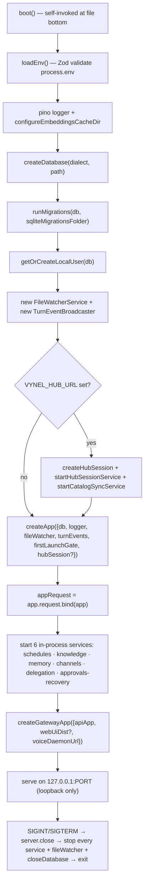

# local-api — Structure

> The boot-and-wiring map for the `apps/local-api` daemon — the app SHELL that mounts every feature's routes, runs the in-process background services, and fronts the desktop UI. For the concepts behind it, see [overview.md](./overview.md). Per-feature route/MCP/web detail lives in each feature's own doc (linked from the route-mount table).
>
> Folders touched: `apps/local-api/src/` · `apps/local-api/src/middleware/` · `apps/local-api/src/handler-bundles/` · `apps/local-api/src/services/` · `apps/local-api/src/streams/` · `apps/local-api/src/sessions/` · `apps/local-api/src/routes/*/`

`local-api` is the Phase-1 entry point: one Hono app (`createApp`) fronted by one gateway, bound to loopback, running **every** background job in-process (the desktop app ships no `apps/worker`). This doc maps the shell-level pieces only — the DI factory, the boot sequence, the middleware chain, the route mounts, the services, SSE streams, and the app-edge session composition. Feature internals (`schema/`, `repositories/`, operations, per-route tables) live in the feature docs.

## File map

`► ` = entry point. Route folders are collapsed to one row each — see the linked feature doc.

| Path | Role |
|---|---|
| `apps/local-api/src/index.ts` | placeholder (`export {}`) — **not** the entry point; the server is wired by `server.ts` |
| ► `apps/local-api/src/server.ts` | boot entry — self-invokes `boot()` at the bottom: load env → open db → migrate → local user → start hub link → `createApp` → start 6 in-process services → gateway → `serve` on 127.0.0.1; SIGINT/SIGTERM graceful shutdown |
| ► `apps/local-api/src/app.ts` | the `createApp` DI factory — request-scoped `c.var.*`, global middleware chain (DI → first-launch gate → featureGate), the one `onError`, `/openapi.json`, and all route mounts |
| `apps/local-api/src/factory.ts` | the Hono `createFactory<AppEnv>()` + the `AppEnv` `c.var` shape (the DI contract every route/middleware builds on) |
| `apps/local-api/src/env.ts` | Zod-validated env — the **only** `process.env` home in this app; repo-root path resolution for `DB_PATH`/dist/cache; `loadEnv()` caches |
| `apps/local-api/src/openapi.ts` | local `describeRoute` wrapper (widens metadata for the `x-mcp` + `x-sdk-name` extensions) + `openApiInfo` doc metadata |
| `apps/local-api/src/gateway.ts` | the front door — `createGatewayApp`: `/api/*` (prefix-stripped) → api, `/voice/*` → voice-daemon proxy, static UI + SPA fallback, `*` → api at root |
| `apps/local-api/src/static-web-ui.ts` | hand-rolled static file server for the built `local-web` dist (sidecar mode) — absolute-dir resolution + traversal guard + hashed-asset caching |
| `apps/local-api/src/middleware/first-launch-gate.ts` | 412 `onboarding_required` on every non-onboarding route until the local user finishes setup (read-only `findSingleLocalUser`) |
| `apps/local-api/src/middleware/feature-gate.ts` | `featureGate(feature)` — 403 `feature_locked` when a live hub entitlement lacks the feature; permissive with no entitlement |
| `apps/local-api/src/middleware/user-resolver.ts` | Phase-1 auth seam — resolves the single local user via `getOrCreateLocalUser`, sets `c.var.user` |
| `apps/local-api/src/middleware/workspace-resolver.ts` | reads `:workspaceId`, scopes by user, sets `c.var.workspace`, fire-and-forget `lastAccessedAt` touch |
| `apps/local-api/src/middleware/chat-session-resolver.ts` | reads `:sessionId`, triple-checks user + workspace + soft-delete, sets `c.var.chatSession` |
| `apps/local-api/src/handler-bundles/user-scoped.ts` | `userScoped` = `[userResolver]` — spread per-route with `...userScoped` |
| `apps/local-api/src/handler-bundles/workspace-scoped.ts` | `workspaceScoped` = `[userResolver, workspaceResolver]` |
| `apps/local-api/src/handler-bundles/session-scoped.ts` | `sessionScoped` = `[userResolver, workspaceResolver, chatSessionResolver]` |
| `apps/local-api/src/services/schedules-service.ts` | per-minute schedule poll → fire via workspace turn (in-process) |
| `apps/local-api/src/services/channels-service.ts` | poll(5s)/process(1s)/deliver(2s) loops — inbound → global-root turn → outbound |
| `apps/local-api/src/services/delegation-service.ts` | ~1s SERIAL (in-flight guard) delegation-jobs drain — one workspace turn per tick |
| `apps/local-api/src/services/knowledge-indexing-service.ts` | boot watcher-restore + catch-up scan; 60s embeddings tick |
| `apps/local-api/src/services/memory-maintenance-service.ts` | 60s embeddings tick + 24h retention purge |
| `apps/local-api/src/services/approvals-recovery-service.ts` | 60s stale-approval reaper — deny the parked provider approval + mark row `timed-out` |
| `apps/local-api/src/services/hub-session-service.ts` | hub account status re-check — adaptive cadence (24h settled / 60s offline); only when a hub is configured |
| `apps/local-api/src/services/catalog-sync-service.ts` | 30-min cloud-catalog cache refresh; only when a hub is configured |
| `apps/local-api/src/streams/chat-turn.ts` | SSE for a chat turn — composes the per-session MCP server, pipes normalized events to SSE frames |
| `apps/local-api/src/streams/global-root-turn.ts` | SSE for a **web** global-root ("brain") turn |
| `apps/local-api/src/sessions/*` | the app-EDGE session composition that CANNOT move into a package — see [Sessions](#sessions--app-edge-composition) |
| `apps/local-api/src/routes/*/` | one folder per feature — mounted in `app.ts`; internals in the feature docs |

## DI & middleware

### `c.var` shape (`factory.ts`)

The DI factory `createFactory<AppEnv>()` fixes what every request carries. Set once at construction in `app.ts`'s `app.use('*')` DI middleware unless noted:

| `c.var` key | Source | Notes |
|---|---|---|
| `db` | boot (`createDatabase`) | the `@vynel/db` kernel handle |
| `logger` | boot (pino) | request-scoped logger |
| `appRequest` | `app.request.bind(app)` | in-process re-entry dispatcher — how MCP tool calls loop back through HTTP |
| `fileWatcher` | boot singleton | one chokidar watcher per registered knowledge source |
| `aiProvider` | `resolveAiAgentProvider(DEFAULT_PROVIDER_ID)` | the real `claude` provider (or a test fake) |
| `turnEvents` | boot `TurnEventBroadcaster` | one pub/sub per process, shared with the delegation service |
| `scheduleFireDeps?` | test override only | absent in prod (routes lazily build real deps) |
| `hubSession?` | boot, only if `VYNEL_HUB_URL` set | the `/hub` routes answer `not-configured` without it |
| `user` | `userResolverMiddleware` | populated per-route via a handler bundle |
| `workspace?` | `workspaceResolverMiddleware` | present on `workspaceScoped` routes |
| `chatSession?` | `chatSessionResolverMiddleware` | present only inside `/chat/sessions/:sessionId` routes |

### Middleware order — global vs per-route

Only three things register **globally** in `app.ts`, in this order (`app.ts:94–119`):

1. **DI** `app.use('*')` — sets the `c.var.*` singletons above.
2. **First-launch gate** `app.use('*', firstLaunchGateMiddleware)` — mounted **only** when `enableFirstLaunchGate` is passed (`server.ts` enables it; route tests leave it off). Skips `/openapi.json` and `/onboarding*` before touching `c.var.db`.
3. **Feature gates** — path-scoped `app.use('<path>/*', featureGate('<feature>'))`, registered before the route mounts.

The scoped bundles (`userScoped` / `workspaceScoped` / `sessionScoped`) are **not** global — each route file spreads them per-route with `...workspaceScoped`. So a real request to memory runs:

```
DI (app.use *) → firstLaunchGate → featureGate('memory') → [route] userResolver → workspaceResolver → handler
```

Two consequences worth holding onto:
- **`featureGate` runs BEFORE user/workspace resolution** — it only sees `c.var.hubSession`'s entitlement, never `c.var.user`. It is a pure entitlement check, deliberately permissive when there is no live entitlement to read.
- **Gated subtrees** are exactly: `schedules`, `knowledge`, `memory`, `marketplace`, `voice` (`app.ts:113–119`). `channels`, `chat`, `workspaces`, `skills` stay **ungated** (core assistant) — note that **channels stays ungated despite running a background service**.

### Error mapping (`app.ts:121–130`)

One global `onError`: `instanceof VynelError` → `{ code, message }` at `err.httpStatus`; anything else logs and returns a 500 `internal_error`. Routes never map errors themselves — they throw typed `VynelError`s.

## HTTP surface — route-mount table

Mounts are declared in `app.ts:136–173`. This table points at feature docs; the per-route method/path/MCP detail lives there. Middleware column shows what each subtree carries **on top of** the global DI + first-launch chain.

| Mount (`app.route`) | Sub-app | Extra middleware | Feature doc |
|---|---|---|---|
| `/workspaces/:workspaceId/knowledge` | `knowledgeApp` | `featureGate('knowledge')` | [knowledge](../../knowledge/overview.md) |
| `/workspaces/:workspaceId/skills` | `skillsApp` | — | [skills](../../skills/overview.md) |
| `/workspaces/:workspaceId/marketplace` | `marketplaceApp` | `featureGate('marketplace')` | [marketplace](../../marketplace/overview.md) |
| `/workspaces/:workspaceId/channels` | `channelsApp` | — | [channels](../../channels/overview.md) |
| `/workspaces/:workspaceId/schedules` | `schedulesApp` | `featureGate('schedules')` | [schedules](../../schedules/overview.md) |
| `/workspaces/:workspaceId/chat` | `chatApp` | — | [chat](../../chat/overview.md) |
| `/workspaces/:workspaceId/files` | `filesApp` | — | [files](../../files/overview.md) |
| `/workspaces/:workspaceId/memory` | `memoryApp` | `featureGate('memory')` | [memory](../../memory/overview.md) |
| `/workspaces/:workspaceId/capabilities` | `capabilitiesApp` | — | [capabilities](../../capabilities/overview.md) |
| `/workspaces/:workspaceId/approvals` | `approvalsApp` | — | [approvals](../../approvals/overview.md) |
| `/workspaces/:workspaceId/approval-rules` | `approvalRulesApp` | — | [approvals](../../approvals/overview.md) |
| `/channels` | `channelsUserApp` | — | user-scoped (global + cross-workspace) channels |
| `/schedules` | `schedulesUserApp` | `featureGate('schedules')` | user-scoped schedules |
| `/marketplace` | `marketplaceUserApp` | `featureGate('marketplace')` | GLOBAL marketplace (user + both items) |
| `/notebook` | `notebookApp` | — | [notebook](../../notebook/overview.md) — user-scoped, optional `workspaceId` |
| `/approvals` | `approvalsUserApp` | — | global approval queue (spans every workspace + brain) |
| `/users` | `usersApp` | — | [users](../../core/overview.md) |
| `/onboarding` | `onboardingApp` | — | [onboarding](../../onboarding/overview.md) |
| `/providers` | `providersApp` | — | [providers](../../providers/overview.md) |
| `/agents` | `agentsApp` | — | [agents](../../agents/overview.md) |
| `/root` | `rootApp` | — | global-root ("brain") turn |
| `/routing` | `routingApp` | — | [routing / orchestration](../../orchestration/overview.md) |
| `/voice` | `voiceApp` | `featureGate('voice')` | [voice](../../voice/overview.md) |
| `/dashboard` | `dashboardApp` | — | dashboard aggregates |
| `/hub` | `hubApp` | — | hub account/entitlement status |
| `/workspaces` | `workspacesApp` | — | [workspaces](../../workspaces/overview.md) |

> **Mount-order gotcha:** bare `/workspaces` mounts **after** every `/workspaces/:workspaceId/*` sub-app (source order) so the param-scoped feature routes keep precedence.

## Boot sequence (`server.ts`)



Numbered walk-through, anchored to `server.ts`:

1. **`boot()` self-invokes** (`server.ts:182`) — a top-level `boot().catch(...)` that `console.error`s + `exit(1)` on boot failure (pino may not be wired yet).
2. **Env** — `loadEnv()` (`server.ts:41`) parses+caches the Zod env; `configureEmbeddingsCacheDir` runs before any embedding tick can lazily load the model (`server.ts:46–48`).
3. **Database** — `createDatabase` then `runMigrations(db, sqliteMigrationsFolder)` (`server.ts:51–58`) — migrations run at every boot, before any request.
4. **Local user** — `getOrCreateLocalUser(db)` (`server.ts:60`) seeds the single Phase-1 user.
5. **Boot singletons** — `FileWatcherService` (boot-owned so shutdown can close every watcher) + one `TurnEventBroadcaster` per process (`server.ts:65–69`).
6. **Hub link (optional)** — only when `VYNEL_HUB_URL` **and** `VYNEL_HUB_PUBLIC_KEY` are set: build the `HubSession` (refresh token in the OS keyring, entitlements verified offline), then `startHubSessionService` + `startCatalogSyncService` (`server.ts:76–92`).
7. **`createApp(...)`** (`server.ts:94–101`) — passes db, logger, fileWatcher, turnEvents, `enableFirstLaunchGate` from env, and hubSession when present.
8. **`appRequest`** — `app.request.bind(app)` (`server.ts:106`), the in-process dispatcher headless turns re-enter through.
9. **The 6 in-process services** (`server.ts:110–129`) — schedules, knowledge-indexing, memory-maintenance, channels, delegation, approvals-recovery. All in the api process because the desktop app runs no `apps/worker`.
10. **Gateway** — checks `VYNEL_WEB_UI_DIST` for a built `index.html`: present → sidecar mode (serve the UI); absent → api-only (`server.ts:135–152`).
11. **Listen** — `serve({ fetch: gateway.fetch, hostname: '127.0.0.1', port: env.PORT })` (`server.ts:155`) — **loopback only; the Phase-1 api is unauthenticated.**
12. **Shutdown** — SIGINT/SIGTERM → `server.close` → stop every service + `fileWatcher.stopAll()` + `closeDatabase` → `exit(0)` (`server.ts:159–179`).

## Background services

All eight live in `services/` and run **in-process** — the unifying reason is that the desktop app ships no `apps/worker`, and the schedule/channel/delegation turns are MCP-intrinsic (they need the api's own `app.request` to build the in-process Vynel MCP server, so they cannot run in a split-out worker). Two are hub-gated (started only when a hub is configured). Each returns `{ stop() }`, called on shutdown.

| Service | Start (`server.ts`) | Tick / cadence | What runs |
|---|---|---|---|
| schedules | `:110` | per-minute poll | claim due schedules → fire each via a headless workspace turn (`buildScheduleFireDeps`) |
| knowledge-indexing | `:113` | boot restore + catch-up scan; 60s embeddings | re-open watchers for every registered source; generate missing chunk embeddings |
| memory-maintenance | `:115` | 60s embeddings + 24h purge | fill null `memory_entries.embedding`; hard-purge soft-deleted entries past retention |
| channels | `:121` | poll 5s / process 1s / deliver 2s | fetch inbound → global-root turn per message → queue + send outbound |
| delegation | `:126` | ~1s SERIAL (in-flight guard) | claim one pending routing job → run as a workspace turn → record terminal; boot fails orphaned `claimed` jobs; publishes to `turnEvents` |
| approvals-recovery | `:129` | 60s | deny the parked provider approval on stale cards → mark row `timed-out`; sweeps post-restart orphans |
| hub-session | `:89` (hub only) | adaptive: 24h settled / 60s offline | re-check hub account status |
| catalog-sync | `:90` (hub only) | 30-min | fetch `/catalog` → REPLACE the local cloud-catalog cache (clear on signed-out, keep on offline) |

## Gateway & static web UI

`createGatewayApp` (`gateway.ts`) is the daemon's front door — a transparent superset of the bare api. Route order **is** the contract:

1. `/api/*` → the inner api app with the `/api` prefix stripped (matches the SDK client's `baseUrl: '/api'` and the Vite dev proxy).
2. `/voice/*` → buffered proxy to the voice daemon's overlay channel; 502 `voice_daemon_unreachable` when the daemon is down. **This shadows the api's own `/voice` at root paths on purpose** — the externally-reachable voice surface is `/api/voice/*`; every out-of-process consumer dispatches through `/api`, and the in-process `appRequest` binds the inner api app and never crosses the gateway.
3. Static UI (sidecar mode only) → when a built `dist` exists, GETs resolve to a real file via `static-web-ui.ts`, else the SPA fallback serves `index.html` for html-accepting navigations.
4. `*` → the api app at root paths (compat: the voice daemon POSTs `/root/turn` directly to the port).

`static-web-ui.ts` is hand-rolled (not `serveStatic`) because it must serve an **absolute** dist dir regardless of `process.cwd()` — same per-CWD bug class the `env.ts` `DB_PATH` note records. It guards against path traversal (double-decode + containment check + null-byte reject) and content-hashes: immutable caching for `assets/`, `no-cache` for entry files so a stale shell can't outlive a rebuild.

## Streams (SSE)

`streams/` holds one file per real-time channel. Both compose their MCP attachment **outside** `streamSSE` (so a composition failure surfaces as a 500 before streaming begins), then pipe normalized turn events to SSE frames.

| File | Turn | Sink |
|---|---|---|
| `streams/chat-turn.ts` | workspace chat turn (web) | per-session MCP server → SSE frames |
| `streams/global-root-turn.ts` | global-root ("brain") turn (web) | routing descriptor → SSE frames |

> **Two `global-root-turn` files — don't confuse them.** `streams/global-root-turn.ts` is the **web/SSE** path; `sessions/run-global-root-turn.ts` is the **background/channel** path (no SSE, a drain sink). Both reduce to `runGlobalRootTurnCore` in `@vynel/session/runtime` and differ **only** in the `SessionSink`.

## Sessions — app-edge composition

`sessions/` is the deliberately-thin api EDGE of the session tier — the session logic itself lives in `@vynel/session` (`./runtime` + `./continuity` + `./delegation`, per the 2026-07-12 delegation lift). Each file **stays** at the edge for a live reason (`sessions/README.md`):

| File | Why it can't move into a package |
|---|---|
| `compose-session-mcp-servers.ts` | LOCKED `api-side-turn-execution-with-mcp` — core stays below the MCP producers; every consumer is app-side |
| `run-global-root-turn.ts` | dynamically imports `@vynel/mcp` (= `apps/mcp`) — a package may never import an app |
| `global-root-workspace.ts` | reads `../env.js` (`VYNEL_USER_DATA_DIR`) — env access lives only in the app |
| `resolve-global-root-conversation.ts` | composes the env-coupled dir above; it IS the injected `resolveTarget` seam |
| `delegation-mode-header.ts` / `delegation-origin-header.ts` | HTTP wire encoding of orchestration types — a transport concern of this surface |
| `build-schedule-fire-deps.ts` | assembles fire deps from `../factory.js` — app DI by definition |

`compose-session-mcp-servers.ts` is the per-turn sibling of `composeSessionCapabilities`: every turn entry-point calls it once to build the `mcpServers` record + allow/deny patterns from a descriptor LIST — workspace turns pass `[vynelWorkspaceDescriptor]`, global-root turns pass `[vynelRoutingDescriptor, …]`. It imports only the descriptor TYPE (`@vynel/mcp-contract`, type-only, no runtime).

## Config & gotchas

**Env** (`env.ts` — the only `process.env` home; `loadEnv()` Zod-validates + caches):

| Var | Default | Notes |
|---|---|---|
| `DB_DIALECT` | `sqlite` | `postgres` is Phase-2 |
| `DB_PATH` | `.data/vynel.dev.db` | resolved against **repo root**, not cwd — keeps api + worker on one file (bug note in `env.ts`) |
| `DB_URL` | — | Postgres only |
| `LOG_LEVEL` | `info` | |
| `PORT` | `18892` | the api/gateway loopback port |
| `VYNEL_VOICE_DAEMON_URL` | `http://127.0.0.1:18893` | the gateway's `/voice/*` proxy target |
| `VYNEL_WEB_UI_DIST` | `apps/local-web/dist` | index.html present → sidecar mode |
| `VYNEL_EMBEDDINGS_CACHE_DIR` | `.models/embeddings` | outside `node_modules` |
| `VYNEL_FIRST_LAUNCH_GATE_ENABLED` | `1` (ON) | prod-safe; set `0` in a dev `.env` before the wizard exists |
| `VYNEL_CONTEXT_PRESSURE_THRESHOLD` | — | dev/test continuity-swap override (0–1) |
| `VYNEL_USER_DATA_DIR` | `<home>/.vynel` | the global root's SDK cwd |
| `VYNEL_DESKTOP_ACT_ENABLED` | `0` (OFF) | opt-in mutating desktop tool |
| `VYNEL_HUB_URL` | — | optional; unset → `/hub` answers `not-configured`, hub services don't start |
| `VYNEL_HUB_PUBLIC_KEY` | — | required whenever `VYNEL_HUB_URL` is set (Zod `superRefine`); base64 SPKI PEM |

**Sharp edges the next editor must know:**
- **`index.ts` is a placeholder** (`export {}`) — the real entry is `server.ts` (self-invoking `boot()`); the app-construction entry is `createApp` in `app.ts`.
- **Loopback-only + unauthenticated in Phase 1** — the api binds `127.0.0.1`; `user-resolver` always resolves the single local user. The user/workspace resolvers are the Phase-1→Phase-2 auth seam.
- **`featureGate` runs before user/workspace resolution** and only reads `hubSession`'s entitlement. **Known M3 limitation:** it gates the HTTP surface only — a pro→basic downgrade does **not** stop already-scheduled fires or the knowledge watcher (they run via direct package calls in the boot services, outside HTTP), and it 403s the whole subtree including disable/delete.
- **First-launch gate 412s everything except `/openapi.json` + `/onboarding*`** — and the skip happens before any `c.var.db` access, keeping the SDK generator's stub-deps spec request safe.
- **`/openapi.json`** is served by `hono-openapi` at request time; `scripts/src/generators/*` dispatch `app.request('/openapi.json')` to walk sub-app routes (routes mounted via `.route(...)` only flatten this way).
- **`createApp` accepts test/generator overrides** (`aiProvider`, `scheduleFireDeps`, `turnEvents`, `fileWatcher`, `hubSession`, `enableFirstLaunchGate`) — production omits most and resolves real singletons; generators mount the app with stub deps to read route shapes only.
- **The gateway `/voice` shadow** (see Gateway section) — external voice surface is `/api/voice/*`.

---
*Mapped from the code on disk, 2026-07-14. If you change this module, update this file and [overview.md](./overview.md).*
