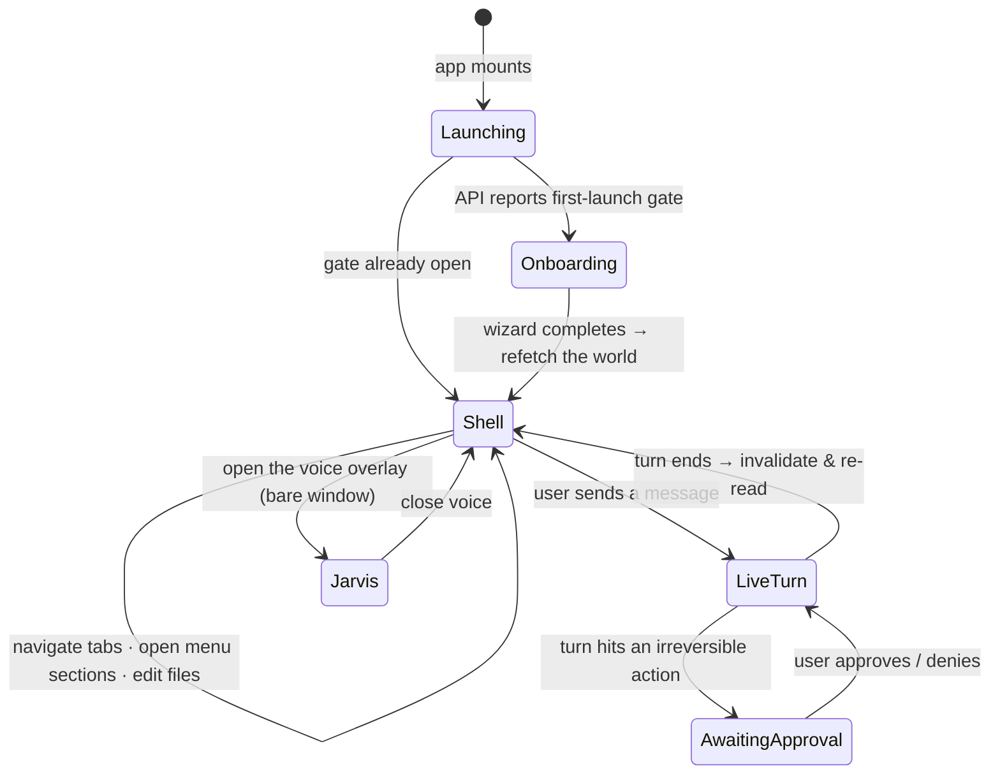

# local-web — Overview

> Vynel's desktop face: the Vue 3 single-page app that non-technical people actually look at and touch — one flowing conversation with an assistant called Claude, wrapped in a dense, native-feeling window.
>
> **Status:** shipped · **Depends on:** [ui](../../ui/overview.md) (components + design tokens), [sdk](../../sdk/overview.md) (typed API client), [session](../../session/overview.md) (mode vocabulary), [voice](../../voice/overview.md), [contracts](../../contracts/overview.md), [approvals](../../approvals/overview.md) · talks to [local-api](../local-api/overview.md) · **Code map:** [structure.md](./structure.md)

## Purpose

local-web is the experience layer — the part of Vynel a person sees. Everything else in the repo is the brain and the plumbing; this app is the room the user sits in. It exists to make a Claude Code agent feel **trustworthy to someone who can't read code**: visible memory, an approval card on every irreversible action, curated skills, and a live view of what the assistant is doing right now.

It is a **thin adapter** by contract. All logic lives in the `packages/`; this app holds only what a screen needs — how the window presents itself, which conversation the canvas is pointed at, how server data is fetched and cached. It renders the API's world; it does not own any of it.

The core experience is deliberately **chrome-light**. There is no dashboard of boxes and no heavy app frame — the assistant is named **Claude** and wears a single coral identity spark, and a turn renders as **one flowing thread**: the assistant's prose, and inline **tool cards** (a file read, a shell command, an edit diff) that read the way Claude Code reads, each with a status and collapsible detail. The window feels like a dense desktop tool, not a web page in a browser.

## What it can do

- **Hold one continuous conversation** — chat opens straight into the single ongoing thread (Vynel's "one brain"), not a list of sessions; past sessions and a fresh-topic start sit behind a history toggle.
- **Work two surfaces** — a **global** surface (the whole assistant, which can dispatch tasks down into workspaces) and a **workspace** surface (one project room, with its own conversation and an editable file area).
- **Stream a live turn** — the assistant's reply and every tool call it makes appear in realtime as the turn runs, with running/finished status and expandable input and output.
- **Watch delegated work** — when a turn hands off to a workspace manager or a specialist agent, a "watch live" link opens a side panel that plays that child session's stream; the report bubbles back into the parent thread.
- **Decide approvals from anywhere** — a pending irreversible action surfaces as a floating notification (and a status light on the titlebar) visible from every view, not buried inside one thread; Approve/Deny is actionable in place.
- **Reach every feature section** — a persistent menu opens Memory, Knowledge, Skills, Agents, Marketplace, Schedules, Channels, and the Notebook for a workspace, plus Application settings and the Account panel globally.
- **Edit workspace files** — click a file to open it on the canvas in direct-edit mode, with syntax highlighting and a Code/Preview toggle for markdown.
- **Compose richly** — a multiline draft with model and mode pickers, a voice mic, and file attachments.
- **Talk to it** — a floating always-on-top **Jarvis overlay** shows the assistant listening and working; voice is a separate window that drops the app shell entirely.
- **Onboard on first launch** — a full-window wizard walks a brand-new user through naming their assistant, seeding identity, and first setup before the main shell ever appears.
- **Switch theme** — dark by default, light on toggle, remembered across relaunches.

## Responsibilities

**Owns** — the presentation only: the window shell (titlebar, tabbed navigation, canvas, floating approval toaster, voice overlay), the client-side view state (theme, the active workspace, what each chat surface is pointed at, the menu and history toggles), the vue-query data layer that fetches and caches everything from the API, the realtime folding of streamed turn events into a live view, the onboarding-gate handling, and the wiring of the shared component library and design tokens into a running app. It renders the assistant's identity — Claude, the coral spark, the flowing thread, Claude-Code-style tool cards.

**Does not own** —
- any business logic, schema, or persistence — those live in the feature packages and are reached only over the API ([local-api](../local-api/overview.md));
- the actual reusable components and design tokens it renders — the shared component library ([ui](../../ui/overview.md));
- the typed calls it makes — the generated client ([sdk](../../sdk/overview.md)), regenerated from the API's contracts ([contracts](../../contracts/overview.md));
- the meaning of any feature panel it opens — each is owned by its feature package ([memory](../../memory/overview.md), [knowledge](../../knowledge/overview.md), [skills](../../skills/overview.md), [agents](../../agents/overview.md), [marketplace](../../marketplace/overview.md), [schedules](../../schedules/overview.md), [channels](../../channels/overview.md), [notebook](../../notebook/overview.md));
- the approval decisions themselves — it only surfaces and forwards them ([approvals](../../approvals/overview.md));
- the voice engine and wake logic — the app only hosts the overlay ([voice](../../voice/overview.md));
- the native window frame, sidecar processes, and packaging — the desktop shell ([desktop](../desktop/overview.md));
- the session-mode vocabulary its composer offers — [session](../../session/overview.md).

## Concepts & vocabulary

| Term | Meaning |
|---|---|
| **Shell** | The persistent frame around every view: a slim titlebar with the three tabs, the canvas, the floating approval toaster, and the voice overlay. |
| **Surface** | Which brain the user is in: **global** (the whole assistant) or a **workspace** (one project room). The chat and menu behave the same on each, scoped differently. |
| **Tab** | The three top-level places — **Home** (dashboard / live activity), **Chat** (the global conversation), **Workspace** (a picked room). |
| **Continuous conversation** | The single ongoing thread a surface opens into by default — no session list up front; history and a fresh topic are opt-in. |
| **Canvas** | The main pane. Shows the chat, a feature section's view, or an open file — while the menu stays open beside it. |
| **Menu section** | A feature the menu opens on the canvas: Memory, Knowledge, Skills, Agents, Marketplace, Schedules, Channels, Notebook (workspace); Application and Account (global). |
| **Live turn** | A turn rendered as it streams — assistant prose plus inline tool cards with realtime status. |
| **Tool card** | The inline record of one tool call (read, write, edit-diff, shell, search), styled to read like Claude Code, with collapsible input/output. |
| **Session viewer** | A side panel that plays a delegated child session's live stream — the "one brain, many hands" story made watchable. |
| **Approval notification** | A pending irreversible action shown as a floating, decidable card from any view, mirrored by the titlebar status light. |
| **ClaudeMark** | The assistant's identity: it is named **Claude** and wears one coral spark. Gold is reserved for presence/liveness, never identity. |
| **Jarvis overlay** | The floating, always-on-top voice window that renders alone, without the app shell. |
| **Onboarding gate** | The first-launch signal (the API refuses normal calls until setup is done) that hands the whole window to the setup wizard. |

## Rules & invariants

- **It is a thin adapter — no business logic lives here.** The app parses user intent, calls the API, and shapes what's on screen; every decision of substance is made in a package behind the API.
- **Server state lives in vue-query; client state lives in a thin Pinia layer.** Everything fetched from the API is a cached query keyed per domain, one composable per operation, mutations invalidating their domain root. Pinia holds only what no server owns — theme, active workspace, each chat surface's view target, the realtime turn registry, cross-view liveness, and the onboarding gate. The two never blur.
- **Streaming stays outside the query cache.** A live turn's events are folded into a view as they arrive; when the turn ends, the affected queries are invalidated so the cache re-reads the settled truth. The stream drives the moment; vue-query drives the record.
- **The assistant is Claude, and the thread is chrome-light.** One coral identity mark; gold means presence only; a turn is a flowing thread of prose and Claude-Code-style tool cards, never a grid of panels.
- **Approvals are reachable from every view.** A waiting decision is never hidden inside a single thread — it is a floating card plus a titlebar status light, decidable wherever the user is.
- **The onboarding gate takes the whole window.** Until first-launch setup completes, the main shell does not mount and nothing keeps polling into the closed gate; when it opens, the app refetches the world.
- **The browser never talks to the API directly.** Calls ride a same-origin `/api` path proxied to the loopback-only local API — the desktop runs no cross-origin traffic.
- **Theme changes atomically.** The document's theme attribute flips in the same synchronous beat as the toggle, so there is never a wrong-theme frame, and the choice survives relaunch.
- **The voice window is bare.** The floating Jarvis view drops the shell entirely — two shell-linked voice surfaces in one window would double the voice session.

## Lifecycle

## Where it sits in the bigger picture

local-web is the top of the stack and imports downward only — it never appears in any package. It renders the shared component library ([ui](../../ui/overview.md)) into a live app, and reaches the entire backend through one typed client ([sdk](../../sdk/overview.md)) generated from the API's contracts ([contracts](../../contracts/overview.md)), speaking only to the local API on loopback ([local-api](../local-api/overview.md)). It shows the user's [memory](../../memory/overview.md), [knowledge](../../knowledge/overview.md), [skills](../../skills/overview.md), [agents](../../agents/overview.md), [marketplace](../../marketplace/overview.md), [schedules](../../schedules/overview.md), [channels](../../channels/overview.md), and [notebook](../../notebook/overview.md) — but owns none of them; each is a feature package it merely opens a window onto. It surfaces [approvals](../../approvals/overview.md) and hosts the [voice](../../voice/overview.md) overlay without owning their logic, borrows the mode vocabulary from [session](../../session/overview.md), and is itself wrapped by the native [desktop](../desktop/overview.md) shell that gives it a frameless window, the Jarvis overlay, and its background processes. In one line: local-web is where Vynel becomes something a person can see and trust — every other module is what it makes visible.

---
*Mapped from the code on disk, 2026-07-14. If you change this module, update this file and [structure.md](./structure.md).*
