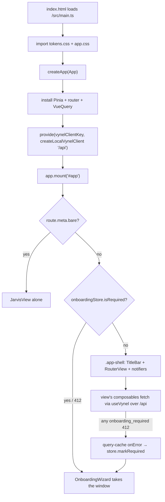

# local-web — Structure

> The code map and connections for the **local-web app shell** — the Vue 3 desktop UI that
> fronts the local API daemon. For the concepts behind it, see [overview.md](./overview.md).
>
> Folders touched: `apps/local-web/{src,}` · `packages/ui/src/` (design system) · `packages/sdk/`
> (typed client) · `packages/session/` · `packages/contracts/` · `packages/voice/` · `packages/approvals/`

This doc maps the **shell scaffolding** only — how the window boots, routes, holds state, and hosts
panels. The feature panels themselves (`components/sections/*`, `components/chat/*`,
`components/onboarding/*`, `components/voice/*`, `components/workspace/*` files, and their
`composables/<feature>/*`) each belong to their feature's own doc; here they appear as *mount points*,
not internals. local-web is a **thin adapter** (§ "thin surfaces, one core"): it speaks only the
generated `@vynel/sdk` client over `/api`, holds server state in vue-query and UI state in Pinia, and
never imports a `packages/<feature>` runtime directly.

## File map — shell scaffolding

► = boot/entry point. Feature panels/composables are collapsed to one row each (see their own docs).

| Path | Role |
|---|---|
| ► `index.html` | Vite HTML entry — `<div id="app">` + `/src/main.ts`; inline `background:#0f1115` avoids a white flash before tokens load |
| ► `src/main.ts` | app bootstrap — `createApp(App)`, install Pinia + router + VueQuery, provide the SDK client, mount `#app`; wires the query-cache 412 hook into the onboarding store |
| `src/App.vue` | root component — the shell layout (`TitleBar` / `RouterView` / `SessionViewerPanel` / `ApprovalNotifier` / `VoiceOverlay`); switches to bare-Jarvis or the onboarding wizard by route/state |
| `src/router.ts` | `createAppRouter()` — 4 routes: `/` → `home`, `/chat`, `/workspace`, `/jarvis` (`meta.bare`); all views lazy-loaded |
| `src/plugins/vynel-client.ts` | `createLocalVynelClient()` (baseUrl `/api`) + the `vynelClientKey` inject symbol |
| `src/plugins/vue-query.ts` | `createAppQueryClient()` — one `QueryClient`; caches carry the global `onOnboardingRequired` (412) hook; `staleTime 30s`, `retry 1`, refetch-on-focus |
| `src/composables/use-vynel.ts` | `useVynel()` — the only sanctioned SDK access point (`inject(vynelClientKey)`, throws if unprovided) |
| `env.ts` / `env.test.ts` | app env boundary (Zod) — `LOCAL_WEB_PORT`, `LOCAL_API_URL`, `VYNEL_VOICE_DAEMON_URL`; runs in the Vite/node context only |
| `vite.config.ts` | dev server — port from env, `strictPort`, proxies `/api` → local-api and `/voice` → voice daemon |
| `src/styles/app.css` | base reset + scrollbar/selection/focus styling; all color from `@vynel/ui` tokens |
| **Views** | |
| `src/views/HomeView.vue` | the dashboard tab — greeting + recent sessions / workspaces / upcoming schedules / approvals cards (reads `useDashboardOverview`) |
| `src/views/GlobalChatView.vue` | the global "one brain" chat surface — menu + history + canvas; hosts the global feature sections |
| `src/views/WorkspaceView.vue` | the per-workspace room — same chat shell scoped to a workspace; hosts workspace sections + files panel + file editor |
| `src/views/JarvisView.vue` | the floating voice overlay window (`meta.bare` — no app shell); Tauri transparent window or `chrome --app` |
| **Shell chrome** | |
| `src/components/shell/TitleBar.vue` | the 40px top bar — 3-tab nav, menu/history toggles, workspace switcher, presence dot, voice + theme buttons |
| `src/components/shell/MenuPanel.vue` | the persistent left menu panel — generic `items` list, emits `select` (shell decides the view) |
| `src/components/shell/ApprovalNotifier.vue` | bottom-right approval toasts — polls pending approvals, decidable from any view |
| `src/components/voice/VoiceOverlay.vue` | in-app Jarvis overlay (teleported to body); reads `ui.isVoiceOverlayOpen` |
| `src/components/session-viewer/SessionViewerPanel.vue` | right-side delegation-trace viewer, driven by `session-viewer-store` |
| `src/components/workspace/workspace-sections.ts` | the **section catalog** — `WorkspaceSectionId` union + `WORKSPACE_SECTIONS` meta list |
| `src/components/workspace/WorkspaceSectionPanel.vue` | dispatches a `WorkspaceSectionId` → its section component (with tier gating) |
| **State (Pinia — UI only)** | |
| `src/stores/ui-store.ts` | shell UI state — theme, active workspace, per-surface `ChatShellState` (`mainView`/`target`), menu/history/voice toggles, composer model+mode |
| `src/stores/activity-store.ts` | cross-view liveness — running-turn count → the presence dot |
| `src/stores/session-viewer-store.ts` | the trace viewer's open/closed session id |
| `src/stores/live-sessions-store.ts` | realtime registry of `ActiveTurnView`s keyed by session id (delegation/agent runs) |
| `src/stores/onboarding-store.ts` | `isRequired` flag — flipped on by the 412 gate, off when the wizard completes |
| **Transport / conventions** | |
| `src/composables/chat/chat-turn-stream.ts` | the live-turn SSE transport — typed `POST … parseAs:'stream'`, yields `ChatTurnEvent`s |
| `src/composables/chat/sse-frames.ts` | pure SSE frame decoder (split/parse/`frameToChatTurnEvent`) — network-free, unit-tested |
| `src/composables/chat/session-keys.ts` | `sessionKeys` query-key factory + `sessionScopeKey(scope)` |
| `src/composables/*/…-keys.ts` | per-feature query-key factories (`dashboard-keys`, `hub-keys`, `notebook-keys`, `onboarding-keys`, `workspace-keys`, `approval-keys`) |
| `src/utils/*.ts` | shell helpers — `format-sdk-error`, `format-relative-time`, `greeting`, `onboarding-required-error`, `schedule-cadence` |
| *feature panels* | `components/{sections,chat,onboarding,workspace,voice}/*.vue` + `composables/<feature>/*` — **deferred to each feature's doc** |

## Boot & wiring — `main.ts`

The whole app comes up in one file, in a deliberate order (`src/main.ts`):

1. **Styles first** — `import "@vynel/ui/styles/tokens.css"` then `"./styles/app.css"` so the design
   tokens (`--bg-shell`, `--ink-1`, `--gold`…) exist before any component paints.
2. **`createApp(App)`** — `App.vue` is the shell root.
3. **Pinia** — `const pinia = createPinia(); app.use(pinia)`. UI state only; server state never lives here.
4. **Router** — `app.use(createAppRouter())`.
5. **The onboarding bridge** — `useOnboardingStore(pinia)` is resolved *with the explicit pinia handle*
   because it's used **outside** any component (in the query-cache error hook). Then
   `app.use(VueQueryPlugin, { queryClient: createAppQueryClient({ onOnboardingRequired: () =>
   onboardingStore.markRequired() }) })` — the single global 412 hook (see Gotchas: first-launch gate).
6. **SDK client** — `app.provide(vynelClientKey, createLocalVynelClient())`. Every data composable
   reaches it through `useVynel()`; tests provide a fake under the same key (`app-shell.test.ts`).
7. **`app.mount("#app")`**.

The `QueryClient` (`plugins/vue-query.ts`) is the app's single server-state store: `staleTime 30_000`,
`retry 1`, `refetchOnWindowFocus: true`, and both the query- and mutation-cache carry `onError:
inspectError`, which forwards any `onboarding_required` error to the store — a shell-level concern no
individual view should handle.

## Routing & views

`createAppRouter()` (`src/router.ts`) — `createWebHistory`, four routes, every view a dynamic import:

| Path | Name | View | Notes |
|---|---|---|---|
| `/` | (redirect) | → `home` | landing redirect |
| `/home` | `home` | `HomeView.vue` | the dashboard |
| `/chat` | `chat` | `GlobalChatView.vue` | the global brain |
| `/workspace` | `workspace` | `WorkspaceView.vue` | active workspace from `ui.activeWorkspaceId` |
| `/jarvis` | `jarvis` | `JarvisView.vue` | `meta.bare: true` — renders alone, **no shell, no VoiceOverlay** (two daemon links in one window would double the voice session) |

`App.vue` reads `route.meta.bare` to pick one of three top-level shapes:

```
route.meta.bare === true          → <RouterView/>              (bare Jarvis window)
onboardingStore.isRequired        → <OnboardingWizard/>        (first-launch takeover)
otherwise                         → .app-shell (TitleBar + <main><RouterView/></main>
                                     + SessionViewerPanel + ApprovalNotifier + VoiceOverlay)
```

`.app-shell` is a `grid-template-rows: 40px 1fr` (titlebar + body). The three tabs are the only
top-level navigation; `TitleBar` maps `route.name` → the active `SegmentedTabs` tab and pushes on
change. The chat surfaces (`GlobalChatView`, `WorkspaceView`) are **not** further routed — their
internal state (which panel/section/file is shown) lives in `ui-store`'s `ChatShellState`, not the URL.

## Shell chrome components

| Component | Role | Reads |
|---|---|---|
| `TitleBar.vue` | 3-tab nav (`SegmentedTabs`); on chat surfaces: menu + history toggles; on workspace: `WorkspaceSwitcher` + create-workspace `+`; always: presence dot, voice button, theme toggle | `ui-store`, `activity-store`, `usePendingApprovals`, `useWorkspaceList` |
| `MenuPanel.vue` | the persistent left panel — dumb: takes `{ title, items, activeId }`, emits `select`; each host view maps the id to a `mainView` | props only |
| `ApprovalNotifier.vue` | bottom-right toast stack (max 3 visible + "+N more"), `TransitionGroup`; approve/deny inline via `useDecideApproval` | `usePendingApprovals`, `useWorkspaceList` |
| `VoiceOverlay.vue` | in-app Jarvis stage, teleported to `body`, gated on `ui.isVoiceOverlayOpen`; bridges the voice daemon link + session | `ui-store`, voice composables |
| `SessionViewerPanel.vue` | right-side delegation-trace viewer | `session-viewer-store` |

The **presence dot** is the shell's one liveness signal (gold = the assistant's signature color, tokens
reserve it for presence/attention only): `attention` when approvals wait, `live` when
`activity.isTurnRunning`, else `idle`. It appears in `TitleBar` and `HomeView`.

## Sections framework — how panels register

Feature panels ("sections") are hosted **inside** the chat views, not routed. Two surfaces, one catalog:

- **Catalog** — `components/workspace/workspace-sections.ts` exports `WorkspaceSectionId`
  (`skills | channels | schedules | knowledge | marketplace | memory | notebook | agents`) and
  `WORKSPACE_SECTIONS` (the `{ id, label, hint }` meta list). This is the single source the workspace
  menu and `WorkspaceSectionPanel` both read.
- **`ChatMainView`** (`ui-store.ts`) is the union that says what the canvas shows:
  `"chat" | "application" | "account" | WorkspaceSectionId | { kind:"file"; filePath }`. Selecting a menu
  item sets `shell.mainView`; the view's template branches on it.
- **Global surface** (`GlobalChatView.vue`) — its own `GLOBAL_MENU_ITEMS` (adds `chat`, `account`,
  `application`) and `GLOBAL_SECTION_IDS`. Sections are mounted **directly** in the template
  (`ChannelsSection`, `SchedulesSection`, … each `:scope="{ kind: 'global' }"`), wrapped in
  `LockedFeatureCard` where `isLocked(feature)` (hub entitlement tier).
- **Workspace surface** (`WorkspaceView.vue`) — builds its menu from `WORKSPACE_SECTIONS`, then
  delegates rendering to `WorkspaceSectionPanel.vue`, which switches `props.section` →
  the section component with `:scope="{ kind:'workspace', workspaceId }"`. Skills is the only section
  still rendered **inline** in the panel; the rest are shared scope-aware components.
- **Tier gating** — `useHubFeatures().isLocked(id)` swaps a section for `LockedFeatureCard`. `notebook`
  and `agents` are core (never gated); `schedules/knowledge/memory/marketplace` are gated.

Adding a section = add its id to `workspace-sections.ts` (+ `GLOBAL_SECTION_IDS`/`GLOBAL_MENU_ITEMS` if
global), map it in `WorkspaceSectionPanel.vue`, and (for the workspace panel) give it an icon in
`SECTION_ICONS`.

## State model — Pinia (UI) vs vue-query (server)

The letterman convention: **server state lives in vue-query, Pinia holds UI state only.**

| Pinia store | Holds | Persistence |
|---|---|---|
| `ui-store` | `theme`, `activeWorkspaceId`, per-surface `globalChat`/`workspaceChat` `ChatShellState`, `isMenuOpen`/`isSessionListOpen`/`isVoiceOverlayOpen`, `composerModelId`/`composerMode` | `theme` + `activeWorkspaceId` mirror to `localStorage` (`vynel.theme`, `vynel.active-workspace`); theme writes `document.documentElement.dataset.theme` with `flush:"sync"` so there's no wrong-theme frame |
| `activity-store` | `runningTurnCount` → `isTurnRunning` | in-memory; incremented by `useChatTurn` around a turn |
| `session-viewer-store` | the watched `currentSessionId` (trace viewer) | in-memory |
| `live-sessions-store` | `Map<sessionId, ActiveTurnView>` for background streams | in-memory |
| `onboarding-store` | `isRequired` first-launch flag | in-memory (set by the 412 hook) |

**Query-key convention** — every feature exposes a `…-keys.ts` factory (hierarchical `as const`
tuples). The chat factory is the template (`session-keys.ts`): `sessionKeys.all = ["chat-sessions"]`,
`.lists()`, `.list(scopeKey)`, `.details()`, `.detail(id)`, with `sessionScopeKey(scope)` folding a
`SessionScope` into `"global"` or `"ws:<id>"`. Mutations invalidate a subtree (e.g. `useChatTurn`
invalidates `sessionKeys.all` after a turn, and `workspaceKeys.all` for a global turn that may have
created a workspace).

**`SessionScope`** (`composables/chat/session-scope.ts`) — `{ kind:"global" } | { kind:"workspace";
workspaceId }` — is the pervasive shell concept: the chat views, the sections, the query keys, and the
SSE transport all branch on it.

## SSE stream reader — the live turn

The generated SDK's `startTurn` methods buffer the whole body, so they can't stream. The shell reads
the turn itself (`composables/chat/`):

1. `chat-turn-stream.ts` → `streamChatTurnEvents(client, input)` calls the typed path-keyed `POST`
   (`/root/turn` for global, `/workspaces/{id}/chat/sessions/turn` for workspace) with
   `parseAs: "stream"`, keeping the request typing, the `/api` baseUrl, and the abort `signal`.
2. `readChatTurnEvents(stream)` drives the raw `ReadableStream` through a `TextDecoder` + the pure
   decoder in `sse-frames.ts` (`splitSseFrames` → `parseSseFrame` → `frameToChatTurnEvent`), yielding
   `ChatTurnEvent`s. It tolerates `\r\n`, handles an EOF-terminated final frame, and recovers a frame's
   `kind` from the `event:` name when the terminal frame is `data: '{}'`.
3. `useChatTurn.ts` consumes the generator: each event folds into a pure `ActiveTurnView`
   (`active-turn-view.ts`), `session-created` binds the shell's `target` and invalidates session lists,
   and `activity.turnStarted()/turnEnded()` bracket the run for the presence dot. `interrupt()` aborts
   the controller (+ calls the workspace interrupt endpoint where one exists). The **same reader** feeds
   the delegation observe stream (`use-delegation-trace-live`).

## Design system & theming

`@vynel/ui` (`packages/ui`) is the one visual contract — a barrel of shared components + one token
sheet, consumed only via the package export (no deep imports):

- **Components** used by the shell: `SegmentedTabs`, `IconButton`, `PresenceDot`, `ApprovalCard`,
  `EmptyState` (+ feature components pull `MessageRow`, `ChatComposer`, `ToolCallCard`, `MarkdownText`,
  `CodeBlock`, `VoiceOrb`, `ClaudeMark`, …). Two helpers cross too: `workspaceAccentVar(name)` and
  `workspaceMonogram(name)` (name-hashed per-workspace color, no stored column).
- **Tokens** (`packages/ui/src/styles/tokens.css`, imported first in `main.ts`) — cool-slate surfaces
  (`--bg-shell` < `--bg-panel` < `--bg-raised`), an ink ladder (`--ink-1..3`), hairlines, and **one warm
  accent**: gold (`--gold`) is reserved for *assistant presence* (running/streaming/awaiting approval) —
  nothing else may use it. Claude's identity mark uses a separate coral (`--claude-mark`). Dark is
  default (`color-scheme: dark`); `[data-theme='light']` overrides, toggled by `ui-store`.

## Dev server, proxy & env

`env.ts` is the app's env boundary (Zod, node-context only): `LOCAL_WEB_PORT` (default 18894),
`LOCAL_API_URL` (default `http://127.0.0.1:18892`), `VYNEL_VOICE_DAEMON_URL` (default
`http://127.0.0.1:18893`). `vite.config.ts` binds the port (`strictPort`) and proxies:

- `/api` → `LOCAL_API_URL`, `changeOrigin`, **no rewrite** — the local API has no CORS (loopback-only),
  so the dev server fronts it, and the daemon's gateway serves `/api/*` itself so dev and packaged
  (sidecar) mode see identical paths.
- `/voice` → `VYNEL_VOICE_DAEMON_URL` with a `^/voice` → `` rewrite (the daemon's overlay SSE channel).

## Pipeline — boot to first interactive paint



1. `index.html` → `src/main.ts:1-6` imports tokens then app styles.
2. `main.ts:15-29` installs Pinia, router, VueQuery (with the 412 hook), and provides the SDK client.
3. `main.ts:31` mounts `#app`; `App.vue` picks bare / wizard / shell by `route.meta.bare` + `onboardingStore.isRequired` (`App.vue:15-45`).
4. The routed view's composables call `useVynel()` (`composables/use-vynel.ts`) → the client's typed
   methods over the `/api` proxy → local-api.
5. Any `onboarding_required` 412 anywhere trips `inspectError` in `plugins/vue-query.ts:17-19` →
   `onboardingStore.markRequired()` → `App.vue` unmounts the shell and shows `OnboardingWizard`; on
   completion `finishOnboarding()` invalidates every query and re-enters the shell.

## Connections

**Summary:** local-web is a **pure leaf adapter** — it depends *down* on shared/UI/SDK packages and
reaches all backend state through the generated SDK over `/api`; nothing imports it, and it imports no
`packages/<feature>` runtime. Server state is vue-query; the only "events" it consumes are the SSE
`ChatTurnEvent` stream and the voice daemon's overlay channel.

| Unit | Direction | Mechanism | What crosses |
|---|---|---|---|
| `@vynel/sdk` | out | import + inject | `createVynelClient`/`VynelClient`, `SdkError`, typed `POST` paths |
| `@vynel/ui` | out | import | shell + feature components, tokens css, workspace color/monogram helpers |
| `@vynel/contracts` | out | type import | `ChatTurnEvent`, `ChatSessionResponse`, `WorkspaceResponse`, `DEFAULT_CHAT_MODEL`, … |
| `@vynel/session` | out | import | `SessionMode`, `DEFAULT_SESSION_MODE` (composer mode vocabulary) |
| `@vynel/voice` | out | import | voice session/daemon primitives used by the overlay + Jarvis |
| `@vynel/approvals` | out | import | approval types for the notifier/cards |
| local-api | out | HTTP `/api` (SDK) | every read/write; the SSE turn stream; the first-launch 412 gate |
| voice daemon (`apps/voice`) | out | HTTP `/voice` (SSE) | wake/state/session-end overlay events |
| Tauri desktop shell (`apps/desktop`) | in (host) | window host | hosts this build; drives the bare `/jarvis` transparent window |

**Events consumed:** the live `ChatTurnEvent` SSE stream (chat/root turn + delegation trace) and the
voice daemon overlay SSE channel. **Events published:** none — a UI leaf.

```mermaid
flowchart LR
    ui[@vynel/ui] --> web[local-web]
    sdk[@vynel/sdk] --> web
    con[@vynel/contracts] --> web
    ses[@vynel/session] --> web
    web -- SDK over /api --> api[local-api]
    web -- SSE /voice --> vd[voice daemon]
    desk[apps/desktop Tauri] -. hosts .-> web
```

## Config & gotchas

- **First-launch gate is shell-level.** The `onboarding_required` (HTTP 412) response is caught by the
  *query/mutation cache* `onError`, not by any view — so it must be wired at boot with an explicit pinia
  handle (`main.ts:23` resolves the store outside component context). When set, the shell **unmounts**
  (`App.vue` v-else-if) so nothing keeps polling into the closed gate.
- **`meta.bare` drops the shell *and* the VoiceOverlay.** The floating Jarvis window renders the view
  alone on purpose — a second daemon link + voice session in a shelled window would double the mic.
- **Chat internal state is not routed.** Which panel/section/file a chat surface shows lives in
  `ui-store`'s `ChatShellState`, keyed per surface (`globalChat` vs `workspaceChat`) — reloading returns
  to `chat`, not the last section. Only `theme` + `activeWorkspaceId` persist (localStorage).
- **`activeWorkspaceId` self-heals.** `WorkspaceView` reconciles a persisted id that no longer exists
  (prior run / leftover demo id) to the first workspace or `null` once the list loads — a stale id would
  404 every workspace-scoped request.
- **The SDK's `startTurn` can't stream** — the shell calls the typed `POST` with `parseAs:"stream"` and
  reads SSE itself (`chat-turn-stream.ts`). Keep the generated method and the hand-rolled streamer in
  sync if the turn route's body shape changes.
- **No CORS, no rewrite on `/api`.** The proxy target is loopback-only; dev and packaged sidecar mode
  must see identical `/api/*` paths (`gateway.ts`).
- **Gold is reserved.** Per `tokens.css`, `--gold` signals assistant presence/attention *only*; workspace
  identity uses the name-hashed accent palette, never amber/orange.
- **`useVynel()` is the only client access point** — components never `inject(vynelClientKey)` directly;
  tests swap a fake under the same key (`app-shell.test.ts`).
- **`live-sessions-store` comment references demo players** — a leftover from the demo phase; the real
  SSE readers now ingest through the same `begin/ingest/end` API.

---
*Mapped from the code on disk, 2026-07-14. If you change this module, update this file and [overview.md](./overview.md).*
