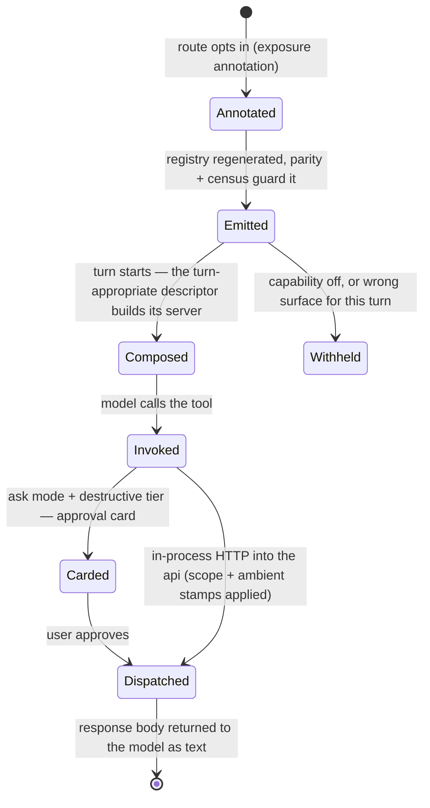

# MCP — Overview

> The seam that turns Vynel's HTTP capabilities into tools the assistant can call — one route definition surfacing as an in-process tool shaped to the turn that composes it, and as a standalone server for outside MCP clients.
>
> **Status:** shipped · **Depends on:** [db](../../_platform/database/overview.md) (kernel), [sdk](../../_platform/contracts-and-sdk/overview.md), [local-api](../local-api/overview.md) (composer host), [providers](../../providers/overview.md) (runtime consumer) · **Code map:** [structure.md](./structure.md)

> **Scope of this document.** "MCP" is documented here as the whole tool seam: the app that carries the generated tool registry, the per-turn in-process server builders, and the three feature descriptors; the external stdio server for outside clients; the generator that derives the registry from the API description; and the small dependency-light contract package that defines the descriptor shape every tool surface implements.

## Purpose

Vynel defines each capability once, as an HTTP route. The MCP seam is what lets that same capability be *called by the assistant* — a route that opts in becomes a tool automatically, and a tool call is just an in-process HTTP request back into the api. The route stays the single home of the behaviour; nobody hand-writes a second copy, and nothing the model does bypasses the route's validation and ownership checks.

The defining idea has grown since the seam first landed: the toolset is now *shaped to the turn*. A background workspace turn, an interactive workspace conversation, and the global-root "brain" each get a different slice of the same generated registry — big enough to do their job, never wide enough to overreach. Eighty-four generated tools exist today; no single turn sees all of them.

It is plumbing more than a product surface, but four of its behaviours are felt directly by the user: a **capability toggle** switches whole tool groups on or off, the **ask-approval tier** raises a card before destructive tools in ask mode, **ambient grounding** means the model acts in the right workspace without ever being told its identifier, and the standing **prompt guidance** for tasks, working steps, plans, and journal rides in with the tools it describes.

## What it can do

- **Expose a route as a tool** — any route carrying the exposure annotation (a flag, a tool name, a description) joins the registry automatically; nothing is hand-wired per surface. Eighty-four tools are generated today.
- **Shape the toolset to the turn** — three turn-shaped toolsets, all under the one `vynel` server name, never coexisting in one turn: the plain **workspace** set (71 tools — schedule fires, spawned-session targets, background runs), the **workspace-interactive** set (those 71 plus a session-spawning quartet: create a session, list sessions, list and inspect background runs — for the interactive chat stream and delegated workspace-root runs), and the **global-root routing** set (17 tools — see workspaces, delegate, register a workspace, channel replies, global monitors, voice output).
- **Keep one name on every surface** — four dual-surface tools (send_message, set_todos, search_chat_messages, get_chat_session) ride both the workspace and routing arrays as a single definition referenced twice, so the model never has to pick between near-identical tools — picking wrong would be a silent misroute.
- **Ground calls ambiently** — when the model omits an optional workspace argument, the turn's own workspace is stamped in server-side, because the model generally does not know its ambient workspace identifier. A tool whose omission genuinely means "the whole system" opts out of the stamp.
- **Gate tools by capability** — five capability groups (knowledge 7, memory 6, tasks 6 — the durable list plus the working-steps dock on one toggle, plans 5, journal 3) are denied wholesale when their capability is off; skills, channels, schedules, monitors, and the other groups stay ungated.
- **Card the destructive tier** — DELETE-shaped routes and explicit opt-ins form the ask-approval tier (four tools today: deleting an agent, registering a workspace, removing a knowledge source, uninstalling a marketplace item). They card in ask mode only; auto and bypass run them uncarded, and no generated tool cards in every mode.
- **Contribute standing guidance** — each workspace descriptor injects the per-capability disciplines (task list, working steps, plans, journal) into the system prompt, filtered by the same enabled-capability set that gates the tools, so prompt and toolset can never disagree; the global root gets the working-steps section ungated.
- **Strip fields that must never transit chat** — a route can exclude body fields (a user-supplied-secrets field, say) from its emitted tool; the tool neither advertises nor forwards them, and even a model-invented value is dropped before the HTTP call.
- **Serve outside clients over stdio** — a generic standalone server reads the committed API description, registers the same curated tool set, and relays each call to the running daemon over real HTTP.
- **Stay in lock-step with the routes** *(background)* — the registry is regenerated from the live API description in a stable order, a parity guard fails the build on drift, and a golden-shape census test pins the exact tool names of all three arrays.

## Responsibilities

**Owns** — the translation from annotated routes to callable tools, for every consumer. That is: the generated registry and its three turn-shaped arrays plus the ask-approval name list; the three per-turn server builders and the three feature descriptors that wrap them (with their capability-gate map and prompt contributions); the ambient workspace stamp inside each generated handler; the exposure-annotation vocabulary the generator reads; and the external stdio server. The contract package it ships alongside owns the descriptor *shape* — the one interface any tool surface implements to be composed into a turn. This layer is a sanctioned home for the SDK's runtime-free tool-*builder* primitives.

**Does not own** —

- the routes and their business logic — each feature owns its own ([memory](../../memory/overview.md), [knowledge](../../knowledge/overview.md), and the rest), hosted by [local-api](../local-api/overview.md);
- the turn composer that attaches descriptors, applies the capability gate, and folds the approval tiers into the turn — that runs in [local-api](../local-api/overview.md);
- the ambient identity headers (which session a turn belongs to, who called, who to report to, delegation origin) — the [local-api](../local-api/overview.md) session layer stamps them onto the dispatcher server-side, precisely so the model can never forge them; the generated tools merely ride the wrapped dispatcher;
- approval-request persistence and rule evaluation — [approvals](../../approvals/overview.md); this layer only *names* which tools belong to which tier;
- the capability rows the gate reads — [capabilities](../../capabilities/overview.md);
- the AI runtime that actually invokes the tools — quarantined in [providers](../../providers/overview.md);
- the published API description the generator and the stdio server read — [sdk](../../_platform/contracts-and-sdk/overview.md);
- the desktop tools — a separate, core-free descriptor ([desktop-control](../../desktop-control/overview.md)) implements the same contract and plugs into the same composition.

## Concepts & vocabulary

| Term | Meaning |
|---|---|
| **MCP** | Model Context Protocol — how an assistant discovers and calls tools. Vynel speaks it on both sides: it exposes tools, and its tools reach back into the api. |
| **Exposure annotation (`x-mcp`)** | The marking on a route that opts it into toolhood: `exposed`, a tool `name`, a `description`, and the opt-in flags below. No annotation, no tool. |
| **`mutatingApproved`** | The explicit flag a non-GET route must carry to be emitted at all. It means only "may become a tool" — it says nothing about approval cards; the generator refuses loudly without it, so bulk exposure can never silently widen the mutating surface. |
| **`askApproval`** | Opts a non-DELETE route into the ask-approval tier (DELETE routes join it automatically). |
| **`rootSurface`** | Routes a tool to the global-root array (the default split is path-based); explicit *false* opts a routing-pathed tool back out to the workspace array. |
| **`workspaceSurface`** | Keeps a root tool in the plain workspace array *too* — the dual-surface mechanism behind "one name everywhere". |
| **`workspaceInteractiveSurface`** | Additionally emits a tool into the interactive array that only workspace-root turns compose. |
| **`excludedBodyFields`** | Body fields the emitted tool must neither advertise nor forward — the structural "secrets never transit chat" guard. |
| **`ambientWorkspace`** | Opt-out (explicit *false*) of the ambient workspace stamp, for a tool whose omitted workspace argument means "the whole system" rather than "my workspace" — added 2026-08-10 alongside the cross-session reads. |
| **The three toolsets** | Workspace (background), workspace-interactive (registry plus the session-spawning quartet), and global-root routing — each turn builds exactly one, all named `vynel`, tools addressed `mcp__vynel__<name>`. |
| **Dual-surface tool** | One definition riding both the workspace and routing arrays (send_message, set_todos, search_chat_messages, get_chat_session) — a single name on every surface so the model never chooses between near-twins. Contrast the older doubling pattern: global monitors ship separately-named global-flavored twins instead. |
| **Descriptor** | The contract shape a tool surface ships: a server builder, its approval-tier name lists, its capability-gate map, and an optional prompt contribution — composed into a turn uniformly, with no per-surface wiring. |
| **Scope** | The per-turn credentials (user, and workspace when there is one) baked into each handler when the server is built, so a tool always acts as the right identity. |
| **Ambient identity headers** | Internal, server-stamped side-channel headers carrying the turn's session, caller, requester, and delegation origin. The model never sees them, so it can never lie about who it is or whose dock it writes. |
| **Ask-approval tier** | The destructive tier that cards in ask mode only. Disjoint from the every-mode mutating tier, which is empty for all generated tools by design. |
| **Capability gate** | The map from capability to its tool names; a capability off means none of its tools, and its prompt section drops with them. |
| **External (stdio) server** | The standalone, generic server for outside MCP clients — same curation, real HTTP into the daemon. |

## Rules & invariants

- **One definition, every consumer.** A capability is written once as a route; the in-process tool and the external tool are both derived from its annotation, and no tool bypasses its route to touch feature logic directly.
- **A tool call is an HTTP call inward.** Every handler dispatches back into the api — the in-process equivalent of "wrap the API, never call the core" — so route-side validation and ownership checks always apply.
- **The registry cannot drift.** It is regenerated in stable order from the API description, guarded by a build-failing parity check, and its exact tool names are pinned by a census test.
- **A mutating route is never emitted by accident.** The generator throws on any non-GET route that opts in without the explicit mutating flag — a CI failure, never a silently-shipped mutating tool.
- **Handlers are built per turn, never at module load.** Each turn's server bakes that turn's scope into fresh closures; credentials are never shared or raced across sessions.
- **Three toolsets, one server name, never together.** A turn builds exactly one `vynel` server; the toolset is a composition-time choice, invisible to the model.
- **Autonomous turns don't route; leaves don't recurse.** The session-spawning quartet is excluded from the plain workspace array by construction, so schedule fires and spawned-session targets can never gain it — an exclusion the tests pin.
- **The primary's toolset never flips per turn origin.** A delegated workspace-root run composes the same interactive set as the interactive stream, so the same conversation always has the same tools.
- **A capability off means none of its tools — and none of its prompt.** Gate and guidance read the same enabled-capability set, so they cannot disagree.
- **Approval is tiered, and the tiers are disjoint.** Ask mode cards the destructive tier; auto and bypass run it uncarded; the every-mode tier exists in the contract but is deliberately empty for every generated tool. Declaring a tier is additive — it never removes the runtime's native floor.
- **Identity is ambient, never model-supplied.** The workspace stamp and the identity headers are applied server-side; a call from a turn that lacks the required identity fails honestly rather than guessing.
- **Roots are managers, not doers.** The global root sees workspaces and delegates down; it never reads a workspace's memory or files itself. Its own private thread is walled off even from the cross-session reads every tier carries.
- **The SDK runtime stays out.** Only runtime-free builder primitives are permitted here; the runtime that executes a turn lives solely in the providers package.

## Lifecycle

A tool's journey, from route to result:

## Where it sits in the bigger picture

MCP is the bridge between Vynel's routes and the model that drives a conversation. Every feature — [memory](../../memory/overview.md), [knowledge](../../knowledge/overview.md), [agents](../../agents/overview.md), [marketplace](../../marketplace/overview.md), and the rest — defines routes; this seam turns the annotated ones into tools. On a live turn, the [local-api](../local-api/overview.md) composer picks the descriptor matching the turn's shape, applies the capability gate, folds the approval tiers in, stamps the ambient identity headers onto the dispatcher, and hands the assembled server to the [providers](../../providers/overview.md) runtime — the only place allowed to actually run the model. The descriptor contract both this seam and [desktop-control](../../desktop-control/overview.md) implement is the plug-in point for any future tool surface. The external stdio server is the one outward-facing surface: the same curated tools, offered to any MCP client, dispatched over HTTP to the daemon.

> **A note against the previous edition of this document.** The earlier overview described a two-toolset world (a full workspace registry and a still-empty routing surface) and a *partial* status. The code has moved well past it: the routing surface is live with seventeen tools, a third interactive toolset exists, four tools deliberately ride two surfaces at once, the capability gate covers five groups rather than two, the every-mode mutating tier was emptied in favour of the ask-approval tier, and ambient grounding (workspace stamp plus identity headers) is now a central behaviour. The status is *shipped*.

---
*Mapped from the code on disk, 2026-08-10. If you change this module, update this file and [structure.md](./structure.md).*
