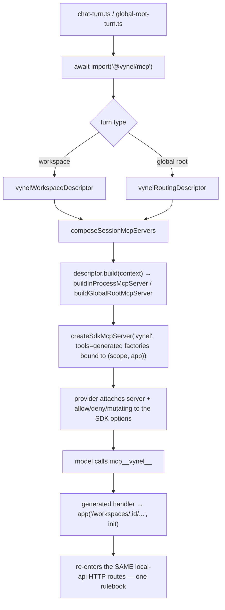

# MCP app (`@vynel/mcp`) — Structure

> The code map and connections for the `apps/mcp` shell. For the concepts behind it, see [overview.md](./overview.md).
>
> Folders touched: `apps/mcp/src/` · `apps/mcp/src/generated/` · `scripts/src/generators/` · `apps/local-api/src/{streams,sessions,routes/chat}/` · `packages/mcp-contract/src/`

`apps/mcp` is a **thin app shell**, not a feature leaf — it owns no table, no repo, no route. It hosts Vynel's two MCP *surfaces* over the api's OpenAPI spec, and it is the **one place a `claude-agent-sdk` MCP-builder export may be imported** (`tool`, `createSdkMcpServer`) — the SDK *runtime* stays quarantined in `packages/providers`. Deps: `@anthropic-ai/claude-agent-sdk` (builder only), `@modelcontextprotocol/sdk`, `@vynel/db` (type-only cast), `@vynel/mcp-contract`, `@vynel/sdk` (the committed `openapi.json`), `zod` (`apps/mcp/package.json`).

Two directions live side by side (both named in `src/index.ts`):

- **Direction ③ — in-process, agent-bound.** The generated tool registry (`generated/api-tools.ts`) → wrapped by `build-in-process-server.ts` into an SDK server → exposed as two `McpFeatureDescriptor`s that `apps/local-api`'s turn composer attaches to a running chat/global-root turn. Tool calls re-enter the api **in-process** via `app.request(...)`.
- **Direction ② — external stdio.** A generic `McpServer` (`external-mcp-server.ts` + the `external-server.ts` bin) that reads the committed OpenAPI spec at runtime and dispatches each tool call to a **running api over HTTP** — for third-party MCP hosts (Claude Desktop, etc.).

## File map

► = entry point.

| Path | Role |
|---|---|
| ► `apps/mcp/src/index.ts` | public barrel — re-exports `mcp-types`, the external-server builders, and the two descriptors (`vynelWorkspaceDescriptor`, `vynelRoutingDescriptor`). The **generated registry is deliberately NOT re-exported** (a private detail) |
| `apps/mcp/src/mcp-types.ts` | SDK-free domain types: `McpScope` (per-session `db`+`userId`+optional `workspaceId`), `HonoAppRequestFn` (Hono's `app.request` shape), `McpToolFactory` (returns `unknown` to keep the SDK out of this module) |
| `apps/mcp/src/vynel-mcp-feature-descriptor.ts` | the two `vynel` descriptors + the `VYNEL_CAPABILITY_GATED_TOOLS` map + `toMcpScope` (the one documented `db as Database` producer cast) |
| `apps/mcp/src/build-in-process-server.ts` | `buildInProcessMcpServer` (workspace) + `buildGlobalRootMcpServer` (routing) — the **only** `createSdkMcpServer` call sites; wrap the generated factory arrays with per-session `(scope, app)` bound in |
| `apps/mcp/src/generated/api-tools.ts` | **GENERATED — do not edit.** 32 workspace `McpToolFactory`s (`generatedMcpTools`) + 6 routing (`generatedRoutingMcpTools`); each closes over `(scope, app)` and dispatches through `app(...)`. Uses the SDK `tool()` builder |
| ► `apps/mcp/src/external-server.ts` | the `vynel-mcp` **bin** — loads env, reads `@vynel/sdk/openapi.json`, builds a fetch dispatcher to the api's `/api` mount, serves over stdio |
| `apps/mcp/src/external-mcp-server.ts` | `collectExternalTools` / `buildExternalMcpServer` — walks the OpenAPI spec, builds live Zod input shapes, registers each `x-mcp.exposed` route as a tool dispatched via injected `FetchDispatch` |
| `apps/mcp/src/env.ts` | Zod env — the single `process.env` read; only `VYNEL_API_URL` (default `http://localhost:18892`). No `PORT` (stdio transport) |
| `apps/mcp/src/external-mcp-server.test.ts` | direction-② tests (tool set + handler dispatch against a stub) |
| `apps/mcp/src/vynel-mcp-feature-descriptor.test.ts` | descriptor shape + capability-gate tests |
| `apps/mcp/src/generated/api-tools.test.ts` | guards the generated registry |

## The `McpFeatureDescriptor` contract

The shape both surfaces implement lives in **`packages/mcp-contract/src/mcp-feature-descriptor.ts`** — dependency-light by design (imports only the SDK's server *type*, type-only), so a core-free feature package (`@vynel/desktop-control`, `@vynel/instructions`) can also implement it without taking on `@vynel/db`. Key fields the `vynel` descriptors set:

| Field | Purpose |
|---|---|
| `serverName` | the `mcp__<serverName>__*` tool prefix — **both** `vynel` descriptors use `'vynel'` (they never coexist in one turn) |
| `build(context)` | build the in-process server for this turn; may return `null` to skip (routing does when empty) |
| `mutatingToolNames` | tools the composer unions into the approval backstop (cards even under bypass) — **additive** to the provider's native floor |
| `capabilityGatedTools` | `capabilityId → tool names`; denied when that capability is OFF (the relocated `CAPABILITY_MCP_TOOLS`) |
| `alwaysOn` / `contributePrompt` / `isApplicable` | core-tier seam / self-contained prompt / cheap pre-check — **none set by the `vynel` descriptors** |

## MCP surface — direction ③ (the in-process `vynel` server)

Two descriptors, one server key, a **different toolset per turn type** (`vynel-mcp-feature-descriptor.ts`):

| Descriptor | Turn type | Builder | Tools | `mutatingToolNames` | Capability gate |
|---|---|---|---|---|---|
| `vynelWorkspaceDescriptor` | workspace chat turn | `buildInProcessMcpServer` | the full 32-tool registry (`generatedMcpTools`) | **`[]`** (empty — see below) | `VYNEL_CAPABILITY_GATED_TOOLS` |
| `vynelRoutingDescriptor` | global-root ("brain") turn | `buildGlobalRootMcpServer` | 6 routing tools (`generatedRoutingMcpTools`) | `['mcp__vynel__register_workspace']` | none |

**Capability gate** (`VYNEL_CAPABILITY_GATED_TOOLS`, `vynel-mcp-feature-descriptor.ts:26-44`) — two capabilities gate together, all-or-none:

- `knowledge` → 7 tools: `search_knowledge`, `list_knowledge_documents`, `get_knowledge_document`, `get_indexer_status`, `list_knowledge_sources`, `add_to_knowledge`, `remove_knowledge_source`.
- `memory` → 6 tools: `list_memory_entries`, `search_memory`, `list_memory_tags`, `create_memory_entry`, `update_memory_entry`, `add_memory_from_file`.
- skills / channels / schedules / providers / chat / users tools stay **ungated**.

**Why `mutatingToolNames` is empty for the workspace server:** the only mutating workspace tools (`add_to_knowledge`, `remove_knowledge_source`, and the 3 memory writes) are emitted with `x-mcp.mutatingApproved` — auto-approved, no card, per the current approval stance. When the real approval card lands they move into `mutatingToolNames` and the composer unions them into the backstop. The routing server's `register_workspace` is the lone tool declared there today, so it **cards on use**.

**The two build functions** (`build-in-process-server.ts`):

- `buildInProcessMcpServer` — throws if `generatedMcpTools` is empty (a real error → "run `pnpm api:generate`").
- `buildGlobalRootMcpServer` — returns **`null`** when `generatedRoutingMcpTools` is empty (KLONE has routing routes now, so it's populated; the `null` idiom lets the composer skip gracefully when a turn's server has no tools).
- Both `.map(factory => factory(scope, app) as SdkMcpToolDefinition<any>)` then `createSdkMcpServer({ name: 'vynel', version: '1.0.0', tools })`.

### The generated registry

`generated/api-tools.ts` is emitted by **`scripts/src/generators/generate-mcp-tools.ts`** (npm `api:generate`): it boots the `apps/local-api` Hono app with stub deps, reads the live `/openapi.json`, and walks every route carrying `'x-mcp': { exposed: true, name, description }`. Each becomes an exported `McpToolFactory`. Split by surface: a route under `/routing/*` **or** flagged `x-mcp.rootSurface: true` (e.g. `register_workspace`, whose route is `POST /workspaces`) lands in `generatedRoutingMcpTools`; everything else in `generatedMcpTools`. A mutating (non-GET) route must set `mutatingApproved` to be emitted at all (D7 gate). Drift is caught by `scripts/src/generators/check-mcp-parity.ts` (CI guard). **Never hand-edit the file.**

The 6 routing tools: `list_routing_channels`, `list_routing_workspaces`, `register_workspace` (mutating→cards), `route_to_workspace`, `send_to_channel`, `speak`. (`route_to_workspace`/`send_to_channel`/`speak` carry a `destructiveHint` annotation but are **not** in `mutatingToolNames` — only `register_workspace` cards today.)

## MCP surface — direction ② (the external stdio server)

`external-mcp-server.ts` builds a generic `@modelcontextprotocol/sdk` `McpServer` from the **committed** `@vynel/sdk/openapi.json` (regenerated + guarded by `check-sdk-parity`, so it cannot drift). `collectExternalTools` mirrors the direction-③ generator's curation: only `x-mcp.exposed === true`, and a mutating tool requires `mutatingApproved` (defense-in-depth — the committed spec only carries already-gated routes). It builds **live Zod objects** (vs. the generator emitting Zod *source strings*), sorts tools by name for a stable set, and each handler fills path/query + JSON body and dispatches via the injected `FetchDispatch`. Non-2xx / thrown → an `isError` text result (never crashes the server).

`external-server.ts` (the `vynel-mcp` bin) wires it: `createFetchDispatch(apiUrl)` targets `apiUrl + '/api'` (concatenated, not `new URL(path, base)` — an absolute path would replace the `/api` mount and break `speak`'s `/voice/*` route). stdio discipline: stdout is the MCP protocol channel, status/errors go to stderr only. Phase-1 single-user → no auth header (the api resolves the local user server-side).

## Boot & wiring

- **Direction ③ never boots as a process.** The api dynamically imports the descriptors per turn and hands them to the composer — deferring the heavy SDK builder + generated registry until a turn actually needs them:
  - `apps/local-api/src/streams/chat-turn.ts:47` → `vynelWorkspaceDescriptor`
  - `apps/local-api/src/streams/global-root-turn.ts:98` + `sessions/run-global-root-turn.ts:143` → `vynelRoutingDescriptor`
  - `apps/local-api/src/sessions/build-schedule-fire-deps.ts:35` → `vynelWorkspaceDescriptor` (scheduled fires)
  - `apps/local-api/src/routes/chat/fetch-context-report.ts:17` → `vynelWorkspaceDescriptor`
- **The composer** — `apps/local-api/src/sessions/compose-session-mcp-servers.ts` — takes the descriptor list + a `SessionToolContext`, and for each: skips on `isApplicable === false` or `build() === null`; registers the built server under `serverName`; adds `mcp__<serverName>__*` to the allow list; denies each gated tool whose capability is off; unions `mutatingToolNames`; and drops the prompt contribution if **every** gated tool is denied. Returns `{ mcpServers, allowedMcpToolPatterns, deniedMcpToolPatterns, mutatingToolNames, systemPromptAppend }` for the SDK's `options`.
- **Direction ② boots on demand** as the `vynel-mcp` bin (`package.json` `bin` → `dist/external-server.js`; `pnpm dev` runs it via `tsx`). `build` is a plain `tsc`.

## Pipeline — "the agent calls a `vynel` tool during a turn"



1. A turn entry-point (`streams/chat-turn.ts:47`) dynamically imports the matching descriptor.
2. `composeSessionMcpServers` (`sessions/compose-session-mcp-servers.ts`) calls `descriptor.build(context)`, deriving `McpScope` via `toMcpScope` (the `db as Database` cast).
3. `buildInProcessMcpServer` (`build-in-process-server.ts:20`) maps each `generatedMcpTools` factory with `(scope, app)` and wraps them in `createSdkMcpServer`.
4. Each generated handler (`generated/api-tools.ts`) calls `app('/workspaces/{workspaceId}/...', { method, body })` — the in-process equivalent of "wrap the api via HTTP, never call core directly" — so the agent hits the **same routes, gates, and serializers** the UI does.
5. The composer's `deniedMcpToolPatterns` / `mutatingToolNames` feed the provider's allow/deny + approval backstop.

## Connections

**Summary:** `apps/mcp` is a **leaf shell** — it depends down on `@vynel/mcp-contract`, `@vynel/sdk`, `@vynel/db` (type-only), and the SDK builder; it owns no data and publishes no events. It is consumed **inward** only by `apps/local-api` (dynamic import of the two descriptors) and, at runtime, by any external MCP host talking to the bin.

| Unit | Direction | Mechanism | What crosses |
|---|---|---|---|
| [contracts-and-sdk](../../_platform/contracts-and-sdk/overview.md) (`@vynel/mcp-contract`) | out | import (type) | `McpFeatureDescriptor`, `SessionToolContext`, `SessionMcpServer` |
| `@vynel/sdk` | out | import (JSON) | the committed `openapi.json` the external server reads |
| db kernel (`@vynel/db`) | out | import (type) | `Database` — the one producer-boundary cast in `toMcpScope` |
| `@anthropic-ai/claude-agent-sdk` | out | SDK **builder** | `tool`, `createSdkMcpServer`, `SdkMcpToolDefinition` — permitted **only here** and `packages/instructions`/`desktop-control` MCP layers; the runtime stays in `packages/providers` |
| `@modelcontextprotocol/sdk` | out | import | `McpServer`, `StdioServerTransport` for the external server |
| [session](../../session/overview.md) / local-api turn composer | in | dynamic `import('@vynel/mcp')` | the two descriptors, deferred until a turn runs |
| [capabilities](../../capabilities/overview.md) | in | id strings | `'knowledge'` / `'memory'` keys of the capability gate |
| local-api HTTP routes | both | `app.request` | every tool call re-enters the api's own routes |
| external MCP hosts | in | stdio (bin) | the generic OpenAPI-derived tool set |

**Events published / consumed:** none — this shell owns no outbox.

```mermaid
flowchart LR
    contract[mcp-contract] --> mcp[apps/mcp]
    sdk[@vynel/sdk openapi.json] --> mcp
    db[(db type)] --> mcp
    agentsdk[claude-agent-sdk builder] --> mcp
    modelctx[@modelcontextprotocol/sdk] --> mcp
    gen[scripts/generate-mcp-tools] -. emits .-> mcp
    mcp -. two descriptors .-> api[local-api turn composer]
    mcp -. bin/stdio .-> host[external MCP host]
    mcp -->|app.request| routes[local-api routes]
```

## Config & gotchas

- **The SDK-runtime line.** Only the SDK *builder* exports live here (`tool`, `createSdkMcpServer`). Importing the SDK *runtime* (`query`, the session loop) anywhere outside `packages/providers` violates the AI-seam invariant. Both build files carry an eslint-disable + a header note documenting the boundary cast.
- **One `db as Database` cast** — `toMcpScope` (`vynel-mcp-feature-descriptor.ts:47`). The contract types `db` as `unknown` so a core-free feature can implement it; the `vynel` producer is the boundary that narrows it.
- **`generated/api-tools.ts` is machine-emitted** — edit the route's `describeRoute({ 'x-mcp': {...} })` in `apps/local-api`, then `pnpm api:generate`; `check-mcp-parity` fails the gate on drift. Never hand-edit.
- **Empty ≠ error, both ways.** An empty *workspace* registry throws (misconfiguration); an empty *routing* registry returns `null` (composer skips) — different failure semantics on purpose.
- **`mutatingToolNames = []` is intentional, not a bug** — the mutating workspace tools ride `x-mcp.mutatingApproved` (auto, no card) today. They migrate into `mutatingToolNames` when the real approval card ships.
- **Routing `destructiveHint` ≠ carded** — `route_to_workspace`/`send_to_channel`/`speak` are annotated destructive but only `register_workspace` is in `mutatingToolNames`, so only it cards.
- **External dispatch concatenates `+ '/api'`** rather than `new URL(path, base)` — an absolute path would replace the mount prefix and break the `speak` tool's `/voice/*` route (see `external-server.ts` comment).
- **stdio hygiene** — stdout is the MCP channel; every status/error line goes to stderr.
- **Env:** only `VYNEL_API_URL` (default `http://localhost:18892`), named to match the CLI and dodge a host's bare `API_URL`. No `PORT` (stdio). A Phase-2 bearer relay would add `VYNEL_API_TOKEN`.

---
*Mapped from the code on disk, 2026-07-14. If you change this module, update this file and [overview.md](./overview.md).*
