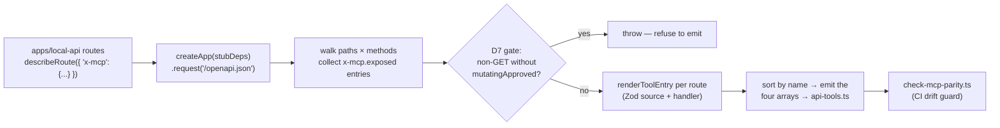
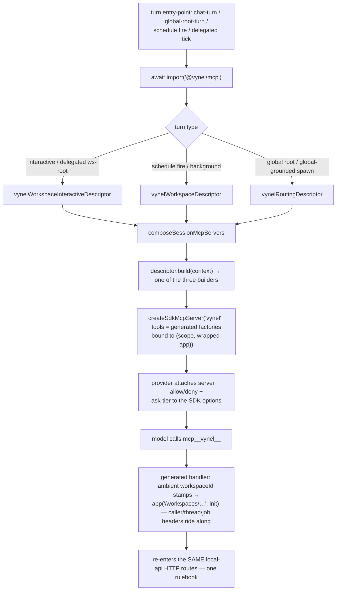

# MCP app (`@vynel/mcp`) — Structure

> The code map and connections for the `apps/mcp` shell. For the concepts behind it, see [overview.md](./overview.md).
>
> Folders touched: `apps/mcp/src/` · `apps/mcp/src/generated/` · `scripts/src/generators/` · `apps/local-api/src/{sessions,streams,routes}/` · `packages/mcp-contract/src/`

`apps/mcp` is a **thin app shell**, not a feature leaf — it owns no table, no repo, no route. It hosts Vynel's two MCP *surfaces* over the api's OpenAPI spec, and it is one of the places a `claude-agent-sdk` MCP-*builder* export may be imported (`tool`, `createSdkMcpServer`) — the SDK *runtime* stays quarantined in `packages/providers`. Deps: `@anthropic-ai/claude-agent-sdk` (builder only), `@modelcontextprotocol/sdk`, `@vynel/contracts` (`VYNEL_ENGINE_PORT`), `@vynel/db` (type-only cast), `@vynel/mcp-contract`, `@vynel/sdk` (the committed `openapi.json`), `zod` (`apps/mcp/package.json`).

Two directions live side by side (both named in `src/index.ts`):

- **Direction ③ — in-process, agent-bound.** The generated tool registry (`generated/api-tools.ts`, **84 distinct tool factories**) → wrapped by `build-in-process-server.ts` into an SDK server → exposed as **three** `McpFeatureDescriptor`s that `apps/local-api`'s turn composers attach per turn type. Tool calls re-enter the api **in-process** via `app.request(...)`.
- **Direction ② — external stdio.** A generic `McpServer` (`external-mcp-server.ts` + the `external-server.ts` bin) that reads the committed OpenAPI spec at runtime and dispatches each tool call to a **running api over HTTP** — for third-party MCP hosts (Claude Desktop, etc.).

## File map

► = entry point.

| Path | Role |
|---|---|
| ► `apps/mcp/src/index.ts` | public barrel — re-exports `mcp-types`, the external-server builders, and the **three** descriptors (`vynelWorkspaceDescriptor`, `vynelWorkspaceInteractiveDescriptor`, `vynelRoutingDescriptor`). The **generated registry is deliberately NOT re-exported** (a private detail) |
| `apps/mcp/src/mcp-types.ts` | SDK-free domain types: `McpScope` (per-session `db`+`userId`+optional `workspaceId`), `HonoAppRequestFn` (Hono's `app.request` shape), `McpToolFactory` (returns `unknown` to keep the SDK out of this module) |
| `apps/mcp/src/vynel-mcp-feature-descriptor.ts` | the three `vynel` descriptors + `VYNEL_CAPABILITY_GATED_TOOLS` (5 capabilities) + the four capability prompt sections + `toMcpScope` (the one documented `db as Database` producer cast) |
| `apps/mcp/src/build-in-process-server.ts` | `buildInProcessMcpServer` (workspace) + `buildWorkspaceInteractiveMcpServer` (workspace + spawning trio) + `buildGlobalRootMcpServer` (routing) — the **only** `createSdkMcpServer` call sites; wrap the generated factory arrays with per-session `(scope, app)` bound in |
| `apps/mcp/src/generated/api-tools.ts` | **GENERATED — do not edit** (3283 lines). 84 `McpToolFactory` exports + the four arrays: `generatedMcpTools` (71), `generatedRoutingMcpTools` (17), `generatedWorkspaceInteractiveMcpTools` (4), `generatedAskModeApprovalToolNames` (4). Each factory closes over `(scope, app)` and dispatches through `app(...)`. Uses the SDK `tool()` builder |
| ► `apps/mcp/src/external-server.ts` | the `vynel-mcp` **bin** — loads env, reads `@vynel/sdk/openapi.json`, builds a fetch dispatcher to the api's `/api` mount, serves over stdio |
| `apps/mcp/src/external-mcp-server.ts` | `collectExternalTools` / `buildExternalMcpServer` — walks the OpenAPI spec, builds live Zod input shapes, registers each `x-mcp.exposed` route as a tool dispatched via injected `FetchDispatch` (with a 150s abort deadline per call) |
| `apps/mcp/src/env.ts` | Zod env — the single `process.env` read; only `VYNEL_API_URL` (default `http://127.0.0.1:${VYNEL_ENGINE_PORT}` = 18892 — the literal, never `localhost`, per the IPv6-first hazard). No `PORT` (stdio transport) |
| `apps/mcp/src/external-mcp-server.test.ts` | direction-② tests (tool set + handler dispatch against a stub) |
| `apps/mcp/src/vynel-mcp-feature-descriptor.test.ts` | descriptor shape + capability-gate tests |
| `apps/mcp/src/generated/api-tools.test.ts` | the tool-name census — pins all four arrays by name (`EXPECTED_TOOL_NAMES` / `EXPECTED_ROUTING_TOOL_NAMES` / `EXPECTED_WORKSPACE_INTERACTIVE_TOOL_NAMES`) + the background-exclusion and retired-alias guards |

Off-app but owned by this unit's story:

| Path | Role |
|---|---|
| `scripts/src/generators/generate-mcp-tools.ts` | the emitter — boots the api with stub deps, reads `/openapi.json`, renders `generated/api-tools.ts` (see the generation pipeline below) |
| `scripts/src/generators/check-mcp-parity.ts` | CI guard — regenerates in-memory and fails the gate on drift |
| `packages/mcp-contract/src/mcp-feature-descriptor.ts` | the `McpFeatureDescriptor` / `SessionToolContext` / `SessionMcpServer` / `HonoAppRequestFn` contract (pure types; `index.ts` is the type-only barrel) |
| `apps/local-api/src/sessions/compose-session-mcp-servers.ts` | `composeSessionMcpServers` + `mergeComposedSessionMcpServers` — the per-turn composition step |
| `apps/local-api/src/sessions/build-workspace-background-mcp.ts` | `buildWorkspaceBackgroundMcpComposer` (schedule fires) + `buildDelegatedTurnMcpComposer` (delegated/spawned/agent-session turns, with the caller/requester/thread/job header wrapping) |

## The `McpFeatureDescriptor` contract

The shape every MCP-tool producer implements lives in **`packages/mcp-contract/src/mcp-feature-descriptor.ts`** — dependency-light by design (imports only the SDK's server *type*, type-only), so a core-free feature package (`@vynel/desktop-control`, `@vynel/instructions`) can also implement it without taking on `@vynel/db`. The heavy context fields (`db`, `desktopReader`) are `unknown`; each producer narrows the one it owns with a single documented cast.

| Field | Purpose |
|---|---|
| `serverName` | the `mcp__<serverName>__*` tool prefix — **all three** `vynel` descriptors use `'vynel'` (one turn ever builds one) |
| `build(context)` | build the in-process server for this turn; may return `null` to skip |
| `mutatingToolNames` | tools that card in **every** mode (even bypass) — unioned additively into the approval backstop. **All three `vynel` descriptors set `[]`** |
| `askModeApprovalToolNames` | the destructive tier — cards **only in ask mode** (auto/bypass run uncarded, Chad's 2026-07-26 stance). All three descriptors pass `generatedAskModeApprovalToolNames` |
| `capabilityGatedTools` | `capabilityId → tool names`; denied when that capability is OFF |
| `contributePrompt(context, enabledCapabilityIds)` | self-contained prompt sections; the capability-aware signature lets a multi-capability descriptor drop one section while another's tools stay live |
| `alwaysOn` / `isApplicable` | core-tier seam (defined, **not set by any feature yet**) / cheap pre-check (not set by the `vynel` descriptors) |

## MCP surface — direction ③ (the in-process `vynel` server)

**Three descriptors, one server key, a different toolset per turn type** (`vynel-mcp-feature-descriptor.ts`):

| Descriptor | Turn type | Builder | Tools | Capability gate | Prompt |
|---|---|---|---|---|---|
| `vynelWorkspaceDescriptor` | **background** workspace turn (schedule fires) | `buildInProcessMcpServer` | `generatedMcpTools` (71) | `VYNEL_CAPABILITY_GATED_TOOLS` | capability-gated sections |
| `vynelWorkspaceInteractiveDescriptor` | interactive chat stream + **delegated** workspace-root / spawned / agent-session runs | `buildWorkspaceInteractiveMcpServer` | the 71 **+** `generatedWorkspaceInteractiveMcpTools` (4) | same | same (differs **only** in toolset) |
| `vynelRoutingDescriptor` | global-root ("brain") turn + global-grounded spawned sessions | `buildGlobalRootMcpServer` | `generatedRoutingMcpTools` (17) | none | working-steps section, **ungated** (the root has no capability rows) |

All three set `mutatingToolNames: []` and `askModeApprovalToolNames: generatedAskModeApprovalToolNames` — the every-mode card set is empty by design; the destructive tier cards in ask mode only.

**The four generated arrays** (84 distinct factories; overlaps are the same export referenced twice, never duplicate declarations):

- `generatedMcpTools` (71) — the workspace surface. Feeds schedule fires and every workspace descriptor.
- `generatedRoutingMcpTools` (17) — the global-root surface: `create_global_monitor`, `create_session`, `get_background_run`, `get_chat_session`, `list_background_runs`, `list_global_monitors`, `list_routing_channels`, `list_routing_workspaces`, `list_sessions`, `register_workspace`, `reply_to_channel`, `search_chat_messages`, `send_message`, `send_to_channel`, `set_todos`, `speak`, `stop_global_monitor`. Four of these (`get_chat_session`, `search_chat_messages`, `send_message`, `set_todos`) carry `x-mcp.workspaceSurface` and so **also** sit in the plain workspace array — one name on every surface (71 + 17 − 4 = 84).
- `generatedWorkspaceInteractiveMcpTools` (4) — the session-spawning trio + read-backs: `create_session`, `get_background_run`, `list_background_runs`, `list_sessions`. Deliberately **not** in `generatedMcpTools` (schedule fires and truly autonomous turns never spawn — the exclusion test pins it).
- `generatedAskModeApprovalToolNames` (4) — the ask-mode card tier: `mcp__vynel__delete_agent`, `mcp__vynel__register_workspace`, `mcp__vynel__remove_knowledge_source`, `mcp__vynel__uninstall_marketplace_item` (DELETE-method routes + `x-mcp.askApproval` opt-ins).

The full 71-name census (and the WHY behind each exposure wave) lives in `generated/api-tools.test.ts` — the fast canary; `check-mcp-parity.ts` is the wider net.

**Capability gate** (`VYNEL_CAPABILITY_GATED_TOOLS`, `vynel-mcp-feature-descriptor.ts:34-75`) — five capabilities, each gating together all-or-none:

| Capability | Tools (count) |
|---|---|
| `knowledge` | 7 — `search_knowledge`, `list_knowledge_documents`, `get_knowledge_document`, `get_indexer_status`, `list_knowledge_sources`, `add_to_knowledge`, `remove_knowledge_source` |
| `memory` | 6 — `list_memory_entries`, `search_memory`, `list_memory_tags`, `create_memory_entry`, `update_memory_entry`, `add_memory_from_file` |
| `tasks` | 6 — `list_tasks`, `create_task`, `update_task`, `complete_task`, `list_my_tasks`, **`set_todos`** (the durable list and its step-level twin ride one toggle) |
| `plans` | 5 — `list_plans`, `create_plan`, `update_plan`, `complete_plan`, `list_my_plans` |
| `journal` | 3 — `list_journal_entries`, `add_journal_entry`, `list_my_journal_entries` |

Skills / channels / schedules / providers / chat / workspaces / users / agents / apps / monitors / marketplace tools stay **ungated**.

**Capability-gated prompt sections** (`CAPABILITY_PROMPT_SECTIONS`, stable order tasks → todos → plans → journal): the workspace descriptors' `contributeWorkspacePrompt` emits the Task-list and Working-steps sections when `tasks` is on, the Plans section (incl. the `vynel://plan/<planId>` deep-link convention) when `plans` is on, and the Work-journal section when `journal` is on — the prompt reads the same enabled-set the composer gates tools with, so prompt and tools can never disagree. The routing descriptor contributes only the Working-steps section, ungated.

**The three build functions** (`build-in-process-server.ts`):

- `buildInProcessMcpServer` — throws if `generatedMcpTools` is empty (a real error → "run `pnpm api:generate`").
- `buildWorkspaceInteractiveMcpServer` — same throw; concatenates `[...generatedMcpTools, ...generatedWorkspaceInteractiveMcpTools]`. A **separate builder**, not a widening of the plain array, so schedule fires never gain the spawning tools.
- `buildGlobalRootMcpServer` — returns **`null`** when `generatedRoutingMcpTools` is empty (the composer's `build() === null → skip` idiom; the array is populated today, so this is dormant).
- All three `.map(factory => factory(scope, app) as SdkMcpToolDefinition<any>)` then `createSdkMcpServer({ name: 'vynel', version: '1.0.0', tools })`.

## The generation pipeline

`generated/api-tools.ts` is emitted by **`scripts/src/generators/generate-mcp-tools.ts`** (npm `api:generate`):



1. Boots the real Hono app with stub deps and reads the **live** spec via `app.request('/openapi.json')` (`generate-mcp-tools.ts:130-138`) — the same app-request-spec trick as `generate-sdk.ts`.
2. Walks every `paths × methods` operation carrying `'x-mcp': { exposed: true, name, description }` (`:175-228`). A mutating (non-GET) route **must** set `mutatingApproved: true` or the generator throws (D7 — `mutatingApproved` means "may be emitted", never "no card"; the card question is the separate ask tier).
3. Classifies each entry (`:220-226`): `isAskApproval` = DELETE method OR `askApproval: true` · `isRouting` = path under `/routing/` (unless `rootSurface: false` opts it out) OR `rootSurface: true` · `isWorkspaceInteractive` = `workspaceInteractiveSurface: true` · `isWorkspaceSurface` = `workspaceSurface: true` (a routing tool opting **back into** the plain workspace array) · `stampsAmbientWorkspace` = `ambientWorkspace !== false`.
4. Renders each tool (`renderToolEntry`, `:298`): Zod **source strings** from the OpenAPI schemas (path params required; query/body optionality from the spec; `excludedBodyFields` stripped — the structural "secrets never transit chat" guard), a handler that fills path/query/body and calls `app(url, init)`, and annotations (`readOnlyHint: true` for GETs; `readOnlyHint: false, destructiveHint: true` for mutations, so the SDK doesn't batch-parallelize them with reads).
5. Emits the four arrays with a stable name sort: `generatedMcpTools` = `!isRouting || isWorkspaceSurface` · `generatedRoutingMcpTools` = `isRouting` · `generatedWorkspaceInteractiveMcpTools` · `generatedAskModeApprovalToolNames` (full `mcp__vynel__<name>` strings) (`renderFile`, `:472-501`).

**The full `x-mcp` flag set** (`generate-mcp-tools.ts:42-104`; the api-side twin is `apps/local-api/src/openapi.ts`):

| Flag | Meaning |
|---|---|
| `exposed` / `name` / `description` | the entry ticket: emit this route as tool `name` |
| `mutatingApproved` | D7: a non-GET route may be emitted at all (says nothing about cards) |
| `askApproval` | opt a non-DELETE route into the ask-mode card tier (e.g. `register_workspace`, `uninstall_marketplace_item`) |
| `excludedBodyFields` | body fields the tool never advertises or forwards (UI-only secrets) |
| `rootSurface` | `true` = a non-`/routing/` route joins the routing array (`register_workspace`, `speak`, the session tools); `false` = a `/routing/` route opts **out** to the workspace array |
| `workspaceInteractiveSurface` | also join `generatedWorkspaceInteractiveMcpTools` (the spawning trio + read-backs) |
| `workspaceSurface` | a routing tool **also** stays in the plain workspace array — one name on every surface (`send_message`, `set_todos`, `get_chat_session`, `search_chat_messages`) |
| `ambientWorkspace` | `false` (2026-08-10) = skip the `scope.workspaceId` stamp on an omitted optional `workspaceId` **query/body** field. Default (`true`) is right for workspace-shaped reads ("omitted = my workspace"); `false` is for tools where omission means "the whole system" — today only `search_chat_messages` (`apps/local-api/src/routes/sessions/index.ts:113`). Path params are unaffected |

**The ambient stamps** baked into every emitted handler:

- **Path fallback** (`buildPathSource`): a `{workspaceId}` path placeholder resolves `args['workspaceId'] ?? scope.workspaceId ?? ''` — a workspace-pathed route always needs this; unconditional.
- **Query stamp** (`buildQuerySource`): when `stampsAmbientWorkspace` and the route has a `workspaceId` query param, an omitted value is filled from `scope.workspaceId` — without it, a workspace turn calling `list_agents` would silently get user-scope rows only.
- **Body stamp** (`buildBodySource`): the same mirror for a `workspaceId` body field — a workspace-spawned call inherits its creator's ground without the model knowing the id. On the root surface `scope.workspaceId` is absent and all three no-op.

## MCP surface — direction ② (the external stdio server)

`external-mcp-server.ts` builds a generic `@modelcontextprotocol/sdk` `McpServer` from the **committed** `@vynel/sdk/openapi.json` (regenerated + guarded by `check-sdk-parity`, so it cannot drift). `collectExternalTools` mirrors the direction-③ curation: only `x-mcp.exposed === true`, and a mutating tool requires `mutatingApproved` (defense-in-depth — the committed spec only carries already-gated routes). It builds **live Zod objects** (vs. the generator emitting Zod *source strings* — kept separate deliberately; a string-emitter and an object-builder don't share cleanly), sorts tools by name, and each handler fills path/query + JSON body and dispatches via the injected `FetchDispatch` under a **150s `AbortSignal.timeout`** (`DISPATCH_TIMEOUT_MS` — sized above `create_session`'s 120s priming cap; an outside client has no reaper behind it, so a wedged api must surface as an `isError` result, not a never-settling promise, and the timeout message names what happened instead of "operation was aborted"). Note: direction ② has **no** surface split and **no** ambient stamps — every exposed tool, one flat set, explicit args only.

`external-server.ts` (the `vynel-mcp` bin) wires it: `createFetchDispatch(apiUrl)` targets `apiUrl + '/api'` (concatenated, not `new URL(path, base)` — an absolute path would replace the `/api` mount and break `speak`'s `/voice/*` gateway route). stdio discipline: stdout is the MCP protocol channel, status/errors go to stderr only. Phase-1 single-user → no auth header (the api resolves the local user server-side).

## Boot & wiring — the composition pipeline

**Direction ③ never boots as a process.** The api dynamically imports the descriptors per turn (deferring the heavy SDK builder + registry) and hands them to `composeSessionMcpServers`:

| Consumer | Descriptor(s) | Turn |
|---|---|---|
| `apps/local-api/src/streams/chat-turn.ts:56` | `vynelWorkspaceInteractiveDescriptor` | interactive workspace chat stream |
| `apps/local-api/src/routes/chat/fetch-context-report.ts:19` | `vynelWorkspaceInteractiveDescriptor` | the /context report (mirrors the stream's toolset) |
| `apps/local-api/src/streams/global-root-turn.ts:137` | `vynelRoutingDescriptor` | global-root chat stream |
| `apps/local-api/src/sessions/run-global-root-turn.ts:205` | `vynelRoutingDescriptor` | headless global-root turns (channels, voice) |
| `apps/local-api/src/sessions/build-workspace-background-mcp.ts:43` (`buildWorkspaceBackgroundMcpComposer`) | `vynelWorkspaceDescriptor` + `notebookFeatureDescriptor` | schedule fires (`build-schedule-fire-deps.ts:40`), background session turns (`streams/session-turn.ts:91`) |
| `apps/local-api/src/sessions/build-workspace-background-mcp.ts:110` (`buildDelegatedTurnMcpComposer`) | `vynelWorkspaceInteractiveDescriptor` (workspace-grounded) or `vynelRoutingDescriptor` (global-grounded) + `notebookFeatureDescriptor` | delegated runs (`boot.ts:291` → `delegation-service`), spawned/agent-session turns (`streams/session-turn.ts:83`) |

**The composer** — `composeSessionMcpServers` (`sessions/compose-session-mcp-servers.ts`) — takes the descriptor list + a `SessionToolContext`, and for each: skips on `isApplicable === false` or `build() === null`; registers the built server under `serverName`; adds `mcp__<serverName>__*` to the allow list; denies each gated tool whose capability is off; unions `mutatingToolNames` and (deduped — the vynel descriptors share one generated set) `askModeApprovalToolNames`; and drops the descriptor's **whole** prompt when *every* gated capability is off (a prompt steering the model into denied tools). Returns `{ mcpServers, allowedMcpToolPatterns, deniedMcpToolPatterns, mutatingToolNames, askModeApprovalToolNames, systemPromptAppend }` for the SDK's `options`. `mergeComposedSessionMcpServers` merges two composed attachments (chat-mentions: background set + the per-turn study server).

**The delegated-turn composer's header wrapping** (`buildDelegatedTurnMcpComposer`, `build-workspace-background-mcp.ts:107-177`) — before composing, it wraps the `appRequest` dispatcher in up to four ambient-context layers the model never sees, so every tool call a routed turn makes carries server-stamped identity:

1. **Caller** (`wrapAppRequestWithReportCaller`) — WHO is running: `workspace-primary` / `spawned-session` / `agent-session`; the report route resolves the requester from this, never from model input. A session-shaped target with no `targetPrimarySessionId` gets **no** header → the tool 400s honestly instead of mis-addressing.
2. **Requester override** (`wrapAppRequestWithReportRequester`) — chat-mentions: reports land in the chat that asked, not the global root.
3. **Thread** (`wrapAppRequestWithDelegationThread`) — a hop from inside a chain **continues** it instead of starting one.
4. **Job** (`wrapAppRequestWithDelegationJob`) — a tool report marks the queue row so the tick doesn't double-harvest.

A `workspaceId: null` input (global-grounded spawned session) composes the **routing** descriptor instead — it inherits its parent the global root's toolset, and `send_message` rides both surfaces so reporting works either way. WHY one background home: every producer resuming the same SDK session must attach the **same** toolset, or the SDK's deferred-tool reconciliation strips the `vynel` server and tells the model it disconnected (the 2026-07-21 live bug, documented in the file header).

**Direction ② boots on demand** as the `vynel-mcp` bin (`package.json` `bin` → `dist/external-server.js`; `pnpm dev` runs it via `tsx`). `build` is a plain `tsc`.

## Pipeline — "the agent calls a `vynel` tool during a turn"



1. A turn entry-point dynamically imports the matching descriptor (table above); delegated/background producers go through the two composer factories in `build-workspace-background-mcp.ts`, which also wrap the dispatcher with the identity headers.
2. `composeSessionMcpServers` calls `descriptor.build(context)`; `toMcpScope` derives `McpScope` (the one `db as Database` cast, `vynel-mcp-feature-descriptor.ts:138`).
3. The builder (`build-in-process-server.ts`) maps the right generated array(s) with `(scope, app)` and wraps them in `createSdkMcpServer('vynel')`.
4. Each generated handler (`generated/api-tools.ts`) fills the path (with the `scope.workspaceId` fallback), stamps the ambient workspace onto omitted query/body `workspaceId` fields (unless `ambientWorkspace: false`), and calls `app(url, init)` — the agent hits the **same routes, gates, and serializers** the UI does.
5. The composer's `deniedMcpToolPatterns` / `askModeApprovalToolNames` feed the provider's allow/deny + the ask-mode approval tier; its `systemPromptAppend` carries the capability prompt sections.

## Connections

**Summary:** `apps/mcp` is a **leaf shell** — it depends down on `@vynel/mcp-contract`, `@vynel/sdk`, `@vynel/contracts`, `@vynel/db` (type-only), and the SDK builder; it owns no data and publishes no events. It is consumed **inward** only by `apps/local-api` (dynamic import of the three descriptors) and, at runtime, by any external MCP host talking to the bin.

| Unit | Direction | Mechanism | What crosses |
|---|---|---|---|
| `@vynel/mcp-contract` | out | import (type) | `McpFeatureDescriptor`, `SessionToolContext`, `SessionMcpServer` |
| `@vynel/sdk` | out | import (JSON) | the committed `openapi.json` the external server reads |
| `@vynel/contracts` | out | import | `VYNEL_ENGINE_PORT` (the env default) |
| db kernel (`@vynel/db`) | out | import (type) | `Database` — the one producer-boundary cast in `toMcpScope` |
| `@anthropic-ai/claude-agent-sdk` | out | SDK **builder** | `tool`, `createSdkMcpServer`, `SdkMcpToolDefinition` — builder-only, per the amended AI-seam invariant; the runtime stays in `packages/providers` |
| `@modelcontextprotocol/sdk` | out | import | `McpServer`, `StdioServerTransport` for the external server |
| local-api turn composers | in | dynamic `import('@vynel/mcp')` | the three descriptors, deferred until a turn runs |
| [instructions](../../instructions/overview.md) (`@vynel/instructions`) | sibling | composed together | `notebookFeatureDescriptor` rides the same composer calls in `build-workspace-background-mcp.ts` |
| [capabilities](../../capabilities/overview.md) | in | id strings | `knowledge` / `memory` / `tasks` / `plans` / `journal` keys of the gate; the composers read `listEnabledCapabilities` |
| local-api HTTP routes | both | `app.request` | every tool call re-enters the api's own routes (with the delegation headers stamped) |
| external MCP hosts | in | stdio (bin) | the generic OpenAPI-derived tool set over HTTP |

**Events published / consumed:** none — this shell owns no outbox.

```mermaid
flowchart LR
    contract[mcp-contract] --> mcp[apps/mcp]
    sdk[@vynel/sdk openapi.json] --> mcp
    db[(db type)] --> mcp
    agentsdk[claude-agent-sdk builder] --> mcp
    gen[scripts/generate-mcp-tools] -. emits .-> mcp
    mcp -. three descriptors .-> comp[local-api composers]
    inst[instructions notebook] -.-> comp
    comp --> turn[turn entry-points]
    mcp -. bin/stdio .-> host[external MCP host]
    mcp -->|app.request| routes[local-api routes]
```

## Config & gotchas

- **The SDK-runtime line.** Only the SDK *builder* exports live here. Importing the SDK *runtime* (`query`, the session loop) anywhere outside `packages/providers` violates the AI-seam invariant.
- **One `db as Database` cast** — `toMcpScope` (`vynel-mcp-feature-descriptor.ts:138`). The contract types `db` as `unknown` so a core-free feature can implement it; the `vynel` producer is the boundary that narrows it.
- **`generated/api-tools.ts` is machine-emitted** — edit the route's `describeRoute({ 'x-mcp': {...} })` in `apps/local-api`, run `pnpm api:generate`, and update the census in `api-tools.test.ts`; `check-mcp-parity` fails the gate on drift. Never hand-edit.
- **Empty ≠ error, both ways.** An empty *workspace* registry throws in both workspace builders (misconfiguration); an empty *routing* registry returns `null` (composer skips). The `buildGlobalRootMcpServer` header comment still says "KLONE has no routing routes yet" — **drift**: the routing array has carried tools since 2026-07-05; the `null` path is dormant.
- **`mutatingToolNames = []` everywhere is intentional** — no `vynel` tool cards in every mode. The destructive tier is `askModeApprovalToolNames` (the 4 generated names): cards in **ask mode only**, uncarded in auto/bypass (Chad's 2026-07-26 stance). `destructiveHint` annotations are SDK scheduling hints, not cards.
- **Surface membership is exclusive by default** — routing vs. workspace is `nonRouting = !isRouting`; a tool every session needs must opt back in with `workspaceSurface` or the model faces near-identical twins and misroutes. The interactive array is additive on top and must **never** leak into the plain array (the background-exclusion test).
- **`ambientWorkspace: false` is per-tool, rare, and query/body-only** — path `{workspaceId}` placeholders always keep the scope fallback. Only `search_chat_messages` sets it (omission = "search the whole system"); flipping the default would silently narrow every workspace turn's system-wide reads.
- **Same toolset for every background producer** — a producer resuming the shared workspace session with a *different* attachment makes the SDK strip the `vynel` server ("MCP server disconnected", the 2026-07-21 bug). Add new background turn producers through `buildWorkspaceBackgroundMcpComposer` / `buildDelegatedTurnMcpComposer`, never inline.
- **External dispatch concatenates `+ '/api'`** rather than `new URL(path, base)` — an absolute path would replace the mount prefix and break the `speak` tool's `/voice/*` gateway route (see `external-server.ts` comment).
- **External calls carry a 150s abort** (`DISPATCH_TIMEOUT_MS`) — keep it above `create_session`'s 120s priming cap or legitimate spawns read as timeouts.
- **stdio hygiene** — stdout is the MCP channel; every status/error line goes to stderr.
- **Env:** only `VYNEL_API_URL` (default `http://127.0.0.1:18892` via `VYNEL_ENGINE_PORT` — the IPv4 literal, never `localhost`). No `PORT` (stdio). A Phase-2 bearer relay would add `VYNEL_API_TOKEN`.

---
*Mapped from the code on disk, 2026-08-10. If you change this module, update this file and [overview.md](./overview.md).*
