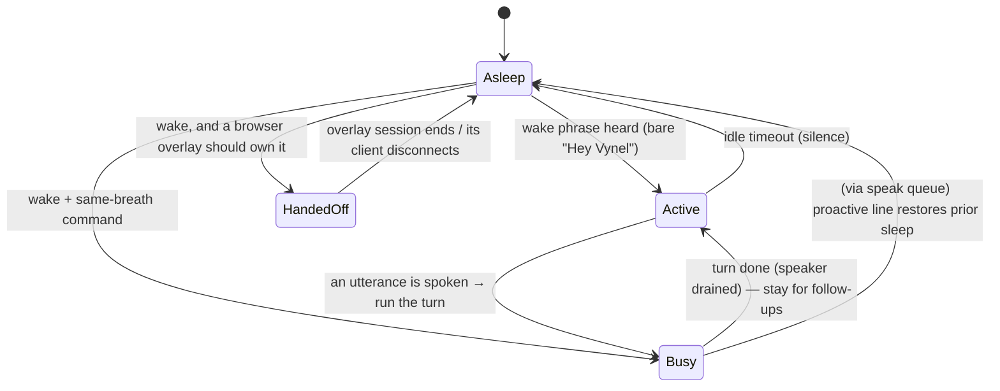

# Voice daemon — Overview

> The always-on "Hey Vynel" sidecar: a background process that owns the microphone and speaker, listens for a wake phrase, runs the spoken command against the brain, and answers in Vynel's own voice — everything on the local CPU, no cloud, no Python.
>
> **Status:** shipped (with live-tuning caveats on real audio hardware) · **Depends on:** [voice](../../voice/overview.md) (pure logic), [voice-engine](../../voice-engine/overview.md) (STT/TTS/VAD models) · **Code map:** [structure.md](./structure.md)

## Purpose

The voice daemon is Vynel's **hands-free channel**. It runs quietly in the background, keeps an ear on the mic, and wakes only when it hears the wake phrase. From there it holds a short spoken conversation: you talk, it thinks, it talks back, and it drifts back to sleep after a stretch of silence.

Its reason to exist as a *separate app* is that it is the **imperative shell** around otherwise-pure voice code. Vynel splits the voice concern into three:

- **The daemon (this app)** — the messy, stateful outside world: it opens the actual audio device, drives the always-on listen loop as a state machine, orchestrates wake → turn → speak, coordinates the browser hand-off, and calls the brain over the network. It is the only piece that touches hardware and wall-clock time.
- **[voice](../../voice/overview.md)** — the *pure decisions*: given a transcript, is this the wake phrase? Given a stream of text, where do the sentence boundaries fall? No microphone, no clock, unit-tested with plain strings.
- **[voice-engine](../../voice-engine/overview.md)** — the *models*: speech-to-text, text-to-speech, and voice-activity detection, all running locally on the CPU.

The daemon **composes** those two: it feeds mic audio through the engine's models and routes their output through the pure logic's decisions, wrapping both in the real-world loop that neither of them contains.

A distinctive design choice: the daemon can either **answer natively** (synthesize the reply and play it through its own speaker) or **hand the conversation off to a browser overlay** — the floating **display dock** that runs the more accurate browser speech stack for the command turn. In hand-off mode the daemon stays the local, private *wake* layer; only the recognized command ever leaves the device.

## What it can do

- **Wake on a phrase** — while asleep it acts on nothing but the wake phrase; hearing it opens a conversation (and runs a command immediately if one followed the phrase in the same breath).
- **Hold a multi-turn conversation** — once awake, every utterance is treated as a command with no need to re-wake; each answer keeps it awake, and a run of silence lets it fall back asleep.
- **Speak the assistant's replies** — synthesized locally in Vynel's chosen voice and played through the speaker; the same one voice is used everywhere, including the browser overlay.
- **Hand a wake off to a browser overlay** — when the display dock (or a connected app tab) is present, the wake is published to it and the browser owns that command session; the daemon takes the mic back when the overlay's session ends or its window closes.
- **Play proactive / tool-driven speech** — text pushed from elsewhere (the assistant's `speak` tool, a proactive notification) is queued and spoken in order when the audio path is free, even mid-hand-off, without colliding with a live conversation.
- **Show its state** — it announces where it is (idle, waking, listening, thinking, speaking) so a status line or the browser voice view can reflect it.
- *(background)* **Never listen to itself** — it closes the mic while speaking and reopens it only once playback has truly finished (the echo defense).
- *(background)* **Fail safe on a bad hand-off** — if a launched overlay window never connects, it gives up the hand-off and resumes wake-listening rather than going deaf.

## Responsibilities

**Owns** — the real-world orchestration of one voice session: opening and closing the physical mic and speaker, the always-on listen loop as a four-state machine (asleep / active / busy / handed-off), the wake-then-converse flow, the idle-to-sleep timing, the speak queue and its ordering, the echo defense (mic stays shut until playback drains), the local↔browser hand-off coordination and its watchdog, and the network call that runs each spoken turn against the brain.

**Does not own** —
- **wake-phrase detection and sentence boundary logic** — the pure [voice](../../voice/overview.md) package (the daemon calls into it, it decides);
- **the STT / TTS / VAD models themselves** — the [voice-engine](../../voice-engine/overview.md) package;
- **the actual conversation, memory, tools, and the reply's content** — the brain, reached through the [local-api](../local-api/overview.md) app; the daemon only asks it to run a turn and plays what comes back;
- **the `speak` tool as a tool** — defined in the [mcp](../mcp/overview.md) surface; the daemon owns only the *speaker playback* that tool's text loops back to;
- **the browser voice view and its speech stack** — a surface in [local-web](../local-web/overview.md) (and the [desktop](../desktop/overview.md) overlay window); the daemon only signals it and synthesizes its audio.

> Faithfulness note: the [voice](../../voice/overview.md) package also carries turn-taking, barge-in, audio-segmentation, and a "relay" set, but the v1 daemon wires in only its wake-detection and sentence-buffering. The rest exists but is not yet part of this loop — consistent with the loop's own note that "v1 has no user barge-in."

## Concepts & vocabulary

| Term | Meaning |
|---|---|
| **Daemon / sidecar** | This background process. Runs alongside the brain, owns the audio device, is never in the request path of a normal chat. |
| **Wake phrase** | The spoken trigger that turns the daemon from asleep to listening. Detected on-device from the transcript alone. |
| **Same-breath command** | A command spoken in one breath right after the wake phrase — run immediately, no second prompt. |
| **Conversation window** | The awake period. Every utterance is a command; a stretch of silence closes it. |
| **Turn** | One spoken exchange: an utterance sent to the brain, whose answer is spoken back. |
| **Echo defense** | The rule that the mic stays closed until the speaker has truly finished, so the daemon never transcribes its own voice. |
| **Hand-off** | Passing a wake to a connected browser overlay, which then owns the command session; the daemon goes deaf until the overlay releases it. |
| **Display dock** | The floating browser overlay opened on wake; runs the browser speech stack for the command turn and plays the daemon's synthesized voice. |
| **Speak queue** | Ordered buffer of text to say aloud from outside a turn (the `speak` tool, proactive lines), drained when the audio path is free. |
| **Session state** | The loop's outward-facing status: idle, wake, listening, thinking, speaking. |

## Rules & invariants

- **Asleep, only the wake phrase matters.** Every other sound is transcribed and ignored until the phrase is heard.
- **The mic never hears the daemon speak.** While it plays audio it drops incoming frames, and it reopens the mic only once playback has genuinely drained — not merely once it stopped sending audio.
- **Wake stays private and local; only the command travels.** Wake detection runs on-device from the transcript; in a hand-off nothing leaves the machine but the recognized command.
- **A wake is delivered to exactly one surface.** With the floating window on, only it runs wake sessions; otherwise the single newest eligible browser client does — two surfaces must never answer the same wake twice.
- **A failed hand-off must never leave the daemon deaf.** If a launched overlay never connects within a bounded wait, the daemon abandons the hand-off and resumes wake-listening.
- **Proactive speech never hijacks the session.** A queued `speak` line is spoken when the path is free and then restores exactly the prior state — it will not wake a sleeping daemon into a conversation or yank a hand-off away from the browser.
- **One line's failure never strands the rest.** A synthesis or playback hiccup on one queued line is dropped and logged; the queue and the state machine keep going.
- **No user barge-in in v1.** Once a turn is thinking or speaking, incoming audio is dropped until it finishes — you cannot interrupt it mid-answer yet.
- **Everything runs locally on the CPU.** Recognition, synthesis, and voice-activity detection need no cloud call and no Python runtime.

## Lifecycle

The listen loop is a four-state machine. A single mic stream feeds it; each recognized segment moves it between states.

## Where it sits in the bigger picture

The voice daemon is one **channel** into Vynel, parallel to text chat — it does not replace the brain, it drives it hands-free. It composes the pure [voice](../../voice/overview.md) decisions with the [voice-engine](../../voice-engine/overview.md) models, and for every spoken turn it calls the [local-api](../local-api/overview.md) app to run the conversation (with all its memory, tools, and approvals) on the fast triage model. Its replies reach the ear through the assistant's `speak` tool, defined in the [mcp](../mcp/overview.md) surface, looping back to this daemon's speaker. When a wake is handed off, the command session runs in the voice view served by [local-web](../local-web/overview.md) — or the floating overlay window shipped by [desktop](../desktop/overview.md) — while the daemon holds the private wake layer. It is the imperative edge of Vynel's voice stack: the only piece that touches a real microphone.

---
*Mapped from the code on disk, 2026-07-14. If you change this module, update this file and [structure.md](./structure.md).*
