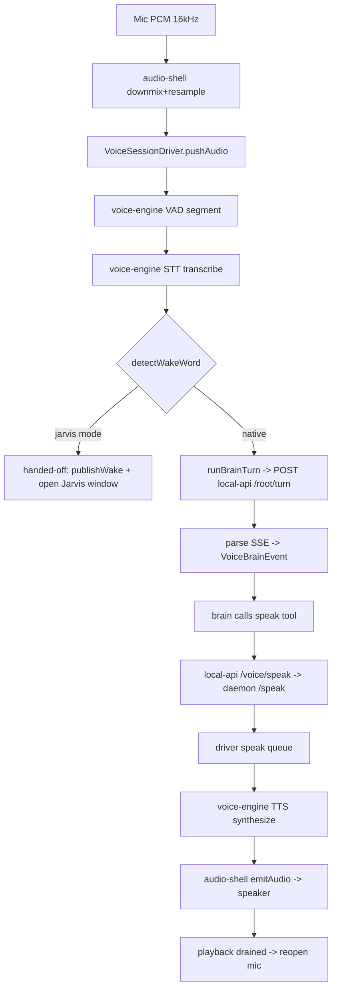
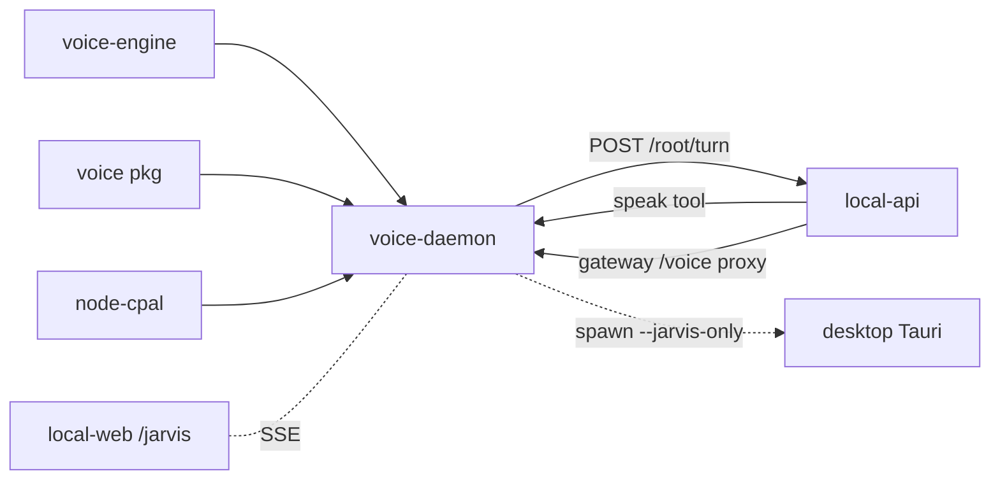

# Voice daemon (`apps/voice`) — Structure

> The code map and wiring for the `@vynel/voice-daemon` app shell. For the concept — what the daemon is and why it exists — see [overview.md](./overview.md).
>
> Folders touched: `apps/voice/src/` · `apps/local-api/src/routes/voice/` · `apps/local-api/src/gateway.ts` · `apps/local-web/vite.config.ts` (`/voice` proxy) · `apps/desktop/src-tauri/src/` (Jarvis overlay window)

`apps/voice` is an **app shell**, not a feature leaf — it owns no DB tables, no repositories, no MCP descriptor. It is the imperative I/O layer that composes two packages into an always-on sidecar: it listens on the mic, wakes on "Hey Vynel", runs a turn against the brain (`local-api /root/turn`), and speaks the answer. Everything runs on the CPU, no Python. Deps: `@vynel/voice`, `@vynel/voice-engine`, `hono` + `@hono/node-server`, `node-cpal`, `pino`, `zod` (`apps/voice/package.json`).

## The three-way voice split

The task the daemon does is spread across three packages — one pure-logic, one models, one I/O shell. Keeping them separate is what makes the loop unit-testable with fakes.

| Package | Layer | Owns | Character |
|---|---|---|---|
| `@vynel/voice-engine` (`packages/voice-engine`) | **the models** — ears + mouth | STT/TTS/VAD over `sherpa-onnx-node` (native, CPU). Stable seams `VoiceEngine` / `SpeechRecognizer` / `VoiceActivityDetector` + the `Sherpa*` backends (Kokoro/piper TTS, Moonshine STT, Silero VAD) | native, model-bound |
| `@vynel/voice` (`packages/voice`) | **the pure logic** — headless brain of the loop | `detectWakeWord`, `SpokenSentenceBuffer`, turn-taking gate, barge-in, audio-segmenter + the relay reducers (summarize/strip-markup/ack) | pure, unit-testable, no I/O |
| `@vynel/voice-daemon` (`apps/voice`, **this unit**) | **the shell** — imperative I/O | mic/speaker via node-cpal, the loop state machine, the brain SSE client, the overlay HTTP channel, the Jarvis-window launcher, env | stateful, device-bound |

The daemon imports **types + Sherpa classes** from voice-engine and **`detectWakeWord` + `SpokenSentenceBuffer`** from voice (`loop/voice-session-driver.ts:1-2`, `main.ts:8-9`). Neither package imports the other; the shell is the only place they meet.

## File map

► = entry point.

| Path | Role |
|---|---|
| ► `apps/voice/src/main.ts` | the composition root — loads env + models, builds the audio shell, overlay channel, Jarvis launcher and `VoiceSessionDriver`, wires the late-bound `io`/`wakeHandoff` seams, registers SIGINT/SIGTERM shutdown |
| `apps/voice/src/env.ts` | Zod-validated env — the **single** place `process.env` is read; relative paths resolve against repo root |
| `apps/voice/src/models.ts` | resolve TTS/STT/VAD model file paths from the models dir + `findMissingModelFile` (fail-clear before native load) |
| `apps/voice/src/audio/audio-shell.ts` | native mic+speaker via node-cpal; implements the driver's `VoiceSessionIo`; downmix/resample both ways; playback-drain estimate + WASAPI keep-alive |
| `apps/voice/src/audio/cpal.ts` | the single corrected boundary to `node-cpal` v0.1.1 — loads it via `createRequire` and types it against the **runtime** (the shipped `.d.ts` is stale) |
| `apps/voice/src/audio/audio-format.ts` | pure sample-rate + channel conversion — `resampleLinear`, `downmixToMono`, `monoToChannels` |
| `apps/voice/src/audio/wav-encode.ts` | encode engine PCM (Float32 mono) → 16-bit WAV bytes — the overlay `/synthesize` wire format |
| `apps/voice/src/loop/voice-session-driver.ts` | **the loop** — a headless `asleep→active→busy→handed-off` state machine; segments mic PCM, transcribes, runs turns, drains the speak queue |
| `apps/voice/src/loop/voice-session-types.ts` | the injected seams — `VoiceSessionState`, `VoiceBrainEvent`, `VoiceSessionIo` |
| `apps/voice/src/brain/run-brain-turn.ts` | the brain client — POST utterance to `local-api /root/turn`, stream SSE → `VoiceBrainEvent`s; pins the Haiku triage model + `voice: true` |
| `apps/voice/src/brain/sse-frames.ts` | minimal SSE frame parser (`event`/`data`, chunk-boundary tolerant) — pure |
| `apps/voice/src/overlay/overlay-channel.ts` | the loopback Hono server (port 18893) for browser Jarvis views — SSE `/events`, `/session/end`, `/speak`, `/synthesize` |
| `apps/voice/src/overlay/jarvis-window.ts` | launch/focus the floating Jarvis window — Tauri overlay exe preferred, Chrome/Edge `--app` fallback; an exe that exits within 3 s of launch (crash, stale build) triggers the browser fallback so the wake is still answered |
| `apps/voice/src/**/*.test.ts` | colocated Vitest tests: `audio-format`, `wav-encode`, `run-brain-turn`, `sse-frames`, `voice-session-driver`, `jarvis-window`, `overlay-channel` |

No `schema/`, `repositories/`, migrations, or `McpFeatureDescriptor` — this app persists nothing and exposes no owned tables.

## Boot & wiring (`main.ts`)

The composition root runs synchronously, top to bottom:

1. `loadEnv()` → pino logger at `LOG_LEVEL`.
2. Resolve TTS/STT/VAD configs (`models.ts`); `findMissingModelFile` → `process.exitCode = 1` with a "run `pnpm voice:fetch-models`" pointer if any file is absent (fail-clear before the native load).
3. Construct the three Sherpa engines — `SherpaVoiceEngine` (TTS), `SherpaSpeechRecognizer` (STT), `SherpaVoiceActivityDetector` (VAD) — loading the ONNX models on CPU.
4. Build `audioShell` (`createAudioShell`) and `overlay` (`startOverlayChannel`) with a **late-bound `driver` reference** (`let driver!`) — each needs driver callbacks and the driver needs both, so the driver is assigned after (`main.ts:57-154`).
5. `wakeSurface` is `'jarvis'` when `VYNEL_VOICE_JARVIS_WINDOW === '1'` (default) — only the floating window runs wakes; otherwise `'any'`.
6. Build `createJarvisWindow` (browser/url/appPath config) and the `VoiceSessionIo` that mirrors every state change to **both** the audio shell (status log) and the overlay (SSE publish).
7. Construct `VoiceSessionDriver` with all deps injected — VAD + recognizer wrapped in `trace*` diagnostics (`LOG_LEVEL=debug`), `runBrainTurn` bound to `VYNEL_API_URL`, and the `wakeHandoff` seam.
8. `audioShell.start(audio => driver.pushAudio(audio))` opens the mic; the daemon is now listening.
9. `SIGINT`/`SIGTERM` → graceful `audioShell.stop()` + `overlay.stop()` + `driver.stop()` + `process.exit(0)`.

If the overlay channel fails to bind (port taken), `overlay.whenListening.catch` stops everything and hard-exits — without the channel the Jarvis window can never connect (`main.ts:87-97`).

## The loop — `VoiceSessionDriver` state machine

`packages/voice`'s pure pieces + `voice-engine`'s models are driven by one class. States (`voice-session-driver.ts:59`):

| State | Meaning | Audio handling |
|---|---|---|
| `asleep` | wake-word only | every VAD segment checked for "hey vynel"; nothing else acted on |
| `active` | conversation window | every real utterance is a command (no re-wake); `idleTimeoutMs` silence → asleep |
| `busy` | a turn is thinking/speaking | incoming audio **dropped** (no barge-in in v1); mic reopens only on playback-drained (echo defense) |
| `handed-off` | a connected browser overlay owns the command session | daemon ignores ALL audio (incl. its own speaker playing the overlay's TTS) until `endHandoff()` |

Key behaviors:
- **The daemon no longer speaks reply text.** A turn runs `runBrainTurn` to completion; the brain replies by **calling the `speak` MCP tool**, which loops back through local-api → the overlay `/speak` → `driver.speak()` (queued behind the turn). Text deltas are ignored (`#runTurn`, `run-brain-turn.ts` comment).
- **Speak queue** (`speak()` / `#drainSpeakQueue`) — external text (the `speak` tool, proactive lines) drains when the audio path is free; it drains even while `handed-off` (the daemon speaker is idle; the browser owns only the mic). A `#drainPriorState` restores exactly where the drain interrupted, and an `#endHandoffPending` flag rescues a handoff-release that arrived mid-drain (the "deaf-daemon" bug guard).
- **Echo defense** — after speaking, the mic stays closed until the shell calls `notifyPlaybackDrained()` (real playback end, not merely "stopped sending").

## HTTP surface — the overlay channel (`overlay-channel.ts`, port 18893)

A small loopback Hono server (`@hono/node-server`), CORS-open because it binds `127.0.0.1` only. Heartbeat `ping` events (15 s) keep proxies from idling the SSE socket.

| Method | Path | Purpose |
|---|---|---|
| GET | `/events?surface=app\|jarvis` | SSE — replays last state on connect, then `{kind:'state'}` / `{kind:'wake'}` frames. Wake goes to **one** newest eligible client (two would answer twice) |
| POST | `/session/end` | overlay's command session finished → `onSessionEnd` → `driver.endHandoff()` |
| POST | `/speak` | speak text through the daemon's own speaker (the `speak` MCP tool path); ≤ 2000 chars; `onSpeak` → `driver.speak()` |
| POST | `/synthesize` | one sentence → WAV bytes in the daemon's own Kokoro voice; ≤ 1000 chars; played by the overlay's `<audio>` |

An undelivered wake is held (`pendingWake`) and replayed to the next eligible connect — that is how the same-breath command survives the Jarvis window's launch time, and how a wake lost to a dying socket recovers (`overlay-channel.ts:27-98`).

## How local-api exposes voice — the `/voice` endpoints it proxies

Two distinct surfaces share the `/voice` path, resolved by route order in `apps/local-api/src/gateway.ts`:

- **`local-api /voice/speak`** (`apps/local-api/src/routes/voice/index.ts`) — the `speak` MCP tool (`rootSurface`, `mutatingApproved`). Any global session (voice triage, global root, a scheduled briefing) calls it; `speakThroughDaemon` relays to the daemon's overlay `/speak` at `VYNEL_VOICE_DAEMON_URL` (default `http://127.0.0.1:18893`) with a 4 s timeout — a daemon that's down returns `{ spoken: false, reason }` (a soft success: "answer in text instead"). Mounted at `/voice` behind `featureGate('voice')` (`app.ts:119,168`).
- **The gateway `/voice/*` proxy** — the gateway forwards `/voice/*` (prefix stripped) to the **daemon's overlay channel** (SSE wake events, `/synthesize`, `/session/end`). It deliberately **shadows** local-api's own `/voice/speak` at root paths; externally the tool surface is `/api/voice/*`, and out-of-process SDK/MCP consumers dispatch through the `/api` mount (`gateway.ts:1-19,50-86`). If the daemon is unreachable the proxy returns `502 voice_daemon_unreachable` with a "start it with `pnpm dev:voice`" pointer.
- **Dev twin** — `apps/local-web/vite.config.ts` proxies `/voice` → the daemon (strips the prefix); the gateway is that proxy's production form.

## Pipeline — "say 'Hey Vynel', get a spoken answer"

1. Mic frames → `audio-shell.ts` downmixes + resamples to 16 kHz mono → `driver.pushAudio` (`main.ts:156-158`).
2. `voice-session-driver.ts:98` → `vad.push` segments → `recognizer.transcribe` per segment.
3. Asleep: `detectWakeWord` (`@vynel/voice`). Jarvis mode → `#state = 'handed-off'`, `publishWake` + open/focus the window (`voice-session-driver.ts:231-245`, `main.ts:132-151`). Native → run the turn.
4. `#runTurn` → `run-brain-turn.ts` POSTs `/root/turn` (`model: claude-haiku-4-5`, `voice: true`) → `sse-frames.ts` parses → `VoiceBrainEvent`s. Text deltas ignored.
5. The brain answers by calling the `speak` tool → `local-api /voice/speak` → `speakThroughDaemon` → daemon overlay `/speak` → `driver.speak()` (queued).
6. Queue drains: `SpokenSentenceBuffer` (`@vynel/voice`) splits into sentences → `synthesizer.synthesize` (voice-engine TTS) → `io.emitAudio` → speaker.
7. `io.endSpeech()` → drain estimate → `notifyPlaybackDrained()` reopens the mic; the driver stays `active` for follow-ups until `idleTimeoutMs` silence sleeps it.

## Connections

**Summary:** a **standalone sidecar** — it imports two voice packages, POSTs turns to local-api, and hosts a loopback channel that local-api proxies and the desktop shell/browser render. It reaches no DB and publishes no outbox events.

| Unit | Direction | Mechanism | What crosses |
|---|---|---|---|
| `@vynel/voice-engine` | out | import | `Sherpa*` STT/TTS/VAD engines + `PcmAudio`/config types |
| `@vynel/voice` | out | import | `detectWakeWord`, `SpokenSentenceBuffer` |
| `node-cpal` | out | native require | default mic/speaker device + streams |
| [local-api](../local-api/overview.md) `/root/turn` | out | HTTP (SSE) | voice turns (Haiku, `voice: true`); answer streamed back |
| [local-api](../local-api/overview.md) `/voice/speak` | in | HTTP | the `speak` MCP tool relays here → daemon `/speak` |
| local-api gateway / local-web Vite | in | HTTP proxy | `/voice/*` → the daemon's overlay channel |
| local-web `/jarvis` | both | SSE + launched window | wake/state events out; the browser owns the command session |
| [desktop](../desktop/overview.md) (Tauri) | out | `spawn` | on wake, launches `vynel-desktop.exe --jarvis-only` for the overlay |

**Events published/consumed:** none — this app has no outbox.

## Who launches it

- **Standalone / dev only (Phase 1).** `pnpm dev:voice` (`pnpm --filter @vynel/voice-daemon dev` — `node --watch --import tsx src/main.ts`) or as part of `pnpm dev:full` (`package.json`). Requires local-api already up on `VYNEL_API_URL`.
- **Nothing auto-supervises the voice daemon yet.** The desktop's `daemon.rs` supervises the **local-api brain** (port 18892), not this daemon. The relationship runs the other way: on a Jarvis wake the voice daemon *launches* the desktop overlay window (`jarvis-window.ts` → `vynel-desktop.exe --jarvis-only`, `apps/desktop/src-tauri/src/main.rs:16`), or a Chrome/Edge `--app` window on local-web's `/jarvis` route as fallback.

## Config & gotchas

- **Env** (`env.ts`): `VYNEL_API_URL` (default `http://127.0.0.1:18892`), `VYNEL_VOICE_MODELS_DIR` (`.models/voice`), `VYNEL_VOICE_TTS` (`kokoro`|`piper-lessac`), `VYNEL_VOICE_STT` (`moonshine-base`|`moonshine-tiny`), `VYNEL_VOICE_ID`, `VYNEL_VOICE_IDLE_TIMEOUT_MS` (15 s), `VYNEL_VOICE_DAEMON_PORT` (18893), `VYNEL_VOICE_JARVIS_WINDOW` (`1`), `VYNEL_VOICE_JARVIS_URL` (`…:18894/jarvis`), `VYNEL_VOICE_JARVIS_BROWSER`, `VYNEL_VOICE_JARVIS_APP` (Tauri exe path).
- **node-cpal `.d.ts` is stale.** `cpal.ts` is the single corrected boundary: it `createRequire`s the addon and types it against the real runtime (`createStream(deviceId, isInput, config, cb)` with **string** device ids; the callback is required even for output streams). Don't reach around it.
- **WASAPI keep-alive** — an idle Windows output stream goes cold and the next write is silent; the shell trickles ~50 ms silence between real audio (`audio-shell.ts:22,57-62`). The `PLAYBACK_TAIL_MS` (350) drain estimate is LIVE-TUNE territory (needs a real mic).
- **No ffmpeg** — despite the module sometimes being described as "node-cpal + ffmpeg", the daemon uses **no** ffmpeg. All format conversion is pure-JS: `audio-format.ts` (resample/downmix/upmix) + `wav-encode.ts` (16-bit WAV). A grep of `apps/voice`, `packages/voice-engine`, `scripts`, and `package.json` finds zero ffmpeg references.
- **Linear resampling on purpose** — box-averaging dulled consonants and STT dropped more words (Chad live-smoke, 2026-07-07); `resampleLinear` keeps the high-frequency energy (`audio-format.ts`).
- **No barge-in in v1** — `busy`/`handed-off` drop all mic audio; the mic reopens only on true playback-drain.
- **The daemon speaks via a tool, not prose** — a turn's text deltas are discarded; voice output is the `speak` tool round-trip alone. A failed turn (never calls `speak`) queues a canned apology line (`voice-session-driver.ts:57,272`).
- **Two `/voice` surfaces collide by design** — local-api's own `/voice/speak` is shadowed at root paths by the gateway's overlay proxy; the tool is reachable externally only at `/api/voice/*` (`gateway.ts:11-15`).
- **Jarvis connect watchdog** — if a launched window never connects within 10 s (`JARVIS_CONNECT_TIMEOUT_MS`), the daemon abandons the handoff and resumes wake-listening so a failed launch never leaves it deaf (`main.ts:29,142-149`).

---
*Mapped from the code on disk, 2026-07-14. If you change this module, update this file and [overview.md](./overview.md).*
