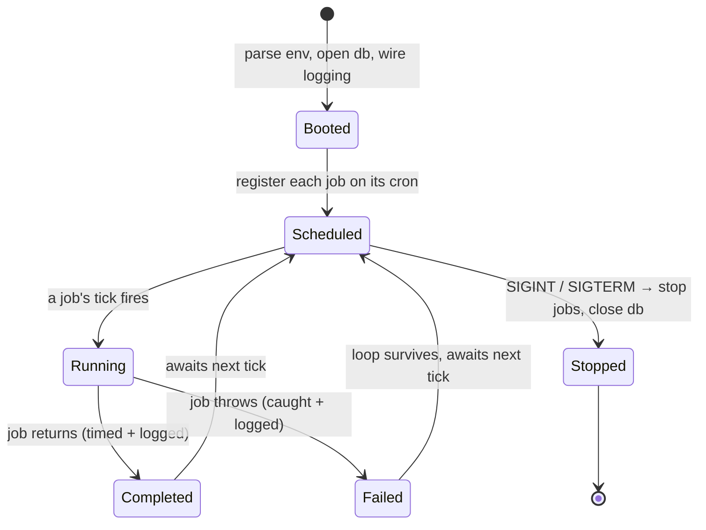

# Worker — Overview

> A standalone background process that runs Vynel's scheduled maintenance jobs on a cron clock — built and green, but on the desktop it is never launched: its one job runs in-process inside the api instead.
>
> **Status:** shipped (built + tested) — but **not launched on the desktop**; its embeddings tick runs in-process in [local-api](../local-api/overview.md) · **Depends on:** [db](../../_platform/database/overview.md) (kernel), [embeddings](../../_platform/embeddings-and-indexing/overview.md), [knowledge](../../knowledge/overview.md) · **Code map:** [structure.md](./structure.md)

## Purpose

The worker exists so that recurring background work — the once-a-minute, once-a-day chores that keep Vynel's data healthy — can run in its **own process**, separate from the api that serves requests. It is a small, generic engine: a cron scheduler that takes a list of jobs at boot, wakes each on its schedule, runs it inside an isolated try/catch, and logs the outcome. Nothing about the engine is domain-specific; each feature is meant to hand it a job as that feature lands.

The honest caveat sits at the front of this doc for a reason. On the desktop — Vynel's real deployment today — **this process is never started**. The single job it carries (generating missing knowledge embeddings) is also wired to run in-process inside [local-api](../local-api/overview.md), on the same minute cadence, because a desktop app is one process and shipping a second is friction the product doesn't yet need. So the worker is best understood as a **built, tested twin kept ready for a split-process deployment** — the day the api and its background chores want to live in separate processes, this is the process the chores move into. It is plumbing, not a product surface, and right now it is plumbing on standby.

## What it can do

- *(background)* **Run a cron schedule** — register a list of jobs at boot, each on a standard 5-field cron expression against the host's local timezone, and fire each on its tick.
- *(background)* **Generate missing knowledge embeddings** — its one wired job, every minute: it delegates to the knowledge feature's core routine, which finds un-embedded chunks and fills them so semantic search works. The worker itself holds none of that logic — it is a thin pass-through of the shared database and logger.
- *(background)* **Isolate a failing job** — one job throwing is caught, logged with the job's name and how long it ran, and does not kill the scheduler or the other jobs.
- *(background)* **Shut down gracefully** — on an interrupt or terminate signal it stops every scheduled job, closes the database, and exits cleanly.

## Responsibilities

**Owns** — the generic scheduling engine and the process wiring around it: the cron dispatcher, the job contract (a name, a cron expression, a run function), per-tick error isolation and timing logs, the boot sequence that opens the database and wires structured logging, the one-place validation of its environment, and graceful shutdown on a signal. It owns *how* jobs are scheduled and run — not what they do.

**Does not own** —
- **the actual running of the embeddings tick on the desktop** — that happens in-process in [local-api](../local-api/overview.md), which is the process the desktop launches; the worker is its dormant twin.
- **the embedding logic itself** — the loop, the per-chunk transactions, the vector writes all live in [knowledge](../../knowledge/overview.md); the worker's job is a thin delegator.
- **the embedding model** — shared infrastructure ([embeddings](../../_platform/embeddings-and-indexing/overview.md)); the worker only points the model's cache at the right on-disk location before the first tick.
- **database migrations** — the api runs them at its own boot; the worker assumes they've already run and never migrates.
- **the other in-process background ticks** — memory maintenance, schedules, channels, delegation and the rest all run inside [local-api](../local-api/overview.md); the worker mirrors only the knowledge-embeddings one.

## Concepts & vocabulary

| Term | Meaning |
|---|---|
| **Job** | One unit of scheduled work: a name (used in logs), a cron expression, and a run function that receives the shared context. The worker holds a list of them. |
| **Scheduler** | The cron dispatcher. Given the job list at boot, it registers each on its schedule and returns a stop handle for shutdown. |
| **Worker context** | The shared dependencies every job receives — an open database handle and a structured logger — wired once at boot. |
| **Tick** | One firing of a job at its scheduled moment. Each tick is timed and logged; a throw is caught, not propagated. |
| **Split-process deployment** | The future shape this process is kept ready for: api and background chores in separate processes. Until then the desktop runs everything in one. |

## Rules & invariants

- **The worker is not the desktop's background engine — the api is.** Today nothing launches this process on the desktop; its one job runs in-process in the api. The worker stands ready for a split-process deployment, where the chores would move here. The two are deliberate twins, and the shared job is idempotent per chunk, so even an accidental overlap is harmless.
- **The engine is generic; the job list is not baked into it.** The scheduler knows nothing of any feature — the boot wiring owns the list, so features stay composable and each can add its own job as it lands. Today that list holds exactly one job.
- **A job's failure is contained.** Every tick runs inside a try/catch; a throw is logged with the job's name and duration and never kills the cron loop or the sibling jobs.
- **The worker assumes migrations have already run.** The api owns schema migrations at its boot; the worker never migrates. This only holds when both processes open the **same database file** — a stray second file silently breaks the worker.
- **Environment is validated in exactly one place.** All external configuration is parsed and checked once at boot; no other part of the app reaches for raw environment values.
- **The model cache is pinned before the first tick.** The embedding model's on-disk cache location is set during boot, so the first embeddings tick warms the model against the right, stable directory rather than a throwaway one.

## Lifecycle

## Where it sits in the bigger picture

The worker is a sibling process to [local-api](../local-api/overview.md), not a dependency of anything else. In Vynel's current desktop deployment the api is the one process that runs, and it carries the background ticks — including the knowledge-embeddings tick this worker was built for — in-process. So the worker sits to the side: a complete, tested engine importing the same kernel [db](../../_platform/database/overview.md), the same [embeddings](../../_platform/embeddings-and-indexing/overview.md) model, and delegating to the same [knowledge](../../knowledge/overview.md) core op as its in-process twin, waiting for the day the deployment splits background work out of the api and into its own process. Until then it is Vynel's background engine on standby.

---
*Mapped from the code on disk, 2026-07-14. If you change this module, update this file and [structure.md](./structure.md).*
