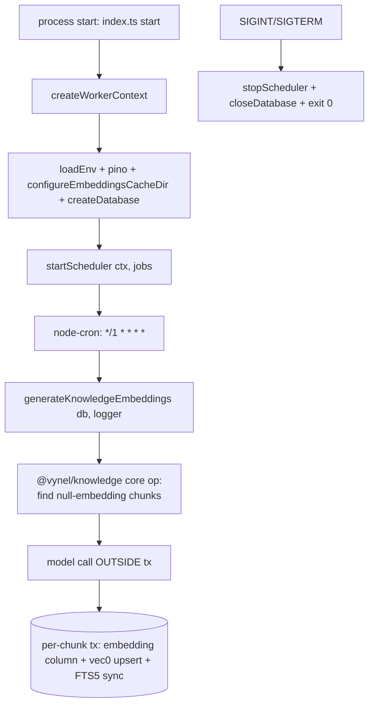

# Worker — Structure

> The code map and connections for the `apps/worker` app shell. For the concepts behind it, see [overview.md](./overview.md).
>
> Folders touched: `apps/worker/src/` · `apps/worker/src/jobs/knowledge/` · (owns no schema, routes, or UI)

`apps/worker` is a thin **standalone Node process** that runs scheduled background jobs against the shared `@vynel/db` file. It owns no tables, no HTTP surface, no MCP descriptor, no UI — it is pure boot + a generic cron scheduler + a list of thin `(db, logger) → core-op` delegators. In the knowledge slice that list is exactly **one** job. Deps: `@vynel/db`, `@vynel/embeddings`, `@vynel/knowledge`, `node-cron`, `pino`, `zod` (`apps/worker/package.json`).

> **Read this first (status):** the desktop app **does not launch this process.** The Tauri daemon spawns only `apps/local-api` (`apps/desktop/src-tauri/src/daemon.rs:166-172`), and local-api runs the same knowledge-embeddings tick **in-process** (`apps/local-api/src/services/knowledge-indexing-service.ts`). `apps/worker` is a **cron twin kept for a future split-process deployment** — green, tested, but not on the running desktop's boot path. See [Config & gotchas](#config--gotchas).

## File map

► = entry point.

| Path | Role |
|---|---|
| ► `apps/worker/src/index.ts` | boot — builds the `WorkerJob[]` (one entry today), starts the scheduler, wires SIGINT/SIGTERM graceful shutdown. Calls `start()` at module load |
| `apps/worker/src/factory.ts` | DI factory — `createWorkerContext()`: parse env, wire pino, set the embeddings cache dir, open the db → `{ db, logger }` |
| `apps/worker/src/env.ts` | the **single** `process.env` touch — Zod `EnvSchema`, cached `loadEnv()`; resolves `DB_PATH` against the repo root, not the CWD |
| `apps/worker/src/scheduler.ts` | generic `node-cron` dispatcher — `startScheduler(ctx, jobs)`; per-job try/catch; returns a `stopScheduler`. Defines the `WorkerJob` contract |
| `apps/worker/src/jobs/knowledge/generate-knowledge-embeddings.ts` | the one job — thin `(db, logger)` delegator to `@vynel/knowledge`'s core embeddings op |
| `apps/worker/src/jobs/knowledge/generate-knowledge-embeddings.test.ts` | smoke test — the delegator boots against a real test db and no-ops on an empty database (no model load) |
| `apps/worker/package.json` | `@vynel/worker`, private, ESM; `dev` = `tsx watch`, `main` = `src/index.ts` |
| `apps/worker/tsconfig.json` | build config |

There is **no `env` module, route, schema, or migration** in this app — it is a consumer of the kernel and feature packages only.

## Boot & wiring

`index.ts` runs `start()` at import (the process's whole job is this boot):

1. `createWorkerContext()` (`factory.ts`) —
   - `loadEnv()` parses + caches the Zod env.
   - `pino({ level: env.LOG_LEVEL })` — pino is wired at the app boundary; its `Logger` structurally satisfies the `{ info, warn, error }` shape core ops expect, so `ctx.logger` passes straight into core with no cast.
   - `configureEmbeddingsCacheDir(env.VYNEL_EMBEDDINGS_CACHE_DIR)` — **before** any job can lazily load the MiniLM model; the cache must live outside `node_modules`.
   - `createDatabase({ dialect, path?/url? })` — opens the SQLite file. **The worker does NOT run migrations** — the api process owns migrations at its own boot; the worker assumes they've run (`index.ts` header comment). This only holds when both processes open the **same** db file, which `env.ts`'s repo-root path resolution guarantees.
2. Build the job list inline in `index.ts` (not hard-coded in the scheduler — keeps the scheduler generic).
3. `startScheduler(ctx, jobs)` registers each job with `node-cron`; logs `worker started` with `jobCount`.
4. `SIGINT` / `SIGTERM` → `stopScheduler()` (stops every cron task) → `closeDatabase(ctx.db)` → `process.exit(0)`.

## Worker / background jobs

The scheduler (`scheduler.ts`) is domain-agnostic: it takes a `ReadonlyArray<WorkerJob>` and, for each, calls `cron.schedule(job.cron, …)`. Every tick logs `worker job started/completed` with `durationMs`; each `run` is wrapped in try/catch so one job's throw lands in `logger.error` (`worker job failed`) instead of killing the cron loop.

`WorkerJob` contract: `{ name: string; cron: string /* 5-field, host TZ */; run: (ctx) => void | Promise<void> }`.

| Job | Cron | Runs | Delegates to |
|---|---|---|---|
| `generate-knowledge-embeddings` | `*/1 * * * *` (every minute) | embed knowledge chunks whose `embedding` is null | `generateKnowledgeEmbeddings(db, {}, { logger })` in `@vynel/knowledge` |

The job file is a 4-line delegator — the loop + per-chunk tx + `sqlite-vec` writes + FTS5 sync all live in `@vynel/knowledge`'s core op (model call **outside** the sync tx). This is the **first consumer** of the real `@vynel/embeddings` MiniLM-L6-v2 implementation; the lazy-loaded model singleton warms on the first tick that finds pending chunks.

## Pipeline — "a cron tick embeds pending knowledge chunks"



1. Process launch runs `start()` (`apps/worker/src/index.ts:50`).
2. `createWorkerContext()` (`factory.ts:19`) parses env, wires pino, sets the embeddings cache dir, opens the db.
3. `startScheduler(ctx, jobs)` (`scheduler.ts:28`) registers the one job with `node-cron`.
4. Every minute the wrapped tick calls `generateKnowledgeEmbeddings(ctx.db, ctx.logger)` (`jobs/knowledge/generate-knowledge-embeddings.ts:27`).
5. The core op (`@vynel/knowledge`) reads chunks needing embeddings, calls the model outside the tx, and writes each chunk's embedding + vec0 index in a per-chunk tx — idempotent per chunk.
6. Any throw is caught by the scheduler wrapper and logged (`scheduler.ts:41`); the loop survives.

## Connections

**Summary:** worker is a pure **leaf process** — a thin driver that imports the kernel + one feature's core op and drives it on a timer. It publishes and consumes **no outbox events of its own** (any events come from the core ops it invokes). It shares state with `apps/local-api` only through the **same SQLite file** — no IPC, no HTTP between them.

| Unit | Direction | Mechanism | What crosses |
|---|---|---|---|
| db kernel (`@vynel/db`) | out | import | `createDatabase`, `closeDatabase`, `Database` type; the shared db file |
| embeddings (`@vynel/embeddings`) | out | import | `configureEmbeddingsCacheDir` (cache setup) + the model, loaded lazily inside the knowledge core op |
| knowledge (`@vynel/knowledge`) | out | import | `generateKnowledgeEmbeddings` core op + `StructuralLogger` type |
| `node-cron` / `pino` / `zod` | out | import | scheduling, structured logging, env validation |
| [local-api](../local-api/overview.md) | **twin (loose)** | shared db file | runs the *same* `generateKnowledgeEmbeddings` in-process (`knowledge-indexing-service.ts`); the two would double-run if both were up, but the op is idempotent per chunk so overlap is harmless |
| [desktop](../desktop/overview.md) | **none** | — | the Tauri daemon spawns only `apps/local-api` (`daemon.rs:166-172`); it never launches the worker |

**Events published:** none directly. **Events consumed:** none.

```mermaid
flowchart LR
    db[(db kernel / shared SQLite file)] --> W[worker]
    emb[embeddings] --> W
    kn[knowledge core op] --> W
    W -->|cron tick| kn
    api[local-api service] -. same op in-process .-> kn
    desk[desktop daemon] -. spawns .-> api
    desk -. NOT spawned .x W
```

## Config & gotchas

- **Not on the desktop boot path (the headline).** The running desktop app never starts this process. `apps/local-api/src/services/knowledge-indexing-service.ts:6-12` states it outright: *"The desktop app runs no `apps/worker` … apps/worker keeps its cron twin for a split-process deployment; the op is idempotent per chunk, so an overlap is harmless."* The only way this process runs today is a **manual launch** (`pnpm --filter @vynel/worker dev`, i.e. `tsx watch src/index.ts`). Treat it as standby infrastructure for a future split-process (separate api + worker) deployment, kept green so it doesn't rot.
- **Worker does not run migrations.** By design (`index.ts` + `env.ts` header comments). If the worker is ever the first/only process to touch a fresh db, tables won't exist and it will crash. The api must have booted (and migrated) against the same file first.
- **Same-file discipline is load-bearing.** `env.ts` resolves a relative `DB_PATH` against the **repo root** (computed from the file's own location), not `process.cwd()` — so api and worker land on the same `.data/vynel.dev.db` regardless of launch directory. A 2026-05-24 bug (noted in `env.ts`) had the worker create a fresh empty DB next to itself and crash; this resolution is the fix. Don't "simplify" it to a CWD-relative path.
- **Env mirrors local-api** (`env.ts` comment) minus `PORT` (api-only): `DB_DIALECT` (`sqlite`/`postgres`, default `sqlite`), `DB_PATH` (default `.data/vynel.dev.db`), `DB_URL` (optional, postgres), `LOG_LEVEL` (default `info`), `VYNEL_EMBEDDINGS_CACHE_DIR` (default `.models/embeddings`, resolved to repo root — kept outside `node_modules` so reinstalls can't poison it).
- **Comment drift — chat-purge job.** `factory.ts` and `scheduler.ts` reference a `purgeDeletedChatSessions` core op / a `'purge-deleted-chat-sessions'` job name as the logger precedent and the example `WorkerJob.name`. Those are **illustrative comments only** — no such job is wired into the `jobs[]` list in `index.ts`; the list holds exactly one entry (`generate-knowledge-embeddings`). Don't read the comments as an inventory.
- **Composable scheduler by design.** The scheduler is deliberately generic (jobs passed in from `index.ts`, not hard-coded) so memory/schedules/other features can each add a `WorkerJob` entry when a split-process deployment needs them — the scheduler + factory stay untouched.
- **First real embeddings consumer.** This job (and its in-process twin) is the first caller of the real MiniLM-L6-v2 impl (replacing memory's earlier throwing stub). Whichever process's tick fires first triggers the ~1 s model warm-up; the smoke test stays cold by running against an empty db.

---
*Mapped from the code on disk, 2026-07-14. If you change this module, update this file and [overview.md](./overview.md).*
