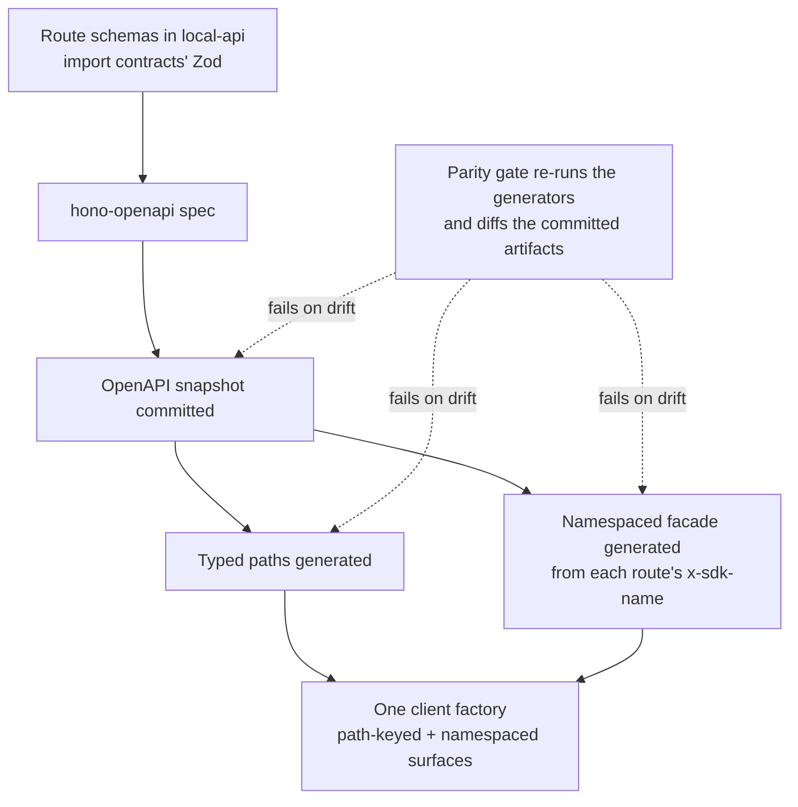

# Contracts & SDK — Overview

> The three dependency-light packages that hold Vynel's shared boundary language: the schemas and value catalogs every feature speaks, the generated typed client the frontends reach the API through, and the one descriptor a feature ships to expose its tools to the AI.
>
> **Status:** shipped (the client is generated, committed, and consumed by the desktop web app and the CLI) · **Depends on:** nothing from `@vynel/*` — that independence is the whole point · **Code map:** [structure.md](./structure.md)

## Purpose

These three packages are the **seams** of the modular monolith — the shared contracts that let features stay decoupled while still agreeing on shapes. They exist so that two parts of the system can speak about the same thing (a chat session, a marketplace item, an MCP tool) without importing each other's code. Everything here is deliberately *plumbing*, not a product surface: no user ever sees it, but every feature leans on it.

They are grouped because they answer the same question at three different boundaries:

- **`@vynel/contracts`** — the boundary between the API and its callers, and between features that must agree on a value set. Shared Zod schemas, the wire/HTTP response shapes, and compiled-in **value catalogs** (the verified-skill list, onboarding steps, schedule templates). Dependency-free except for Zod.
- **`@vynel/sdk`** — the boundary between the frontends and the running API. A **generated** TypeScript client, produced from the API routes, so the caller's types can never drift from what the server actually returns.
- **`@vynel/mcp-contract`** — the boundary between a feature and the AI turn. A single interface, `McpFeatureDescriptor`, that a feature implements to plug its MCP tools into a conversation without the turn's entry point knowing the feature exists.

## What it can do

- **Define shared shapes once.** A schema or wire type is authored in `@vynel/contracts` the moment a second consumer needs it (API + web/sdk/mcp), so both sides validate and type against the same definition rather than two hand-kept copies.
- **Carry compiled-in value catalogs.** The verified-skill catalog, onboarding-step catalog, and schedule-template catalog are TypeScript constant arrays bundled into the binary — no runtime catalog fetch — with small lookup helpers over them. Adding an entry is a few-line edit, never a schema migration.
- **Speak the hub's registry language.** Kind-agnostic wire types for the cloud marketplace registry and hub auth/entitlements, kept deliberately separate from the local skill-shaped marketplace types.
- **Give the frontends a typed client with two surfaces** — a low-level path-keyed surface that returns `{ data, error }`, and an ergonomic **namespaced facade** (`client.knowledge.search(...)`) that returns the body directly and throws `SdkError` on any non-2xx. Both live on one instance from one factory, sharing config.
- **Let a feature expose AI tools uniformly.** A feature ships one `McpFeatureDescriptor` — its server name, a `build` that returns an in-process MCP server for the turn, the names of its mutating (auto-carding) tools, and any capability-gated tools — and the composer folds it into a turn with no entry-point edits.
- *(background)* **Guard itself against drift.** A parity gate re-runs the generators and diffs their output against the committed client; if a route changed and the client wasn't regenerated, the gate fails.

## Responsibilities

**Owns** — the shared vocabulary and the machinery that keeps it honest: the Zod schemas and wire/HTTP response shapes promoted for reuse, the compiled-in value catalogs and their lookup helpers, the hub registry/auth/entitlement wire types, the generated OpenAPI snapshot and typed client (both surfaces, the client factory, and the thrown-error shape), and the MCP feature-attachment contract every tool producer implements.

**Does not own** —
- the actual **routes** these shapes describe — the [local-api](../../_apps/local-api/overview.md) app owns the endpoints; the client is generated *from* them;
- the **generation and parity scripts** themselves — those live with the repo's build tooling ([scripts](../../scripts/overview.md)), not inside these packages;
- any feature's **business logic or database** — contracts never import `@vynel/db`; the MCP contract types its heavy fields as `unknown` so a producer takes on no kernel dependency;
- the **AI runtime** — `@vynel/mcp-contract` touches only the SDK's *builder* server type (type-only), never the `claude-agent-sdk` runtime, which stays quarantined in [providers](../../providers/overview.md);
- **who runs the tools** — the turn composer that consumes the descriptors lives at the [local-api](../../_apps/local-api/overview.md) layer, deliberately above the feature packages.

## Concepts & vocabulary

| Term | Meaning |
|---|---|
| **Contract** | A shared shape — a Zod schema or a TypeScript wire type — promoted to `@vynel/contracts` once a second consumer needs it. The single source both sides validate/type against. |
| **Value catalog** | A compiled-in constant array of well-known values (verified skills, onboarding steps, schedule templates) with small lookup helpers. Bundled, not fetched. |
| **Wire type / HTTP shape** | The serialized JSON a route returns, or the SSE event a stream writes — the frontend casts SDK responses to these where a route carries no response schema. |
| **Generated client** | `@vynel/sdk` — a typed client produced from the API, never hand-written. Its type source ultimately traces back to the route schemas, which import contracts' Zod. |
| **Path-keyed surface** | The low-level client call (by URL path + method) that returns `{ data, error }` and never throws. |
| **Namespaced facade** | The ergonomic client call grouped by domain (`client.knowledge.search(...)`) that returns the body and throws on non-2xx — the Stripe/Anthropic-SDK feel. |
| **`x-sdk-name`** | The per-route annotation that names a namespaced method. The facade is derived entirely from these annotations. |
| **`api:generate`** | The command that regenerates all three client artifacts (OpenAPI snapshot → typed paths → namespaced facade) from the live API surface. |
| **Parity gate** | The check that re-runs the generators and diffs their output against the committed artifacts, failing if a route changed without a regenerate. Part of the test gate. |
| **`McpFeatureDescriptor`** | The one shape a feature implements to attach its MCP tools to a turn: server name, per-turn `build`, mutating tool names, capability-gated tools, and optional prompt/applicability hooks. |
| **`SdkError`** | The error the namespaced facade throws on non-2xx — carries the HTTP status, the parsed error body, and the raw response. |

## Rules & invariants

- **These packages depend on nothing from `@vynel/*`.** Contracts pulls in only Zod; the MCP contract references only the SDK's server *type*, type-only. That is exactly what lets a core-free package (like desktop control) implement the MCP contract without dragging in the database kernel.
- **A shape is promoted on the second consumer, not the first.** A schema stays local until a second surface needs it; then it moves to `@vynel/contracts` so the two sides can't drift.
- **The client is generated, never hand-edited.** Its three artifacts are emitted by `api:generate` from the live API and committed to git so a fresh checkout typechecks without running the generator. Hand-editing them is banned; the parity gate catches it.
- **One direction of truth: route → OpenAPI → client.** Route schemas (which import contracts' Zod) are the source; the OpenAPI snapshot, the typed paths, and the namespaced facade are all downstream of them. Nothing flows back up.
- **The parity gate is the safety net against silent drift.** Because the client is generated from the routes and committed to the repo, a change to a route could leave the committed client stale — so the gate re-derives the client on every test run and diffs it against what's committed, failing on any mismatch.
- **Two client surfaces, two error idioms, one instance.** The path-keyed surface returns `{ data, error }` and never throws; the namespaced facade throws `SdkError`. Both are composed onto the same client from one factory, sharing fetch and config.
- **A mutating tool cards itself.** A feature lists its irreversible tools once in its descriptor's mutating set; the composer unions those into the approval backstop — additive only, it never lowers the native floor.
- **Capability-gated tools are denied when their capability is off.** The descriptor maps capability ids to the tool names that turn off with them, so a single feature can mix always-available and capability-gated tools.

## Lifecycle

The central process here is how a route becomes a typed client — the generation pipeline and the gate that guards it.

## Where it sits in the bigger picture

This group is the connective tissue beneath almost everything. [local-api](../../_apps/local-api/overview.md) authors the routes these contracts describe and hosts the turn composer that consumes MCP descriptors; the frontends ([local-web](../../_apps/local-web/overview.md)) reach the API only through the generated client. Every feature package — [chat](../../chat/overview.md), [memory](../../memory/overview.md), [knowledge](../../knowledge/overview.md), [marketplace](../../marketplace/overview.md), [schedules](../../schedules/overview.md), [channels](../../channels/overview.md), and the rest — imports contracts for its shared shapes and, if it exposes tools, ships an `McpFeatureDescriptor`. The [hub](../../_apps/hub/overview.md) speaks its own registry wire types from here. The one line it will not cross is the AI runtime: the MCP contract stops at the SDK's *builder* type, leaving the live runtime sealed inside [providers](../../providers/overview.md). If contracts is the language the monolith agrees to speak, the SDK is how the outside world speaks it, and the MCP contract is how a feature offers itself to the assistant.

---
*Mapped from the code on disk, 2026-07-14. If you change this module, update this file and [structure.md](./structure.md).*
