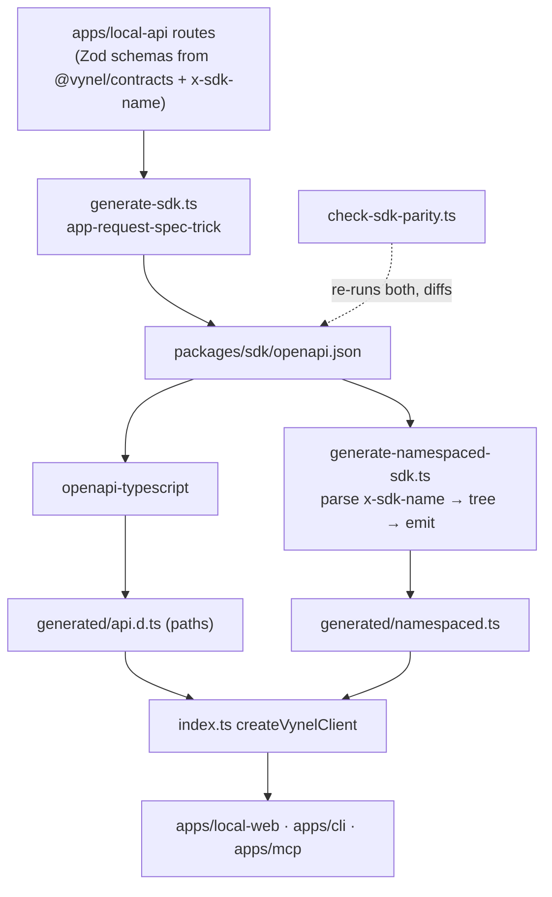
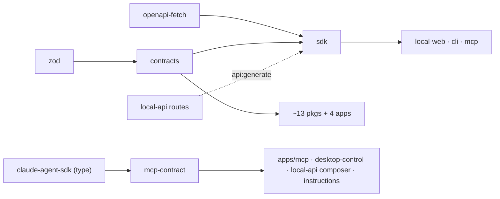

# Contracts & SDK — Structure

> The code map and connections for the three **seam** packages that carry Vynel's shared
> vocabulary across the module boundary: `@vynel/contracts`, `@vynel/sdk`, `@vynel/mcp-contract`.
> For the concepts behind them, see [overview.md](./overview.md).
>
> Folders touched: `packages/contracts/src/` · `packages/sdk/src/` · `packages/mcp-contract/src/` · `scripts/src/generators/` · `apps/local-api/src/routes/` (the SDK's upstream) · `apps/mcp/src/` (a descriptor producer)

These three packages hold **no business logic and touch no database** — they are the typed
contracts every other module agrees on. All sit at the bottom of the import graph (imports point
down only): a feature package, an app route, and the web UI all import the *same* shape here so the
two sides cannot drift. None depends on `@vynel/db`; `contracts` depends only on `zod`, `sdk` only
on `openapi-fetch`, and `mcp-contract` only on the Claude SDK's *type* export.

## File map

`► ` = entry point / public barrel.

### `@vynel/contracts` — shared shapes + compiled catalogs (`packages/contracts/src/`)

Exports every file directly via the package's `"./*": "./src/*.ts"` map — consumers import deep
paths (`@vynel/contracts/schedules/schedule-http`), **not** a root barrel.

| Path | Role |
|---|---|
| ► `index.ts` | deliberate **placeholder** (`export {}`) — a schema is promoted to the root barrel only on its *second* consumer; the real surface is the deep subpaths |
| `agents/curated-agents/curated-agent-definition.ts` | the `CuratedAgentDefinition` shape |
| `agents/curated-agents/curated-agent-catalog.ts` | `CURATED_AGENT_CATALOG` **value** (3 entries) + `findCuratedAgentBySlug` — compiled-in, no runtime fetch |
| `agents/curated-agents/{document-generator,researcher,inbox-assistant}.ts` | the 3 curated-agent entries |
| `approvals/approval-http.ts` · `channels/channel-http.ts` · `chat/chat-http.ts` · `schedules/schedule-http.ts` · `workspaces/workspace-http.ts` | per-feature **wire types** — the serialized JSON shapes the routes return + the SSE/turn-event unions the web casts to |
| `chat/chat-models.ts` · `chat/model-context-window.ts` (+ `.test.ts`) | model list + `resolveContextWindow(model)` **value** helper |
| `hub/{admin,catalog,entitlements,hub-auth}.ts` | the **cloud** second-system's wire types — shared by `apps/cloud-api` AND the desktop's hub client (`@vynel/hub-account`) so they can't drift |
| `marketplace/{marketplace-item,agent-item-manifest,resolve-catalog-sources}.ts` | marketplace item shapes + catalog-source resolution |
| `onboarding/{collected-onboarding-data,onboarding-step-catalog,onboarding-step-inputs,suggested-skills}.ts` (+ `.test.ts`) | onboarding step catalog **values** + input shapes |
| `schedules/schedule-template-catalog.ts` (+ `.test.ts`) | `SCHEDULE_TEMPLATE_CATALOG` **value** (5 entries) + `findScheduleTemplateByKind`; `ScheduleTemplateKind`/`ScheduleDestinationKind` unions |
| `schedules/{morning-briefing,weekly-summary,email-watch,custom,reminder}.ts` | the 5 individual schedule-template entries the catalog composes |
| `schedules/one-time.ts` (+ `.test.ts`) | separate concern — `ScheduleKind` (`'recurring'` \| `'one-time'`) + the `isOneTimeSchedule` predicate, **not** a template entry |
| `skills/verified-skills/{verified-skill-definition,verified-skill-catalog,email-drafter}.ts` | `VERIFIED_SKILL_CATALOG` **value** + the shipped skill entry |
| `workspaces/workspace-kind-bundles.ts` | `WorkspaceKind` bundles (the locked "re-declare, don't import `@vynel/db`" precedent) |

### `@vynel/sdk` — the typed API client (`packages/sdk/src/`)

| Path | Role |
|---|---|
| ► `index.ts` | **hand-written** — `createVynelClient(opts)` wraps `openapi-fetch` with the generated `paths` and `Object.assign`s the namespaced facade onto the same instance; re-exports the generated types + `SdkError` |
| `errors.ts` | `SdkError` — thrown by the namespaced surface on non-2xx (carries `status` + parsed `body` + `Response`) |
| `generated/api.d.ts` | **GENERATED** — `openapi-typescript` output: typed `paths` / `components` / `operations`. Checked into git; do not hand-edit |
| `generated/namespaced.ts` (+ `.test.ts`) | **GENERATED** — `makeNamespaced(client)`, the `client.knowledge.search()` facade, one async method per route derived from its `x-sdk-name` |
| `../openapi.json` *(package root, not `src/`)* | **GENERATED** — the OpenAPI 3.1 snapshot; the source both generated TS artifacts derive from; also re-exported as `@vynel/sdk/openapi.json` |

### `@vynel/mcp-contract` — the MCP feature-attachment contract (`packages/mcp-contract/src/`)

| Path | Role |
|---|---|
| ► `index.ts` | barrel — re-exports the four contract types, **type-only, no runtime** |
| `mcp-feature-descriptor.ts` | the `McpFeatureDescriptor` interface + `SessionToolContext`, `SessionMcpServer`, `HonoAppRequestFn` |

## `@vynel/contracts` — the shape rules

- **No `@vynel/db` dependency, by lock.** Union types that also live in a DB schema (`WorkspaceKind`,
  `ChannelKind`, `ScheduleTemplateKind`, the chat `Role`/`Status` enums) are **re-declared here and
  kept in sync by discipline**, not imported — see the comment blocks in `schedule-template-catalog.ts`
  and `chat-http.ts`. On a doc-vs-disk conflict the on-disk precedent wins (blueprint §4's
  `import from '@vynel/db'` sample is superseded).
- **Two kinds of export.** Most files are pure `interface`/`type` (wire shapes, cast targets). A
  handful ship compiled-in **value** catalogs: `SCHEDULE_TEMPLATE_CATALOG`, `CURATED_AGENT_CATALOG`,
  `VERIFIED_SKILL_CATALOG`, the onboarding step catalog, and helpers `resolveContextWindow` /
  `findScheduleTemplateByKind` / `findCuratedAgentBySlug`. These stay bundled (no runtime fetch) for
  offline reliability + an unambiguous trust story.
- **The `hub/` subfolder is the cloud seam.** `admin`/`catalog`/`entitlements`/`hub-auth` are the
  wire types the co-located cloud app (`apps/cloud-api`) and the desktop's hub client
  (`@vynel/hub-account`) both speak. Zod parsing stays at each app's boundary; these are types only.
- **Promotion rule.** A shape lands here on its **second** consumer (api + web/sdk/mcp). The root
  `index.ts` barrel stays empty until a shape earns root-level promotion; everything is reached by
  deep subpath.

## `@vynel/sdk` — the generation pipeline

The SDK is **three generated artifacts + one hand-written factory**. Everything downstream of the API
routes flows through one chain — route schema → `openapi.json` → SDK types → fetcher — with no
duplication.

`pnpm api:generate` (`package.json:26`) runs three passes in order:

1. **`scripts/src/generators/generate-sdk.ts`** — builds a temp Hono app via `createApp(stubDeps)`
   (handlers never run; only route metadata is walked), dispatches `app.request('/openapi.json')` —
   the locked **app-request-spec-trick** (a static `generateSpecs(app)` does *not* flatten
   `.route(...)`-mounted routes and would silently emit empty `paths`; the generator hard-fails on
   `pathCount === 0`). Writes `packages/sdk/openapi.json`, then runs `openapi-typescript` → `api.d.ts`.
2. **`scripts/src/generators/generate-namespaced-sdk.ts`** — reads `openapi.json`, emits
   `namespaced.ts`. Split under the 300-line cap into `namespaced-sdk/{types,parse,tree,emit}.ts`
   (orchestrator → parse → tree → emit). `x-sdk-name` is the **required** annotation on every
   operation: `parse.ts` throws at codegen time on a missing name, a non-`namespace.method` dotted
   shape, an invalid identifier segment, a duplicate name, or a top-level segment that collides with
   an `openapi-fetch` client key (`use`/`eject`).
3. **`scripts/src/generators/generate-mcp-tools.ts`** — the *sibling* MCP pass (same `x-mcp` route
   metadata; emits `apps/mcp/src/generated/api-tools.ts`). Belongs to the MCP surface, not the SDK,
   but rides the same `api:generate` invocation.

Both SDK artifacts are **checked into git** so a fresh checkout typechecks without running the
generator. `scripts/src/generators/check-sdk-parity.ts` re-runs both generators, diffs the three
outputs against the committed copies, restores the tree, and exits non-zero on drift. Why guard the
generated SDK at all: a stale `api.d.ts` stays internally consistent and self-typechecks, so no
consumer's typecheck ever cross-checks it against the live routes — the parity guard is the only thing
that catches SDK drift. Wired into `pnpm test:parity`.

**Runtime shape (hand-written, `index.ts`):** `createVynelClient({ baseUrl })` carries **both**
surfaces on one instance — the path-keyed `client.GET('/...')` (returns `{ data, error }`, never
throws) and the namespaced `client.knowledge.search(...)` (returns the body, throws `SdkError` on
non-2xx, Stripe/Anthropic ergonomic). Both are typed against the same generated `paths`. Phase 1 has
no auth — the bearer-token + 401-interceptor middleware is deliberately omitted until Phase 2.

## `@vynel/mcp-contract` — the descriptor contract

One interface, `McpFeatureDescriptor`, is the single shape every MCP-tool surface implements so the
`apps/local-api` composer can attach it to a turn uniformly. **Dependency-light by design** — the
package imports nothing from `@vynel/*`, only `createSdkMcpServer`'s return *type* from the Claude
SDK. That is what lets the core-free `@vynel/desktop-control` implement the contract without pulling
in `@vynel/db`.

| Member | Meaning |
|---|---|
| `serverName` | the `mcp__<serverName>__*` tool prefix |
| `build(context)` | build this feature's in-process MCP server for the turn; returns `null` when not applicable |
| **`mutatingToolNames`** | tools irreversible enough to require an approval card **even under bypass mode** — the composer UNIONS these into the approval backstop (additive; never removes the native floor in `@vynel/providers`) |
| **`capabilityGatedTools?`** | `capabilityId → tool names`; tools denied when that capability is OFF. The relocated `CAPABILITY_MCP_TOOLS` — keys are id **strings**, mapped to the typed `CapabilityId` set by the composer. Omit when nothing is gated |
| `alwaysOn?` | core-capability tier seam: never capability-denied, never mutating, mode-independent. Flag exists; set on no feature yet |
| `contributePrompt?(context)` | optional self-contained system-prompt addition, concatenated into `systemPromptAppend` |
| `isApplicable?(context)` | cheap defense-in-depth pre-check; `false` skips the feature before `build` |

`SessionToolContext` is the per-turn deps a `build(context)` reads. It is **structural + dependency-light**:
`db` and `desktopReader` are typed `unknown` so a producer package implements the contract *without*
importing `@vynel/db` or another feature — each producer narrows the one field it owns with a single
documented cast at its own boundary. `HonoAppRequestFn` is Hono's `app.request` surface declared
structurally (tool handlers dispatch back through HTTP, never into core directly).

**Two producers implement it today** — the route-derived `vynel` server (`apps/mcp`, hand-written
descriptors wrapping the generated tool arrays from `generate-mcp-tools.ts`) and the standalone
`desktop` server (`packages/desktop-control`). The **composer** that consumes descriptors lives at
`apps/local-api` (the locked `api-side-turn-execution-with-mcp` decision keeps core below the
producers).

## Connections

**Summary:** all three are **pure downstream leaves** — imported *by* nearly everything, importing
*nothing* from `@vynel/*` themselves. `contracts` is the widest-shared vocabulary; `sdk` is the wire
client for the surfaces that call the API over HTTP; `mcp-contract` is the plug every MCP producer
implements. No outbox events, no DB, no runtime dependencies between the three.

| Unit | Direction | Mechanism | What crosses |
|---|---|---|---|
| `zod` | out | import | the only `contracts` dependency |
| `openapi-fetch` | out | import | the `sdk` runtime the factory wraps |
| `@anthropic-ai/claude-agent-sdk` | out | **type-only** import | `mcp-contract` reads `ReturnType<typeof createSdkMcpServer>` — the SDK's *builder* type, no runtime |
| `@vynel/contracts` consumers | in | import (deep subpath) | ~13 packages + 4 apps: `accounts`, `agents`, `channels`, `db`, `hub-account`, `marketplace`, `onboarding`, `registry`, `schedules`, `session`, `skills`, `ui`, `sdk` (deps) · `local-api`, `local-web`, `cloud-api`, `cloud-admin-web` |
| `@vynel/sdk` consumers | in | import | the wire-facing surfaces: `apps/local-web` (`createVynelClient` once in `main.ts`, injected as `vynelApi`), `apps/cli` (`createVynelClient` in `bin.ts`), `apps/mcp` |
| `@vynel/mcp-contract` consumers | in | import (types) | the producers + composer + prompt layer: `apps/mcp`, `apps/local-api`, `packages/desktop-control`, `packages/instructions` |
| `apps/local-api` routes | in (for sdk) | codegen | the routes' Zod schemas (which import `@vynel/contracts`) + `x-sdk-name`/`x-mcp` metadata are the *source* the SDK + MCP artifacts are generated from |

**Events published / consumed:** none. These packages hold no state and never touch the outbox.

## Config & gotchas

- **`contracts` root barrel is intentionally empty** (`export {}`). Don't add re-exports there
  casually — the "promote on the second consumer" rule governs it; consumers use deep subpaths.
- **Union types are duplicated on purpose.** `WorkspaceKind`/`ChannelKind`/`ScheduleTemplateKind`/
  the chat enums are re-declared in `contracts` and kept in sync with `@vynel/db`'s schema by
  discipline — a deliberate trade to keep `contracts` DB-free. Change one, change the other.
- **Never hand-edit `generated/api.d.ts` or `generated/namespaced.ts` or `openapi.json`.** They are
  emitted by `pnpm api:generate` and guarded by `check-sdk-parity.ts` (wired into `pnpm test:parity`).
  Any route/schema/`describeRoute` change requires a regenerate + commit of all three.
- **`x-sdk-name` is required in practice, optional in the type.** The type field is optional only so
  the annotation sweep could land in stages; `parse.ts` throws at codegen on any missing/invalid/
  duplicate/reserved name. Add every new route's `'x-sdk-name': 'namespace.method'` in its
  `describeRoute({...})`.
- **The app-request-spec-trick is load-bearing.** The SDK generator dispatches
  `app.request('/openapi.json')` rather than calling `generateSpecs(app)` — the static call silently
  drops `.route(...)`-mounted routes. `generate-sdk.ts` hard-fails on empty `paths` to catch a
  regression loud; the likely fix if it fires is a coupled `hono`+`hono-openapi`+`zod-openapi` bump.
- **Two SDK surfaces, two error behaviors.** Path-keyed `client.GET(...)` returns `{ data, error }`
  and never throws; namespaced `client.x.y(...)` throws `SdkError` on non-2xx. Pick per call site.
- **`hasSuccessBody` is status-based, not content-based** (`namespaced-sdk/parse.ts`) — Vynel routes
  declare responses as prose without a `content` schema, so any non-204/205 2xx is treated as
  body-bearing; return *types* tighten automatically once routes gain response schemas.
- **`mcp-contract` heavy fields are `unknown` by design.** `db` and `desktopReader` on
  `SessionToolContext` are untyped so a producer implements the contract without cross-importing;
  each producer casts the one field it owns with a documented cast at its boundary.
- **`alwaysOn` is defined but unused** — the core-capability tier is wired the day its owner builds it.

---
*Mapped from the code on disk, 2026-07-14. If you change any of these three packages, update this file and [overview.md](./overview.md).*
