# Database (kernels) — Structure

> The code map and connections for the two database kernels — `@vynel/db` (the local SQLite kernel every product feature sits on) and `@vynel/cloud-db` (the hub's Postgres kernel). For the concepts behind them, see [overview.md](./overview.md).
>
> Folders touched: `packages/db/src/` · `packages/cloud-db/src/` · the two root drizzle configs · `scripts/src/generators/check-schema-parity.ts` · `apps/local-api/src/server.ts` (SQLite boot) · `apps/cloud-api/src/server.ts` (Postgres boot)

These are **two separate systems, one shape.** `@vynel/db` is the product's on-device kernel: SQLite via better-sqlite3, dialect-agnostic helpers, `Database` as every repo's first arg, migrations run at api boot. `@vynel/cloud-db` is the hub's server-side kernel: Postgres via postgres-js (PGlite in tests), `CloudDatabase` as every cloud repo's first arg, Postgres-only **by design** — it never runs on a user machine, so it has no dialect seam. Both share the `casing: 'snake_case'` convention, the functional-repository contract, the boot-migrator pattern, and the same schema-parity guard. Neither imports the other (verified — `packages/cloud-db` never imports `@vynel/db`).

The defining pattern for both: **a leaf owns its schema files, but registers them in the kernel's central drizzle config** — so one shared migrations lineage is generated, and no per-feature physical DB is ever created (CLAUDE.md invariant §3). See [Data & persistence](#data--persistence).

## File map

► = entry point.

### `@vynel/db` — the local SQLite kernel

| Path | Role |
|---|---|
| ► `packages/db/src/index.ts` | public barrel — re-exports `Database`/`createDatabase`/`closeDatabase`, `withTransaction`, `runMigrations`, and the resolved `sqliteMigrationsFolder` abs path |
| `packages/db/src/client.ts` | SQLite client factory (`createSqliteDatabase`, aliased `createDatabase`); WAL + `foreign_keys=ON` pragmas; **loads `sqlite-vec` at every connection**; tracks the raw better-sqlite3 instance in a `WeakMap` for `closeDatabase` / `getSqliteClient` |
| `packages/db/src/dialect.ts` | the dialect seam — re-exports `table`/`text`/`primaryKey`/`index`/`uniqueIndex` + typed column helpers (`id`, `timestamp`, `boolean`, `integer`, `json`, `bytes`); `activeDialect = 'sqlite'`. Schema files import from here, **never** `drizzle-orm/sqlite-core` directly |
| `packages/db/src/transactions.ts` | `withTransaction` — **Phase-1 SYNC** wrapper (better-sqlite3 rejects promise-returning tx callbacks) |
| `packages/db/src/migrate.ts` | `runMigrations` — toggles `foreign_keys=OFF` at the connection level around the run (the FK-cascade-during-table-rebuild lock fix); `toActionableMigrationError` maps a locked-file failure to a clear message |
| `packages/db/src/migrations-sqlite/0000_baseline.sql` | the folded baseline — **many leaves' tables in one file** (users, workspaces, providers, chat, approvals, memory, knowledge, skills, files, capabilities, agents, outbox…) plus hand-authored FTS5 + vec0 virtual tables and triggers |
| `packages/db/src/migrations-sqlite/0001…0005_*.sql` | incremental migrations (chat origin channel · marketplace cloud catalog · knowledge source kind · memory tags · instruction documents) |
| `packages/db/src/migrations-sqlite/meta/*` | drizzle-kit journal + per-migration snapshots |
| `packages/db/src/schema/_shared/outbox-events.ts` | the cross-cutting `outbox_events` table (defined once here; never per-feature) |
| `packages/db/src/schema/{users,workspaces,providers,files,onboarding,capabilities,agents}/` | the **kernel-core** domain schemas — the tables the kernel itself owns |
| `packages/db/src/schema/index.ts` | root schema barrel — aggregates every kernel domain barrel |
| `packages/db/src/repositories/_shared/outbox.ts` | the outbox repo — `insertOutboxEvent` + the relay/monitor reads (`listUnprocessed…`, `markProcessed`, `listRecent…ByTypes`) |
| `packages/db/src/repositories/{users,workspaces,providers,files,onboarding,capabilities,agents}/` | functional repos for the kernel-core tables (db-first, Phase-1 sync) |
| `packages/db/src/test-support/with-test-database.ts` | `withTestDatabase` — fresh temp-file SQLite per test, real migrations, teardown. Lives here (not `@vynel/testing`) to avoid a workspace cycle |

### `@vynel/cloud-db` — the hub's Postgres kernel

| Path | Role |
|---|---|
| ► `packages/cloud-db/src/index.ts` | public barrel — `createCloudDatabase`/`closeCloudDatabase`, `CloudDatabase` type, `runCloudMigrations`, `cloudMigrationsFolder` |
| `packages/cloud-db/src/client.ts` | Postgres client factory via **postgres-js**; `prepare: false` **default** (safe behind a transaction-mode pooler); `CloudDatabase = PgDatabase<PgQueryResultHKT>` so postgres-js and PGlite both satisfy it; `WeakMap`-tracked `sql` for `closeCloudDatabase` |
| `packages/cloud-db/src/migrate.ts` | `runCloudMigrations` (drizzle postgres-js migrator) + the resolved `cloudMigrationsFolder` abs path |
| `packages/cloud-db/src/testing.ts` | ► `withTestCloudDatabase` — a **real Postgres dialect via PGlite** (in-process, no Docker), migrated from the same committed folder; exported as `@vynel/cloud-db/testing` |
| `packages/cloud-db/src/schema/accounts/accounts.ts` | the `accounts` table — hub kernel-core (like `users` locally); every cloud leaf references `accountId` |
| `packages/cloud-db/src/schema/accounts/platform-events.ts` | `platform_events` — webhook-delivery dedup log (exactly-once) |
| `packages/cloud-db/src/repositories/accounts/accounts-repository.ts` | functional accounts repo (async pg); email normalization; `findX`/`getXOrThrow`; admin allowlist read |
| `packages/cloud-db/src/repositories/platform-events/platform-events-repository.ts` | webhook-dedup repo |
| `packages/cloud-db/migrations-postgres/0000…0004_*.sql` | Postgres migrations (baseline · account tier · platform events · registry · account role) + `meta/` |

## Data & persistence

### The pattern — leaf owns the schema file, kernel owns the config

A feature package keeps its own `src/schema/*.ts` (vertical-slice ownership), but registers each file in the **central** drizzle config for its dialect:

- `drizzle.sqlite.config.ts` (repo root) — the product's schema list. Its `schema:` array names **32** files: the kernel-local `./src/schema/...` entries **and** cross-package `../<feature>/src/schema/...` entries (chat, approvals, memory, knowledge, skills, marketplace, channels, schedules, instructions, session, orchestration). CWD is `packages/db` — paths are relative, deliberately (drizzle-kit mishandles absolute paths on Windows).
- `drizzle.cloud-postgres.config.ts` (repo root) — the hub's schema list: the cloud-db-local accounts/platform-events files **and** `../accounts/...`, `../registry/...` cross-package entries.

**The parity guard makes this safe.** `scripts/src/generators/check-schema-parity.ts` walks every `packages/*/src/schema/` dir on disk (excluding `index.ts` barrels + `*.test.ts`) and asserts each file is registered in **exactly one** of the two configs. A missing entry → drizzle-kit silently skips the table when generating; a doubled entry → the table gets generated in the wrong dialect. Both are review-blocking. The guard reads the config files as **text** (regex on quoted paths containing `/schema/`) so `@vynel/scripts` stays free of the drizzle-kit dep. Wired into `pnpm test` via `pnpm test:parity`.

### Kernel-owned tables — `@vynel/db`

The kernel itself owns these core tables (every other feature's tables live in their own packages and are documented in those modules). All carry `userId` per the multi-user-ready rule.

| Table | Owner file | Notes |
|---|---|---|
| `users` | `schema/users/users.ts` | one local user row; holds the `id` every other row carries as `userId` |
| `user_preferences` | `schema/users/user-preferences.ts` | per-user settings |
| `workspaces` | `schema/workspaces/workspaces.ts` | `userId` FK cascade; `managerName`, `continueEnabled`; **no `deletedAt`** (D13 carve-out — `isArchived` + `hardDeleteWorkspace`) |
| `provider_preferences` | `schema/providers/provider-preferences.ts` | unique `(userId, providerId)` |
| `file_activities` | `schema/files/file-activities.ts` | workspace file-change log |
| `onboarding_runs` | `schema/onboarding/onboarding-runs.ts` | onboarding lifecycle |
| `workspace_capabilities` | `schema/capabilities/workspace-capabilities.ts` | unique `(workspaceId, capabilityId)` |
| `agents` + `agent_skills` | `schema/agents/*.ts` | partial-unique slug indexes (global vs workspace scope, `deleted_at IS NULL`) |
| `outbox_events` | `schema/_shared/outbox-events.ts` | cross-cutting; opaque `json` payload; indexed on `type` + `created_at`. The one-table backbone of §5 co-commit-your-event invariant |

**Virtual tables (baseline, hand-authored — drizzle-kit doesn't model them).** Appended to `0000_baseline.sql` after the drizzle-generated DDL:
- FTS5 external-content indexes: `chat_messages_fts`, `memory_entries_fts`, `knowledge_chunks_fts` — each kept in sync by 3 insert/delete/update triggers.
- `sqlite-vec` `vec0` tables: `memory_entries_vec` (`entryId PK, workspaceId, embedding float[384]`) and `knowledge_chunks_vec` (`chunk_id PK, source_id, document_id, embedding float[384]`) — **no triggers, no FKs**; every write is explicit code in the owning feature's repo. These require the `sqlite-vec` extension, loaded at every connection in `client.ts`.

### Kernel-owned tables — `@vynel/cloud-db`

| Table | Owner file | Notes |
|---|---|---|
| `accounts` | `schema/accounts/accounts.ts` | hub kernel-core; `email` stored lowercased (plain unique index = case-insensitive); `passwordHash` nullable; `platformUserId` unique (webhook idempotency key); `status`/`tier`/`role` as app-enforced unions (**not DB enums** — adding a value must not need a migration); `tierExpiresAt` nullable |
| `platform_events` | `schema/accounts/platform-events.ts` | `eventId` PK — dedup log making webhook application exactly-once |

Note the cloud schema files import `drizzle-orm/pg-core` **directly** (`pgTable`, `text`, `timestamp`, `uniqueIndex`) — no dialect seam, because the hub is Postgres-only forever.

## Repositories

Both kernels ship functional, db-first, stateless repos. `findX` may return null; `getXOrThrow` throws `NotFoundError`.

### `@vynel/db` — the outbox repo (the cross-cutting one)

| Function (db-first, sync) | Purpose |
|---|---|
| `insertOutboxEvent` | insert one event, return the row (co-committed inside a feature's mutating tx) |
| `listOutboxEventsByType` | oldest-first reads of one type |
| `listUnprocessedOutboxEvents` | the generic relay input — unprocessed events of **registered** types only, oldest-first (the `types` filter stops a historical backlog of never-relayed events from starving newer ones) |
| `markOutboxEventProcessed` | stamp `processedAt` |
| `listRecentOutboxEventsByTypes` | newest-first, keyset `before` cursor — the `monitor` activity feed reads lifecycle signals straight from the outbox (no materialized activity_log in Phase 1) |

> The kernel-core domain repos (`users`, `workspaces`, `providers`, `files`, `onboarding`, `capabilities`, `agents`) live under `packages/db/src/repositories/<domain>/` and are the low-level CRUD for the kernel tables above; the higher-level operations that use them live in the feature packages (e.g. `@vynel/workspaces`).

### `@vynel/cloud-db` — accounts + platform-events

| Function (db-first, **async**) | Purpose |
|---|---|
| `insertAccount` / `findAccountByEmail` / `findAccountById` / `getAccountByIdOrThrow` / `findAccountByPlatformUserId` | account lookups; email lowercased on insert + lookup |
| `listAccountsForAdmin` | explicit column allowlist — never the full row (`passwordHash` can't leak to the wire) |
| `updateAccountPasswordHash` / `setAccountStatus` / `setAccountTier` / `setAccountRole` / `updateAccountDisplayName` / `updateAccountEmail` | account mutations (each stamps `updatedAt`) |
| *(platform-events)* the dedup repo | record/check a webhook `eventId` for exactly-once application |

## Core operations & helpers

| Operation | What it does | Key calls |
|---|---|---|
| `createSqliteDatabase` (`= createDatabase`) | open/attach a SQLite file, WAL + `foreign_keys=ON`, load `sqlite-vec`, wrap in drizzle (`snake_case`), track the raw handle | `mkdirSync` parent dir, `BetterSqlite3`, `sqliteVec.load`, `drizzle` |
| `closeDatabase` / `getSqliteClient` | shut down / reach the raw better-sqlite3 handle behind a `Database` | `WeakMap` lookup |
| `runMigrations` (SQLite) | run drizzle migrator with connection-level `foreign_keys=OFF` around it (the table-rebuild-cascade lock fix), restore in `finally` | `getSqliteClient`, `migrate`, `toActionableMigrationError` |
| `withTransaction` | **sync** tx wrapper (Phase 1); repos inside must be sync | `db.transaction(callback)` |
| `createCloudDatabase` / `closeCloudDatabase` | open/close a postgres-js pool (`prepare:false` default); `closeCloudDatabase` MUST run or the pool keeps the event loop alive | `postgres()`, `sql.end()` |
| `runCloudMigrations` | run drizzle postgres-js migrator from `cloudMigrationsFolder` (caller uses a direct, `maxConnections:1` connection) | `migrate` |
| `withTestDatabase` / `withTestCloudDatabase` | real-DB test substrates — temp-file SQLite / in-process PGlite, both migrated from the committed folder | `createSqliteDatabase`+`runMigrations` / `PGlite`+`migrate` |

## Pipeline — "boot the kernel: connect → migrate → serve"

Both apps follow the same three beats; the dialect differs.

```mermaid
flowchart TD
    subgraph local[apps/local-api boot]
      A1[loadEnv] --> A2["createDatabase({ dialect:'sqlite', path:.data/vynel.db })"]
      A2 --> A3["client.ts: WAL + FK on + sqlite-vec load"]
      A3 --> A4["runMigrations(db, sqliteMigrationsFolder)"]
      A4 --> A5["FK OFF around run → baseline + 0001..0005 → FK ON"]
      A5 --> A6[getOrCreateLocalUser → serve]
    end
    subgraph cloud[apps/cloud-api boot]
      B1[env] --> B2["createCloudDatabase({ url, maxConnections:1 }) — direct"]
      B2 --> B3["runCloudMigrations(directDb)"]
      B3 --> B4[closeCloudDatabase directDb]
      B4 --> B5["createCloudDatabase({ url }) — the serving pool"]
    end
```



1. **SQLite boot** — `apps/local-api/src/server.ts:51` → `createDatabase(...)` → `client.ts` opens the file, sets WAL + `foreign_keys=ON`, loads `sqlite-vec` (fail-loud). `server.ts:58` → `runMigrations(db, { migrationsFolder: sqliteMigrationsFolder })` → `migrate.ts` toggles `foreign_keys=OFF` for the run (so a table-rebuild migration's implicit cascade can't deadlock against an FTS trigger on a populated DB), applies `0000_baseline.sql` then `0001…0005`, restores `foreign_keys=ON`.
2. **Postgres boot** — `apps/cloud-api/src/server.ts:24` opens a **direct** `maxConnections:1` connection, `runCloudMigrations(directDb)` applies `migrations-postgres/*`, then `closeCloudDatabase(directDb)`, then `server.ts:31` opens the real serving pool. DDL runs on a direct connection because it misbehaves through a transaction-mode pooler.
3. **Tests** short-circuit boot: `withTestDatabase` / `withTestCloudDatabase` create a throwaway real DB migrated from the same committed folders — never a mock.

## Connections

**Summary:** both are **foundation kernels — pure leaves in the import graph** (they import only shared packages, never a feature). `@vynel/db` is imported by essentially every product package + the product apps; `@vynel/cloud-db` is imported only by the hub trio. Neither publishes or consumes outbox events itself — it *provides the outbox table and repo* that every feature uses.

| Unit | Direction | Mechanism | What crosses |
|---|---|---|---|
| every feature package (`chat`, `memory`, `knowledge`, `approvals`, `skills`, `channels`, `schedules`, `agents`, `capabilities`, `workspaces`, `session`, `orchestration`, `instructions`, `marketplace`, `provider-preferences`, `files`, `onboarding`, `core`, `contracts`, `mcp-contract`, `testing`) | in | import | `Database`, `createDatabase`, `withTransaction`, dialect helpers, `insertOutboxEvent`, kernel FKs (`users`/`workspaces`) |
| `apps/local-api`, `apps/mcp`, `apps/worker` | in | import | boot (`createDatabase` + `runMigrations`), the `Database` handle threaded through routes |
| `@vynel/db/dialect` | (internal) | import | every schema file across the repo imports its column helpers from here |
| root `drizzle.sqlite.config.ts` | in | file-path registration | every product schema file registered for migration generation |
| `packages/accounts`, `packages/registry` | in (cloud) | import | `CloudDatabase`, the accounts/registry repos + schema |
| `apps/cloud-api` | in (cloud) | import | boot (`createCloudDatabase` + `runCloudMigrations`), the serving pool |
| root `drizzle.cloud-postgres.config.ts` | in (cloud) | file-path registration | every cloud schema file |
| `scripts/check-schema-parity` | in | reads config text + walks `src/schema/` | enforces exactly-one-config registration across both dialects |

**Events published:** none directly — but `@vynel/db` **is** the outbox substrate: `insertOutboxEvent` + the `outbox_events` table are how every feature co-commits its events (CLAUDE.md §5). **Events consumed:** none.

```mermaid
flowchart LR
    dialect[db/dialect] --> feats[every feature schema]
    feats --> sqcfg[drizzle.sqlite.config]
    db[(@vynel/db)] --> featpkgs[feature packages]
    featpkgs --> lapi[local-api / mcp / worker]
    db -. provides .-> obx[(outbox_events + repo)]
    cloudschema[accounts / registry schema] --> pgcfg[drizzle.cloud-postgres.config]
    cdb[(@vynel/cloud-db)] --> hub[accounts / registry / cloud-api]
    parity[check-schema-parity] -. guards .- sqcfg
    parity -. guards .- pgcfg
```

## Config & gotchas

- **`sqlite-vec` loads at every SQLite connection** (`client.ts:59`) — fail-loud. The package ships platform binaries for darwin/linux/windows x64+arm64 only; on an unsupported platform (e.g. FreeBSD) construction throws. Without it every `vec0` statement dies with `no such module: vec0`.
- **Phase-1 transactions are SYNC.** better-sqlite3 rejects a promise-returning tx callback, so `withTransaction` and every repo used inside it are sync. Phase-2 Postgres restores the async API at the same call sites — only the implementation flips.
- **The FK toggle in `runMigrations` is load-bearing.** A drizzle table-rebuild (create-new → copy → drop-old → rename) implicitly cascade-deletes into children during the DROP with FKs on, firing FTS triggers mid-DROP → `SQLITE_LOCKED` on a **populated** DB. The migration's own `PRAGMA foreign_keys=OFF` is a no-op inside drizzle's per-migration tx, so it's toggled at the connection level outside the tx. Empty-DB tests never hit this — a 0-row table has nothing to cascade.
- **`0000_baseline.sql` is a folded baseline** — many leaves' tables in one file (a monolith artifact of the pull), with hand-authored FTS/vec DDL appended after the drizzle-generated part. New tables land as incremental migrations (`0001+`), not by editing the baseline. (Stale dev DB after a baseline re-fold → delete `.data/vynel.dev.db*` and restart.)
- **`vec0` has no triggers, no FKs, no upsert** — every index write is explicit code in the owning feature's repo. FTS5, by contrast, syncs via triggers. Don't assume symmetry.
- **`createDatabase` is aliased to `createSqliteDatabase`** and throws if given `dialect !== 'sqlite'` — the Postgres branch of the *local* kernel is a Phase-2 stub. (The **hub** already runs Postgres via the separate `@vynel/cloud-db`; don't confuse the two.)
- **Cloud client `prepare: false` by default** — postgres-js prepared statements silently break behind a transaction-mode pooler (PgBouncer/Neon :6543). Flip on only when the hub talks to Postgres directly.
- **`closeCloudDatabase` MUST be called** — an unclosed postgres-js pool keeps the event loop alive and hangs `&&` chains / CI. The migrator and server-shutdown paths both call it.
- **`withTestCloudDatabase` lives in `cloud-db`, not `@vynel/testing`** — keeps the SQLite test substrate free of Postgres deps. Likewise `withTestDatabase` lives inside `packages/db` (not `@vynel/testing`) because `@vynel/testing` depends on `@vynel/db` — importing it back would form a workspace cycle that breaks turbo's build graph.
- **`accounts` status/tier/role are app-enforced unions, not DB enums** — adding a value must never require a migration.
- **The two kernels never import each other** — verified. They are parallel systems joined only by the shared parity guard and the shared `casing`/repo conventions.

---
*Mapped from the code on disk, 2026-07-14. If you change this module, update this file and [overview.md](./overview.md).*
