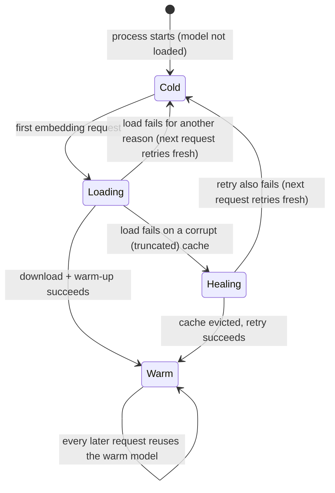

# Embeddings & Indexing — Overview

> The two-step machinery that turns raw text into something searchable: one package pulls clean text out of files and slices it into bite-sized chunks, the other turns any piece of text into a numeric fingerprint of its meaning. Together they are the retrieval substrate under everything Vynel *remembers* and *knows*.
>
> **Status:** shipped · **Depends on:** nothing internal (leaf infrastructure — one external ML model, a handful of file-format libraries) · **Code map:** [structure.md](./structure.md)

## Purpose

This is a **grouping of two leaf packages** that sit at the very bottom of the stack, doing pure transformations and nothing else:

- **Indexing** takes a document — of any of seven everyday formats — and produces clean plain text, then splits long text into overlapping chunks small enough to embed and retrieve precisely.
- **Embedding** takes a string and returns a compact vector: a fixed-length list of numbers that places that text in a "meaning space," so two things that mean the same thing land near each other even when they share no words.

Neither is a product surface — the user never opens an "Indexing" panel. They are **plumbing**: the quiet, shared engine that two product surfaces — [memory](../../memory/overview.md) and [knowledge](../../knowledge/overview.md) — build their search on top of. Memory uses them to make a captured fact findable by meaning and to accept a single imported file. Knowledge uses them to make a whole corpus of documents searchable. The grouping exists because these two steps are one conceptual pipeline (**file → text → chunks → vector**) and because the same two packages serve both consumers identically.

Both packages are deliberately **pure helpers**: they read files and crunch text, but they own no database, no storage, no scheduling, and no decision about *when* any of this runs. That discipline is what lets memory and knowledge share them without stepping on each other.

## What it can do

- **Extract text from a document** in seven formats — markdown, plain text, PDF, Word, HTML, CSV, JSON — resolving the right extractor automatically from the file's extension.
- **Recognize unsupported files** rather than guessing — anything outside the known extensions is reported as unsupported instead of mis-parsed.
- **Split long text into chunks** with a recursive strategy that prefers natural boundaries: it breaks on blank lines first, then single line-breaks, then sentence ends, then spaces, and only hard-cuts mid-word as a last resort. Each chunk carries a small overlap with the one before it, so meaning that straddles a boundary isn't lost, and every chunk records where in the original text it came from.
- **Turn any text into a 384-number vector** — an L2-normalized fingerprint suitable for cosine-similarity search.
- **Stamp every vector with a model version** so a consumer can tell a fingerprint was made by an older model and re-embed it.
- **Point the model's on-disk cache at a stable location** chosen by whichever app boots first, keeping it out of the reinstall-wiped package folder.
- *(background)* **Load the embedding model lazily and once per process** — the first request anywhere triggers the download-and-warm-up; every later request reuses the warm model, and concurrent first-callers all wait on the same single load.
- *(background)* **Self-heal a corrupted model cache** — if a half-finished download left a truncated model file, the next load detects the damage, throws the poisoned copy away, and retries once instead of failing forever.

## Responsibilities

**Owns** — pure, stateless transformations and nothing more: reading a file and returning its clean text (with page or sheet counts where the format offers them); the recursive-character chunker with its overlap and character-offset bookkeeping; the registry that maps a file extension to the right extractor; turning a string into a normalized 384-dimension vector; the lazy, deduplicated, self-healing lifecycle of the single in-process embedding model; the cache-directory hook; and the model-version stamp that flags stale vectors. A deterministic stand-in embedding is also shipped, so consumers can test against a fixed, model-free fingerprint.

**Does not own** —
- **storing or searching the vectors** — the vector index, the keyword index, and hybrid search live in the consumers ([memory](../../memory/overview.md), [knowledge](../../knowledge/overview.md));
- **deciding *when* to embed or re-embed**, and the background tick that fills missing vectors — the consumers and the [local-api](../../_apps/local-api/overview.md) app schedule that;
- **watching folders, tracking which files are indexed, and orchestrating the parse → chunk → embed flow** — that is [knowledge](../../knowledge/overview.md)'s job (this package is explicitly *helpers only*, no orchestration);
- **the file-size and one-shot import rules for memory** — [memory](../../memory/overview.md) owns those and merely calls the parsers;
- **any database, migration, or persisted state** — these packages touch no kernel and hold no tables.

## Concepts & vocabulary

| Term | Meaning |
|---|---|
| **Parser** | A function that reads one file and returns its plain text (plus optional page/sheet counts). One per supported format. |
| **Document kind** | The recognized format of a file — markdown, plain text, PDF, Word, HTML, CSV, JSON — or *unsupported*, derived from its extension. |
| **Registry** | The lookup that hands back the right parser for a document kind, and derives the kind from a path. Adding a format is a deliberate multi-file edit. |
| **Chunk** | A slice of the original text, sized for retrieval, carrying its index, its start/end character offsets in the source, its text (with the previous chunk's tail prepended as overlap), and a rough token estimate. |
| **Overlap** | The tail of the previous chunk repeated at the head of the next, so a sentence spanning a boundary is still findable from either side. |
| **Embedding** | A 384-number, unit-length vector representing a text's meaning; near-identical texts sit close, unrelated texts scatter. |
| **Embedding model** | The local, quantized `all-MiniLM-L6-v2` model (~23 MB) that produces the vectors; runs on CPU, no network after the one-time download. |
| **Model version stamp** | A short label recorded alongside every vector marking which model/pre-processing generation made it, so stale vectors can be spotted and re-embedded. |
| **Cache directory** | The stable on-disk home for the downloaded model, set at app boot, kept outside the package folder that reinstalls wipe. |
| **Fake embedding** | A deterministic, model-free fingerprint used in tests — same input, same vector — with just enough of the real similarity behavior to exercise search without loading the model. |

## Rules & invariants

- **These packages are pure helpers.** They read files and transform text; they import no database, no repositories, and no sibling feature. Every decision about persistence, scheduling, and orchestration belongs to the consumer.
- **The model loads once per process, on first use.** No app pays the load cost at boot; the first embedding request anywhere triggers it, and a single shared load absorbs all concurrent first-callers. A load that fails does not poison future attempts — the next request retries fresh.
- **A corrupt model cache heals itself, once.** A load that fails with the signature of a truncated download evicts the cached model and retries a single time, so an interrupted first download recovers on the next tick rather than failing forever.
- **The cache must be pointed at a stable directory before the first embedding.** Left at its default the model lands inside the reinstall-wiped package folder, where a killed download leaves a poisoned file trusted forever; each app redirects it at boot.
- **Every vector is exactly 384 numbers, unit-normalized.** A result of any other length is rejected as an error rather than stored, keeping the vector index uniform.
- **Every vector carries a model-version stamp.** The stamp only advances when a change makes old vectors incompatible — a new model file with unchanged math does not bump it — so consumers can safely re-embed only what's genuinely stale.
- **Chunking prefers natural boundaries and never silently drops text.** It splits on the largest structural boundary that fits, falls back through smaller ones, and hard-cuts only as a last resort; each chunk keeps the character offsets that tie it back to the source.
- **Unsupported files are named, not mis-parsed.** An unknown extension resolves to no parser rather than a wrong one.

## Lifecycle

The only genuinely stateful thing in this group is the **embedding model's in-process load** — the chunker and parsers are stateless functions with no lifecycle. The model moves like this:

## Where it sits in the bigger picture

This group is the floor of Vynel's retrieval stack — it depends on nothing inside the repo and is depended on by the two surfaces that make Vynel feel like it has a mind. [Memory](../../memory/overview.md) calls the parsers to import a single file as one fact and the embedder to make each fact findable by meaning; [knowledge](../../knowledge/overview.md) drives the full pipeline — parse a document, chunk it, embed every chunk — to make a whole corpus searchable, and owns the orchestration, storage, and file-watching that these helpers deliberately leave out. The background ticks that actually fill missing vectors are scheduled by the [local-api](../../_apps/local-api/overview.md) app. Because both packages are pure and share no state, the same code serves memory and knowledge side by side without conflict — one small, well-tested engine under two product surfaces.

---
*Mapped from the code on disk, 2026-07-14. If you change this module, update this file and [structure.md](./structure.md).*
