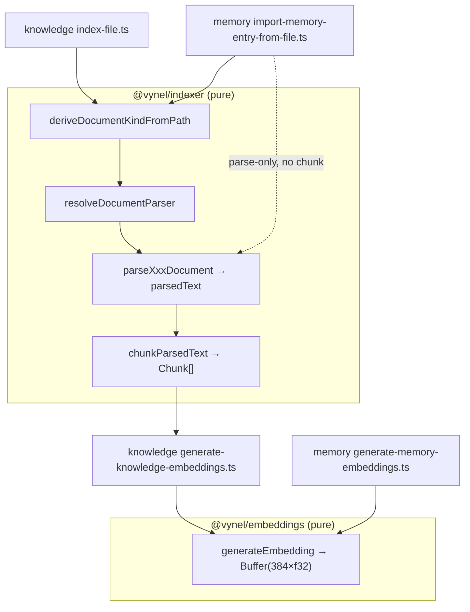
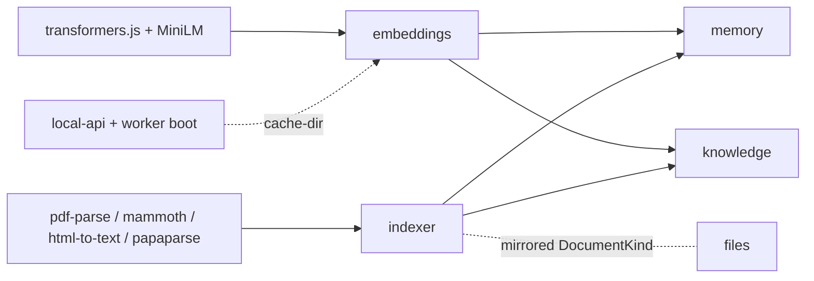

# Embeddings & Indexing — Structure

> The code map and connections for the semantic-search infrastructure group — `@vynel/embeddings` (text → vector) and `@vynel/indexer` (file → parsed text → chunks). For the concepts behind it, see [overview.md](./overview.md).
>
> Folders touched: `packages/embeddings/src/` · `packages/indexer/src/` — consumed by `packages/memory/src/` · `packages/knowledge/src/` · wired at boot in `apps/local-api/src/server.ts` · `apps/worker/src/factory.ts`.

These are **two independent pure-infra leaves**, grouped by role, not by a shared codepath. Neither imports the other — `@vynel/embeddings` depends only on Node + `@huggingface/transformers`; `@vynel/indexer` depends only on Node + parse libraries. They are the shared building blocks of local semantic search: the *consumers* (memory, knowledge) assemble the parse → chunk → embed flow. Both packages hold **pure helpers** — no `@vynel/db`, no repositories, no cross-feature imports (indexer: `parser-types.ts` header, D24; embeddings: single async seam per knowledge decision D23).

## File map

`► ` = the package barrel / entry point.

**`@vynel/embeddings`** — one source file plus a test-support fake.

| Path | Role |
|---|---|
| ► `packages/embeddings/src/index.ts` | the whole module — `generateEmbedding`, `configureEmbeddingsCacheDir`, the lazy cached pipeline singleton + corrupt-cache self-heal, and the `EMBEDDING_DIMENSIONS` / `EMBEDDING_BYTES` / `EMBEDDING_MODEL_VERSION` constants |
| `packages/embeddings/src/test-support/fake-embeddings.ts` | deterministic FNV-1a → LCG → L2-normalized 384-dim fake (`fakeGenerateEmbedding`); exported via the `./test-support` subpath so consumer tests `vi.mock('@vynel/embeddings', …)` without loading the real HF model |

**`@vynel/indexer`** — per-format parsers, the registry, the chunker.

| Path | Role |
|---|---|
| ► `packages/indexer/src/index.ts` | barrel — re-exports `./parsers` + `./chunking/chunk-parsed-text` (the only two public surfaces) |
| `packages/indexer/src/parsers/index.ts` | parsers barrel |
| `packages/indexer/src/parsers/parser-types.ts` | the contract — `DocumentKind` union (7 formats + `unsupported`), `ParseDocumentInput`, `ParseDocumentResult`, `DocumentParser` type |
| `packages/indexer/src/parsers/parser-registry.ts` | `resolveDocumentParser(kind)` (kind → parser fn, `null` for unsupported) + `deriveDocumentKindFromPath(path)` (extension → kind); adding a format is a multi-file edit here |
| `packages/indexer/src/parsers/parse-markdown.ts` | `.md`/`.markdown` — pass-through UTF-8 read (chunker handles structure) |
| `packages/indexer/src/parsers/parse-plain-text.ts` | `.txt` — pass-through UTF-8 read |
| `packages/indexer/src/parsers/parse-pdf.ts` | `.pdf` via `pdf-parse` — text PDFs only; scanned → empty `parsedText` (no error, no OCR); returns `pageCount` |
| `packages/indexer/src/parsers/parse-docx.ts` | `.docx` via `mammoth.extractRawText` — text only (tables/images/headers dropped) |
| `packages/indexer/src/parsers/parse-html.ts` | `.html`/`.htm` via `html-to-text` — strips `<script>`/`<style>`, returns body text |
| `packages/indexer/src/parsers/parse-csv.ts` | `.csv`/`.tsv` via `papaparse` — renders rows as labeled text blocks (`Columns: …` + `k: v; …`) for embedding |
| `packages/indexer/src/parsers/parse-json.ts` | `.json` — well-formed: round-trip pretty-print; malformed: preserve raw so something stays searchable |
| `packages/indexer/src/chunking/chunk-parsed-text.ts` | `chunkParsedText` — recursive-character splitter (paragraph → line → sentence → space → char), 2000-char target / 200-char overlap, `~4 chars/token` estimate |

Test files (`*.test.ts`) sit beside each source file and `__fixtures__/` holds sample docs for the parser tests. No `schema/`, `repositories/`, routes, MCP descriptor, web surface, or owned worker jobs — these leaves are compute-only.

## Exported API

**`@vynel/embeddings`**

| Export | Kind | What it does |
|---|---|---|
| `generateEmbedding(text)` | `async → Buffer` | mean-pooled, L2-normalized 384-dim Float32 as a raw `Buffer` (1536 bytes); loads the model on first call across the whole process |
| `configureEmbeddingsCacheDir(dir)` | `void` | sets transformers.js `env.cacheDir`; **must run at boot before the first `generateEmbedding()`** |
| `EMBEDDING_DIMENSIONS` = `384` | const | vector length |
| `EMBEDDING_BYTES` = `1536` | const | `384 × 4` — the on-disk/BLOB size |
| `EMBEDDING_MODEL_VERSION` = `'all-MiniLM-L6-v2/v1'` | const | written to each embedding row; consumers compare to detect "embedded with a stale model" and re-embed (bump rules in Gotchas) |
| `fakeGenerateEmbedding(text)` *(subpath `./test-support`)* | `async → Buffer` | deterministic fake, same Buffer shape + similarity property, no model load |

`EMBEDDING_MODEL_ID` (`'Xenova/all-MiniLM-L6-v2'`), the `pipelinePromise` singleton, `loadPipeline`/`getEmbeddingPipeline`, and the `isCorruptModelCacheError`/`evictCachedModel` self-heal pair are module-private.

**`@vynel/indexer`**

| Export | Kind | What it does |
|---|---|---|
| `deriveDocumentKindFromPath(relativePath)` | `DocumentKind` | extension → kind; `unsupported` for anything unmapped — also used standalone as a file classifier (not only before parsing) |
| `resolveDocumentParser(kind)` | `DocumentParser \| null` | kind → parser fn; `null` for `unsupported` |
| `parseMarkdown/PlainText/Pdf/Docx/Html/Csv/JsonDocument` | `DocumentParser` | the seven concrete parsers (`ParseDocumentInput → ParseDocumentResult`) |
| `chunkParsedText(input)` | `Chunk[]` | split parsed text into overlapping chunks with char offsets + token estimates |
| `DocumentKind`, `ParseDocumentInput`, `ParseDocumentResult`, `DocumentParser`, `Chunk`, `ChunkParsedTextInput` | types | the parser + chunker contracts |

## Pipeline — where consumers assemble these two leaves

Neither package chains to the other internally. The **parse → chunk → embed** sequence lives in the consumers. The canonical assembly is knowledge's `index-file.ts`; memory does a lighter parse-only variant.

1. **Knowledge, full path** — `packages/knowledge/src/indexing/index-file.ts` imports all three indexer helpers (`deriveDocumentKindFromPath`, `resolveDocumentParser`, `chunkParsedText`): classify the file, resolve + run the parser, chunk the parsed text into rows. Later the worker/service job `packages/knowledge/src/indexing/generate-knowledge-embeddings.ts` (and its worker wrapper `apps/worker/src/jobs/knowledge/generate-knowledge-embeddings.ts`) reads null-embedding chunks and calls `generateEmbedding` + stamps `EMBEDDING_MODEL_VERSION`.
2. **Memory, parse-only path** — `packages/memory/src/lifecycle/import-memory-entry-from-file.ts` uses `deriveDocumentKindFromPath` + `resolveDocumentParser` to ingest one document as a single entry (capped ~20 000 chars, **no** chunking). `packages/memory/src/indexing/generate-memory-embeddings.ts` embeds entries the same way knowledge embeds chunks.
3. **Search, both** — `packages/knowledge/src/queries/search-knowledge.ts` and `packages/memory/src/queries/search-memory-for-agent.ts` call `generateEmbedding` on the query text (outside any DB tx) to produce the query vector, then hand off to their own vec0 search.

The model call always happens **outside** the transaction in every consumer; the lazy singleton in `embeddings/index.ts` means whichever service/worker tick fires first pays the one-time load.

## Connections

**Summary:** both are **pure leaf dependencies** (out-edges only) — imported downward by memory and knowledge, wired at app boot by local-api and worker. They own no tables, publish/consume no outbox events, and expose no HTTP/MCP surface of their own.

| Unit | Direction | Mechanism | What crosses |
|---|---|---|---|
| `@huggingface/transformers` | out (embeddings) | import | `pipeline`, `env` (cache dir), `FeatureExtractionPipeline` — the MiniLM model runtime |
| `pdf-parse` / `mammoth` / `html-to-text` / `papaparse` | out (indexer) | import | per-format parse libraries |
| [memory](../../memory/structure.md) | in | import | `generateEmbedding`, `EMBEDDING_MODEL_VERSION`; `deriveDocumentKindFromPath` + `resolveDocumentParser` (file import — parse only, no chunker) |
| [knowledge](../../knowledge/overview.md) | in | import | `generateEmbedding`, `EMBEDDING_MODEL_VERSION`; **all three** indexer helpers incl. `chunkParsedText`; `deriveDocumentKindFromPath` alone in `path-safety.ts` + `upsert-skipped-document.ts` as a classifier |
| knowledge worker job | in | import | `apps/worker/src/jobs/knowledge/generate-knowledge-embeddings.ts` — first real `generateEmbedding` consumer at runtime (job owned by knowledge/worker, not by these leaves) |
| local-api / worker boot | in | import | `configureEmbeddingsCacheDir` at `apps/local-api/src/server.ts:47` + `apps/worker/src/factory.ts:24` |
| [files](../../files/overview.md) | in (loose) | **mirrored type** | `packages/files/src/files-types.ts` re-declares `DocumentKind` rather than importing it (files must not depend on indexer); `packages/knowledge/src/document-kind-sync.test.ts` guards the two copies from drifting |

**Events published / consumed:** none — neither leaf touches the outbox.

## Config & gotchas

- **Native / model deps are the fresh-machine risk.** Embeddings pulls `@huggingface/transformers` (transformers.js + onnxruntime) and downloads the **~23 MB q8 `all-MiniLM-L6-v2`** model from the HF Hub on first `generateEmbedding()`. Indexer pulls `pdf-parse`, `mammoth`, `html-to-text`, `papaparse`. These are what break when a machine is offline or the install is incomplete — not the pure TS.
- **Model cache MUST live outside `node_modules`.** transformers.js defaults its cache *inside* `node_modules` — wiped by reinstalls, and a process killed mid-first-download leaves a **truncated** model file it then trusts forever (`Protobuf parsing failed` on every load, seen live 2026-07-11). Two defenses in `index.ts`: (1) `configureEmbeddingsCacheDir` points the cache at a stable dir; (2) a load failing with a protobuf-parse error evicts the cached model dir and retries **once**.
- **`VYNEL_EMBEDDINGS_CACHE_DIR`** — Zod env, default `.models/embeddings` (repo-root-resolved, the voice-models `.models/` precedent). `apps/worker/factory.ts` calls `configureEmbeddingsCacheDir` unconditionally; `apps/local-api/server.ts` guards on `!== undefined` — belt-and-suspenders, since the Zod default means it is effectively always set.
- **`EMBEDDING_MODEL_VERSION` is a re-embed contract**, `'all-MiniLM-L6-v2/v1'`. Consumers stamp it on each embedding row and compare to detect stale vectors. **Bump the suffix** only when chunking/pre-processing changes make old vectors incompatible — *not* for a model minor revision where the math is unchanged. (q8 quantization landed 2026-07-11 without a bump: no fp32 vector had ever been generated, so nothing needed invalidating.)
- **A failed model load does not poison future calls** — `pipelinePromise` resets itself to `null` on rejection, so the next tick retries fresh rather than caching the rejected promise.
- **`generateEmbedding` returns a raw `Buffer` view** (`Buffer.from(floats.buffer, byteOffset, byteLength)`), 1536 bytes; consumers store it as the vec0/BLOB embedding. It throws if the model returns anything other than 384 dims.
- **Tests never load the real model** — consumers `vi.mock('@vynel/embeddings', …)` and substitute `fakeGenerateEmbedding` from the `./test-support` subpath (same shape, deterministic, no HF download).
- **Adding a document format is a multi-file edit** — extend the `DocumentKind` union, add a `parse-*.ts`, register it in `PARSERS_BY_DOCUMENT_KIND`, and add the extension case to `deriveDocumentKindFromPath` (all in `parser-registry.ts` + `parser-types.ts`).
- **Scanned PDFs parse to empty text, not an error** — no OCR in Phase 1; the document is marked parsed with zero chunks. Malformed JSON falls back to raw text so it stays searchable.
- **The chunker's overlap is pulled from the RAW previous chunk**, not the already-overlapped result of the prior chunk — otherwise overlap would compound and inflate the budget (see the comment in `mergeWithOverlap`).

---
*Mapped from the code on disk, 2026-07-14. If you change this module, update this file and [overview.md](./overview.md).*
