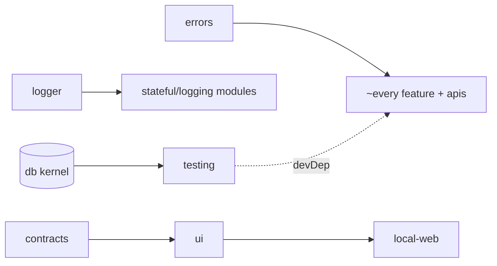

# Platform Primitives — Structure

> The code map and connections for the four foundation packages every other module builds on:
> `@vynel/errors`, `@vynel/logger`, `@vynel/testing`, `@vynel/ui`. For the ideas behind them,
> see [overview.md](./overview.md).
>
> Folders touched: `packages/errors/src/` · `packages/logger/src/` · `packages/testing/src/` · `packages/ui/src/`

These are the bottom of the import graph — the "shared" tier that leaves and the kernel may reach
without forming a cycle. Three are runtime-tiny (errors, logger, testing are a handful of files
each); `@vynel/ui` is the design system. None owns a table, a route, or an MCP tool — so this doc
drops the Data / Repositories / HTTP / MCP / Worker sections and instead gives each package its own
sub-section under the file map.

## File map

► = public entry point (the package's `.` export).

### `@vynel/errors` — the `VynelError` taxonomy

| Path | Role |
|---|---|
| ► `packages/errors/src/index.ts` | the whole package — abstract `VynelError` base + 6 generic HTTP-semantic subclasses; **zero dependencies** |
| `packages/errors/src/index.test.ts` | taxonomy tests (code/httpStatus per subclass, `name` set from the concrete class) |

### `@vynel/logger` — the structural-logging contract

| Path | Role |
|---|---|
| ► `packages/logger/src/index.ts` | the whole package — publishes **only** the `StructuralLogger` type (3 levels: `info`/`warn`/`error`). No test file. |

### `@vynel/testing` — the real-SQLite test harness

| Path | Role |
|---|---|
| ► `packages/testing/src/index.ts` | public barrel — re-exports `withTestDatabase` + `WithTestDatabaseCallback` |
| `packages/testing/src/with-test-database.ts` | the harness — fresh SQLite file under `os.tmpdir()`, runs `@vynel/db`'s SQLite migrations, closes + unlinks on teardown |

### `@vynel/ui` — the shared component library + design tokens

| Path | Role |
|---|---|
| ► `packages/ui/src/index.ts` | public barrel — re-exports 16 components + 2 lib helpers + 4 component prop/state types (re-exports only, no logic) |
| `packages/ui/src/styles/tokens.css` | the design tokens — second export subpath (`./styles/tokens.css`); the one visual contract |
| `packages/ui/src/components/ApprovalCard.vue` | **the trust primitive** — the inline approval card on every irreversible action |
| `packages/ui/src/components/ChatComposer.vue` | THE chat input for every surface — multiline draft, model + mode pickers; exports `ComposerOption` |
| `packages/ui/src/components/MessageRow.vue` | one message row; author line derives from `sourceKind` (who wrote it) |
| `packages/ui/src/components/ToolCallCard.vue` | one card per tool the assistant runs, presented Claude-Code-style |
| `packages/ui/src/components/ToolCallList.vue` | a message's tool activity — consecutive same-tool runs collapse into one group |
| `packages/ui/src/components/ToolCallDetail.vue` | the expanded half of a tool card (path header + body). **Internal — NOT exported** (a `ToolCallCard` child) |
| `packages/ui/src/components/MarkdownText.vue` | one markdown renderer for every surface (assistant messages, file preview) — markdown-it + DOMPurify |
| `packages/ui/src/components/CodeBlock.vue` | syntax-highlighted code block (shiki) |
| `packages/ui/src/components/ThinkingBlock.vue` | collapsible reasoning trace, open while streaming |
| `packages/ui/src/components/ClaudeMark.vue` | the assistant's identity glyph — Claude's coral starburst spark (identity only) |
| `packages/ui/src/components/PresenceDot.vue` | the signature mark — gold = the assistant is alive here |
| `packages/ui/src/components/VoiceOrb.vue` | the assistant’s presence orb — 6 states, pure CSS; exports `VoiceOrbState` |
| `packages/ui/src/components/AttachmentChips.vue` | the "what rode along" strip on a sent message — one chip per attachment |
| `packages/ui/src/components/SegmentedTabs.vue` | segmented tab control; exports `SegmentedTab` |
| `packages/ui/src/components/SelectChip.vue` | compact inline selector (model/mode picker); exports `SelectChipOption` |
| `packages/ui/src/components/IconButton.vue` | chrome-level icon button (titlebar, panel headers) |
| `packages/ui/src/components/EmptyState.vue` | empty-screen invitation — title + call to act |
| `packages/ui/src/lib/workspace-color.ts` | stable per-workspace accent by name-hash (djb2) → `var(--ws-N)`; exports `workspaceAccentVar` |
| `packages/ui/src/lib/workspace-monogram.ts` | a workspace's two-letter mark, derived not stored ("vynel" → "VY"); exports `workspaceMonogram` |
| `packages/ui/src/lib/shiki-highlighter.ts` | one lazily-loaded shiki highlighter shared by `CodeBlock` + markdown fences. **Internal — not exported** |
| `packages/ui/src/tool-cards/tool-presenters.ts` | pure presentation logic — a raw `{toolName,toolInput,toolOutput}` → verb/argument/body. **Internal** |
| `packages/ui/src/tool-cards/group-tool-calls.ts` | groups consecutive same-tool calls into runs. **Internal** |
| *tests* | `ApprovalCard` · `ChatComposer` · `CodeBlock` · `MarkdownText` · `MessageRow` · `PresenceDot` · `SegmentedTabs` · `ToolCallCard` · `VoiceOrb` · `workspace-color` · `workspace-monogram` · `tool-presenters` |

## `@vynel/errors` — the taxonomy

One abstract base + six generic subclasses. Per `.claude/rules/error-handling.md`
("one base + small generic set"), **per-domain `<Domain>NotFoundError` wrappers are forbidden** —
every domain throws these directly.

| Class | `code` | `httpStatus` | Notes |
|---|---|---|---|
| `VynelError` (abstract) | — | — | base; `code` + `httpStatus` are abstract readonly; ctor sets `name` from `new.target.name` |
| `NotFoundError` | `not_found` | 404 | ctor `(resource, id?)` — builds the message; carries `resource` + `id` |
| `ConflictError` | `conflict` | 409 | |
| `ValidationError` | `validation_failed` | 400 | |
| `UnauthorizedError` | `unauthorized` | 401 | |
| `ForbiddenError` | `forbidden` | 403 | |
| `RateLimitedError` | `rate_limited` | 429 | |

**The class IS the response shape.** `apps/local-api/src/app.ts`'s `onError` has a single
`instanceof VynelError` branch that reads `httpStatus` + `code` off the class (per the header
comment in `index.ts`). Being dependency-free is deliberate: it lets both `@vynel/core` and
`@vynel/providers` import the taxonomy without a `core ↔ providers` workspace cycle.

## `@vynel/logger` — the contract, not (yet) the runtime

Phase 1 publishes **only the `StructuralLogger` type** — `info`/`warn`/`error`, each
`(payload: object, message?: string) => void`. Core ops, workers, and shared code accept this
shape; apps wire a real pino instance at the boundary and inject it. `pino` is declared as a
runtime dependency (`packages/logger/package.json`) so a future `makeLogger` factory /
OpenTelemetry wiring / log-level config lands here without churn at consumers — but **no pino
runtime code exists in this package yet** (type-only import, erases to nothing). Three levels
because that's all the core layer needs; pino's full set is available where it's instantiated.

## `@vynel/testing` — real DB, never mocked

`withTestDatabase<T>(callback)` (`with-test-database.ts`) is the one cross-package test harness:

| Step | Call |
|---|---|
| fresh temp dir | `mkdtempSync(join(tmpdir(), 'vynel-test-'))` |
| open SQLite | `createSqliteDatabase({ dialect: 'sqlite', path: <tempDir>/test.db })` (from `@vynel/db`) |
| migrate | `runMigrations(db, { migrationsFolder })` — folder resolved relative to this file at `../../db/src/migrations-sqlite` |
| run + teardown | `await callback(db)` inside `try`; `finally` → `closeDatabase(db)` + `rmSync(tempDir, …)` |

This upholds the project gate's **"never mock the DB"** rule (`CLAUDE.md` Testing). Note the
deliberate split: `@vynel/db` has its **own** local `packages/db/src/test-support/with-test-database.ts`
for its tests, to avoid the `db ↔ testing` workspace cycle; **every other package uses this one.**
No fakes/factories ship yet — the barrel exports only the harness + its callback type.

## `@vynel/ui` — components, tokens, helpers

**Export surface** (`index.ts`): 16 default component exports + `workspaceAccentVar` +
`workspaceMonogram` + 4 type exports (`ComposerOption`, `SegmentedTab`, `SelectChipOption`,
`VoiceOrbState`). The `tool-cards/` presenters, `group-tool-calls`, `shiki-highlighter`, and
`ToolCallDetail.vue` are **internal** — reached only through `ToolCallCard` / `ToolCallList`, never
re-exported. Deps: `@vynel/contracts` (tool-call row types), `dompurify`, `markdown-it`, `shiki`;
`vue` is a **peer** dependency.

**Design tokens** (`styles/tokens.css`, second export subpath). Dark is the default theme;
`[data-theme='light']` overrides every var. The load-bearing rules encoded here:

- **Gold (`--gold*`) is presence-only** — assistant is running / streaming / awaiting approval.
  Nothing else may use it. Enforced by convention across every surface.
- **`--claude-mark` (coral `#d97757`) is identity-only** — the `ClaudeMark` glyph; presence stays gold.
- **Surfaces** ladder shell < panel < raised; **ink** ladder `--ink-1..3`; hairlines, status
  (`--ok`/`--danger`/`--info`), file-type colors, radii, fonts (Segoe UI Variable), elevation, motion.
- **`--ws-1..6`** workspace-accent palette, deliberately off amber/orange (gold stays reserved);
  assigned by name-hash in `lib/workspace-color.ts`, so it needs no stored column.

**Coupling to watch** (`lib/workspace-color.ts`): `sourceLabel` is **persona-first** —
`@vynel/chat`'s `composeManagerSourceLabel` yields `"<manager> · <workspace>"`, so the workspace
name is the **LAST** `" · "` segment. `normalizeWorkspaceName` splits on that and takes `.at(-1)`.
If the label format changes, this normalizer must change with it.

## Connections

**Summary:** all four are pure **leaf/shared** packages — imported downward by nearly everything,
importing almost nothing themselves. No outbox events, no routes, no MCP. `errors` and `logger`
have **zero `@vynel/*` deps**; `testing` depends only on `@vynel/db`; `ui` depends only on
`@vynel/contracts` (+ third-party render libs).

| Package | Depends on | Imported by (count) | Reach |
|---|---|---|---|
| `@vynel/errors` | *nothing* | **~23** packages + `apps/{local,cloud}-api` | ubiquitous — nearly every feature throws its subclasses |
| `@vynel/logger` | *nothing* (pino declared, type-only in use) | **~13** — accounts, agents, approvals, chat, core, hub-account, knowledge, memory, orchestration, session, skills, desktop-control, `apps/cloud-api` | wide (stateful/logging modules) |
| `@vynel/testing` | `@vynel/db` | **~20** — as a **devDependency**; agents, approvals, capabilities, channels, chat, core, files, instructions, knowledge, marketplace, memory, onboarding, orchestration, provider-preferences, schedules, session, skills, workspaces, `apps/{local-api,worker}` | ubiquitous in tests only |
| `@vynel/ui` | `@vynel/contracts` (+ dompurify, markdown-it, shiki, vue peer) | **1** — `apps/local-web` only (the desktop web view; cloud web view later) | single consumer today |

**Events published/consumed:** none — none of these packages touch the outbox.

## Config & gotchas

- **`@vynel/errors` must stay dependency-free.** Its whole reason to exist as a separate leaf is to
  break the `core ↔ providers` cycle. Adding any `@vynel/*` import defeats that.
- **`@vynel/logger` ships a type, not a runtime.** pino is a declared dep with no code path yet —
  don't assume importing the package gives you a logger; apps construct one and inject it.
- **`@vynel/testing` migrates via a path relative to its own file** (`../../db/src/migrations-sqlite`);
  it only knows SQLite (Phase 1). Testcontainers Postgres is the Phase-2 extension. `@vynel/db`
  can't use this harness — it has its own local copy to avoid the workspace cycle.
- **`@vynel/ui` internals are not exported** — `ToolCallDetail.vue`, `shiki-highlighter.ts`,
  `tool-cards/*.ts` are reached only through the exported cards. Import the card, not the child.
- **The gold rule is a contract, not a comment.** `--gold*` = assistant presence only; `--claude-mark`
  = identity only; `--ws-*` never uses amber/orange. New UI must respect it.
- **`shiki` loads lazily** (dynamic import) so its grammar payload code-splits out of the shell
  bundle — code renders as plain text until the highlighter resolves (content first, colors when ready).
- **`vue` is a peer dep of `@vynel/ui`** — the consuming app owns the single Vue instance.

---
*Mapped from the code on disk, 2026-07-14. If you change this module, update this file and [overview.md](./overview.md).*
