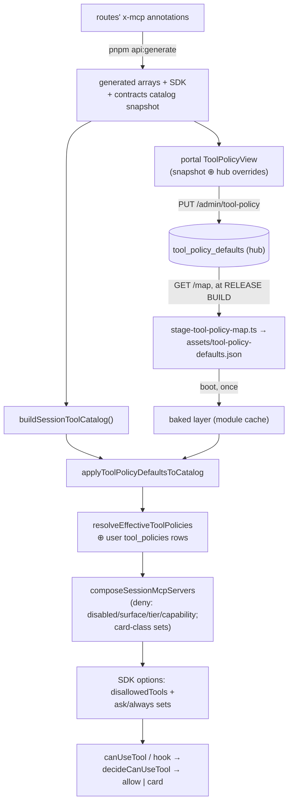

# Tool Policy — Structure

> The code map and connections for the tool-policy platform concern. For the concepts behind
> it, see [overview.md](./overview.md).
>
> Folders touched: `packages/contracts/src/tool-policy/` · `packages/capabilities/src/{schema,repositories,tool-policy}/` ·
> `apps/local-api/src/{sessions,routes/tool-policies}/` · `packages/providers/src/claude/approvals/` ·
> `apps/mcp/src/` · `packages/registry/src/` · `apps/cloud-api/src/routes/` ·
> `apps/cloud-admin-web/src/` · `apps/local-web/src/` · `scripts/src/{generators,release}/`

Tool policy is a **platform concern spanning both systems**, not a leaf: the vocabulary and the
generated catalog snapshot live in `@vynel/contracts` so the product engine, the hub, and the
portal all read one truth; the per-user store lives in the `@vynel/capabilities` leaf; the
operator store lives in the hub's `@vynel/registry` leaf.

## File map

**Shared vocabulary + snapshot (`@vynel/contracts`)**

| Path | Role |
|---|---|
| `packages/contracts/src/tool-policy/catalog.ts` | the unions (`SESSION_SURFACE_KINDS` 9-kind, `TOOL_CARD_CLASSES`) + zod enums + `ToolCatalogEntry` (incl. optional `defaultEnabled` set only by the baked layer) |
| `packages/contracts/src/tool-policy/defaults.ts` | wire schemas for operator defaults: `ToolPolicyDefaultFieldsSchema` (nullable-inherit), `ToolPolicyDefaultSchema`, `ToolPolicyMapExportSchema` (`version` = sha256 hex, `generatedAt`, `defaults`) |
| ► `packages/contracts/src/generated/tool-catalog-snapshot.ts` | **GENERATED** — all 128 declared entries, sorted (serverName, toolName) by codepoint; prettier/eslint-ignored via `src/generated/` globs |

**Product engine — per-user layer (`@vynel/capabilities` + `apps/local-api`)**

| Path | Role |
|---|---|
| `packages/capabilities/src/schema/tool-policies.ts` | the `tool_policies` table (leaf-owned; user-scoped overrides, every policy column nullable) |
| `packages/capabilities/src/repositories/tool-policies.ts` | functional repo (`listToolPolicies` / `findToolPolicy` + writes) |
| `packages/capabilities/src/tool-policy/tool-policy-types.ts` | re-exports the contracts vocabulary + `EffectiveToolPolicy` / `EffectiveToolPolicies` |
| `packages/capabilities/src/tool-policy/resolve-effective-tool-policies.ts` | catalog ⊕ user overrides → the per-tool effective map; exports `TOOL_POLICY_UNGATED` (`'none'`) + `filterKnownSurfaceKinds` |
| `packages/capabilities/src/tool-policy/apply-tool-policy-defaults.ts` | the BAKED layer: pure catalog transform (null inherits, `'none'` ungates, `enabled` → `defaultEnabled`, unknown tools inert) |
| `packages/capabilities/src/tool-policy/set-tool-policy-override.ts` | full-replace upsert; all-null save normalizes to delete; co-commits the outbox event in one tx |
| `packages/capabilities/src/tool-policy/tool-policy-events.ts` | `TOOL_POLICY_UPDATED` event name + payload |
| ► `apps/local-api/src/sessions/session-tool-catalog.ts` | `SURFACE_DESCRIPTOR_SETS` (surface → server read model) + `buildSessionToolCatalog()` (assembles all entries, pre-merges duplicate-name surfaces) + `resolveSessionToolPolicies()` (applies the baked layer internally — zero call-site threading) |
| `apps/local-api/src/sessions/baked-tool-policy-defaults.ts` | boot-primed module cache of the shipped map (missing = info, mangled = warn + code defaults); `resetBakedToolPolicyDefaultsForTest` |
| `apps/local-api/src/sessions/enabled-feature-keys.ts` | per-composition entitlement read → the tier feature-key set (fail-open on null) |
| `apps/local-api/src/sessions/compose-session-mcp-servers.ts` | the enforcement point: denies disabled / surface-excluded / tier-gated / capability-gated tools into `deniedMcpToolPatterns`; card-class overrides strip-then-re-add the ask/always sets |
| `apps/local-api/src/routes/tool-policies/index.ts` | user-scoped routes GET `/` · PUT `/:toolName` · DELETE `/:toolName` — **x-mcp OFF by doctrine** (an agent must never edit its own gates; an OpenAPI guard test pins it) |
| `apps/local-api/src/routes/tool-policies/schemas.ts` | zod boundary (full-replace body; toolName regex; vocabulary enums) |
| `packages/providers/src/claude/approvals/tool-approval-policy.ts` | the mode × card-class decision table `decideCanUseTool` + `requiresApprovalCardBackstop` — the ONE home the permission callback and the PreToolUse hook both consult |
| `apps/mcp/src/vynel-tool-gates.ts` | the generated gate arrays re-derived (surface membership, tier/capability maps, curated ask tier), exported via the `@vynel/mcp/tool-gates` subpath |
| `apps/mcp/src/external-mcp-server.ts` | the external `vynel-mcp` bin's startup filter: best-effort GET of `/tool-policies` skips admin-disabled tools (3s timeout, fail-open + stderr line) |

**Hub — operator layer (`@vynel/registry` + `apps/cloud-api`)**

| Path | Role |
|---|---|
| `packages/registry/src/schema/tool-policy-defaults.ts` | the `tool_policy_defaults` table (global, `toolName` PK, nullable-inherit) |
| `packages/registry/src/repositories/tool-policy-defaults-repository.ts` | functional repo: list (toolName-sorted) / upsert / delete |
| `packages/registry/src/tool-policy-defaults.ts` | the core: snapshot-validated `setToolPolicyDefault` (reset allowed for stale tools; surfaces canonicalized to declared order), `resolveToolPolicyMapExport` (sha256 content-hash version, collation-independent JS sort) |
| ► `apps/cloud-api/src/routes/admin-tool-policy.ts` | GET `/` · GET `/map` · PUT `/:toolName` · DELETE `/:toolName`; mounted INSIDE `buildAdminRoutes` at `/tool-policy` so the parent chain's `requireAdminAccess` is the single gate |

**Editing surfaces**

| Path | Role |
|---|---|
| `apps/cloud-admin-web/src/views/ToolPolicyView.vue` | the operator matrix at `/tool-policy` (snapshot ⊕ hub overrides, map version stamp, name filter) |
| `apps/cloud-admin-web/src/components/tool-policy/` | `ToolPolicyEditForm.vue` (tri-state inherit editor showing declared defaults) + `effective-tool-policy.ts` (display overlay helpers) |
| `apps/cloud-admin-web/src/composables/tool-policy/` | vue-query keys + list/map queries + save/reset mutations |
| `apps/local-web/src/components/sections/ToolPolicySection.vue` + `sections/tool-policy/` | the user's Tool access panel (toolkit group, shield icon) + capability toggles panel |
| `apps/local-web/src/composables/tool-policies/` | TanStack composables over the product routes |

**Generation + release**

| Path | Role |
|---|---|
| `scripts/src/generators/generate-tool-catalog.ts` | emits the contracts snapshot from `buildSessionToolCatalog` + the desktop descriptor's declared names; last step of `pnpm api:generate` |
| `scripts/src/generators/check-tool-catalog-parity.ts` | gate guard (snapshot/restore diff, the `check-mcp-parity` pattern) — wired into `pnpm test:parity` |
| `scripts/src/release/stage-tool-policy-map.ts` | the BAKE: downloads `/admin/tool-policy/map` into `backend/assets/tool-policy-defaults.json`; both env vars or neither; fail the build on half-config or non-OK |

## Data & persistence

**`tool_policies`** (product SQLite, leaf-owned in capabilities; migration
`packages/db/src/migrations-sqlite/0040_tool_policies.sql`): `id` PK · `userId` FK→users
cascade · `toolName` text · `enabled` bool NULL · `cardClass` text NULL · `surfacesJson` json
NULL · `featureKey` text NULL · `capabilityId` text NULL · timestamps. Unique
`(userId, toolName)`. NULL = inherit; `'none'` on the gate columns = ungate; a row exists only
while at least one override does.

**`tool_policy_defaults`** (hub Postgres, registry-owned; migration
`packages/cloud-db/migrations-postgres/0007_tool_policy_defaults.sql`): `toolName` text PK ·
the same five nullable override columns · timestamptz pair. Global — no account scoping.

Loose refs only: `toolName` strings key everything; no FK crosses a module or a system.

## Core operations

| Operation | What it does | Key calls |
|---|---|---|
| `setToolPolicyOverride` (capabilities) | full-replace user override; all-null → delete | one `db.transaction` co-committing `TOOL_POLICY_UPDATED` |
| `resolveEffectiveToolPolicies` (capabilities) | catalog ⊕ overrides → per-tool map; `enabled = override ?? defaultEnabled ?? true`; unknown-tool rows ignored | `listToolPolicies` |
| `applyToolPolicyDefaultsToCatalog` (capabilities) | the baked middle layer as a pure catalog transform | — |
| `resolveSessionToolPolicies` (local-api) | the one turn-facing read: `resolveEffectiveToolPolicies(db, { catalog: apply(build(), baked()) })` | `bakedToolPolicyDefaults()` |
| `setToolPolicyDefault` (registry) | operator default; validates toolName/featureKey/capabilityId against the snapshot; reset-first so stale rows stay deletable; surfaces canonicalized | repo upsert/delete (hub has no outbox) |
| `resolveToolPolicyMapExport` (registry) | the downloadable map; `version` = sha256 of canonical defaults JSON | codepoint re-sort in JS |
| `decideCanUseTool` (providers) | mode × card-class → `'allow' | 'card'` per call; ask-mode map-allow scoped to composed server names so external settings-loaded servers keep carding | consulted by `canUseTool` + the PreToolUse hook |

## HTTP surface

| System | Mount | Routes | Notes |
|---|---|---|---|
| product | `/tool-policies` (`apps/local-api/src/app.ts`) | GET `/` · PUT `/:toolName` · DELETE `/:toolName` | userScoped; **no x-mcp**, guard-tested |
| hub | `/admin/tool-policy` (inside `buildAdminRoutes`) | GET `/` · GET `/map` · PUT `/:toolName` · DELETE `/:toolName` | dual-door admin gate; `/map` is what release builds download |

## Pipeline — a policy value's life

1. A route (or descriptor inventory) declares a tool → `pnpm api:generate` re-emits the
   registry, the SDK, and `packages/contracts/src/generated/tool-catalog-snapshot.ts`;
   `check-tool-catalog-parity.ts` fails the gate on drift.
2. The operator edits in `apps/cloud-admin-web/src/views/ToolPolicyView.vue` → hub rows in
   `tool_policy_defaults` via `packages/registry/src/tool-policy-defaults.ts`.
3. A release build runs `scripts/src/release/stage-tool-policy-map.ts` — the map JSON lands in
   the payload's `backend/assets/`.
4. Engine boot primes `apps/local-api/src/sessions/baked-tool-policy-defaults.ts` from
   `VYNEL_ASSETS_DIR` (`apps/local-api/src/boot.ts`).
5. Every turn site calls `resolveSessionToolPolicies` and hands the map + its `surfaceKind` to
   `compose-session-mcp-servers.ts`; denials become the SDK's `disallowedTools` (invisible),
   card classes become the ask/always sets.
6. Each actual tool call reaches `packages/providers/src/claude/approvals/tool-approval-policy.ts`
   — `never` resolves-allow, `ask`/`always` enter the [approvals](../../approvals/structure.md)
   card flow per mode.

## Connections

**Summary:** a platform concern with one small event-side edge — the product store publishes
one outbox event; everything else is imports down and loose `toolName` strings across.

| Unit | Direction | Mechanism | What crosses |
|---|---|---|---|
| contracts | out (both systems) | import | unions, wire schemas, the generated snapshot |
| [capabilities](../../capabilities/structure.md) | host | leaf owns store + resolver | `tool_policies`, effective resolution |
| [mcp shell](../../_apps/mcp/structure.md) | out | `@vynel/mcp/tool-gates` subpath | generated surface/gate arrays feeding the catalog |
| local-api sessions | host | import | catalog assembly, baked layer, composition enforcement |
| [providers](../../providers/structure.md) | in | composed sets in SDK options | ask/always sets + denials; `decideCanUseTool` |
| [approvals](../../approvals/structure.md) | out | card flow | calls the policy classified as carding |
| [registry](../../registry/structure.md) (hub) | host | leaf owns operator store | `tool_policy_defaults`, `/map` export |
| cloud-admin-web | in | HTTP + snapshot import | the operator matrix |
| local-web | in | HTTP | the Tool access panel |
| release scripts | in | HTTP at build time | the bake |

**Events published:** `TOOL_POLICY_UPDATED` (product side, co-committed in the override tx).
**Events consumed:** none. The hub side publishes nothing (no outbox there).

## Config & gotchas

- **Env:** the bake reads `VYNEL_HUB_URL` + `CLOUD_ADMIN_TOKEN` (both or neither — half-set
  fails the build; a hub-configured desktop release therefore REQUIRES the token in the
  release env). The engine reads only `VYNEL_ASSETS_DIR` (already present for migrations).
- **New tools are automatic** — never hand-edit the snapshot or the gate arrays; annotate the
  route / descriptor and run `pnpm api:generate`. Generated files live under `src/generated/`
  so `pnpm format` can't corrupt them.
- **`vi.mock('@vynel/capabilities')` stubs** exist in local-api tests — widening the
  capabilities barrel breaks them at test-runtime, not typecheck (bitten twice; grep for the
  mocks when adding exports).
- **The snapshot is the hub's validation universe** — feature keys / capability ids not
  appearing anywhere in it are rejected on write (plus `'none'`).
- **Deliberate asymmetries:** entitlement fail-open (Phase 1) vs build fail-loud vs boot
  fail-soft; per-user store has an outbox event, the hub store does not.
- **Known deferrals** (full list in `docs/module-notes/tool-policy.md`): origin display
  (code/shipped/yours) in the local panel; local-web's hand-pinned kinds mirror →
  contracts import; SDK-builder-free tool-gates via a names-only generator emission.
- **Drift notes:** `.claude/docs/_apps/mcp/structure.md` and
  `.claude/docs/capabilities/structure.md` carry banners — their permission-plumbing sections
  predate this concern; this file + the module notes are current.

---
*Mapped from the code on disk, 2026-08-14. If you change this module, update this file and [overview.md](./overview.md).*
