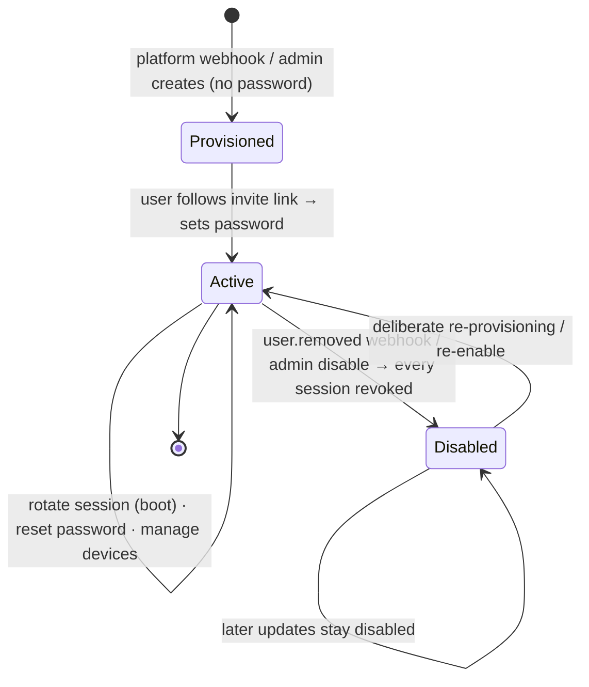

# Accounts — Overview

> The hub's identity core: it provisions cloud accounts, proves who someone is at sign-in, keeps a "log in once" session alive across devices, and mints the signed tokens that tell the desktop what a person is allowed to do.
>
> **Status:** shipped · **Depends on:** [cloud-db](../cloud-db/overview.md) (Postgres kernel), [contracts](../contracts/overview.md) (hub entitlement vocabulary), errors, logger · **Code map:** [structure.md](./structure.md)

## Purpose

Accounts is the trust root of Vynel's **cloud side**. It runs inside the hub — the small server that fronts a shared Postgres database — and it answers three questions for every other cloud surface: *who is this person, is their session still good, and what tier of the product have they paid for.* The desktop app never talks to this package directly; it talks to the hub's HTTP layer, which leans on this package for all of its identity logic.

The signature design choice is a **two-token split**. Signing in yields a short-lived, cryptographically signed **access token** that any surface can verify offline with a public key, plus a long-lived **refresh token** that stands for one device and quietly renews the access token in the background. That split is what lets a non-technical user "log in once" on their laptop and simply stay logged in — while the hub keeps the power to cut any device off the moment an account is disabled.

The second deliberate choice is that **accounts are never self-serve**. Nobody signs up here. Every account is *provisioned* — created either by a webhook from the upstream billing/identity platform, or by an admin as a fallback — and the new user is emailed a link to set their own password. This package is the plumbing behind a trustworthy, invite-only cloud, not a public registration form.

## What it can do

- **Sign a user in** with email + password, returning the two-token pair plus a signed entitlement proof — under strict anti-enumeration discipline (one generic "wrong email or password", and constant response timing whether or not the email exists).
- **Keep a session alive** by rotating the refresh token: the desktop presents its token on boot, a healthy account gets a fresh access token and a renewed refresh token, and a revoked or disabled account gets its whole session torn down.
- **List a person's devices** and **revoke any one of them**, and **sign out** the device currently holding a token.
- **Set or reset a password through an emailed link** — an invite link after provisioning, or a "forgot password" reset — where the user proves control of their inbox and, on success, every existing session is killed.
- **Provision an account** (admin fallback path) and email its set-password invite as part of creation.
- **Apply an upstream platform event** — user created / updated / removed, or tier changed — idempotently, so a retrying webhook never breaks.
- **Grant or revoke the admin role**, and **override an account's tier** from the admin portal when the platform isn't wired.
- **Answer "what is this caller's live tier / role right now"** — read fresh from the database, never trusted from the (up-to-a-week-stale) token.
- **Issue and verify the access token**, and **issue the entitlement token** that encodes tier and feature flags.

## Responsibilities

**Owns** — everything about proving and managing hub identity that is *not* the raw account row: password hashing and verification, the whole sign-in flow with its anti-enumeration timing defence, the refresh-token session mechanism (families, rotation, reuse detection, expiry) and the two tables behind it — refresh tokens and single-use email-link tokens; the devices surface (list / revoke / sign-out); the set-password link lifecycle for both invite and reset; account provisioning and the idempotent application of platform webhook events; the enable/disable rule and its session teardown; role and tier assignment plus their *live* resolution; and the minting of both signed tokens (access + entitlement) and the verification of the access token.

**Does not own** —
- the **account record itself** — email, display name, password hash, status, role, tier, expiry, and the platform-join key all live in the shared kernel and are read/written through its repositories ([cloud-db](../cloud-db/overview.md));
- the **HTTP routes, auth middleware, and static admin-token door** that expose all of this over the wire — the hub app ([cloud-api](../_apps/cloud-api/overview.md));
- **verifying the entitlement token** — that half lives on the desktop leaf that pins the public key ([hub-account](../hub-account/overview.md)); issue and verify are deliberately different systems with different key material;
- the **tier → feature catalog** and the definition of the tier vocabulary itself ([contracts](../contracts/overview.md));
- **sending real email** — a production provider implements the mail seam at deploy time; this package ships only a dev-only logging stub.

## Concepts & vocabulary

| Term | Meaning |
|---|---|
| **Account** | One cloud identity. Its record (email, display name, password hash, status, role, tier, tier-expiry, platform id) lives in the kernel; this package operates on it. |
| **Access token** | A short-lived signed JWT (EdDSA / Ed25519) proving *who* you are. Verifiable offline with the public key. |
| **Entitlement token** | A ~7-day signed JWT proving *what tier and features* you have. The ~7 days **are** the offline grace window. Carries identity too, so an offline boot can still show who's signed in. |
| **Refresh token** | A long-lived opaque secret standing for one device. Sliding ~1-year window, re-stamped on each rotation — the "log in once" half of the split. |
| **Token family / Device** | A device is a *family* of refresh tokens: sign-in opens a family, each rotation revokes the old token and issues a new one in the same family. Revoking a device kills the family. |
| **Reuse detection** | Presenting an already-revoked refresh token signals a stolen, replayed secret — so the entire family is killed rather than forked. |
| **Set-password link** | A single-use, emailed link. Two kinds: **invite** (after provisioning, ~7-day TTL) and **password-reset** (~30-minute TTL). One live link per kind per account. |
| **Provisioning** | Account creation. Never self-serve — driven by a platform webhook or an admin fallback, followed by an invite link. |
| **Platform event** | An upstream webhook (`user.created` / `updated` / `removed` / `tier.updated`) whose contract *Vynel* authors; applied idempotently, joined by the platform's user id. |
| **Tier** | The product level — `basic` or `pro` — with an optional expiry. A lapsed or unknown tier resolves to `basic`. |
| **Role** | `member` or `admin`. Admin unlocks the management portal; authority is always read live, never from a token. |
| **Status** | `active` or `disabled`. Disabling revokes every session; the row survives for audit and possible re-grant. |
| **Opaque secret** | A random 256-bit secret (refresh tokens, link tokens). Stored only as a fast unsalted SHA-256 digest — passwords, by contrast, use slow argon2id. |
| **Anti-enumeration** | The discipline that outside callers can't learn which emails have accounts — generic errors, flat sign-in timing, silent "forgot password". |

## Rules & invariants

- **Accounts are never self-serve.** Every account is provisioned by the platform webhook or an admin; the person then sets their own password through an emailed link. The platform never sends us a password.
- **Two tokens, two jobs.** A short signed access JWT proves identity offline; a long sliding refresh token is the device's "stay logged in" credential. They rotate independently.
- **Authority is always read live.** A caller's tier and role are resolved fresh from the account row on every request — never taken from the up-to-a-week-old token — so a downgrade, demotion, or disable takes effect on the next request, not at token expiry.
- **Status is checked only after password proof.** "This account is disabled" is not a secret from its owner, but it must not be probeable by someone typing random passwords, so the disabled signal comes only once the password is verified.
- **Anti-enumeration is enforced end to end.** Wrong-email and wrong-password return one identical error; a real hash verify runs even when no account exists so timing stays flat; "forgot password" for an unknown email resolves silently.
- **A device is a token family, and rotation is atomic.** Each rotation revokes exactly the presented token and inserts its successor in one transaction; if the revoke claims zero rows (a concurrent rotation already consumed it) or a revoked token is replayed, the whole family dies.
- **Any credential change or account teardown kills every session.** Setting a password, disabling an account, and a `user.removed` event all revoke every refresh token for that account, locking the desktop back to sign-in.
- **The entitlement never grants more than the hub can currently vouch for.** A lapsed term or an unrecognised tier string is stamped down to `basic` at issue time.
- **Set-password links are single-use and short-lived.** One outstanding link per kind per account; re-requesting expires the previous one; consuming a link burns it inside the same transaction that sets the password.
- **Platform events are idempotent.** A replayed `user.created` for a known id converges to an update instead of a 409; a `user.removed` account stays disabled even if later updated, until a deliberate re-provisioning.
- **Passwords use argon2id at the OWASP minimum; opaque secrets use SHA-256.** Slow salted hashing for user passwords; a fast unsalted digest for high-entropy random secrets that need O(1) lookup.
- **Two owned tables, one shared kernel.** This package owns only the refresh-token and email-link-token tables; the account row lives in the shared cloud database. This is a *cloud-side* leaf over Postgres — not the desktop's kernel, and it does not use the desktop's outbox pattern.

## Lifecycle

The central concept is the **account**, which moves through provisioning, an active life, and possible disablement:

Underneath, each signed-in device runs its own smaller machine: a refresh token is **issued** at sign-in, **rotated** (old revoked, successor issued in the same family) on every boot, and **revoked** by sign-out, device revocation, a killed family, a credential change, or account disable — with a replayed revoked token collapsing the whole family as a theft signal.

## Where it sits in the bigger picture

Accounts is the identity foundation the rest of the hub stands on. The [cloud-api](../_apps/cloud-api/overview.md) app is its only caller: it wires the routes, the auth middleware, and the static admin-token bootstrap door, and hands every request down to this package. It reads and writes the account row through the [cloud-db](../cloud-db/overview.md) kernel and borrows the tier/feature vocabulary from [contracts](../contracts/overview.md). The tokens it mints flow out to the desktop, where the [hub-account](../hub-account/overview.md) leaf pins the public key and verifies the entitlement token offline — the far end of a split that lets a laptop stay signed in for a week without the network while the hub keeps the last word on who's still allowed in. Set against the desktop's own [db](../db/overview.md)-backed features, Accounts is a different world: a separate Postgres kernel, a separate app, invite-only identity rather than local memory.

---
*Mapped from the code on disk, 2026-07-14. If you change this module, update this file and [structure.md](./structure.md).*
