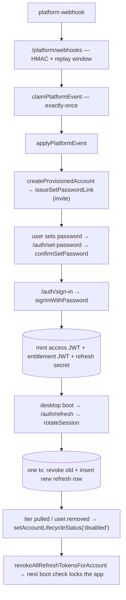
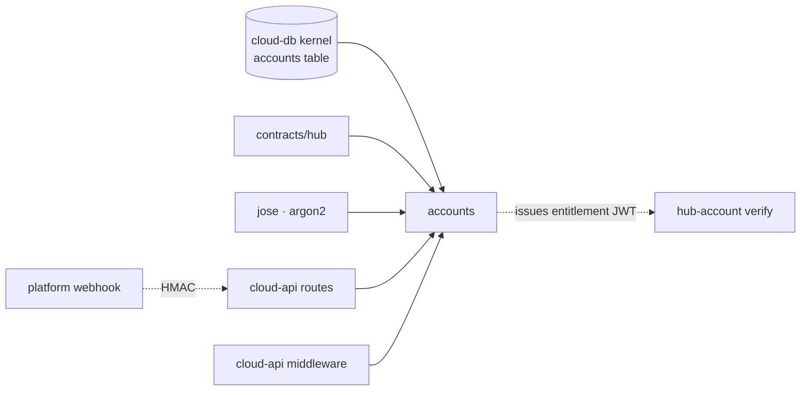

# Accounts — Structure

> The code map and connections for the accounts module. For the concepts behind it, see [overview.md](./overview.md).
>
> Folders touched: `packages/accounts/src/` · `apps/cloud-api/src/routes/{auth,admin,platform,catalog}.ts` · `apps/cloud-api/src/middleware/` · `packages/cloud-db/migrations-postgres/`

Accounts is a **cloud-side vertical-slice leaf** — the hub's identity/session core. Unlike the product leaves (which sit over the SQLite `@vynel/db` kernel), this package sits over the **`@vynel/cloud-db` Postgres kernel** (PGlite in tests). It owns two tables (`refresh_tokens`, `account_action_tokens`); the `accounts` table itself is **kernel-core in `@vynel/cloud-db`**, and this leaf references it by FK. Deps: `@node-rs/argon2`, `@vynel/cloud-db`, `@vynel/contracts`, `@vynel/errors`, `@vynel/logger`, `drizzle-orm`, `jose` (`packages/accounts/package.json`). Exports two subpaths: `.` (the barrel) and `./schema/*`.

## File map

► = entry point.

| Path | Role |
|---|---|
| ► `packages/accounts/src/index.ts` | public barrel — the leaf's whole API (tokens · passwords · sessions · credentials · provisioning · tiers · roles · status · mail) |
| `packages/accounts/src/schema/index.ts` | schema barrel — re-exports the two owned tables + their row/kind types |
| `packages/accounts/src/schema/refresh-tokens.ts` | `refresh_tokens` table — one row per issued token; a device = a token FAMILY |
| `packages/accounts/src/schema/account-action-tokens.ts` | `account_action_tokens` table — single-use email links (`invite` \| `password-reset`) |
| `packages/accounts/src/tokens/access-token.ts` | short-lived signed access JWT — EdDSA issue **and** verify (`createAccessTokenIssuer` / `createAccessTokenVerifier`) |
| `packages/accounts/src/tokens/entitlement-token.ts` | ~7-day signed entitlement JWT — **issue only** (verify lives in `@vynel/hub-account`); `resolveEffectiveTier` (lapsed/unknown → `basic`) |
| `packages/accounts/src/tokens/opaque-secret.ts` | `generateOpaqueSecret` / `hashOpaqueSecret` — random refresh/link secret + its deterministic digest for storage & O(1) lookup *(file unreadable — permission-denied; role inferred from call sites + schema comments = sha256 of the random secret)* |
| `packages/accounts/src/passwords/password-hash.ts` | argon2id `hashPassword` / `verifyPassword` (OWASP params) + `getTimingDummyPasswordHash` (anti-enumeration timing flat) |
| `packages/accounts/src/sessions/session-types.ts` | shared session shapes — `SessionDeps`, `AuthenticatedSession`, `DeviceDescription`, `REFRESH_TOKEN_TTL_DAYS = 365`, `refreshTokenExpiry` |
| `packages/accounts/src/sessions/sign-in.ts` | email+password sign-in — new token family, mint access + entitlement + refresh |
| `packages/accounts/src/sessions/rotate-session.ts` | boot-time refresh: rotate token, tear down on revoked/disabled, reuse-detection family kill |
| `packages/accounts/src/sessions/devices.ts` | `listDevices` / `revokeDevice` (family kill) / `signOut` |
| `packages/accounts/src/credentials/set-password-links.ts` | `issueSetPasswordLink` · `requestPasswordReset` · `confirmSetPassword` — the email-link password flow |
| `packages/accounts/src/provisioning/create-account.ts` | `createProvisionedAccount` — never self-serve; insert + send invite link; 409 on dup (find-then-insert race safe) |
| `packages/accounts/src/provisioning/apply-platform-event.ts` | `applyPlatformEvent` — idempotent webhook lifecycle (`user.created`/`updated`/`removed`/`tier.updated`) |
| `packages/accounts/src/provisioning/unique-violation.ts` | `isUniqueViolation` — walks the cause chain for Postgres `23505` |
| `packages/accounts/src/tiers/assign-account-tier.ts` | `assignAccountTier` — admin/portal tier override (NotFound gate) |
| `packages/accounts/src/tiers/resolve-active-account-tier.ts` | `resolveActiveAccountTier` — LIVE tier read fresh from `accounts`, never the stale token claim |
| `packages/accounts/src/roles/assign-account-role.ts` | `assignAccountRole` — grant/revoke admin (bootstrap via static token) |
| `packages/accounts/src/roles/resolve-active-account-role.ts` | `resolveActiveAccountRole` — LIVE admin/member read fresh |
| `packages/accounts/src/status/set-account-lifecycle-status.ts` | `setAccountLifecycleStatus` — the ONE home for disable (+ revoke every device) |
| `packages/accounts/src/mail/account-mail-sender.ts` | `AccountMailSender` seam + `createLoggingAccountMailSender` (dev-only, logs the link) |
| `packages/accounts/src/repositories/refresh-tokens/*` | functional refresh-token repo (`db`-first) + barrel |
| `packages/accounts/src/repositories/action-tokens/*` | functional action-token repo (`db`-first) + barrel |

Consumers in the app layer (not part of the package, but the leaf's whole reason to exist):

| Path | Role |
|---|---|
| ► `apps/cloud-api/src/routes/auth.ts` | `/auth` — sign-in / refresh / sign-out / password-reset / set-password / devices |
| ► `apps/cloud-api/src/routes/platform.ts` | `/platform/webhooks` — HMAC-verified platform events → `applyPlatformEvent` |
| ► `apps/cloud-api/src/routes/admin.ts` | `/admin` — provisioning, role/tier/status overrides (+ catalog) |
| `apps/cloud-api/src/routes/catalog.ts` | reads `resolveActiveAccountTier` to gate paid downloads |
| `apps/cloud-api/src/middleware/require-account.ts` | Bearer access-JWT guard (offline verify) |
| `apps/cloud-api/src/middleware/require-admin.ts` | dual-door admin guard (static token OR fresh admin-role read) |
| `apps/cloud-api/src/{app,server,cloud-app-options}.ts` | wires the issuers/verifier/mail into `CloudAppOptions`, mounts the routes |

## Data & persistence

Both owned tables are declared in `packages/accounts/src/schema/` but registered in **`drizzle.cloud-postgres.config.ts`** (repo root, lines 19–20) — **not** the SQLite config. The schema-parity guard (`scripts/src/generators/check-schema-parity.ts`) requires each on-disk schema file to appear in exactly one drizzle config. Migrations for both tables live with the cloud kernel at **`packages/cloud-db/migrations-postgres/0000_baseline.sql`** (tables L12–34, FKs L36–37, indexes L40–44) — **not** in the accounts package (there is no `packages/accounts/migrations-postgres/`).

Both tables FK to `accounts.id` — the **kernel-core** table in `@vynel/cloud-db` (`packages/cloud-db/src/schema/accounts/accounts.ts`: `id`, `email`, `displayName`, `passwordHash?`, `platformUserId?`, `status` default `active`, `tier` default `basic`, `tierExpiresAt?`, `role` default `member`, timestamps; unique on `email` and `platformUserId`). This leaf reads/writes it through `@vynel/cloud-db/repositories/accounts`, never with raw SQL.

**`refresh_tokens`** — one row per issued token; a device = a token **family** (`familyId`). Rows are **revoked, never deleted**, so a replayed superseded token is recognizable (reuse detection).

| Column | Type | Notes |
|---|---|---|
| `id` | text (PK) | random UUID; the first token's id also seeds its `familyId` |
| `accountId` | text (FK → `accounts.id`) | `ON DELETE no action` |
| `familyId` | text | the device identity — stable across rotations |
| `tokenHash` | text | **sha256** of the random secret (not argon2 — a 256-bit random needs no slow hash, and the unique index needs a deterministic digest) |
| `deviceName` / `devicePlatform` / `appVersion` | text | device description |
| `createdAt` / `lastUsedAt` | timestamptz | default now |
| `expiresAt` | timestamptz | sliding ~1-year window, re-stamped on every rotation |
| `revokedAt` | timestamptz (null) | null = active; set by rotation / sign-out / device revoke / family kill / account disable |

Indexes: unique `token_hash` · `account_id` · `family_id`.

**`account_action_tokens`** — single-use email links; invite and password-reset share one table + one confirm flow.

| Column | Type | Notes |
|---|---|---|
| `id` | text (PK) | random UUID |
| `accountId` | text (FK → `accounts.id`) | `ON DELETE no action` |
| `kind` | text | `invite` \| `password-reset` — **app-enforced**, not a DB enum (a new kind needs no migration) |
| `tokenHash` | text | sha256 of the random link secret |
| `expiresAt` | timestamptz | invite TTL 7 d · reset TTL 30 min |
| `usedAt` | timestamptz (null) | null = outstanding; re-requesting expires prior outstanding of the same kind (one live link per kind per account) |
| `createdAt` | timestamptz | default now |

Indexes: unique `token_hash` · `account_id`.

> **No outbox.** The cloud kernel has no outbox table; this leaf publishes no outbox events (the outbox pattern lives on the product `@vynel/db` side). Platform state changes arrive *inbound* via webhook, deduped by `claimPlatformEvent` in `@vynel/cloud-db` — see Connections.

## Repositories

Both repos are functional (`db`-first, stateless, async), imported via their local barrels.

| Function (db-first) | Purpose |
|---|---|
| `insertRefreshToken` | create a token row (id + familyId supplied by caller) |
| `findRefreshTokenByHash` | lookup by `tokenHash` or `null` — the presented-secret path |
| `findRefreshTokenById` | lookup by row id (device revoke) |
| `revokeRefreshToken` | revoke EXACTLY one live row; returns count (**0 = concurrent consume** → reuse signal) |
| `revokeRefreshTokenFamily` | revoke every live row in a family (device/session kill) |
| `revokeAllRefreshTokensForAccount` | revoke every live row for an account (disable / password change) |
| `listActiveRefreshTokensForAccount` | live sessions: unrevoked AND unexpired |
| `insertActionToken` | create an email-link token |
| `findActionTokenByHash` | lookup by `tokenHash` or `null` |
| `markActionTokenUsed` | claim the single-use token; returns count (**0 = lost the race**) |
| `expireOutstandingActionTokens` | burn prior outstanding links of the same kind (one live link per kind) |

## Core operations

| Operation | What it does | Key calls (tx / events) |
|---|---|---|
| `signInWithPassword` | verify email+password (dummy-hash verify when account/hash missing → flat timing), status checked only after password proof, start a fresh family, mint the triple | `findAccountByEmail`, `verifyPassword`, `insertRefreshToken`, `accessTokens.issue`, `entitlements.issue` |
| `rotateSession` | boot check: revoked/expired/disabled → tear down; else **one tx** `revokeRefreshToken`+`insertRefreshToken` (revokedCount 0 → reuse → family kill); mint fresh triple. **Family kill runs OUTSIDE the tx** (a throw inside would roll it back) | `findRefreshTokenByHash`, `db.transaction`, `revokeRefreshTokenFamily`, `findAccountById`, issuers |
| `listDevices` / `revokeDevice` / `signOut` | live-session list; revoke by device id (ownership folded into existence → 404); sign out = family kill (unknown token = no-op) | refresh-token repo |
| `issueSetPasswordLink` | burn prior same-kind links, insert token, send mail (invite 7 d / reset 30 min) | `getAccountByIdOrThrow`, `expireOutstandingActionTokens`, `insertActionToken`, `mail.sendSetPasswordLink` |
| `requestPasswordReset` | public "forgot password" — always resolves void; unknown/inactive email silently ignored (no enumeration) | `findAccountByEmail`, `issueSetPasswordLink` |
| `confirmSetPassword` | **one tx**: claim the single-use token (0 → lost race → 401), set password hash, revoke every session | `findActionTokenByHash`, `db.transaction`, `markActionTokenUsed`, `updateAccountPasswordHash`, `revokeAllRefreshTokensForAccount` |
| `createProvisionedAccount` | never self-serve; 409 on existing email (also on concurrent `23505`), insert, then issue the invite link | `findAccountByEmail`, `insertAccount`, `isUniqueViolation`, `issueSetPasswordLink` |
| `applyPlatformEvent` | idempotent webhook lifecycle — `user.created` (dup → converge as update), `user.updated`/`tier.updated` (missing → ignored), `user.removed` → disable + kill sessions | `findAccountByPlatformUserId`, `createProvisionedAccount`, `setAccountTier`, `updateAccountEmail/DisplayName`, `setAccountLifecycleStatus` |
| `assignAccountTier` / `assignAccountRole` | admin/portal overrides; NotFound gate (unknown account = 404, never silent) | `findAccountById`, `setAccountTier` / `setAccountRole` |
| `resolveActiveAccountTier` / `resolveActiveAccountRole` | LIVE authority read fresh from `accounts`; `null` when no active account stands behind the token | `findAccountById`, `resolveEffectiveTier` |
| `setAccountLifecycleStatus` | the ONE home for enable/disable; on `disabled` also revokes every device | `findAccountById`, `setAccountStatus`, `revokeAllRefreshTokensForAccount` |
| `createAccessTokenIssuer` / `Verifier` | EdDSA JWT; verify enforces `token_use === access` (the entitlement token shares key+issuer), one generic 401 for expired/malformed/wrong-key | `jose` `SignJWT` / `jwtVerify` |
| `createEntitlementTokenIssuer` | ~7-day tier+features JWT with a `kid` header (rotation overlap); tier clamped by `resolveEffectiveTier` | `jose` `SignJWT` |

## HTTP surface

The leaf ships no routes of its own; `apps/cloud-api` mounts the operations. `createCloudApp` (`apps/cloud-api/src/app.ts:15`) wires four subtrees; one `instanceof VynelError` `onError` maps typed errors to `{ code, message }` + status.

| Method | Path | Purpose | Guard |
|---|---|---|---|
| POST | `/auth/sign-in` | email+password → session triple | rate limit 5 / 5 min per email |
| POST | `/auth/refresh` | rotate the refresh token (boot check) | — |
| POST | `/auth/sign-out` | kill the presenting device's family | — |
| POST | `/auth/password-reset/request` | fire-and-forget reset link, always 202 | rate limit 3 / 15 min per email |
| POST | `/auth/set-password` | consume link, set password, kill sessions | — |
| GET | `/auth/devices` | list live sessions | `requireAccount` (Bearer access JWT) |
| DELETE | `/auth/devices/:deviceId` | revoke one device (family kill) | `requireAccount` |
| POST | `/platform/webhooks` | HMAC-verified platform event → `applyPlatformEvent` | HMAC sig + 5-min replay window; 503 if secret unset |
| POST | `/admin/accounts` | provision an account | `requireAdminAccess` |
| GET | `/admin/accounts` | list accounts for the portal | `requireAdminAccess` |
| POST | `/admin/accounts/:id/role` | grant/revoke admin | `requireAdminAccess` |
| POST | `/admin/accounts/:id/tier` | tier override | `requireAdminAccess` |
| POST | `/admin/accounts/:id/status` | enable/disable | `requireAdminAccess` |
| GET | `/catalog/*` | (registry) paid gating reads `resolveActiveAccountTier` | `requireAccount` |

**Guards** — `requireAccount` verifies the access JWT offline (no DB read; claims land on `c.var.account`). `requireAdminAccess` is dual-door: static `CLOUD_ADMIN_TOKEN` bearer (sha256 `timingSafeEqual`) **or** a signed-in account whose role is read **fresh** as `admin`.

## MCP surface

None. Accounts is a cloud/hub package — it exposes no MCP tools and ships no `McpFeatureDescriptor`. (MCP is a product-side concern on `@vynel/db`.)

## Worker / background jobs

None in this package. Token expiry is enforced at read time (`listActiveRefreshTokensForAccount` filters `expiresAt`; revoked rows are never reaped) — there is no cron purge.

## Pipeline — "log in once, stay signed in, get revoked instantly"

1. `apps/cloud-api/src/routes/platform.ts` verifies the HMAC signature (`${timestamp}.${rawBody}`, 5-min window), `claimPlatformEvent` dedupes, then `applyPlatformEvent` (`packages/accounts/src/provisioning/apply-platform-event.ts`).
2. `user.created` → `createProvisionedAccount` (`.../provisioning/create-account.ts`) inserts the account and calls `issueSetPasswordLink` (`.../credentials/set-password-links.ts:37`) — invite mail with a 7-day link.
3. The user opens the link → `POST /auth/set-password` → `confirmSetPassword` (`set-password-links.ts:79`): **one tx** claims the token, sets the argon2id hash, revokes every session.
4. `POST /auth/sign-in` → `signInWithPassword` (`.../sessions/sign-in.ts`) starts a fresh family and mints access + entitlement + refresh (`session-types.ts` `AuthenticatedSession`).
5. On every desktop boot `POST /auth/refresh` → `rotateSession` (`.../sessions/rotate-session.ts:55`) rotates the refresh row in **one tx**; a replayed superseded secret (revokedCount 0, or a presented already-revoked row) kills the whole family **outside** the tx.
6. A `tier.updated`-lapse or `user.removed` → `setAccountLifecycleStatus('disabled')` (`.../status/set-account-lifecycle-status.ts`) revokes every device; the next `rotateSession` finds `status !== 'active'`, tears the family down, the app locks to sign-in. Fresh reads (`resolveActiveAccountTier` / `…Role`) refuse non-active accounts before token expiry.

## Connections

**Summary:** accounts is a **cloud leaf over the `@vynel/cloud-db` kernel**, consumed only by `apps/cloud-api` (routes + middleware + boot). It has **no outbox** (publishes none, consumes none); platform state flows *inbound* via the webhook route. Its entitlement/access tokens are the cross-system contract with the desktop, but the desktop **verify** side lives in a different leaf (`@vynel/hub-account`) — no cross-leaf import.

| Unit | Direction | Mechanism | What crosses |
|---|---|---|---|
| cloud-db kernel (`@vynel/cloud-db`) | out | import | `CloudDatabase`, `db.transaction`, the `accounts` repo (`findAccountByEmail`, `insertAccount`, `setAccountTier/Role/Status`, `updateAccountEmail/DisplayName/PasswordHash`, `findAccountByPlatformUserId`) |
| contracts (`@vynel/contracts/hub/*`) | out | import | `HubTier`, `TIER_FEATURES`, `HUB_TOKEN_ISSUER`, `HUB_ACCESS_TOKEN_USE`, `HUB_ENTITLEMENT_TOKEN_USE` |
| errors / logger | out | import / type-only | `Unauthorized/Forbidden/Conflict/NotFound/ValidationError`, `StructuralLogger` |
| `@node-rs/argon2` · `jose` | out | import | argon2id hashing · EdDSA JWT sign/verify |
| [cloud-api](../_apps/cloud-api/overview.md) routes | in | import | `signInWithPassword`, `rotateSession`, devices, set-password flow, `applyPlatformEvent`, `createProvisionedAccount`, `assignAccountRole/Tier`, `setAccountLifecycleStatus`, `resolveActiveAccountTier/Role` |
| cloud-api middleware | in | import | `AccessTokenVerifier`/`AccessTokenClaims` (`require-account`); `resolveActiveAccountRole` (`require-admin`) |
| cloud-api boot | in | import | `createAccessTokenIssuer/Verifier`, `createEntitlementTokenIssuer`, `createLoggingAccountMailSender` (`server.ts`, `cloud-app-options.ts`) |
| platform (Chad's external system) | in (loose) | webhook + HMAC | `PlatformUserEvent` — contract WE author; joined by `platformUserId` |
| [hub-account](../hub-account/overview.md) (desktop leaf) | — | **none** (contract mirror) | verifies the entitlement JWT issued here; **no import** — the two grep hits are comment references only |

**Events published:** none (no cloud outbox).
**Events consumed:** none — platform lifecycle arrives via `POST /platform/webhooks`, deduped by `claimPlatformEvent` (`@vynel/cloud-db/repositories/platform-events`), not via an outbox consumer registry.

## Config & gotchas

- **Cloud dialect, not product dialect.** This leaf is Postgres-only (`drizzle-orm/pg-core`); tests run PGlite via `@vynel/cloud-db`. Its schema files register in `drizzle.cloud-postgres.config.ts` — **never** the SQLite config — and migrations live under `packages/cloud-db/migrations-postgres/`, not in this package.
- **The leaf owns two tables; `accounts` is the kernel's.** `refresh_tokens` and `account_action_tokens` are this leaf's; the `accounts` table is core to `@vynel/cloud-db`. Don't add `accounts` columns here.
- **Two token digests, deliberately different.** Refresh/link secrets are stored as **sha256** (`hashOpaqueSecret` — deterministic, unsalted, for the unique index + O(1) lookup); passwords are **argon2id** (`password-hash.ts`). The `Algorithm` const-enum member is spelled numerically (`2 as Algorithm`) because its values are unusable under `verbatimModuleSyntax`.
- **Issue here, verify elsewhere.** `entitlement-token.ts` only *issues*; the desktop *verify* side is `@vynel/hub-account` (different key-material access). The access token issues **and** verifies here because `require-account` runs in the same process. Both share one Ed25519 keypair + issuer, so `access-token` verify enforces `token_use === access` to stop an entitlement token authenticating as a 7-day session.
- **Fresh reads beat the ~7-day token.** `resolveActiveAccountTier` / `resolveActiveAccountRole` deliberately re-read the `accounts` row; a downgraded/demoted/disabled account loses access on its next request, not at token expiry. `null` means "no active account" — the caller picks fail-open vs fail-closed.
- **Reuse detection kills families outside the tx.** In `rotateSession` a `revokeRefreshToken` count of 0 (concurrent consume) or a presented already-revoked row triggers `revokeRefreshTokenFamily`, run **after** the transaction — a throw inside would roll the rotation back.
- **Anti-enumeration is load-bearing.** Sign-in runs a real argon2 verify against a dummy hash when the account is missing (flat timing) and returns one generic 401; `requestPasswordReset` always 202s and fires without awaiting; `revokeDevice` folds ownership into a 404. Don't "optimize" these branches.
- **Idempotent webhooks.** `applyPlatformEvent` converges every replay: `user.created` for a known id degrades to an update (never a 409), `user.updated`/`tier.updated` for an unknown id return `ignored`. A `user.removed` account that is updated again **stays disabled** — only deliberate re-provisioning resurrects it (conservative for M3).
- **Dev mail sender logs the link (a secret).** `createLoggingAccountMailSender` warns the full set-password link because no provider is configured — dev/test only; the production sender replaces the whole impl. Never wire it where real links would land in logs.
- **`unique-violation.ts` walks the cause chain** for pg `23505` because drizzle may wrap the driver error — used by the provisioning find-then-insert races (email / platformUserId).
- **`opaque-secret.ts` could not be read** (permission-denied at doc time). Its two exports are mapped from every call site + the schema comments (random secret in, sha256 digest out); confirm the exact generation before editing it.

---
*Mapped from the code on disk, 2026-07-14. If you change this module, update this file and [overview.md](./overview.md).*
