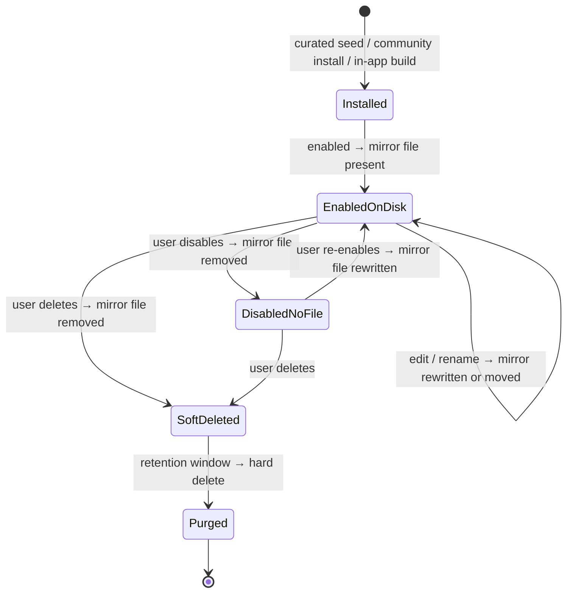

# Agents — Overview

> Vynel's named, reusable sub-assistants — a curated "hand" the root brain can invoke — each one visible to the user as a real file on disk, kept in step with whether it is actually installed and switched on.
>
> **Status:** shipped core, named edges · **Depends on:** [db](../_platform/database/overview.md) (kernel), [contracts](../_platform/contracts-and-sdk/overview.md) (curated catalog) · **Code map:** [structure.md](./structure.md)

## Purpose

An agent is a saved persona the main session can call on for a focused job — a document writer, a read-only researcher, an inbox helper. Each one bundles a system prompt, an optional model and reasoning effort, a tool allow/deny list, and a set of preloaded skills, all behind a short `@mention` handle. The main brain stays general; agents are the specialists it hands work to.

What makes this a product surface rather than plumbing is the same instinct that drives [memory](../memory/overview.md): **legibility**. Every installed agent is mirrored to a plain, human-visible agent file inside the scope's agents folder, stamped with a "Managed by Vynel" header. The user can open that folder and see exactly which specialists the assistant has, the way memory is a drawer the user can open. The database row is the source of truth; the file is a transparency mirror of it.

That mirror is **load-bearing, not cosmetic**. The runtime live-loads agent files from disk, and a same-named programmatic definition only shadows a file while the agent is *enabled*. So the rule "a file exists exactly while the agent is installed **and** switched on" is a safety property: a leftover file for a disabled agent would silently go live. Removal is always marker-checked, so a file the user hand-authored themselves is never touched.

## What it can do

- **Install a curated agent** — seed one of Vynel's three built-in specialists (a write-capable document generator, a read-only researcher, an inbox assistant) into a scope from the compiled-in catalog.
- **Install a community agent** — bring in a marketplace agent from a downloaded, integrity-verified artifact, validated at install time.
- **Build the enabled agent set for a session** — resolve every live, switched-on agent for a user-and-workspace into the keyed shape the runtime consumes, with each agent's preloaded skills attached.
- **Edit an agent** — change its persona, model, effort, permission mode, tool lists, enabled flag, or its preloaded-skill set (the sent skill list replaces the old one).
- **Enable / disable an agent** — a per-row toggle that decides whether it joins a session at all, and whether its mirror file is present on disk.
- **Rename an agent** — a slug change moves its mirror file to the new handle.
- **Soft-delete an agent** — hide it from every read, keep the row for a retention window, and drop its mirror file.
- **List agents for a workspace** — the union of user-scope agents (available everywhere) and that workspace's own agents, live rows only.
- *(background)* The row-versus-disk mirror is reconciled after every install, edit, and delete so the file set always matches the enabled rows; a leftover mirror from a losing install race is cleaned up.

## Responsibilities

**Owns** — the agent rows and their whole lifecycle: identity (handle, name, description, icon), the runtime fields borrowed from the SDK agent shape (prompt, model, effort, permission mode, tool allow/deny lists, background flag), scope, provenance and trust tier, the enabled flag, the preloaded-skill links, and soft-delete state. It owns create / read / update / enable-disable / soft-delete, the three lifecycle events it announces through the outbox, the mapping from a stored agent to the runtime definition, the per-session resolution of enabled agents (including the scope-collision rule), and the load-bearing, marker-checked disk mirror that keeps installed agents visible as files.

**Does not own** —
- injecting the resolved agent set into the live chat turn — this module builds the map; wiring it into a running session is [session / orchestration](../session/overview.md);
- whether an agent's tools may reach MCP servers — that resolves through [capabilities](../capabilities/overview.md), not duplicated here;
- the skills an agent preloads — those are [skills](../skills/overview.md); this module only holds their ids as loose string refs;
- the marketplace catalog, hub, and artifact download that a community install consumes — [marketplace](../marketplace/overview.md) hands over a verified artifact;
- the scope containers themselves (the user and the workspaces an agent belongs to) — [workspaces](../workspaces/overview.md);
- the scheduled purge that eventually hard-deletes expired soft-deletes — this module ships only the primitive; the timer that calls it lives in the hosting app.

## Concepts & vocabulary

| Term | Meaning |
|---|---|
| **Agent** | A named, reusable specialist: a prompt plus optional model / effort / permission mode / tool lists / preloaded skills, invoked by the root brain under an `@mention` handle. |
| **Slug** | The kebab-case handle, unique within a scope; the `@mention` and the key the runtime uses to register the agent. |
| **Scope** | `user` (available in every workspace the user owns) or `workspace` (only that room). A workspace agent overrides a user agent of the same slug. |
| **Source (provenance)** | Where the agent came from: `vynel` (curated seed), `user` (built in-app), or `community` (installed from the marketplace). |
| **Trust tier** | A recorded distribution-trust label: `verified` (curated), `community` (user-built / marketplace), with `anthropic-official` reserved. It gates nothing at runtime today. |
| **Preloaded skills** | Skill ids attached to an agent so those skills are available whenever it runs. Held as loose refs — plain strings, no cross-module link. |
| **Effort / permission mode** | Runtime dials borrowed from the SDK agent shape. Effort is one of `low` · `medium` · `high` · `xhigh` · `max`; permission mode one of `default` · `acceptEdits` · `bypassPermissions` · `plan` · `dontAsk` · `auto`. A null value means "inherit from the main session." |
| **Background agent** | An agent that runs fire-and-forget when invoked rather than inline. |
| **Transparency mirror** | The human-visible agent file on disk, stamped "Managed by Vynel," derived from the row. Present exactly while the agent is installed and enabled. |
| **Enabled vs. deleted** | *Enabled* is a reversible per-row on/off toggle. *Deleted* is a soft-delete with a retention window before the hard purge. |

## Rules & invariants

- **The row is the source of truth; the file mirrors it.** The disk agent file is derived state. A read never trusts the file; the row wins on every conflict.
- **A mirror file exists exactly while the agent is installed and enabled.** Because the runtime live-loads agent files and only an enabled agent's programmatic definition shadows its file, a disabled agent must leave no file behind — otherwise it would go live from disk. Disable removes the file, enable rewrites it, rename moves it.
- **Vynel never destroys a file it did not write.** Every removal or overwrite is marker-checked against the "Managed by Vynel" header. A hand-authored agent file at the same path aborts an install and is left untouched on sync and delete.
- **User-built agents get no mirror.** The disk mirror is deliberately scoped to curated and community installs; agents created directly in the in-app builder are not yet mirrored (a named follow-up).
- **Every state change co-commits its outbox event.** Create, update, and soft-delete each land the row change and its lifecycle event in one transaction, or neither — three events in total. Install provenance rides the create event's source field, so the curated and community install paths never emit a second event.
- **Reads are tenant- and scope-scoped, and hide soft-deletes.** Every query filters by the owning user; single-agent access outside your scope is a plain not-found, never a leak. Soft-deleted rows are invisible to all normal reads.
- **A workspace agent overrides a user agent of the same slug.** When a session resolves its agents, the more-specific workspace scope wins, so a room can specialize a globally-available agent.
- **The install write is load-bearing; the sync and removal are best-effort.** An install writes the file first and aborts with no row if disk fails; later reconciliation logs and moves on if disk misbehaves, because the row already carries the truth.
- **Curated seeds never model the approval-card skip.** Catalog agents use a safe permission subset — never the modes that would bypass the approval card.

## Lifecycle

## Where it sits in the bigger picture

Agents is a specialist supplier to the conversational core. Each turn, [session / orchestration](../session/overview.md) asks this module for the enabled agent set and hands the resulting map to the runtime; the runtime reaches its model only through the provider seam, and this module only ever borrows the SDK's *data* shape, never its runtime. An agent's tool reach is decided by [capabilities](../capabilities/overview.md); the skills it preloads live in [skills](../skills/overview.md), referenced by loose id. Curated agents come from a compiled-in catalog in [contracts](../_platform/contracts-and-sdk/overview.md); community agents arrive as verified artifacts from [marketplace](../marketplace/overview.md). It shares the "make it visible on disk" instinct with [skills](../skills/overview.md) and the "the user can open the drawer" instinct with [memory](../memory/overview.md): between them, memory holds what the assistant knows, skills hold what it can do, and agents hold the specialists it can become.

---
*Mapped from the code on disk, 2026-07-14. If you change this module, update this file and [structure.md](./structure.md).*
