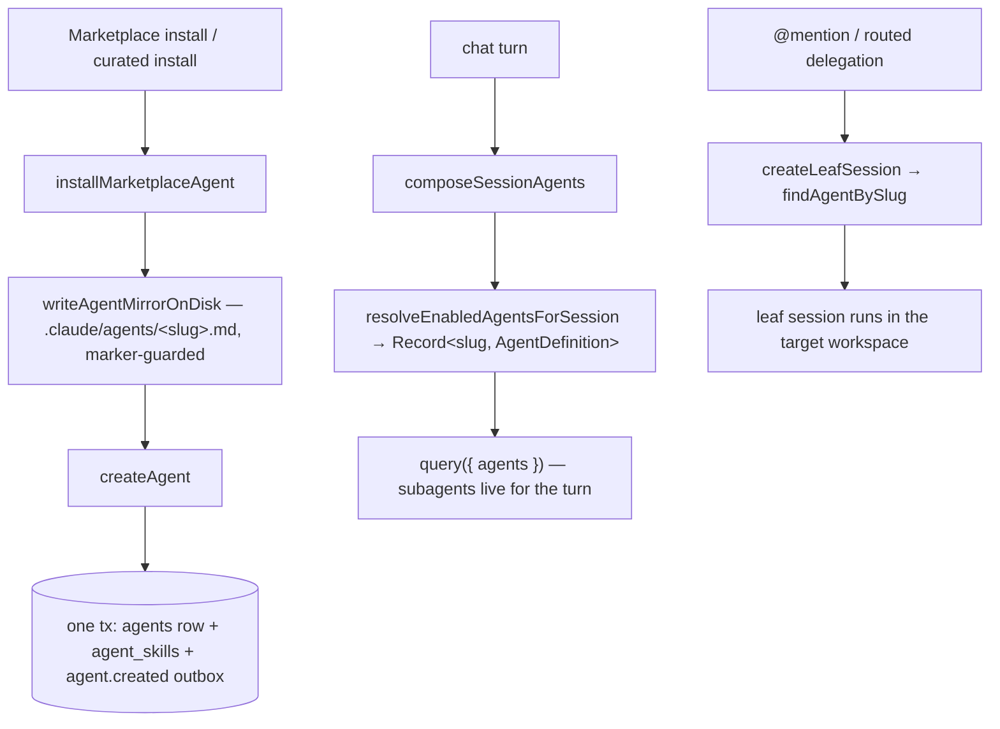
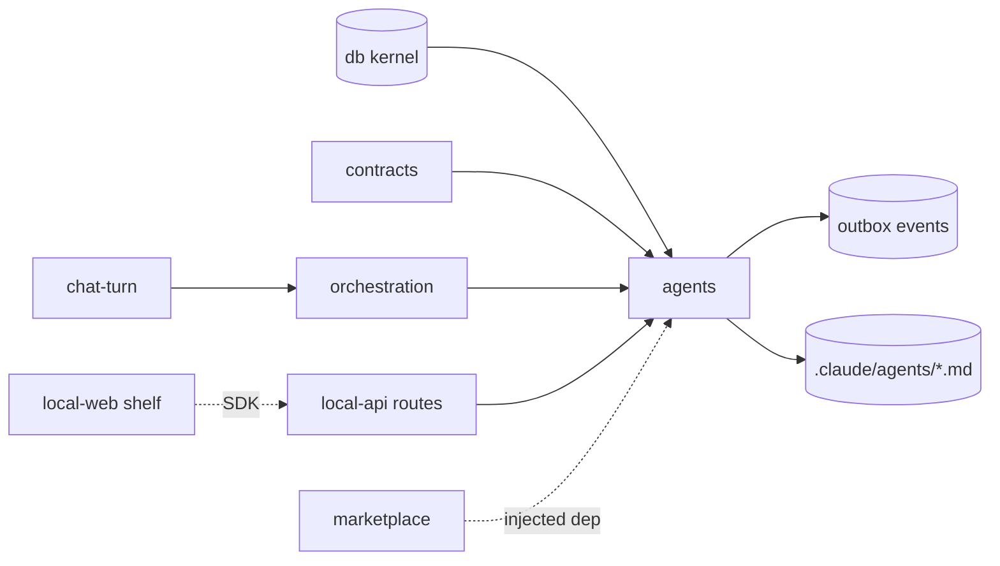

# Agents — Structure

> The code map and connections for the agents module. For the concepts behind it, see [overview.md](./overview.md).
>
> Folders touched: `packages/agents/src/` · `packages/db/src/{schema,repositories}/agents/` · `apps/local-api/src/routes/agents/` · `apps/local-api/src/streams/chat-turn.ts` · `apps/local-web/src/{components/sections,composables/agents}/`

Agents is a **leaf that owns operations, not tables**. Unlike memory (which owns its own `schema/` + `repositories/`), the `agents` package holds only operations (`lifecycle/` · `session/`), the outbox events, the domain types, and the `internal/` disk-mirror machinery. **The `agents` + `agent_skills` tables and their functional repositories live in the `@vynel/db` kernel** (`packages/db/src/schema/agents/`, `packages/db/src/repositories/agents/`); `agents-types.ts` re-exports the row/enum types from there. Deps: `@vynel/db`, `@vynel/contracts` (curated catalog + agent manifest schema), `@vynel/errors`, `@vynel/logger`, `jszip`, and `@anthropic-ai/claude-agent-sdk` **type-only** (the `AgentDefinition` data shape — no runtime crosses the AI seam) (`packages/agents/package.json`).

## File map

► = entry point (public barrel).

| Path | Role |
|---|---|
| ► `packages/agents/src/index.ts` | public barrel — the only subpath export (`.`) + `./test-support`; exports the 7 ops, `mapAgentToDefinition`, the 3 event constants, and re-exported row/enum types |
| `packages/agents/src/agents-types.ts` | domain type re-exports — `AgentRow`/enums from `@vynel/db/repositories/agents`, `StructuralLogger` (type-only) from `@vynel/logger` |
| `packages/agents/src/agents-events.ts` | 3 outbox event constants (`agent.created` / `.updated` / `.deleted`) + payload types |
| `packages/agents/src/lifecycle/create-agent.ts` | insert agent row + `agent_skills` rows + `agent.created` outbox (one tx); duplicate-slug pre-check; **no disk mirror** (user-built path) |
| `packages/agents/src/lifecycle/update-agent.ts` | patch persona/runtime/tools + skill-set REPLACE + `agent.updated` outbox (one tx); post-commit mirror sync (rename drops old file) for non-`user` sources |
| `packages/agents/src/lifecycle/soft-delete-agent.ts` | set `deletedAt` + `agent.deleted` outbox (one tx); post-commit mirror removal for non-`user` sources |
| `packages/agents/src/lifecycle/list-agents-for-workspace.ts` | user-scope ∪ workspace agents (or user-scope only when `workspaceId` null), newest first |
| `packages/agents/src/lifecycle/find-agent-by-slug.ts` | exact-scope slug lookup — `findAgentBySlug` (null) + `getAgentBySlugOrThrow` |
| `packages/agents/src/lifecycle/install-curated-agent.ts` | catalog-lookup install from `CURATED_AGENT_CATALOG` → `source: 'vynel'`, `trustTier: 'verified'` → `installMarketplaceAgent` |
| `packages/agents/src/lifecycle/install-cloud-agent.ts` | marketplace artifact install — sha256 verify → extract+parse manifest → `slug === itemId` → `installMarketplaceAgent` (`source/trustTier: 'community'`) |
| `packages/agents/src/lifecycle/install-marketplace-agent.ts` | *package-internal (NOT on the barrel)* — the shared install choreography behind both curated + cloud: dup pre-check → mirror write → `createAgent`, orphan-cleanup on race |
| `packages/agents/src/session/resolve-enabled-agents-for-session.ts` | enabled agents → SDK `Record<slug, AgentDefinition>`; workspace-scope overrides user-scope on slug collision; batched skill lookup |
| `packages/agents/src/session/list-agent-skill-ids.ts` | thin core read of an agent's preloaded skill ids (keeps routes off the kernel repo) |
| `packages/agents/src/internal/map-agent-to-definition.ts` | pure row + skill-ids → SDK `AgentDefinition` (the one translation site; `import type` only) |
| `packages/agents/src/internal/agent-mirror-on-disk.ts` | disk-mirror write / remove / sync — marker-checked, best-effort on remove/sync, load-bearing throw on write |
| `packages/agents/src/internal/render-agent-mirror-markdown.ts` | row → `.claude/agents/<slug>.md` markdown; the `"Managed by Vynel"` marker + frontmatter-injection neutralization |
| `packages/agents/src/internal/resolve-agent-mirror-path.ts` | scope → mirror path (`~/.claude/agents/` or `<workspacePath>/.claude/agents/`); slug containment re-check |
| `packages/agents/src/internal/resolve-host-home-dir.ts` | host-home lookup with test-override seam (`withHomeDir`) — carved-out host-OS read |
| `packages/agents/src/internal/extract-agent-manifest.ts` | read + zod-parse `agent.json` from the artifact zip; zip-bomb caps + trust boundary |
| `packages/agents/src/internal/read-declared-uncompressed-size.ts` | zip entry's declared uncompressed size (pre-inflate zip-bomb wall); duplicated from `@vynel/skills` |
| `packages/agents/src/test-support/host-home-dir.ts` | `./test-support` export — re-exports `withHomeDir` for consumer tests |
| **kernel** `packages/db/src/schema/agents/agents.ts` | the `agents` table + scope/source/trust/effort/permission enum types |
| **kernel** `packages/db/src/schema/agents/agent-skills.ts` | the `agent_skills` child table (preloaded skill ids) |
| **kernel** `packages/db/src/repositories/agents/agents.ts` | functional agents repo — find / list / insert / update / soft- & hard-delete |
| **kernel** `packages/db/src/repositories/agents/agent-skills.ts` | functional preload-set repo — list (single + batched) / insert / delete-for-agent |
| ► `apps/local-api/src/routes/agents/index.ts` | HTTP entry — 8 routes mounted at `/agents`; `x-mcp` OFF on every route |
| `apps/local-api/src/routes/agents/{schemas,serializers}.ts` | Zod request/response schemas · row→JSON serializers (Date→ISO) |
| `apps/local-web/src/components/sections/AgentsSection.vue` | the Agents shelf — list with provenance chip + On/Off toggle, on both surfaces |
| `apps/local-web/src/composables/agents/{use-agents,use-set-agent-enabled}.ts` | vue-query list-in-scope + enable-toggle mutation |

## Data & persistence

Both tables live in the **kernel** (`packages/db/src/schema/agents/`) and are registered in `drizzle.sqlite.config.ts` (repo root, L50–51). DDL is in `packages/db/src/migrations-sqlite/0000_baseline.sql` (`agents` L464, `agent_skills` L495; indexes L490–494). No agent-specific migration beyond the baseline.

**`agents`** — one row per Vynel agent (an SDK `AgentDefinition` + Vynel metadata). The DB row is the source of truth; the disk mirror is derived. Soft-delete column: `deletedAt`.

| Column | Type | Notes |
|---|---|---|
| `id` | id (PK) | UUID supplied by the core op |
| `userId` | id (FK, cascade) | → `users` — the tenant boundary; every row carries it (Phase-2-ready) |
| `workspaceId` | text (FK, cascade, null) | → `workspaces`; **null = user-scope** (available in every workspace), non-null = workspace-scope. `text().references(...)` not `id()` because `id()` is NOT NULL by dialect contract |
| `slug` | text | kebab-case `@mention` handle + the key in the resolved `Record<slug, AgentDefinition>` |
| `name`, `description`, `prompt` | text | `description`/`prompt` → SDK-required fields |
| `icon` | text (null) | lucide-vue-next icon name for the panel |
| `model` | text (null) | → `AgentDefinition.model`; null = inherit |
| `effort` | text (null) | `low`/`medium`/`high`/`xhigh`/`max`; null = inherit |
| `permissionMode` | text (null) | `default`/`acceptEdits`/`bypassPermissions`/`plan`/`dontAsk`/`auto`; null = inherit |
| `background` | boolean | → `AgentDefinition.background` (fire-and-forget) |
| `allowedTools`, `disallowedTools` | json(`string[]`) (null) | opaque tool arrays; null allowed = inherit all |
| `scope` | text | `user` / `workspace` — derived from `workspaceId` at create |
| `source` | text | `vynel` (curated) / `user` (in-app builder) / `community` (marketplace) — install provenance |
| `trustTier` | text | `verified` / `anthropic-official` (reserved) / `community`; **gates nothing at runtime today** |
| `enabled` | boolean | per-row enable flag; only enabled+live rows resolve into a session |
| `createdAt` / `updatedAt` / `deletedAt` | timestamp | |

Indexes: `userId` · `workspaceId` · `deletedAt`; two **partial unique** indexes on `deleted_at IS NULL` — `(userId, workspaceId, slug)` (cross-scope coexistence) and `(userId, slug) WHERE workspaceId IS NULL` (user-scope dedup, since SQL treats two NULLs as distinct). Soft-delete-aware so a deleted slug can be re-used.

**`agent_skills`** — the skill ids an agent preloads (→ `AgentDefinition.skills[]`). Composite PK `(agentId, skillId)`. `agentId` is a real FK (cascade) to `agents`; **`skillId` is a loose string ref — there is NO `skills` table to point at** (skills live as a compiled-in catalog + `installed_skills` rows). No `userId` — tenant isolation is FK-transitive through `agentId → agents.userId`.

## Repositories (kernel — `@vynel/db/repositories/agents`)

| Function (db-first) | Purpose |
|---|---|
| `findAgentById` | one live agent or `null` |
| `findAgentBySlug` | exact-scope lookup (user-scope when `workspaceId` null) |
| `listAgentsForUserAndWorkspace` | user-scope ∪ workspace (or user-scope only), live, newest first |
| `listEnabledAgentsForUserAndWorkspace` | as above, `enabled = true` only — the session-resolver read |
| `insertAgent` | create (id supplied by caller) |
| `updateAgent` | tenant-filtered patch; bumps `updatedAt`; null on no live match |
| `softDeleteAgent` | set `deletedAt`; null on already-deleted/not-owned |
| `hardDeleteAgentsDeletedBefore` | retention purge primitive (cascades to `agent_skills`) — *no scheduled caller yet* |
| *(skills)* `listSkillIdsForAgent`, `listSkillIdsForAgents` (batched Map), `insertAgentSkill`, `deleteAgentSkillsForAgent` | the preload-set child repo |

## Core operations (`packages/agents/src`)

| Operation | What it does | Key calls |
|---|---|---|
| `createAgent` | dup-slug pre-check → one tx: `insertAgent` + per-skill `insertAgentSkill` + `agent.created` outbox. **No mirror** (user-built path). Scope derived from `workspaceId` | `findAgentBySlug`, `insertAgent`, `insertAgentSkill`, `insertOutboxEvent` |
| `updateAgent` | find→404 (not-found = not-owned, no enum leak) → rename-collision check → one tx: patch + skill REPLACE + `agent.updated` outbox → post-commit mirror sync (drops old file on rename) for non-`user` sources | `findAgentById`, `findAgentBySlug`, `updateAgent` (repo), `syncAgentMirrorOnDisk` |
| `softDeleteAgent` | one tx: `deletedAt` flip + `agent.deleted` outbox (miss throws before any write) → post-commit mirror removal for non-`user` sources | `softDeleteAgent` (repo), `removeAgentMirrorOnDisk` |
| `listAgentsForWorkspace` | thin pass-through to the union read | `listAgentsForUserAndWorkspace` |
| `findAgentBySlug` / `getAgentBySlugOrThrow` | exact-scope lookup (find/get pair) | repo `findAgentBySlug` |
| `installCuratedAgent` | catalog lookup by slug → 404 → `installMarketplaceAgent` (`source: 'vynel'`, `trustTier: 'verified'`) | `findCuratedAgentBySlug`, `installMarketplaceAgent` |
| `installCloudAgent` *(async)* | workspace-id guard → **sha256 verify FIRST** → extract+zod-parse `agent.json` → enforce `slug === itemId` → `installMarketplaceAgent` (`community`) | `createHash`, `extractAgentManifest`, `installMarketplaceAgent` |
| `installMarketplaceAgent` *(internal)* | dup pre-check → **mirror write first** (throws on hand-authored collision) → `createAgent` → remove mirror if create races | `findAgentBySlug`, `writeAgentMirrorOnDisk`, `createAgent`, `removeAgentMirrorOnDisk` |
| `resolveEnabledAgentsForSession` *(async)* | enabled rows → `Record<slug, AgentDefinition>`; user-scope built first, workspace-scope overwrites on slug collision; batched skill lookup | `listEnabledAgentsForUserAndWorkspace`, `listSkillIdsForAgents`, `mapAgentToDefinition` |
| `mapAgentToDefinition` | pure row + skill-ids → SDK `AgentDefinition`; null columns omitted (= inherit) | — |
| `listAgentSkillIds` *(async)* | route-facing read of an agent's preloaded skill ids | `listSkillIdsForAgent` |

## The disk transparency mirror (signature subsystem)

Marketplace/curated installs (`source` `vynel`/`community`) get a Claude-Code-style agent file written to disk so the install is **visible outside Vynel** — exactly like skills' `SKILL.md`. The DB row stays the functional source of truth; the file is derived state. User-built agents (`source: 'user'`) are **never** mirrored.

- **Location** (`resolve-agent-mirror-path.ts`) — user scope `~/.claude/agents/<slug>.md` (via `resolveHostHomeDir`), workspace scope `<workspacePath>/.claude/agents/<slug>.md` (workspace path read from the kernel via the loose `workspaceId`). Slug re-validated against `SAFE_AGENT_SLUG` here (defense-in-depth) before it becomes a path segment.
- **Marker guard** (`render-agent-mirror-markdown.ts`) — every managed file carries the `"Managed by Vynel"` header comment. **Only a file containing that marker is ever overwritten or deleted** — a user's own hand-authored agent file is never destroyed. Write on a marker-less file throws `ConflictError` (install aborts); sync downgrades it to warn+skip.
- **Frontmatter-injection neutralized** — the free-text `name` rides in a YAML comment, so `toSingleCommentLine` collapses `\r\n` + NEL/LS/PS (`…

`) to spaces (a smuggled line break would end the comment and inject a real `tools:` key into a file plain Claude Code sessions load live). `name`/`description`/`tools`/`model` values are `JSON.stringify`-quoted (a safe YAML double-quoted subset).
- **Present-iff-enabled invariant** (`agent-mirror-on-disk.ts`) — the file exists exactly while the row is enabled AND not soft-deleted. `syncAgentMirrorOnDisk` writes on enabled, removes on disabled/deleted. This is **load-bearing**: the SDK discovers `.claude/agents/*.md`, so a disabled agent's stale file would go live from disk — the invariant prevents it.
- **Shadowing** — while enabled, the programmatic `query({ agents })` definition (same slug) always takes precedence over the disk file, so the mirror is shadowed, never double-registered.
- **Load posture** — write is load-bearing (throws, propagates); remove + sync are best-effort (log warn, never throw) — the row's state must win even if the disk misbehaves.

## HTTP surface

Mounted **top-level at `/agents`** (`apps/local-api/src/app.ts:165`) — agents aren't nested under `/workspaces/:id` because a user-scoped agent has no workspace. Every route: `describeRoute` → validator(s) → `...userScoped` → handler (the locked Hono chain). Workspace **ownership** (when a `workspaceId` is in play) is verified in-route via `getWorkspaceById` (`@vynel/workspaces`) — keeps `@vynel/agents` free of cross-feature imports. No error mapping in-route; typed `VynelError`s hit the global `onError`.

| Method | Path | Purpose | MCP tool |
|---|---|---|---|
| POST | `/agents` | create (server-stamps `source: 'user'`, `trustTier: 'community'`) | — (`x-mcp` off) |
| GET | `/agents?workspaceId=` | list; user-scope ∪ workspace, or user-scope only | — |
| GET | `/agents/curated` | the compiled-in curated catalog (browse source) | — |
| POST | `/agents/curated/install` | install a curated agent into a scope | — |
| GET | `/agents/:slug` | one agent by slug within an exact scope (+ skill ids) | — |
| PATCH | `/agents/:agentId` | update persona/runtime/tools/skills | — |
| POST | `/agents/:agentId/enable` | enable/disable (thin `updateAgent({ enabled })`) | — |
| DELETE | `/agents/:agentId` | soft-delete (204) | — |

## MCP surface

**None.** `x-mcp` is deliberately OFF on every agents route (`index.ts` header — same posture as approvals' D16; read-safe list/get are future candidates pending per-route scope review). Agents are surfaced to the model as *delegable subagents* through `query({ agents })` — not as callable MCP tools.

## Worker / background jobs

**None wired.** `hardDeleteAgentsDeletedBefore` is the retention-purge data primitive (cascades to `agent_skills`), but the scheduled caller is a follow-up unit — *defined but not yet wired* (confirmed: no non-comment caller in `apps` or `packages`).

## Web surface

Both composables speak the generated SDK (`vynel.agents.*`) through vue-query; no Pinia store — cache keys under `["agents", …]`.

- **Composables** (`apps/local-web/src/composables/agents/`) — `use-agents.ts` (workspace surface = user-scope ∪ that workspace; global = user-scope only; keyed `["agents","list", workspaceId|"user"]` so any install/uninstall refreshes every shelf), `use-set-agent-enabled.ts` (the On/Off toggle mutation).
- **Component** — `AgentsSection.vue`: the shelf on both surfaces, a provenance chip per non-`user` source (`vynel`→"Curated", `community`→"Community"), a scope chip, and an On/Off pill wired to `setEnabled`. Empty state points at the Marketplace.

## Pipeline — "install a specialist, then Claude delegates to it"

1. **Install** — the marketplace path (`apps/local-api/src/routes/marketplace/item-lifecycle.ts`) or curated install → `installMarketplaceAgent` (`packages/agents/src/lifecycle/install-marketplace-agent.ts`): dup pre-check → mirror write (aborts on a hand-authored collision) → `createAgent`.
2. **Create** — `create-agent.ts` — one tx: `insertAgent` (embedding-less; scope derived from `workspaceId`) + per-skill `insertAgentSkill` + `insertOutboxEvent('agent.created')`; `source` carries the install provenance so the install paths never emit a second event.
3. **Session compose (LIVE)** — a chat turn at `apps/local-api/src/streams/chat-turn.ts:89` calls `composeSessionAgents` (`@vynel/orchestration`) → `resolveEnabledAgentsForSession` — enabled rows → `Record<slug, AgentDefinition>` (workspace-scope overrides user-scope on slug collision), forwarded into the provider's `startChatSession` → `query({ agents })`.
4. **Delegate (LIVE)** — an `@mention`/routed delegation goes through `packages/session/src/delegation/delegate-to-leaf-session.ts` → orchestration's `createLeafSession` → `findAgentBySlug` (prefer workspace scope, fall back to user scope) → the leaf runs in the target workspace.

## Connections

**Summary:** agents is a **read-side hub, event-side leaf** — consumed by the chat-turn session composer, the `@mention`/delegation resolver, the HTTP routes, and the marketplace install/uninstall seam; it depends only on the kernel + shared packages + contracts (and the SDK's `AgentDefinition` type). It publishes three lifecycle events; none are consumed yet.

| Unit | Direction | Mechanism | What crosses |
|---|---|---|---|
| db kernel (`@vynel/db`) | out | import | `Database`, `withTransaction`, the `agents`/`agent_skills` schema + repos, `insertOutboxEvent`, `findWorkspaceById` (mirror path) |
| [contracts](../contracts/overview.md) | out | import | `CURATED_AGENT_CATALOG`/`findCuratedAgentBySlug`, `AgentItemManifestSchema` |
| claude-agent-sdk | out | **SDK type only** | `AgentDefinition` shape (`import type` — no runtime) |
| errors / logger | out | import / type-only | `ConflictError`, `NotFoundError`, `ValidationError`, `StructuralLogger` |
| jszip | out | import | agent artifact extraction |
| [orchestration](../orchestration/overview.md) | in | import | `composeSessionAgents`→`resolveEnabledAgentsForSession`; `resolveMentions`→`listAgentsForWorkspace`; `createLeafSession`→`findAgentBySlug` |
| local-api routes | in | import | the 8 routes + `listAgentSkillIds` |
| local-api chat-turn | in | import (via orchestration) | live `query({ agents })` composition |
| [marketplace](../marketplace/overview.md) | in | **injected dep** | `installCloudAgent` + `softDeleteAgent` bound into `marketplaceDeps` (`routes/marketplace/item-lifecycle.ts`); the sync install-status annotator reads the **kernel repo** `listAgentsForUserAndWorkspace` directly (leaf export is async, marketplace pipeline is sync) |
| local-web | in | SDK | the Agents shelf (list + enable toggle) |
| `packages/session` | *(test only)* | import | `createAgent` in `delegate-to-leaf-session.test.ts`; at runtime session reaches agents **through orchestration**, not directly |
| filesystem (`.claude/agents/`) | out | disk write | the transparency mirror |

**Events published** (each co-committed in the mutating tx): `agent.created` (source carries install provenance) · `agent.updated` (incl. enable/disable toggle) · `agent.deleted` (on soft-delete).
**Events consumed:** none — no `agents` subscriber is registered. Publish-from-day-one for future sync/activity-feed subscribers.

## Config & gotchas

- **Schema lives in the kernel, not the leaf.** `agents` + `agent_skills` are under `packages/db/src/schema/agents/` and registered in `drizzle.sqlite.config.ts` (L50–51). The `agents` package re-exports the row/enum types from `@vynel/db/repositories/agents` — a deliberate divergence from the memory-style "leaf owns its schema" pattern.
- **The SDK dep is type-only.** `package.json` lists `@anthropic-ai/claude-agent-sdk`, but every usage is `import type { AgentDefinition }` — no runtime crosses the AI seam, so this is not an invariant violation.
- **`installMarketplaceAgent` is package-internal** — not on the barrel; both `installCuratedAgent` and `installCloudAgent` delegate to it, and it owns the mirror write. User-built agents (`POST /agents`) skip it and get **no mirror** (recorded follow-up in `docs/module-notes/marketplace-kinds.md`).
- **`trustTier` gates nothing at runtime today** — a recorded provenance label reserved for future per-tier gating; carding is enforced tier-independently by the provider's PreToolUse hook + the manifest's clamped `permissionMode`.
- **`agent_skills.skillId` is a loose string ref, not an FK** — there is no `skills` table (skills are a compiled-in catalog + `installed_skills` rows); an agent may declare a preload before that skill is installed in any given workspace.
- **Slug uniqueness is two partial indexes.** The 3-col `(userId, workspaceId, slug)` unique doesn't catch two user-scope rows (SQL treats two NULL `workspaceId`s as distinct) — the second partial index `(userId, slug) WHERE workspaceId IS NULL` closes that gap. Both are `WHERE deleted_at IS NULL`, so a soft-deleted slug is re-usable.
- **Scope resolution: workspace overrides user.** In `resolveEnabledAgentsForSession` a workspace-scope agent with the same slug overwrites the user-scope one; in `createLeafSession` the delegation lookup prefers workspace scope then falls back to user scope.
- **Install ordering is security-first.** `installCloudAgent` verifies sha256 **before** parsing any bytes; `extractAgentManifest` caps artifact + manifest size (zip-bomb walls) and the zod parse is the trust boundary. `install-marketplace-agent` writes the mirror **before** the row so a disk failure aborts with no orphan.
- **Host-home read is carved out** (`resolve-host-home-dir.ts`) — a deliberate per-domain twin of skills' helper (not shared: the test override is module-level mutable state); extract a shared home only on the third consumer.
- **`read-declared-uncompressed-size.ts` is duplicated** from `@vynel/skills` (same WHY) — the shared zip-extractor home is deferred to the third consumer.

---
*Mapped from the code on disk, 2026-07-14. If you change this module, update this file and [overview.md](./overview.md).*
