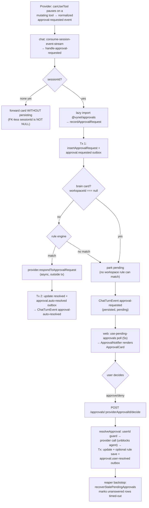

# Approvals — Structure

> The code map and connections for the `approvals` module. For the concepts behind it, see [overview.md](./overview.md).
>
> Folders touched: `packages/approvals/src/` · `apps/local-api/src/routes/approvals/` · `apps/local-api/src/services/` · `apps/local-web/src/composables/approvals/` · `apps/local-web/src/components/shell/` · `packages/ui/src/components/` · `packages/chat/src/turn-consumption/`

`approvals` is a **vertical-slice leaf** (`@vynel/approvals`): it owns its own `schema/`, `repositories/`, and operations. The two tables are **not** in the `@vynel/db` kernel — they live in the package (moved out of the kernel in Slice A, `0fe8192`). The kernel supplies only `Database`, `withTransaction`, the dialect helpers, and the shared outbox repo.

## File map

`► ` = entry point (public barrel or route/service the outside world mounts).

| Path | Role |
|---|---|
| ► `packages/approvals/src/index.ts` | Public barrel (`@vynel/approvals`) — re-exports row/enum types, 5 event constants + payload types, the pure fns, the core ops, and 4 repo reads. |
| `packages/approvals/src/schema/approval-requests.ts` | `approval_requests` table · `ActionKind` union · `ApprovalRequestStatus` · `ApprovalResolutionKind` · row types |
| `packages/approvals/src/schema/approval-rules.ts` | `approval_rules` table · `ApprovalRuleKind` · `ApprovalRuleMatcher` discriminated union · row types |
| `packages/approvals/src/schema/index.ts` | Schema barrel — drizzle config + schema-parity guard read the tables from here |
| `packages/approvals/src/repositories/approval-requests.ts` | requests repo — find by id / provider id · pending-for-session · **pending-for-user (global queue)** · workspace keyset list · stale-pending · insert · update · 90-day hard-delete |
| `packages/approvals/src/repositories/approval-rules.ts` | rules repo — find · list enabled (engine input) · list active (panel) · list soft-deleted before cutoff · insert · update · soft-delete · hard-delete-by-ids |
| `packages/approvals/src/repositories/index.ts` | Repository barrel — the ops import their repos through here |
| `packages/approvals/src/approvals-types.ts` | Re-exports all row + enum types from `./repositories`; re-exports `StructuralLogger` (type-only, from `@vynel/logger`) |
| `packages/approvals/src/approvals-events.ts` | 5 event constants + 3 payload interfaces (`ApprovalRequestedPayload`, `ApprovalResolvedPayload`, `ApprovalRuleCreatedPayload`) |
| `packages/approvals/src/derive-action-kind.ts` | Pure fn — `deriveActionKind(toolName)` + `ACTION_KIND_MAPPINGS` (the taxonomy source of truth). Also its own subpath export `@vynel/approvals/action-kind`. |
| `packages/approvals/src/rules/evaluate-approval-rules.ts` | Pure fn — `evaluateApprovalRules(...)` → `RuleMatch \| null` (first enabled match wins) |
| `packages/approvals/src/rules/describe-approval-rule.ts` | Pure fn — `describeApprovalRule(matcher)` → human-readable label (stored at insert) |
| `packages/approvals/src/rules/save-approval-rule-from-decision.ts` | Sync helper called inside `resolveApproval`'s tx — insert rule + `approval.rule-created` outbox |
| `packages/approvals/src/rules/soft-delete-approval-rule.ts` | Ownership check → tx: repo soft-delete (no outbox event in Phase 1; comment explains why) |
| `packages/approvals/src/rules/purge-deleted-approval-rules.ts` | Core op — hard-delete rules soft-deleted >30 days ago |
| `packages/approvals/src/requests/record-approval-request.ts` | **Hot path**: Tx 1 insert + outbox → (brain card parks) → rule eval → optional provider call + Tx 2 update + outbox. Returns `pending` or `auto-approved`. |
| `packages/approvals/src/requests/resolve-approval.ts` | Provider call (async, outside tx) → Tx: update + optional rule save + outbox. **User-scoped** tenant guard. Ordering invariant: provider first. |
| `packages/approvals/src/requests/recover-stale-pending-approvals.ts` | Reaper core op — per-row `requestedAt + timeoutMs×2` check → optional `unblockProvider` → tx update + `approval.timed-out` outbox |
| `packages/approvals/src/requests/purge-old-approval-requests.ts` | Core op — hard-delete audit rows older than 90 days |
| ► `apps/local-api/src/routes/approvals/index.ts` | Workspace-scoped Hono sub-apps: `approvalsApp` (3 routes) + `approvalRulesApp` (2 routes) |
| ► `apps/local-api/src/routes/approvals/user-scoped.ts` | **User-scoped** `approvalsUserApp` — the global queue (2 routes), mounted at `/approvals` |
| `apps/local-api/src/routes/approvals/schemas.ts` | Zod request + response schemas (shared by both surfaces) |
| `apps/local-api/src/routes/approvals/serializers.ts` | Row → wire (`@vynel/contracts` cast targets); Date → ISO-8601; drops tenant/internal columns |
| ► `apps/local-api/src/services/approvals-recovery-service.ts` | 60s reaper service — started in `server.ts`; wires `recoverStalePendingApprovals` with a provider-deny `unblockProvider` |
| `packages/ui/src/components/ApprovalCard.vue` | **Shared card** — data-blind: props (`toolName`, `toolInput`, `actionKind?`, `contextLabel?`, `compact?`, `busy?`), emits `approve`/`deny`. Works inline or as a compact toast. |
| `apps/local-web/src/components/shell/ApprovalNotifier.vue` | Shell-level notifier — bottom-right toast stack (max 3 visible) rendering `ApprovalCard` for every pending approval, decidable from any view |
| `apps/local-web/src/composables/approvals/use-pending-approvals.ts` | vue-query poll (`refetchInterval: 5000`) of `approvals.listPending` |
| `apps/local-web/src/composables/approvals/use-decide-approval.ts` | vue-query mutation → `approvals.decide`; invalidates on settle |
| `apps/local-web/src/composables/approvals/approval-keys.ts` | Query-key factory (`["approvals", …]`) |

## Data & persistence

Both tables are **baseline-folded into `packages/db/src/migrations-sqlite/0000_baseline.sql`** — there is no standalone approvals migration. The Postgres mirror lives under `packages/cloud-db/migrations-postgres` (Phase-2 dialect). The tables are defined in the package (`src/schema/`) and picked up by the drizzle config + schema-parity guard.

**`approval_requests`** — append-only audit log. No `deletedAt`. Hard-purged after 90 days.

| Column | Type | Notes |
|---|---|---|
| `id` | id (PK) | Vynel UUID; `randomUUID()` at the core layer |
| `providerApprovalId` | text (unique index) | SDK-supplied identifier; the hot-path lookup key |
| `userId` | id (FK → `users`, cascade) | tenant owner |
| `workspaceId` | text (**nullable**, FK → `workspaces`, cascade) | **NULL = a global-root (brain) card** — persisting it (rather than dropping it) is what makes brain cards reachable in the user queue. Loose `text().references(...)` because `id()` is NOT NULL by contract. |
| `sessionId`, `parentMessageId`, `toolUseId` | text (NOT NULL) | Loose refs to chat — no FK (D13) |
| `toolName` | text | Raw SDK tool name |
| `actionKind` | text (`ActionKind`) | Derived once at insert; never re-derived (D8) |
| `toolInput` | json | The input the agent intended to pass |
| `status` | text | `pending` · `resolved` |
| `resolutionKind` | text (null) | `approved` · `denied` · `timed-out` · `cancelled` |
| `resolutionReason` | text (null) | User-provided denial reason |
| `resolutionUpdatedInput` | json (null) | Edit-before-approve: the modified input |
| `autoApprovedByRuleId` | text (null, FK → `approval_rules`, SET NULL) | null = manual decision |
| `timeoutMs` | integer (NOT NULL) | **No DB default** — the 5-min default (`DEFAULT_TIMEOUT_MS`) is set at the core layer in `record-approval-request.ts` |
| `requestedAt`, `resolvedAt` | timestamp | |

Indexes: `provider_approval_id` (unique); `(session_id, status)`; `(workspace_id, requested_at)`; `user_id`; `(status, requested_at)`; `tool_use_id`.

**`approval_rules`** — user-saved auto-approve preferences. Soft-delete (`deletedAt`); 30-day retention.

| Column | Type | Notes |
|---|---|---|
| `id` | id (PK) | |
| `userId`, `workspaceId` | id (FK → users/workspaces, cascade) | both NOT NULL (a rule is always workspace-scoped) |
| `ruleKind` | text | `auto-approve-action-kind` · `auto-approve-tool-name` |
| `description` | text | Human label from `describeApprovalRule` at insert; stored verbatim |
| `matcher` | json (`ApprovalRuleMatcher`) | Structured discriminated union; consumed by the engine |
| `isEnabled` | boolean | Set false on soft-delete |
| `deletedAt` | timestamp (null) | Soft-delete column; all active reads filter `IS NULL` |
| `createdAt`, `updatedAt` | timestamp | |

Indexes: `(workspace_id, is_enabled)`; `(workspace_id, deleted_at)`; `user_id`.

## Repositories

Functional, `db`-first, sync (better-sqlite3 tx contract). **Only four leave the package** via `index.ts` (marked ►); the rest are package-internal, called by the ops.

| Function | Table | Purpose |
|---|---|---|
| `findApprovalRequestById` | requests | one row or null |
| ► `findApprovalRequestByProviderApprovalId` | requests | hot-path lookup (unique index); route ownership pre-check |
| `listPendingApprovalRequestsForSession` | requests | pending rows for one session |
| ► `listPendingApprovalsForUser` | requests | **the global queue** — every pending row for a user across all sessions/workspaces + the brain, newest first |
| ► `listApprovalRequestsForWorkspace` | requests | keyset cursor on `(requestedAt desc, id desc)`; caps 50/200 |
| `listStalePendingApprovalRequests` | requests | pending rows older than a staleness cutoff (reaper input) |
| `insertApprovalRequest` | requests | create (id supplied by caller) |
| `updateApprovalRequest` | requests | patch status / resolution fields |
| `hardDeleteApprovalRequestsRequestedBefore` | requests | 90-day purge |
| `findApprovalRuleById` | rules | one active rule or null |
| `listEnabledApprovalRulesForWorkspace` | rules | active + enabled rules (engine input) |
| ► `listApprovalRulesForWorkspace` | rules | active rules for the settings panel |
| `listSoftDeletedApprovalRulesBefore` | rules | soft-deleted before cutoff (purge input) |
| `insertApprovalRule` | rules | create |
| `updateApprovalRule` | rules | patch (auto-bumps `updatedAt`) |
| `softDeleteApprovalRule` | rules | sets `deletedAt` + `isEnabled=false`; idempotent guard in WHERE |
| `hardDeleteApprovalRulesById` | rules | 30-day purge |

## Core operations

| Operation | Sync/async | What it does | Key calls |
|---|---|---|---|
| `recordApprovalRequest` | async | Tx 1: insert + `approval.requested` outbox. **Brain card (`workspaceId===null`) parks pending — skips rule eval.** Else eval workspace rules (outside tx); on match: provider call (async) + Tx 2 update + `approval.auto-resolved`. Returns `pending` or `auto-approved`. | `insertApprovalRequest`, `evaluateApprovalRules`, `provider.respondToApprovalRequest`, `updateApprovalRequest`, `insertOutboxEvent` |
| `resolveApproval` | async | Find by providerApprovalId → **userId-only tenant guard** (404 on miss/other-user; no enumeration) → provider call (async, outside tx) → Tx: update + optional `saveApprovalRuleFromDecision` (guarded on non-null workspace) + `approval.user-resolved` | `findApprovalRequestByProviderApprovalId`, `provider.respondToApprovalRequest`, `updateApprovalRequest`, `saveApprovalRuleFromDecision`, `insertOutboxEvent` |
| `saveApprovalRuleFromDecision` | sync (inside tx) | Build matcher → insert rule + `approval.rule-created` outbox | `insertApprovalRule`, `describeApprovalRule`, `insertOutboxEvent` |
| `softDeleteApprovalRule` | sync | Ownership check → tx: soft-delete rule (no outbox event) | `findApprovalRuleById`, `softDeleteApprovalRule` (repo) |
| `evaluateApprovalRules` | sync, pure | Iterate enabled rules; first match wins | — |
| `deriveActionKind` | sync, pure | Map tool name → `ActionKind` via `ACTION_KIND_MAPPINGS` then mcp write-verb heuristic | — |
| `describeApprovalRule` | sync, pure | Matcher → human label | — |
| `recoverStalePendingApprovals` | async (reaper) | Scan stale pending rows; per-row: optional `unblockProvider` (deny) → tx update + `approval.timed-out` outbox | `listStalePendingApprovalRequests`, `updateApprovalRequest`, `insertOutboxEvent` |
| `purgeOldApprovalRequests` | sync | Hard-delete audit rows >90 days | `hardDeleteApprovalRequestsRequestedBefore` |
| `purgeDeletedApprovalRules` | sync | Hard-delete rules soft-deleted >30 days | `listSoftDeletedApprovalRulesBefore`, `hardDeleteApprovalRulesById` |

## HTTP surface

**Two mount families** in `apps/local-api/src/app.ts` — a workspace-scoped pair and a user-scoped global queue. Locked Hono protocol: `describeRoute` → `validator` → `...workspaceScoped`/`...userScoped` → handler; handlers throw typed errors, the global `onError` maps them (`NotFoundError`→404, `ConflictError`→409). **No `x-mcp` on any route** (D16 — an agent must never self-approve).

**`approvalsApp`** — `app.route('/workspaces/:workspaceId/approvals', …)`

| Method | Path | Purpose | SDK name |
|---|---|---|---|
| GET | `/pending` | Workspace pending list (filtered from workspace list) | `approvalsWorkspace.listPending` |
| GET | `/recent` | Cursor-paginated audit view (max 200) | `approvalsWorkspace.listRecent` |
| POST | `/:providerApprovalId/decide` | Resolve — approve (+`updatedInput`/`rememberRule`) or deny (+`reason`). Route enforces the workspace boundary since the core op is user-scoped. | `approvalsWorkspace.decide` |

**`approvalRulesApp`** — `app.route('/workspaces/:workspaceId/approval-rules', …)`

| Method | Path | Purpose | SDK name |
|---|---|---|---|
| GET | `/` | List active (non-deleted) rules | `approvalRules.list` |
| DELETE | `/:ruleId` | Soft-delete a rule (204) | `approvalRules.delete` |

**`approvalsUserApp`** — `app.route('/approvals', …)` (the global queue, no workspace prefix)

| Method | Path | Purpose | SDK name |
|---|---|---|---|
| GET | `/pending` | Every pending approval for the user (all sessions/workspaces + brain) | `approvals.listPending` |
| POST | `/:providerApprovalId/decide` | Resolve from any surface | `approvals.decide` |

## MCP surface

**None.** `approvals` ships no `McpFeatureDescriptor` (verified — no descriptor in `packages/approvals/src`). This is deliberate (D16): approvals is the human-in-the-loop gate; exposing decide/rule tools would let an agent self-approve. The domain participates in MCP only as the thing that *gates* mutating tools, never as a tool provider.

## Background jobs

| Runner | Where | Schedule | What runs |
|---|---|---|---|
| Approvals recovery service | `apps/local-api/src/services/approvals-recovery-service.ts` (started in `server.ts:129`) | every 60 s | `recoverStalePendingApprovals` — denies the parked provider approval (steer-to-text reason) AND marks the row `timed-out`; also sweeps post-restart rows whose in-memory registry died |
| `purgeOldApprovalRequests` | `packages/approvals/src/requests/` | *defined but not yet wired* | 90-day audit hard-delete — exported, no scheduler calls it in KLONE yet |
| `purgeDeletedApprovalRules` | `packages/approvals/src/rules/` | *defined but not yet wired* | 30-day soft-deleted-rule hard-delete — exported, no scheduler calls it yet |

> There is **no `apps/worker` approvals job** in KLONE (worker hosts only `knowledge`). Recovery moved to the api-side service; the two purge ops await a scheduler home.

## Web surface

The KLONE web model is **poll-and-notify**, not the v1 inline-SSE card:

- **`ApprovalCard.vue`** (`packages/ui`) — the shared, data-blind trust primitive. Props in, `approve`/`deny` out. Renders an action label + JSON `toolInput` preview; `file-delete`/`shell-command`/`email-send` render as danger. `compact` gives the toast variant. It surfaces **neither** the "always allow" rule selector nor an edit-before-approve field (see gotchas).
- **`ApprovalNotifier.vue`** (`apps/local-web/src/components/shell/`) — mounted in the shell so a pending card slides in bottom-right from any view. Shows up to 3, "+N more waiting" beyond that. Maps a null `workspaceId` to "your assistant's own workspace"; otherwise resolves the workspace name via `useWorkspaceList`.
- **`use-pending-approvals.ts`** — the one always-on real query; polls `approvals.listPending()` every 5 s (`retry: false`).
- **`use-decide-approval.ts`** — mutation calling `approvals.decide(...)`; invalidates `approvalKeys.all` on settle.
- **`approval-keys.ts`** — query-key factory.

Only the **user-scoped** routes (`approvals.listPending` / `.decide`) have a web consumer today. The workspace-scoped list/recent routes and **all rule routes** have no `local-web` caller yet (no rules panel, no recent/audit view in the KLONE web app).

## Pipeline — "mutating tool intercepted → card surfaces → user decides → agent unblocked"



1. The provider's `canUseTool` callback pauses on a mutating tool and emits a normalized `approval-requested` event. **Which tools trigger this is decided upstream in providers/MCP** (`canUseTool` / `mutatingToolNames`); approvals receives an already-intercepted event and never decides *what* needs a card.
2. `packages/chat/src/turn-consumption/consume-session-event-stream.ts` routes the event to `handle-approval-requested.ts`.
3. `handle-approval-requested` **lazy-imports** `@vynel/approvals` (keeps it off chat's static graph) and calls `recordApprovalRequest` synchronously — the turn stream needs the approval id before it can emit the card. A card with no session row yet is forwarded without persisting; a brain card (null workspace) now **does** persist.
4. `recordApprovalRequest`: Tx 1 (insert + outbox) → brain card parks / else rule eval → on match, provider unblock + Tx 2 → returns `pending` or `auto-approved`.
5. Chat emits the matching `ChatTurnEvent` (`approval-requested` card or `approval-auto-resolved` pill).
6. Web polls `approvals.listPending` (5 s) and `ApprovalNotifier` renders `ApprovalCard` for each pending row, from any view.
7. User approve/deny → `POST /approvals/:providerApprovalId/decide` → `resolveApproval`: provider call first (unblocks the SDK), then the tx (update + optional rule save + `approval.user-resolved`).
8. Backstop: the 60 s recovery service reaps any unanswered/orphaned pending row as `timed-out`, denying the parked provider approval so the agent never hangs.

## Connections

**Summary:** approvals is an **active gate** — [chat](../chat/overview.md) calls it synchronously mid-stream (via a lazy import), and it calls back into [providers](../providers/overview.md) to unblock the paused agent. It publishes five outbox events; nothing consumes them *inside* this package. It is a leaf: it imports only kernel + shared.

| Unit | Direction | Mechanism | What crosses |
|---|---|---|---|
| `@vynel/db` | out | import | `Database`, `withTransaction`, dialect helpers, `insertOutboxEvent`, `users`/`workspaces` refs |
| `@vynel/providers` | out | import | `resolveAiAgentProvider`, `AiAgentProviderId`, `ApprovalDecision`, `DEFAULT_PROVIDER_ID` → `respondToApprovalRequest` |
| `@vynel/errors` | out | import | `NotFoundError`, `ConflictError` |
| `@vynel/logger` | out | import (type) | `StructuralLogger` |
| [chat](../chat/overview.md) | in (caller) | **lazy** import | `handle-approval-requested` calls `recordApprovalRequest`; chat's outbox consumer reads `approval.*` to mirror onto `chat_tool_calls.approvalStatus` |
| [local-api](../local-api/overview.md) | in | route mount + service | 7 routes across 3 sub-apps; `approvals-recovery-service` wires the reaper |
| [session](../session/overview.md) | in | import | `listPendingApprovalsForUser` (delegation-tick test only, today) |
| `@vynel/contracts` | out | cast target | serializers cast rows to `ApprovalRequestResponse` / `ApprovalRuleResponse` (`approvals/approval-http`) |
| [local-web](../local-web/overview.md) | in | SDK + shared card | `ApprovalNotifier` + 3 composables (poll/decide) via the generated SDK; `ApprovalCard` from `@vynel/ui` |

**Events published** (all co-committed in the same tx as their state change):
- `approval.requested` — `recordApprovalRequest` Tx 1
- `approval.auto-resolved` — `recordApprovalRequest` Tx 2 (rule fast path)
- `approval.user-resolved` — `resolveApproval` tx
- `approval.timed-out` — `recoverStalePendingApprovals` per-row tx
- `approval.rule-created` — `saveApprovalRuleFromDecision` (inside `resolveApproval` tx)

**Events consumed:** none. The package registers no outbox consumer; downstream consumption is chat's concern.

```mermaid
flowchart LR
    db[(db)] --> AP[approvals]
    prov[providers] --> AP
    chat[chat] -. lazy import .-> AP
    AP -->|respondToApprovalRequest| prov
    AP --> obx[(outbox events)]
    obx -. approval.* .-> chat
    api[local-api routes + reaper] --> AP
    web[local-web] -. SDK .-> api
    AP --> con[contracts types]
```

## Config & gotchas

- **Phase-1 sync transaction discipline.** `withTransaction(db, (tx) => {...})` is synchronous (better-sqlite3). Every async provider call happens *outside* the tx; an `await` inside `withTransaction` is a runtime error.
- **`providerApprovalId` vs `id`.** The hot-path/decide lookup is by `providerApprovalId` (SDK-supplied, unique-indexed); the row PK is the Vynel `id`. Conflating them is the classic wiring mistake.
- **Brain cards persist (Slice B).** `approval_requests.workspaceId` is nullable; `handle-approval-requested` no longer drops `workspaceId===null`. Brain cards park pending (no workspace rule can match) and reach the user's global queue. `resolveApproval` is therefore **user-scoped** — `workspaceId` is not in `ResolveApprovalInput`; the tenant guard is `userId` alone.
- **`resolveApproval` provider-first ordering is intentional.** If the provider unblock throws, the row stays pending and the reaper cleans it up. The inverse (row resolved but agent never unblocked) would hang the agent forever — strictly worse.
- **Reaper is a denial, audit is a timeout.** The parked agent sees a *denial* (with the report-as-text steer) while the row records `timed-out` — deliberate: the model gets a clean signal, the user sees truthful history. Non-`NotFound` unblock failures skip the row this tick (retried next tick) rather than marking it resolved.
- **Taxonomy gap — `file-delete` is unreachable.** `ACTION_KIND_MAPPINGS` has no Delete-tool mapping, so `deriveActionKind` never emits `file-delete`, even though it's a declared `ActionKind` and a danger kind in the UI. `external-action` only arises from the mcp write-verb heuristic. Adding a delete mapping is a deliberate change.
- **`timeoutMs` has no DB default.** The 5-minute default is core-layer (`DEFAULT_TIMEOUT_MS` in `record-approval-request.ts`), not a schema default.
- **`cancelled` is reserved, never emitted.** The `ApprovalResolutionKind` union includes `cancelled`; no Phase-1 path produces it. Consumers should handle it gracefully.
- **`softDeleteApprovalRule` emits no outbox event.** No Phase-1 consumer needs rule-deletion; the panel would re-fetch. Add the constant + emit together if a consumer ever needs it.
- **Purge ops are unwired.** `purgeOldApprovalRequests` and `purgeDeletedApprovalRules` are exported and tested but no scheduler calls them in KLONE yet — the retention windows won't actually reap until a job home lands.
- **Card under-surfaces the backend.** `ApprovalCard.vue` emits bare approve/deny. The backend + API fully support `rememberRule` (auto-approve rules) and `updatedInput` (edit-before-approve), but the KLONE web UI wires neither yet; the workspace rule routes have no web consumer.

---
*Mapped from the code on disk, 2026-07-14. If you change this module, update this file and [overview.md](./overview.md).*
