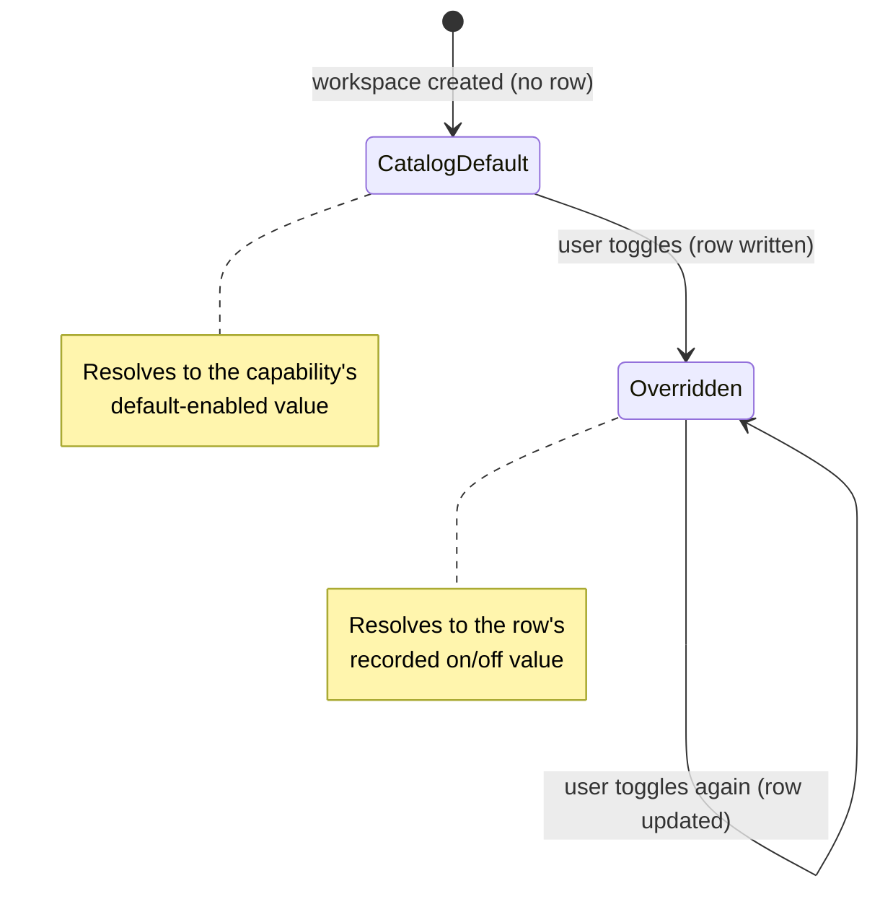

# Capabilities — Overview

> The per-workspace on/off switches that decide which parts of Vynel the assistant may use in a given room — the spine that gates memory, knowledge, and the notebook.
>
> **Status:** shipped · **Depends on:** [db](../db/overview.md) (kernel) · **Code map:** [structure.md](./structure.md)

## Purpose

Every workspace is a separate room, and not every room should have the same powers. Capabilities is the small module that answers one question per workspace: *is this capability turned on here?* It ships a fixed **catalog** of the first-party powers Vynel offers — remembering facts, searching indexed documents, consulting curated playbooks — and records, per workspace, which of them the user has switched on or off.

It is deliberately thin. Capabilities holds no logic of its own for memory or knowledge or the notebook — it owns only the *enable state* and the catalog that names the choices. The actual behavior each capability unlocks lives in its own module; capabilities is the gate those modules pass through. When the assistant composes a turn, this module tells it which powers are live, and the turn builder grants tools and injects prompt text accordingly. Turn a capability off and its tools are denied and its instructions withheld — the assistant is never steered toward a power it can't use.

The design's load-bearing idea is **catalog-first resolution**: the default answer comes from the catalog, and a stored row is only ever an *explicit override*. Nothing seeds rows when a workspace is created, so a capability that shipped as "on by default" is on everywhere until a user deliberately turns it off — a fresh install is fully-powered, not silently dead.

## What it can do

- **List a workspace's capabilities** — every first-party catalog capability paired with whether it's enabled here, so a settings panel can render the full set as toggles regardless of which ones have been touched.
- **Toggle a capability** on or off for a workspace — the first toggle records an override; later toggles update it. The change is scoped to the owning user.
- **Report the enabled set** to the turn builder — the resolved list of live capabilities a session consumes each turn to decide which tools and prompt contributions to include.
- **Expose the catalog default set** — the capabilities that are on with no override at all, used by the global root (which has no workspace, so it can carry no override rows) so its default-on tools aren't wrongly denied.
- **Look up a capability by id** — resolving a known first-party id to its catalog entry, or nothing when the id is an unknown (e.g. future marketplace) plugin.

## Responsibilities

**Owns** — the first-party capability catalog (the fixed set of names, descriptions, scope, and default-on state) and the per-workspace enable state: the table of override rows, the create-or-update of a toggle, the catalog-first resolution rule that turns "no row" into a default and "a row" into an override, and the read paths that feed both the settings panel and the turn builder. It owns the *fact* that a capability is on or off — nothing about what that capability then does.

**Does not own** —
- what each capability actually *does* — the behavior lives in its own module: [memory](../memory/overview.md), [knowledge](../knowledge/overview.md), and the notebook;
- how enablement becomes a live turn — the actual MCP-tool gating and prompt composition happen in the [session](../session/overview.md) build and the [local-api](../_apps/local-api/overview.md) turn assembly, which read this module's enabled set;
- per-capability *configuration* (a knowledge folder, memory settings) — that is typed and owned by each capability's own module; this module records only the on/off bit, never a config blob;
- the HTTP surface that exposes the toggles — the [local-api](../_apps/local-api/overview.md) app hosts those routes and validates ids against the catalog at the boundary;
- marketplace / third-party capabilities (a later phase) — those are identified by an open-text plugin id that this catalog deliberately does not describe.

## Concepts & vocabulary

| Term | Meaning |
|---|---|
| **Capability** | One named power Vynel can offer in a workspace — today: memory, knowledge, notebook. A catalog entry carries a display name, description, scope, first-party flag, and default-on state. |
| **Catalog** | The fixed, first-party list of capabilities, held as pure data. It names the choices and their defaults; it is not the enable state. |
| **Enable state / override** | The stored record that a capability is on or off *for a specific workspace*. It exists only when someone has toggled — its absence means "use the catalog default", so a stored row is always an explicit override. |
| **Catalog-first resolution** | The rule every read applies: no override row → the capability's default; a row → its recorded value. |
| **Default-enabled** | Whether a capability is on with no override at all. Every first-party capability today defaults on, so a fresh workspace is fully powered before anyone touches a toggle. |
| **First-party vs. marketplace** | First-party capabilities are the catalog's known set. Marketplace capabilities (a later phase) use an arbitrary plugin id stored as open text and are not in the catalog. |
| **Scope** | Where a capability's enablement applies. In the current phase every capability is *workspace*-scoped — there is no global memory or global knowledge toggle. |
| **Enabled set** | The resolved list of live capabilities for a workspace, handed to the turn builder each turn to gate tools and prompt text. |

## Rules & invariants

- **The catalog is the default, a row is an override.** Nothing seeds enable rows at workspace creation. A capability with no row resolves to its catalog default; a row is written only when a user toggles, either direction. Both the settings panel and the turn builder resolve the same way, so the panel never shows "off" while the session composes the capability in.
- **A default-on capability is on until someone turns it off.** Every first-party capability ships default-on, so a fresh install is fully powered — the earlier "no row means off" default silently killed memory and knowledge in every new workspace, and catalog-first resolution is the fix.
- **Enablement is workspace-scoped, always.** Capabilities are never global; the enable row is a hard child of a workspace. The global root, which has no workspace, carries no override rows and falls back to the catalog default set.
- **A toggle is tenant-guarded.** Updating an existing enable row is filtered by the owning user; an update the filter rejects fails loud rather than silently no-opping.
- **The catalog describes first-party only.** Known ids resolve to catalog entries; an unknown (marketplace) id resolves to nothing here. Ids are validated against the catalog at the HTTP boundary, not inside the core toggle.
- **This module holds no per-capability config.** The enable state is a single on/off bit. Any configuration a capability needs is typed and lives in that capability's own module.
- **Toggling is a user action, not an agent tool.** Enabling or disabling a capability is exposed to people through the settings surface; it is deliberately not an agent-callable tool.

## Lifecycle

## Where it sits in the bigger picture

Capabilities is a quiet gate that most of Vynel's powers pass through. It sits directly on the [db](../db/overview.md) kernel and imports nothing sideways — a true leaf. On the way in, the [local-api](../_apps/local-api/overview.md) app hosts the toggle routes that the settings panel drives. On the way out, the [session](../session/overview.md) build and the local-api turn assembly read its enabled set each turn: enabled capabilities get their MCP tools granted and their prompt contributions injected, disabled ones get their tools denied and their instructions withheld. The capabilities it gates — [memory](../memory/overview.md), [knowledge](../knowledge/overview.md), and the notebook — own everything they *do*; capabilities owns only the switch. A later marketplace phase will let third-party plugins register as capabilities too, identified by open-text ids this first-party catalog leaves room for.

---
*Mapped from the code on disk, 2026-07-14. If you change this module, update this file and [structure.md](./structure.md).*
