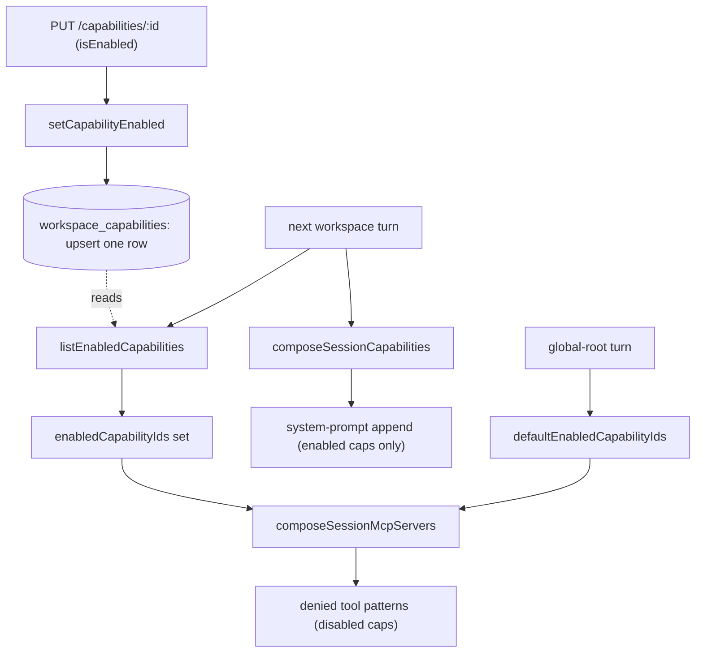
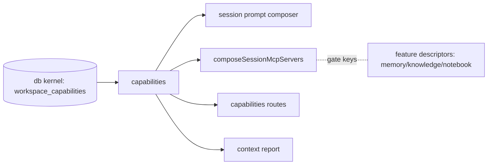

# Capabilities — Structure

> **DRIFT (2026-08-14, tool-policy arc — remap on next touch).** This leaf now DOES own a
> schema: `tool_policies` (`packages/capabilities/src/schema/`, migration 0039) with a
> functional repo, a `tool-policy/` concern (`resolveEffectiveToolPolicies`,
> `setToolPolicyOverride`), and a `TOOL_POLICY_UPDATED` outbox event — superseding this map's
> "no schema, no events" framing. The capability toggles also gained their first web UI
> (`CapabilityTogglesPanel` inside the Tool access section), superseding "Web surface: none".
> Current map: [`_platform/tool-policy`](../_platform/tool-policy/structure.md) +
> `docs/module-notes/tool-policy.md`.
>
> The code map and connections for the capabilities module. For the concepts behind it, see [overview.md](./overview.md).
>
> Folders touched: `packages/capabilities/src/` · `packages/db/src/{schema,repositories}/capabilities/` · `apps/local-api/src/routes/capabilities/` · `apps/local-api/src/sessions/` · `apps/local-api/src/streams/` · `apps/mcp/src/` · `packages/instructions/src/mcp/` · `packages/session/src/runtime/`

Capabilities is an unusual leaf: the `@vynel/capabilities` package is **pure logic + data** — a static catalog and three catalog-first resolvers — while its **table and repository live in the `@vynel/db` kernel**, not in the leaf (contrast [memory](../memory/structure.md), which owns its own `schema/`). The leaf depends only on `@vynel/db` (`packages/capabilities/package.json`). No outbox events, no background jobs. Its whole job is answering one question each turn: *which capabilities are on for this workspace?* — and the session build turns that answer into gated tools + prompt contributions.

## File map

► = entry point.

| Path | Role |
|---|---|
| ► `packages/capabilities/src/index.ts` | public barrel — the single `.` export; re-exports catalog fns, types, and the three resolvers |
| `packages/capabilities/src/catalog.ts` | the static `CAPABILITY_CATALOG` (3 first-party entries, all `defaultEnabled`) + `findCapabilityById` (find→null) + `defaultEnabledCapabilityIds()` (the global-root fallback set) |
| `packages/capabilities/src/capabilities-types.ts` | `Capability`, `CapabilityId` union (`'memory' \| 'knowledge' \| 'notebook'`), `CapabilityScope` (`'workspace'` only) |
| `packages/capabilities/src/list-enabled-capabilities.ts` | `listEnabledCapabilities` — catalog-first resolve of the *enabled* set for a workspace (the session build's read) |
| `packages/capabilities/src/list-capability-status.ts` | `listCapabilityStatusForWorkspace` + `CapabilityStatus` — every catalog entry paired with its on/off (the panel read) |
| `packages/capabilities/src/set-capability-enabled.ts` | `setCapabilityEnabled` + `SetCapabilityEnabledInput` — upsert the per-workspace enable row |
| `packages/capabilities/src/*.test.ts` | colocated tests for the three resolvers |
| `packages/db/src/schema/capabilities/workspace-capabilities.ts` | the `workspace_capabilities` table (kernel-owned) + `WorkspaceCapabilityRow` types |
| `packages/db/src/repositories/capabilities/workspace-capabilities.ts` | functional repo — `findWorkspaceCapability` / `listWorkspaceCapabilities` / `insertWorkspaceCapability` / `updateWorkspaceCapabilityEnabled` |
| ► `apps/local-api/src/routes/capabilities/index.ts` | HTTP entry — 2 routes (`GET /`, `PUT /:capabilityId`); no MCP exposure |
| `apps/local-api/src/routes/capabilities/schemas.ts` | Zod param/body/response schemas; the catalog id enum lives here for the boundary check |
| `apps/local-api/src/sessions/compose-session-mcp-servers.ts` | the **tool-gating seam** — denies a disabled capability's MCP tools (reads `enabledCapabilityIds`) |
| `packages/session/src/runtime/compose-session-capabilities.ts` | the **prompt seam** — appends each enabled capability's system-prompt contribution |
| `apps/mcp/src/vynel-mcp-feature-descriptor.ts` | `VYNEL_CAPABILITY_GATED_TOOLS` — maps `memory` (6 tools) + `knowledge` (7 tools) to their `vynel`-server tool names |
| `packages/instructions/src/mcp/notebook-mcp-feature-descriptor.ts` | the `notebook` gate — maps the capability to its 2 `vynel-notebook` read tools |

## Data & persistence

The one owned table, **`workspace_capabilities`**, lives in the **kernel** (`packages/db/src/schema/capabilities/workspace-capabilities.ts`), not in the leaf — so it registers in `drizzle.sqlite.config.ts` like any kernel table and ships in the baseline migration (`packages/db/src/migrations-sqlite/0000_baseline.sql:449-463`). No separate numbered migration.

One row per `(workspace, capability)` recording **only** the enable flag — no config column (per-capability config is typed and lives in its owning domain). A row is an **override**; its absence means "use the catalog default."

| Column | Type | Notes |
|---|---|---|
| `id` | id (PK) | UUID supplied by `setCapabilityEnabled` |
| `userId` | id (FK → `users`, cascade) | tenant boundary; every row carries it (Phase-2-ready) |
| `workspaceId` | id (FK → `workspaces`, cascade) | hard NOT-NULL — capabilities are always workspace-scoped |
| `capabilityId` | text (NOT NULL) | **open text** — first-party catalog id today, arbitrary marketplace plugin id later; not a DB enum |
| `isEnabled` | boolean (NOT NULL) | the toggle; no soft-delete — disabling flips this flag |
| `createdAt` / `updatedAt` | timestamp | |

Indexes: `idx_workspace_capabilities_workspace` (`workspaceId`) · `idx_workspace_capabilities_user` (`userId`) · **unique** `uniq_workspace_capabilities_workspace_capability` (`workspaceId`, `capabilityId`). No FTS/vec virtual indices. No `deletedAt`.

> **The catalog is not in the DB.** The three first-party capabilities are a static `readonly` array in `catalog.ts`; the table stores only per-workspace *overrides* of their defaults. Marketplace ids (Phase C) will land in this same table as open text without a catalog entry.

## Repositories

Kernel repo (`packages/db/src/repositories/capabilities/workspace-capabilities.ts`), functional, `db`-first, sync (Phase 1).

| Function (db-first) | Purpose |
|---|---|
| `findWorkspaceCapability` | one row for `(workspaceId, capabilityId)` or `null` |
| `listWorkspaceCapabilities` | all override rows for a workspace |
| `insertWorkspaceCapability` | create the row on first toggle (throws on empty `.returning()`) |
| `updateWorkspaceCapabilityEnabled` | flip `isEnabled` — **`userId` tenant filter in the WHERE**; returns `null` if the filter rejects |

## Core operations

Three functions in the leaf, all sync, all **catalog-first**: no row → the catalog's `defaultEnabled`; a row → the explicit override.

| Operation | What it does | Key calls |
|---|---|---|
| `listEnabledCapabilities` | returns the `Capability[]` currently enabled for a workspace; ids not in the catalog (future marketplace) are skipped | `listWorkspaceCapabilities`, `CAPABILITY_CATALOG.filter(… ?? defaultEnabled)` |
| `listCapabilityStatusForWorkspace` | every catalog entry + its `isEnabled` (same resolution as above, so the panel never disagrees with the session) | `listWorkspaceCapabilities` |
| `setCapabilityEnabled` | upsert the enable row — `find` then `update` (tenant-filtered) **or** `insert`; **no transaction** (single write); catalog NOT validated here (open text) | `findWorkspaceCapability`, `updateWorkspaceCapabilityEnabled` / `insertWorkspaceCapability` |
| `defaultEnabledCapabilityIds` *(catalog helper)* | the `defaultEnabled` id set — used by global-root turns, which have no workspace and thus no override rows | `CAPABILITY_CATALOG.filter(defaultEnabled)` |

`setCapabilityEnabled` throws a plain `Error` if a row exists but the tenant filter rejects the update (fail-loud, shouldn't happen behind the workspace resolver).

## HTTP surface

Mounted at `/workspaces/:workspaceId/capabilities` (`apps/local-api/src/app.ts:144`). Locked Hono chain per route: `describeRoute` → `validator` → `...workspaceScoped` (user + workspace ownership). **No `featureGate`** on this subtree (contrast memory). No error mapping in the routes — typed `VynelError`s hit the global `onError`.

| Method | Path | Purpose | MCP tool |
|---|---|---|---|
| GET | `/` | `{ capabilities: CapabilityStatus[] }` — all three with on/off | — |
| PUT | `/:capabilityId` | enable/disable one (`{ isEnabled }`), returns the updated `CapabilityStatus` | — |

> **No MCP exposure — deliberate.** Neither route carries `x-mcp`: toggling a capability is a *user* action, not an agent tool (the header of `index.ts` records this as a rationalized decision, not an oversight). The `capabilityId` param is validated against the catalog enum (`z.enum(['memory','knowledge','notebook'])` in `schemas.ts`) — the one place the open-text column is boundary-checked back to the first-party set.

## MCP surface

Capabilities ships **no descriptor of its own**. Instead it is the **gate** other features' descriptors are read through. The tool-name maps live with the tools:

- `apps/mcp/src/vynel-mcp-feature-descriptor.ts` — `VYNEL_CAPABILITY_GATED_TOOLS`: `knowledge` → 7 `mcp__vynel__*` tools, `memory` → 6 `mcp__vynel__*` tools. A capability off ⇒ *all* of its tools denied (they gate together).
- `packages/instructions/src/mcp/notebook-mcp-feature-descriptor.ts` — `notebook` → 2 `mcp__vynel-notebook__*` read tools.

`composeSessionMcpServers` (`apps/local-api/src/sessions/compose-session-mcp-servers.ts`) walks each descriptor's `capabilityGatedTools`, and for every capability id **not** in the passed `enabledCapabilityIds` set pushes its tools onto `deniedMcpToolPatterns`. If *every* gated tool of a feature is denied, that feature's prompt contribution is dropped too (so the model isn't steered to call tools that can only fail — the notebook is the first feature to combine a gate + a prompt).

## Web surface

**None yet.** No `local-web` toggle panel, composable, or `vynel.capabilities.*` SDK call exists on disk today (grep of `apps/local-web/src` finds only a prose mention of the word "capability" in `MarketplaceItemCard.vue`). The `GET /` + `PUT /:capabilityId` routes (SDK names `capabilities.list` / `capabilities.setEnabled`) are the intended backing for a future panel; the toggle UI is unbuilt. **This is drift versus any doc that assumes a shipped capabilities UI.**

## Pipeline — "a workspace's toggles shape the next turn"

1. User toggles: `apps/local-api/src/routes/capabilities/index.ts` (PUT) → `workspaceScoped` → `setCapabilityEnabled(c.var.db, …)` → upsert one `workspace_capabilities` row (`packages/capabilities/src/set-capability-enabled.ts`).
2. Next **workspace** turn (`apps/local-api/src/streams/chat-turn.ts:49` and `sessions/build-schedule-fire-deps.ts:45`) → `listEnabledCapabilities(db, workspaceId)` → `enabledCapabilityIds` set.
3. Tool gating: `composeSessionMcpServers([vynelWorkspaceDescriptor, notebookFeatureDescriptor], ctx, { enabledCapabilityIds })` (`apps/local-api/src/sessions/compose-session-mcp-servers.ts`) — a disabled capability's tools go to `deniedMcpToolPatterns` and its prompt is dropped.
4. Prompt: `composeSessionCapabilities(db, { workspaceId })` (`packages/session/src/runtime/compose-session-capabilities.ts`) appends `buildMemorySessionContribution` when `memory` is enabled (knowledge lands in Phase B).
5. **Global-root** turns (`apps/local-api/src/streams/global-root-turn.ts:110`, `sessions/run-global-root-turn.ts:155`) have no workspace ⇒ no override rows ⇒ they pass `defaultEnabledCapabilityIds()` so `defaultEnabled` tools (the notebook's) aren't wrongly denied.
6. The `/context` report (`apps/local-api/src/routes/chat/fetch-context-report.ts:19`) reuses the same `enabledCapabilityIds` so its tool count matches the live turn.

## Connections

**Summary:** capabilities is a **read-side leaf with no events** — pure config that the session build (both MCP-gate and prompt seams), the two turn families (chat + schedules + global-root), and the `/context` report read each turn. It depends only on the `@vynel/db` kernel; the table itself is kernel-owned.

| Unit | Direction | Mechanism | What crosses |
|---|---|---|---|
| db kernel (`@vynel/db`) | out | import | `Database`; the `workspace_capabilities` schema + repo (kernel-owned) |
| [session](../session/structure.md) | in | import | `composeSessionCapabilities` calls `listEnabledCapabilities` for the prompt append |
| local-api sessions/streams | in | import | `listEnabledCapabilities` / `defaultEnabledCapabilityIds` feed `composeSessionMcpServers` on every turn |
| local-api routes (`capabilities`, `chat/fetch-context-report`) | in | import | the 2 routes + the context-report tool count |
| [mcp](../_apps/mcp/structure.md) (`apps/mcp` descriptor) | in | id string | `memory` / `knowledge` in `VYNEL_CAPABILITY_GATED_TOOLS` — the gate keys |
| [instructions](../instructions/structure.md) (notebook descriptor) | in | id string | `notebook` in `capabilityGatedTools` |
| [memory](../memory/structure.md) | in (as gated feature) | id string | `'memory'` gate → its 6 tools + prompt contribution |
| local-web | — | — | no consumer yet (UI unbuilt) |

**Events published:** none. **Events consumed:** none — capabilities is a synchronous read/config domain with no outbox participation.

## Config & gotchas

- **The table lives in the kernel, not the leaf.** `@vynel/capabilities` owns no `schema/` or `repositories/` — the table + repo are under `packages/db/src/{schema,repositories}/capabilities/`. The leaf imports them via `@vynel/db/repositories/capabilities`. Don't look inside the leaf for the DDL.
- **Catalog-first is the whole design.** No `workspace_capabilities` row means the capability's `defaultEnabled` applies — and **all three first-party capabilities default ON**. This was a live fix (2026-07-11, comment in `capabilities-types.ts`): the old "no-row-means-off" default left memory + knowledge silently dead on fresh installs because nothing seeds rows.
- **`capabilityId` is open text, validated only at the HTTP boundary.** The column and `setCapabilityEnabled` accept any string (for future marketplace plugins); the route's `z.enum(['memory','knowledge','notebook'])` is the only enforcement back to the first-party set. `listEnabledCapabilities` silently skips ids not in the catalog.
- **Gating is split across two seams and three descriptors.** Prompt contribution: `composeSessionCapabilities` (in `@vynel/session`). Tool denial: `composeSessionMcpServers` (in `apps/local-api`). Tool-name maps: `apps/mcp` (memory/knowledge) + `packages/instructions` (notebook). A capability isn't "wired" until it appears in *both* a `capabilityGatedTools` map and, if it prompts, a descriptor `contributePrompt`.
- **Global-root has no toggles.** Global-root turns can't have override rows (no workspace), so they use `defaultEnabledCapabilityIds()` — a capability toggled off in a workspace is still on at the global root by design.
- **No web UI, no MCP tool, no events.** The toggle panel is unbuilt (see Web surface); enabling/disabling is intentionally *not* an agent tool; and the domain publishes/consumes nothing on the outbox.
- **`setCapabilityEnabled` runs no transaction** — it's a single insert *or* a single tenant-filtered update, so a tx would be ceremony. The tenant `userId` filter lives in `updateWorkspaceCapabilityEnabled`'s WHERE; a rejected update fails loud rather than no-opping.

---
*Mapped from the code on disk, 2026-07-14. If you change this module, update this file and [overview.md](./overview.md).*
