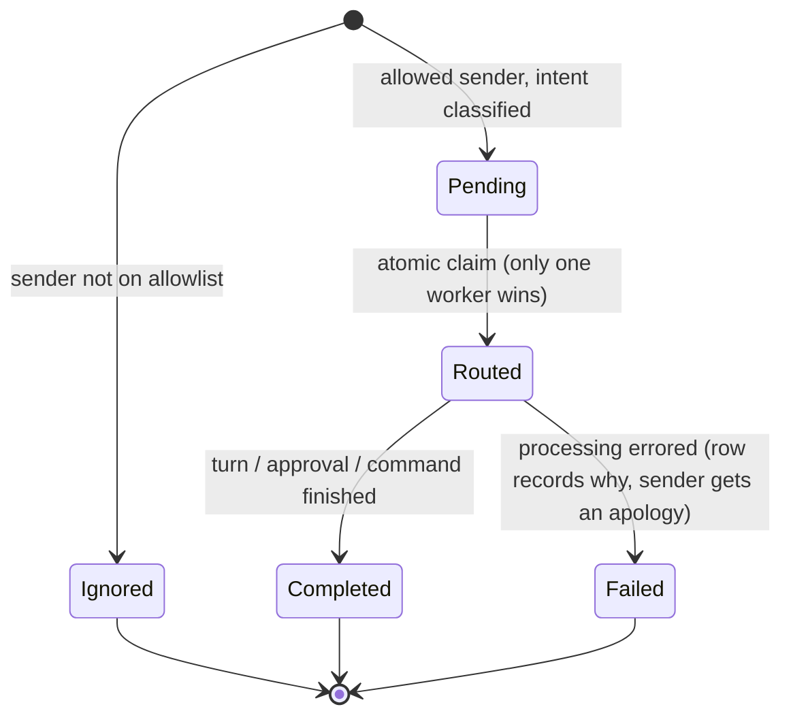

# Channels — Overview

> Vynel's outside door: the messaging surfaces (Telegram now, Discord next) through which a user reaches the assistant — and Vynel reaches back — without opening the desktop app.
>
> **Status:** shipped (Telegram; Discord stubbed for Phase 1.5) · **Depends on:** [db](../_platform/database/overview.md) (kernel), [providers](../providers/overview.md) (adapter precedent + default provider id) · injected at runtime: [chat](../chat/overview.md) / orchestration (the turn), [approvals](../approvals/overview.md) (resolution) · **Code map:** [structure.md](./structure.md)

## Purpose

Channels is how Vynel becomes reachable from *outside* its own window. A user connects their own bot — a Telegram bot in Phase 1 — and from then on they can message the assistant from their phone, and the assistant can message them back: answers, approval prompts, error notices, and fired reminders.

What makes it a product surface rather than plumbing is **ownership and trust**. Each channel is the user's own bot, gated by an explicit **allowlist** — only sender IDs the user has approved are ever processed; everything else is recorded as ignored and goes nowhere. The user connects, names, enables, disables, and disconnects channels, curates who may talk to the bot, and can page back through the message history. Underneath that surface sits real plumbing: two polling/delivery loops, a claim-based inbound pipeline, and a retrying outbound queue that survives the bot being offline or rate-limited.

The other defining idea is where an inbound message *goes*. A channel message does not run against the channel's bound workspace — it runs a **global-root turn** (the per-user "brain"), carrying the origin channel along so the root's answer, and any work it delegates to a workspace, come back to exactly the conversation the user asked from.

## What it can do

- **Connect a channel** — the bot's credentials are verified over the network first; only a valid bot is persisted, with an optional first allowed sender.
- **Manage the allowlist** — add, remove, and list the external senders permitted to message a channel's bot.
- **Enable or disable a channel** — a disabled channel is neither polled nor delivered to, without being torn down.
- **Disconnect a channel** — a hard delete that cascades away its allowlist, inbound rows, and queued outbound rows.
- **List channels** — for a workspace, or across a user's global + workspace channels alike.
- **Browse channel history** — the received-message timeline, keyset-paginated newest-first.
- **Answer an inbound message** — an allowed sender's message is classified, claimed, run as a global-root turn, and the answer delivered back to the sender.
- **Handle approvals over the channel** — push an approval card to the sender, who resolves it by tapping a button or replying "approve" / "deny <reason>"; the resolution flows back to the approvals domain.
- **Push proactively** — the global root's `send_to_channel` tool delivers a message to one of the user's channels; a fired schedule's output is delivered to the channel owner.
- **Show a "typing…" indicator** while a channel turn is generating, refreshed on a timer for the turn's duration.
- *(background)* **Poll** every enabled channel for new inbound messages and advance its cursor; **deliver** ready outbound rows with capped exponential backoff; **purge** terminal (completed/failed/sent) rows on a maintenance sweep.

## Responsibilities

**Owns** — the connected channels and everything hanging off them: four tables (channels, the allowlist, inbound messages, the outbound queue), the abstract channel-adapter contract and its Telegram implementation, connection lifecycle and health status, the allowlist gate, inbound intent classification and the claim-based processing pipeline, the outbound queue with its retry/backoff, the three lifecycle events it announces through the outbox, the schedules→channels event consumer, and the credential-scrubbing that keeps bot tokens out of every log line and payload.

**Does not own** —
- the AI turn itself — the global root / session orchestration runs it; channels only injects the message and receives the answer text (via an injected runner, so the leaf never imports the turn code — [chat](../chat/overview.md));
- resolving an approval — the [approvals](../approvals/overview.md) domain; channels parses the sender's reply and calls an injected resolver, never writing approval rows itself;
- producing schedules — the schedules domain publishes a run-completed event; channels only *consumes* it into an outbound row ([schedules](../schedules/overview.md));
- the timers that drive the poll and delivery ticks — the [local-api](../_apps/local-api/overview.md) app owns the loop cadence; the leaf just exposes the tick functions;
- users and workspaces — the shared kernel ([db](../_platform/database/overview.md)); channels carries them as scope, not as its own tables;
- chat sessions and approval requests it points at — referenced only loosely, by id, never by foreign key.

## Concepts & vocabulary

| Term | Meaning |
|---|---|
| **Channel** | One connected bot install — a user's Telegram bot. Carries its kind, display name, credentials, health status, and enabled flag. |
| **Channel kind** | `telegram` (Phase 1) · `discord` (Phase 1.5, stubbed). Selects which adapter handles the channel. |
| **Channel adapter** | The per-kind contract for talking to the outside API — verify credentials, poll for messages, send, edit, typing indicator, capability flags. |
| **Allowed sender / allowlist** | The external sender IDs permitted to message a channel's bot. A message from anyone else is stored as *ignored*. |
| **Inbound message** | A message received from the channel, intent-classified and moved through a claim-based status lifecycle. |
| **Intent kind** | What an inbound message *is*: `chat-turn` · `approval-reply` · `channel-command` (Phase 1.5) · `ignored` (non-allowed sender). |
| **Outbound message / message queue** | The single egress: every reply, approval card, status notice, and fired schedule leaves as a queued row awaiting delivery. |
| **Payload kind** | Why an outbound row exists: `chat-stream-final` · `approval-request` · `approval-resolved` · `status-update` · `scheduled-message`. |
| **Connection status** | A channel's health: `healthy` · `auth-failed` · `rate-limited` · `network-error` · `misconfigured`. |
| **Poll cursor** | The opaque per-channel marker (a Telegram update offset) that tracks how far polling has read. |
| **Global-root turn** | The per-user "brain" turn a channel message runs, instead of the channel's bound workspace turn. |
| **Origin** | The channel coordinates (channel + sender + chat context) threaded onto the turn so the answer, and any delegation's report, return to the asker. |
| **Bot credentials** | The bot's secret token(s). Sensitive: never returned in a response, never logged, never placed in an outbox payload. |

## Rules & invariants

- **Only allowlisted senders are processed.** A message from an unknown sender is stored as *ignored* for the audit trail and never becomes a turn.
- **Bot credentials never leak.** They are never returned in a response, never logged, and never carried in an outbox payload; every logged error is run through a token-scrubbing pass first, because a raw channel-library error can embed the token in a request URL.
- **Credentials are verified before anything is persisted.** Connecting a channel makes a network check first; an invalid bot is rejected with an actionable message and no row is written.
- **Every inbound message is claimed atomically before processing.** The status moves pending → routed as an atomic claim, so the fast processing loop can fire concurrently without two workers running the same long turn twice.
- **A channel message runs the global root, not the channel's workspace.** The origin rides along so the answer — and any workspace delegation's later report — come back to the conversation the user asked from.
- **Every state change co-commits its outbox event in one transaction.** The row and its `channel.connected` / `channel.disconnected` / `channel.enabled-changed` event land together or not at all; the network credential-verify happens *outside* the transaction.
- **Disconnect is a hard delete.** There is no soft-delete state — removing a channel cascades away its allowlist, inbound rows, and queued outbound rows inside SQLite.
- **Outbound delivery retries with capped backoff.** Failed sends retry on a fixed schedule (1s, 5s, 30s, 5m, 30m) and are abandoned after the sixth attempt.
- **Inbound messages are deduplicated.** A unique key of channel + external message id means a redelivered message (channel APIs replay across reconnects) is accepted exactly once.
- **One channel's failure never aborts the loop.** The poll and delivery ticks isolate each channel/entry in its own try/catch; a failing channel downgrades its own status and the rest proceed.
- **`userId` is the tenant boundary; `workspaceId` is nullable.** A null workspace means the channel is *global* (user-level, no workspace); single-channel operations authorize by (user, channel).
- **Cross-domain links are loose refs, never foreign keys.** The chat session and approval request an inbound row points at are plain text ids, so channels stays decoupled from those domains.

## Lifecycle

An inbound message is the beating heart — from arrival, through the allowlist gate and the atomic claim, to a terminal state:

## Where it sits in the bigger picture

Channels is the seam between Vynel and the messaging world. It leans *down* only on the [db](../_platform/database/overview.md) kernel and borrows the adapter pattern (and the default provider id) from [providers](../providers/overview.md). Everything cross-feature reaches it through injection or the outbox: the global-root turn is handed in by the [chat](../chat/overview.md) / orchestration layer so the leaf never imports the turn code; approval resolution is handed in by [approvals](../approvals/overview.md); [schedules](../schedules/overview.md) delivers a fired reminder by publishing an event this domain consumes into an outbound row. The [local-api](../_apps/local-api/overview.md) app hosts the `/channels` HTTP surface and owns the timers that drive the poll and delivery ticks, and the [local-web](../_apps/local-web/overview.md) surface is where a user connects a bot and curates its allowlist. Where [memory](../memory/overview.md) and [knowledge](../knowledge/overview.md) shape *what* the assistant knows, channels shapes *where the user can reach it from*.

---
*Mapped from the code on disk, 2026-07-14. If you change this module, update this file and [structure.md](./structure.md).*
