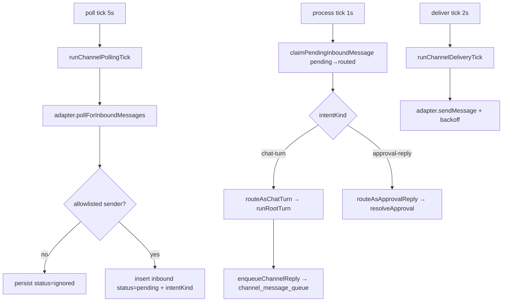

# Channels — Structure

> The code map and connections for the channels module. For the concepts behind it, see [overview.md](./overview.md).
>
> Folders touched: `packages/channels/src/` · `apps/local-api/src/routes/channels/` · `apps/local-api/src/routes/routing/` · `apps/local-api/src/services/channels-service.ts` · `apps/local-web/src/{components,composables/channels}/`

Channels is a vertical-slice leaf: the package owns its own `schema/`, `repositories/`, and operations (`adapters/` · `lifecycle/` · `inbound/` · `delivery/` · `senders/` · `queries/`) over the shared `@vynel/db` kernel. Deps: `@vynel/contracts`, `@vynel/db`, `@vynel/errors`, `@vynel/providers`, `drizzle-orm`, `telegraf` (`packages/channels/package.json`). It is the only leaf that owns a background egress/ingress loop and a live network adapter (`telegraf`).

## File map

► = entry point.

| Path | Role |
|---|---|
| ► `packages/channels/src/index.ts` | public barrel — sole subpath `.` (+ `./test-support`); exports ops, the `Channel` type, the three outbox event constants, and the two ticks the api-side service drives |
| `packages/channels/src/channels-types.ts` | domain types — `StructuralLogger`, `AppRequestFn`, `ProcessInboundDeps` (the injected turn seam), re-exported adapter contract types |
| `packages/channels/src/channels-events.ts` | 3 outbox event constants + payload types; **payloads are loose-ref facts only — never `botCredentials`** |
| `packages/channels/src/test-support.ts` | test fixtures/helpers (dev-only export) |
| **schema/** | |
| `packages/channels/src/schema/channels.ts` | `channels` table (one row per bot install) + `ChannelKind` / `ChannelConnectionStatus` |
| `packages/channels/src/schema/channel-user-links.ts` | `channel_user_links` table (the allowlist) |
| `packages/channels/src/schema/channel-inbound-messages.ts` | `channel_inbound_messages` table + `InboundIntentKind` / `InboundMessageStatus` |
| `packages/channels/src/schema/channel-message-queue.ts` | `channel_message_queue` table + `OutboundPayloadKind` / `OutboundMessageStatus` |
| `packages/channels/src/schema/index.ts` | schema barrel |
| **adapters/** | |
| `packages/channels/src/adapters/channel-adapter.ts` | abstract `ChannelAdapter` contract (verify / poll / send / edit / typing / capability flags) + normalized message types |
| `packages/channels/src/adapters/channel-adapter-registry.ts` | `resolveChannelAdapter(kind)` — lazy singleton per kind; `'discord'` throws `ValidationError` (Phase 1.5) |
| `packages/channels/src/adapters/telegram/telegram-channel-adapter.ts` | the concrete Telegram adapter over `telegraf` (Phase 1's only channel) |
| `packages/channels/src/adapters/extract-error-message.ts` | **token-scrubbing** error→message helper (strips `<digits>:<url-safe>` bot-token shapes before any log/store) |
| **repositories/** | four repos + `index.ts` barrel (see [Repositories](#repositories)) |
| **lifecycle/** | connect / disconnect / enable ops + the shared tx bodies + retention purge (see [Core operations](#core-operations)) |
| **inbound/** | polling tick, claim+process, intent classifier, route-as-chat-turn / route-as-approval-reply |
| **delivery/** | delivery tick, enqueue helpers, the schedules consumer, approval-card push, (unwired) chat-event translator |
| **senders/** | allowlist add/remove/list (workspace- and user-scoped) + the row builder |
| **queries/** | channel/history reads (workspace- and user-scoped) + ownership guards |
| ► `apps/local-api/src/routes/channels/index.ts` | workspace-scoped HTTP surface — 9 routes |
| ► `apps/local-api/src/routes/channels/user-scoped.ts` | user-scoped HTTP surface — 10 routes (`/channels`, both scopes) |
| `apps/local-api/src/routes/channels/{schemas,serializers}.ts` | Zod request/response schemas · row→JSON serializer (**strips `botCredentials` + `lastPolledCursor`**) |
| ► `apps/local-api/src/services/channels-service.ts` | the poll(5s) / process(1s) / deliver(2s) loops; injects the turn deps |
| `apps/local-api/src/routes/routing/index.ts` | global-root routing surface — hosts `list_routing_channels` + `send_to_channel` (proactive push) |

## Data & persistence

All four tables live in `packages/channels/src/schema/` and are registered in the kernel's `drizzle.sqlite.config.ts` (repo root, lines 42–45) — the schema-parity check enforces exactly-one-config registration. DDL: all four tables + their indexes are in `packages/db/src/migrations-sqlite/0000_baseline.sql` (`channels` ~L313, `channel_user_links` ~L336, `channel_inbound_messages` ~L349, `channel_message_queue` ~L371). **None carry `deletedAt`** — `disconnectChannel` hard-deletes and the FK `ON DELETE cascade` sweeps the three child tables (decision D16).

**`channels`** — one row per connected bot install (a Telegram bot in Phase 1).

| Column | Type | Notes |
|---|---|---|
| `id` | id (PK) | UUID from the op |
| `userId` | id (FK cascade) | → `users` — **the tenant boundary** |
| `workspaceId` | text (FK cascade, null) | → `workspaces`; **NULL = GLOBAL scope** (no workspace). `text()` not `id()` because `id()` is NOT NULL by contract |
| `channelKind` | text | `telegram` \| `discord` (discord = Phase 1.5) |
| `displayName` | text | |
| `botCredentials` | text | JSON-encoded; **sensitive — never returned, never logged** |
| `botMetadata` | text | JSON-encoded; what the channel API reports (username, id) |
| `connectionStatus` | text | `healthy` / `auth-failed` / `rate-limited` / `network-error` / `misconfigured` |
| `connectionStatusMessage` | text (null) | scrubbed failure reason |
| `lastPolledCursor` | text (null) | opaque per-channel poll cursor (Telegram update offset); **stripped from responses** |
| `lastPolledAt` / `lastInboundAt` | timestamp (null) | |
| `isEnabled` | boolean | pause toggle (polling + delivery both honor it) |
| `createdAt` / `updatedAt` | timestamp | |

Indexes: `idx_channels_user` · `idx_channels_workspace` · `idx_channels_enabled_polling (isEnabled, lastPolledAt)`.

**`channel_user_links`** — the allowlist; one row per external sender allowed to message the bot. Carries **no** `userId` (scopes through `channelId → channels.userId`). Columns: `id`, `channelId` (FK cascade), `externalSenderId`, `externalSenderHandle` (null, display-only), `externalSenderDisplayName` (null, display-only), `scopeContextId` (null; Telegram DM = the user id), `addedAt`. Indexes: `idx_channel_user_links_channel` · **unique** `(channelId, externalSenderId, scopeContextId)` (the dedup key).

**`channel_inbound_messages`** — received messages with a claim-based status lifecycle. `routedToChatSessionId` / `routedToApprovalRequestId` are **loose `text()` refs, NOT FKs** (they point at other domains' rows). Columns: `id`, `channelId` (FK cascade), `externalMessageId`, `externalSenderId`, `externalChatContextId`, `messageBody`, `messageMetadata` (JSON), `intentKind` (`chat-turn`/`approval-reply`/`channel-command`/`ignored`), `routedToChatSessionId` (loose), `routedToApprovalRequestId` (loose), `status` (`pending`/`routed`/`completed`/`failed`/`ignored`), `statusMessage`, `receivedAt`, `processedAt`. Indexes: `(channelId, status)` · `(status, receivedAt)` (the pending queue) · **unique** `(channelId, externalMessageId)` (redelivery dedup) · `(channelId, receivedAt, id)` (history keyset).

**`channel_message_queue`** — the single outbound egress (chat replies, approvals, status, fired schedules). Columns: `id`, `channelId` (FK cascade), `externalRecipientId`, `externalChatContextId`, `messageBody`, `messageStructure` (JSON: buttons/parseMode), `payloadKind` (`chat-stream-final`/`approval-request`/`approval-resolved`/`status-update`/`scheduled-message`), `status` (`pending`/`sending`/`sent`/`failed-retry`/`failed-give-up`), `statusMessage`, `attemptCount`, `lastAttemptedAt`, `nextAttemptAt` (backoff anchor), `externalSentMessageId`, `enqueuedAt`, `sentAt`. Indexes: `(status, nextAttemptAt)` (the ready-drain) · `(channelId, externalChatContextId, enqueuedAt)`.

> Related but **owned by chat**, not channels: `0001_chat-message-origin-channel.sql` adds `origin_channel_id` to chat messages — the "via Telegram" stamp `routeAsChatTurn` threads through `originChannel`. It lives in chat's schema; channels only supplies the value.

## Repositories

Four functional repos (db-first), barreled at `repositories/index.ts`. `findX` may return `null`.

| Function (db-first) | Purpose |
|---|---|
| **channels** | `findChannelById` · `listChannelsForWorkspace` · `listChannelsForUser` · `listEnabledChannels` (the poll set) · `insertChannel` · `updateChannel` · `hardDeleteChannel` |
| **channel-user-links** | `findAllowedSender` (allowlist check) · `listAllowedSenders` · `insertAllowedSender` · `deleteAllowedSender` |
| **channel-inbound-messages** | `findInboundMessageByExternalId` (dedup) · `findInboundMessageById` · `claimPendingInboundMessage` (atomic pending→routed) · `listPendingInboundMessages` (the process queue) · `insertInboundMessage` · `updateInboundMessage` · `hardDeleteInboundMessagesBefore` (purge) · `listInboundMessagesForChannel` · `findRecentSessionedInboundForSender` / `findRecentApprovalAwaitingInboundForSender` (approval-reply correlation) |
| **channel-message-queue** | `listReadyOutboundMessages` (the drain) · `insertOutboundMessage` · `updateOutboundMessage` · `hardDeleteOutboundMessagesBefore` (purge) · `listOutboundMessagesForChannel` · `findOutboundMessageById` |

## Core operations

| Operation | What it does | Key calls (incl. outbox / tx) |
|---|---|---|
| `connectChannel` *(async)* | verify credentials over the network **first**, then insert channel + optional first allowed sender + `channel.connected` — one sync tx (verify is outside it) | `resolveChannelAdapter`, `adapter.verifyCredentials`, `insertChannel`, `insertAllowedSender`, `insertOutboxEvent` |
| `disconnectChannel` / `disconnectChannelForUser` | resolve+own the channel (`getChannelInWorkspaceOrThrow` / `getChannelForUserOrThrow`), then `hardDeleteChannelWithEvent` | shared tx: `hardDeleteChannel` (cascade) + `channel.disconnected` |
| `setChannelEnabled` / `setChannelEnabledForUser` | resolve+own, then `updateChannelEnabledWithEvent` | shared tx: `updateChannel({isEnabled})` + `channel.enabled-changed` |
| `addAllowedSender[ForUser]` / `removeAllowedSender[ForUser]` | resolve+own the channel, then mutate the allowlist | `insertAllowedSender` / `deleteAllowedSender` (no outbox) |
| `listChannelsForWorkspace` / `listChannelsForUser` / `listAllowedSenders…` / `listChannelHistory[ForUser]` | scoped reads | keyset cursor on history |
| `runChannelPollingTick` *(async)* | poll every **enabled** channel; dedup, allowlist-check, persist inbound rows, advance the cursor; per-channel try/catch downgrades status + logs a **scrubbed** reason | `listEnabledChannels`, `adapter.pollForInboundMessages`, `findInboundMessageByExternalId`, `findAllowedSender`, `deriveIntentKind`, `insertInboundMessage`, `extractErrorMessage` |
| `processInboundMessage` *(async)* | **atomic claim** (pending→routed) then route by intent then mark terminal; failures mark the row `failed` + log scrubbed | `claimPendingInboundMessage`, `routeAsChatTurn`, `routeAsApprovalReply` |
| `runChannelDeliveryTick` *(async)* | drain ≤50 ready outbound rows via the adapter; capped backoff `[1s,5s,30s,5m,30m]` then `failed-give-up` after the 6th attempt; per-entry try/catch, disabled channels skipped | `listReadyOutboundMessages`, `adapter.sendMessage`, `updateOutboundMessage`, `extractErrorMessage` |
| `enqueueChannelReply` | queue a plain-text reply (`chat-stream-final`) back to who asked | `insertOutboundMessage` |
| `sendToChannel` | the `send_to_channel` tool — own-guard the channel, resolve the owner recipient (`listAllowedSenders[0]`), enqueue | `findChannelById`, `listAllowedSenders`, `enqueueChannelReply` |
| `enqueueApprovalRequest` / `enqueueApprovalRequestForRecipient` | push an approval **card** (inline buttons carry the approval id) to the sender / a delegation's origin | `summarizeApprovalForChannel`, `insertOutboundMessage` |
| `consumeScheduleRunCompletedEvent` | the schedules→channels consumer: enqueue a `scheduled-message` to the channel owner | `findChannelById`, `listAllowedSenders`, `insertOutboundMessage` |
| `purgeTerminalChannelRows` | daily retention sweep (>30 d) of terminal inbound (`completed`/`ignored`) + outbound (`sent`/`failed-give-up`) rows — *defined + tested, **not yet wired** to a timer* | `hardDeleteInboundMessagesBefore`, `hardDeleteOutboundMessagesBefore` |

## HTTP surface

Two mounts, both in `apps/local-api/src/app.ts`. **Channels is ungated** — no `featureGate` (Chad's tier matrix: channels are core-assistant, available on `basic`).

**Workspace-scoped** — `/workspaces/:workspaceId/channels` (`app.ts:139`), bundle `...workspaceScoped`. Single-channel ops verify the channel belongs to the resolved workspace in core (`getChannelInWorkspaceOrThrow`) → 404 across a tenant boundary.

| Method | Path | Purpose | MCP tool |
|---|---|---|---|
| GET | `/` | list connected channels (credentials stripped) | `list_channels` (read) |
| POST | `/connect` | verify the bot token, then persist | — (**token — never exposed**) |
| DELETE | `/:channelId` | disconnect (hard-delete + cascade) | — |
| POST | `/:channelId/enable` · `/:channelId/disable` | toggle polling | — |
| GET | `/:channelId/allowed-senders` | the allowlist | `list_allowed_senders` (read) |
| POST | `/:channelId/allowed-senders` | add an allowed sender | — |
| DELETE | `/:channelId/allowed-senders/:senderLinkId` | remove one | — |
| GET | `/:channelId/history` | inbound history (keyset cursor) | — |

**User-scoped** — `/channels` (no workspace prefix, `app.ts:152`), bundle `...userScoped`; spans a user's GLOBAL + every workspace channel. Every op authorizes by `(userId, channelId)` via `getChannelForUserOrThrow`. Same 9 shapes **plus** `GET /:channelId` (one channel). `POST /` takes a `scope: global|workspace` discriminator (global → null workspaceId). Serializer + param/sender schemas are reused from the workspace surface.

| Method | Path | Purpose | MCP tool |
|---|---|---|---|
| GET | `/` | every channel the user owns, both scopes | `list_my_channels` (read) |
| POST | `/` | connect (scope = global \| workspace) | — |
| GET | `/:channelId` | one channel | — |
| … | (enable/disable, allowed-senders ×3, history — as above, `…ForUser`) | | — |

## MCP surface

Channels ships no descriptor of its own — its tools ride the route-derived `vynel` server. Each route's `x-mcp` block is compiled by the generator into `apps/mcp/src/generated/`. Channels tools are **ungated** — `apps/mcp/src/vynel-mcp-feature-descriptor.ts` gates only `knowledge` + `memory`; channels/schedules/skills tools stay ungated.

- **Read tools** (route-derived, workspace/global): `list_channels` (workspace), `list_allowed_senders` (workspace), `list_my_channels` (user). All read-only. **No mutating channels route is exposed** — `POST /connect` carries the bot token and must never be an MCP tool.
- **Global-root routing tools** (`apps/local-api/src/routes/routing/index.ts`, emitted into the separate routing tool array that reaches only the global-root turn): `list_routing_channels` (read — reuses `listChannelsForUser`) and `send_to_channel` (mutating, `mutatingApproved: true` → **auto/uncarded in Phase 1**; a per-send card is a deferred follow-up pending a global-root approval surface).

## Background service

The desktop app runs no `apps/worker` — channels' loops run in-process in the API (`apps/local-api/src/services/channels-service.ts`), started from `server.ts:121` after `createApp(...)`, stopped on shutdown (`server.ts:165`). It lives in local-api (not worker) because the cadence is sub-minute and the processing turn is MCP-intrinsic (`runGlobalRootTurn` builds the in-process Vynel MCP server from the api's own `app.request`).

| Tick | Interval | Runs |
|---|---|---|
| poll | 5 s | `runChannelPollingTick` |
| process | 1 s | drain ≤10 `listPendingInboundMessages`, fire each **concurrently** as `processInboundMessage` (the atomic claim guards double-dispatch) |
| deliver | 2 s | `runChannelDeliveryTick` |

Injected `ProcessInboundDeps`: `runRootTurn` → `runGlobalRootTurn`; `resolveApproval` → `@vynel/approvals` (both injected so the leaf never imports apps/local-api, session, or approvals — invariant #2). `purgeTerminalChannelRows` is **not** on a timer yet.

## Web surface

Everything speaks the generated SDK (`vynel.channelsUser.*`) through vue-query; no Pinia store — cache keys under `["channels", …]`.

- **Composables** (`apps/local-web/src/composables/channels/`) — `use-channels.ts` (`channelsUser.list`), `use-connect-channel.ts`, `use-disconnect-channel.ts`.
- **Components** — `components/sections/ChannelsSection.vue` (the list + connect/disconnect), `ConnectChannelDialog.vue` (token entry), `components/onboarding/steps/ChannelStep.vue` (the optional onboarding connect step), `components/chat/channel-presentation.ts` + `GlobalWelcomeHero.vue` (channel presentation).
- **Mounting** — workspace surface via `components/workspace/workspace-sections.ts` + `WorkspaceSectionPanel.vue`; global surface via `views/GlobalChatView.vue`.

## Pipeline — "a Telegram message becomes an answer"



1. `channels-service.ts` poll timer → `runChannelPollingTick` (`inbound/run-channel-polling-tick.ts`) → for each `listEnabledChannels`, `adapter.pollForInboundMessages` with the stored `lastPolledCursor`.
2. Each message: explicit `findInboundMessageByExternalId` dedup (unique index is the net) → `findAllowedSender` → `insertInboundMessage` with `intentKind` from `deriveIntentKind` (non-allowed → stored `ignored`). Cursor + `connectionStatus: healthy` written back.
3. process timer → `listPendingInboundMessages` (≤10) → each fired **concurrently** through `processInboundMessage` (`inbound/process-inbound-message.ts`): `claimPendingInboundMessage` (atomic pending→routed; only the winner proceeds) → route by intent.
4. `chat-turn` → `routeAsChatTurn` (`inbound/route-as-chat-turn.ts`): send/refresh the "typing…" indicator, `deps.runRootTurn` (a **global-root** turn carrying the channel `origin`), then `enqueueChannelReply` with the answer text. `approval-reply` → `routeAsApprovalReply` correlates the pending approval and calls the injected `resolveApproval`.
5. deliver timer → `runChannelDeliveryTick` (`delivery/run-channel-delivery-tick.ts`): drain `listReadyOutboundMessages` → `adapter.sendMessage`; success → `sent`, failure → backoff (`failed-retry`) or `failed-give-up` after 6 attempts.
6. A **delegation** the root spawned reports back later: `packages/session/src/delegation/run-delegation-claim-and-run-tick.ts` re-resolves the origin channel and `enqueueChannelReply`s the report — closing channel → root → delegate → report → channel.

## Connections

**Summary:** channels is a **network-facing leaf with an injected turn seam** — it depends only on the kernel + shared + `@vynel/providers` (types) + `telegraf`, and it reaches the AI runtime and the approvals leaf **only through injected deps** (`ProcessInboundDeps`), never by import. Read-side it's consumed by the api routes/MCP tools, session's delegation tick, onboarding, and the web panel. It publishes three lifecycle events and consumes one cross-domain event (schedules).

| Unit | Direction | Mechanism | What crosses |
|---|---|---|---|
| db kernel (`@vynel/db`) | out | import | `Database`, `withTransaction`, `users`/`workspaces` FKs, `insertOutboxEvent` |
| errors (`@vynel/errors`) | out | import | `NotFoundError`, `ValidationError` |
| providers (`@vynel/providers`) | out | import (type) | `AiAgentProviderId` at the resolve-approval cast; the `AiAgentProvider` precedent for the adapter contract |
| `telegraf` | out | import | the Telegram bot transport (quarantined in `adapters/telegram/`) |
| AI runtime / global root | in | **injected dep** | `ProcessInboundDeps.runRootTurn` → `runGlobalRootTurn` — the leaf never imports session/orchestration |
| [approvals](../approvals/overview.md) | in | **injected dep** | `ProcessInboundDeps.resolveApproval` — the leaf never imports `@vynel/approvals` |
| local-api routes | in | import | the 19 HTTP routes across the two surfaces + the routing tools |
| local-api service | in | import | the three ticks + `processInboundMessage` |
| [session](../session/overview.md) (delegation) | in | import | `findChannelById`, `enqueueChannelReply`, `enqueueApprovalRequestForRecipient` — the delegation tick delivers reports/cards to a channel origin |
| [onboarding](../onboarding/overview.md) | in | **injected dep** | `connectChannel` bound into `OnboardingDeps` — the leaf never imports `@vynel/channels` |
| [schedules](../schedules/overview.md) | in | **outbox** | publishes `schedule.run-completed`; `consumeScheduleRunCompletedEvent` reacts (schedules never writes channels' tables) |
| [chat](../chat/overview.md) | out (loose) | loose id / stamp | `originChannel` stamped onto the persisted user message ("via Telegram") |
| local-web | in | SDK | the panel calls list / connect / disconnect |

**Events published** (each co-committed in the mutating tx via `_shared/outbox`): `channel.connected` (in `connectChannel`) · `channel.disconnected` (in `hardDeleteChannelWithEvent`; records the severed loose ref + kind, **never** child-row counts or credentials) · `channel.enabled-changed` (in `updateChannelEnabledWithEvent`). Phase 1 consumers of these: **none**.
**Events consumed:** `schedule.run-completed` — `consumeScheduleRunCompletedEvent` is the domain's owned consumer + payload shape, but the generic outbox **relay** (unprocessed-query + registry + poll loop) is not on disk yet, so the consumer is *defined + tested, not yet dispatched*.

```mermaid
flowchart LR
    db[(db kernel)] --> CH[channels]
    tg[telegraf] --> CH
    CH --> obx[(outbox: connected/disconnected/enabled-changed)]
    sch[schedules] -. schedule.run-completed .-> CH
    api[local-api routes + service] --> CH
    root[global root] -. injected runRootTurn .-> CH
    appr[approvals] -. injected resolveApproval .-> CH
    onb[onboarding] -. injected connectChannel .-> CH
    del[session delegation] --> CH
    web[local-web panel] -. SDK .-> api
```

## Config & gotchas

- **The bot token never leaves the leaf.** `botCredentials` is stripped by the serializer (with `lastPolledCursor`), never enters an outbox payload (the lifecycle tests assert its absence), and `extractErrorMessage` scrubs token-shaped substrings before any log/store — a raw `telegraf` error can echo the request URL, which embeds the token.
- **No `deletedAt` — hard-delete + cascade (D16).** Disconnect physically removes the channel and cascades to all three child tables inside SQLite; the disconnected event therefore can't report child-row counts.
- **`workspaceId` is nullable = GLOBAL.** A null workspace is a user-level (global) channel; a value scopes it. `text().references(...)` is used (not `id()`) because `id()` is NOT NULL by contract. Mirrors `approval_requests.workspaceId`.
- **The atomic claim is the concurrency contract.** The process tick fires each pending row concurrently (not awaited serially); `claimPendingInboundMessage` (pending→routed) is what stops the 1 s loop re-firing a still-running long turn.
- **Channels is ungated at the entitlement tier** (core-assistant), and its MCP tools are ungated at the capability tier — unlike memory/knowledge.
- **`send_to_channel` runs auto (uncarded) in Phase 1** — consistent with the channel auto-reply; a per-send approval card is deferred until the global-root approval surface lands.
- **`purgeTerminalChannelRows` is not wired to a timer** — the op + tests exist, but nothing in `apps/` drives it yet (retention doesn't actually run in the wild).
- **The schedules consumer's relay is missing** — `consumeScheduleRunCompletedEvent` reacts correctly, but no generic outbox dispatch loop invokes it yet (deliberately not fabricated — see the file header).
- **Discord throws** — `resolveChannelAdapter('discord')` raises a clear `ValidationError`; Phase 1 is Telegram-only.
- **Defined but not yet wired to production callers:** `findRecentChannelSessionId`, `findRecentSessionedInboundForSender`, `createChannelEventTranslator` / `translateChatEventToChannel` (the streaming-look chat-event translator), and the queue reads `listInboundMessagesForChannel` / `listOutboundMessagesForChannel` / `findOutboundMessageById` — carried on the barrel/repos ahead of their Phase 1.5 consumers.

---
*Mapped from the code on disk, 2026-07-14. If you change this module, update this file and [overview.md](./overview.md).*
