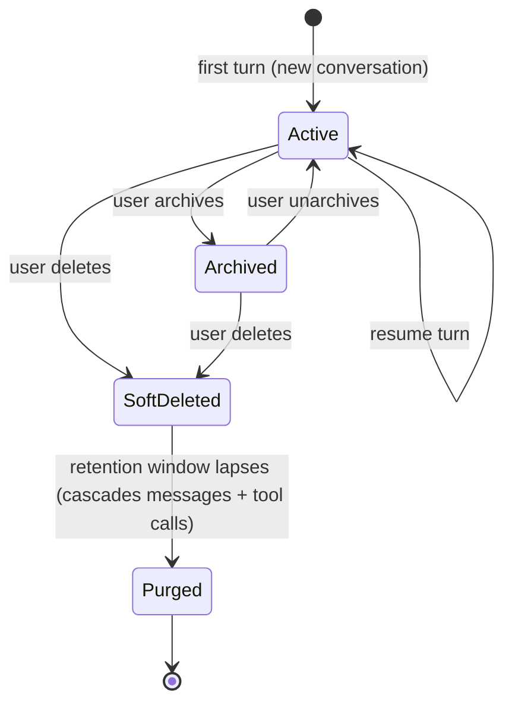
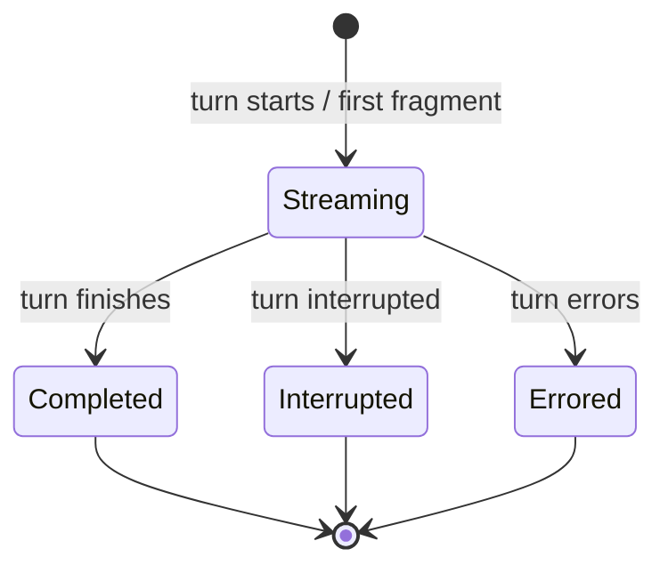

# Chat — Overview

> The conversational domain: every exchange between the user and the AI agent — live-streamed as it happens, persisted turn-by-turn, and searchable across every conversation the user owns.
>
> **Status:** shipped (with two deferred pieces — the retention purge job is not yet wired onto the worker, and chat's own agent-readable context tool lands with the session pull) · **Phase:** 1 · **Depends on:** [session](../session/overview.md), [providers](../providers/overview.md), [mcp](../_apps/mcp/overview.md), [capabilities](../capabilities/overview.md), [orchestration](../orchestration/overview.md), [approvals](../approvals/overview.md), [instructions](../instructions/overview.md) · **Code map:** [structure.md](./structure.md)

> **Scope of this document.** "Chat" is documented here as the whole domain: the persistence-engine package plus the HTTP routes and live-stream endpoint that expose it, and the desktop web surface that renders it. The package itself is deliberately narrow — pure consumption and persistence — and the sections below keep that boundary explicit.

## Purpose

Chat is where the user and the AI agent actually talk. Every message the user sends, every assistant response that streams back token by token, every tool the agent invokes, and every approval card that gates a destructive action lives inside this domain. Nothing about a conversation is treated as throwaway: as each fragment arrives from the provider it is appended to the transcript at the moment it lands, so the conversation survives a crash mid-stream and re-opens exactly where it left off.

The deeper promise is that chat is *legible*. The user watches the agent's thinking unfold in real time, can inspect every tool call it made, read a breakdown of how full the context window is, search across every conversation they have ever had, and rename, archive, interrupt, or delete any of it. Vynel does not have opaque AI interactions — it has a conversation history the user owns.

One boundary matters throughout: chat does not *drive* a turn. Driving the agent — opening the provider session, deciding continuity, composing the system prompt — belongs to the session domain. Chat's job is to *consume* the normalized stream that driving produces, turn it into durable rows and UI-bound events, and later serve those rows back.

## What it can do

- **Consume and persist a streamed turn** — drain the agent's normalized event stream and, as it flows, record the new conversation, the user's message, the assistant's text and thinking, each tool call, token usage, an auto-generated title, and the turn's final state. Each fragment is written the instant it arrives.
- **Relay a turn to the UI as it happens** — the live-stream endpoint forwards the same events over Server-Sent Events so the desktop surface renders the response as it is produced, not after it finishes.
- **Resume a conversation** — a later turn can name an existing conversation, and the agent continues in the same context.
- **Show tool calls inline** — when the agent invokes a tool, the stream announces the call starting and completing; each is persisted as a child of the assistant message that triggered it and rendered as an expandable card within that message.
- **Gate destructive tools** — when the agent asks permission for a risky action, chat's consumer hands the request to the approvals domain, which checks the user's saved rules. A matching rule lets the turn continue automatically (the UI shows a small "auto-approved" note); otherwise an approval card blocks the turn until the user approves or denies.
- **Serve conversation history** — list a workspace's conversations, open one in full (messages with their tool calls grouped under each), and list a user's most recent conversations across scopes.
- **Full-text search** across all the user's conversations — every workspace and every spawned or agent session — optionally narrowed to one workspace, returning ranked, highlighted snippets grouped by conversation. The agent itself carries this same search (and a read-any-conversation companion) as tools on every tier, so any session can grab context from any other; the one exception is the assistant's own private global thread, which never surfaces through either.
- **Serve attached images** — images the user attaches arrive inline with the turn; the consumer writes them to a per-conversation store on disk, and a dedicated route serves the bytes back for re-display.
- **Report context occupancy** — resume the conversation in the provider, ask it for its context-window breakdown, and return that as text for the UI's detail panel.
- **Lifecycle management** — rename, archive and unarchive, interrupt an active turn, and soft-delete (a reversible hide with a retention window before permanent removal).
- **Synchronize conversations** *(background)* — import stubs of conversations from the provider's on-disk transcripts, which the user can then open and resume.
- **Purge expired conversations** *(background)* — permanently remove conversations whose retention window has lapsed, cascading their messages and tool calls. *(The purge logic exists in the package but is not yet scheduled on the worker — only one other domain has a live worker job today.)*

## Responsibilities

**Owns** — the three conversation tables (conversations, messages, and the tool calls hung under each message) and their whole lifecycle from the first streamed event to permanent removal; the full-text search index and the triggers that keep it current; the on-disk store of attached-image bytes; the four conversation lifecycle outbox events, each co-committed with the state change that raises it; the discriminated union of UI-bound turn events; the stream-consumption engine that translates provider events into rows and those events; and the history reads (list, detail, search, recent). The HTTP routes and the live-stream endpoint that expose all of this sit in the local API app; the desktop conversation surface (session list, thread view, live turn, composer, tool-call cards, context chip) sits in the local web app — both thin surfaces over the owned core.

**Does not own** —
- driving a turn — opening the provider session, resolving continuity, composing the system prompt — that is [session](../session/overview.md); chat only consumes the stream that driving yields;
- the AI agent runtime itself — that is [providers](../providers/overview.md);
- the in-process tool server built for each turn — that is [mcp](../_apps/mcp/overview.md);
- which capabilities (memory among them) are injected into the system prompt — that is [capabilities](../capabilities/overview.md);
- approval-request persistence and rule evaluation — that is [approvals](../approvals/overview.md); chat calls into it when the agent asks permission;
- enabled sub-agents and the run telemetry around a delegated turn — that is [orchestration](../orchestration/overview.md);
- the curated reference material a session can read on demand — that is [instructions](../instructions/overview.md).

## Concepts & vocabulary

| Term | Meaning |
|---|---|
| **Conversation (session)** | One conversation thread. Created on its first turn and resumed by naming it on a later turn. Its identity is assigned by the agent runtime at the start of a turn, not minted by Vynel. |
| **Turn** | One round-trip: the user sends a message, the assistant streams a response, possibly invoking tools along the way. A single turn can produce many messages and tool calls. |
| **Message** | One entry in a conversation. Its author is the user, the assistant, or the system. An assistant message carries the streamed body, the thinking body, token usage, and any error. |
| **Tool call** | A record of the agent invoking a tool, hung under the assistant message that triggered it. It carries the tool's name, input, output, status, and approval status, and renders inline under its message. |
| **Turn event** | The stream of typed, UI-bound events a turn emits — a message persisted, a conversation created, a title generated, a text or thinking fragment, a tool call started or completed, an approval requested / resolved / auto-resolved, usage reported, and the turn finishing, being interrupted, or erroring. |
| **Mixed identity source** | A conversation's and an assistant message's identifiers come from the agent runtime (the latter is needed to correlate streamed fragments); the user's message and tool-call rows get Vynel-minted identifiers. |
| **Archived** | A conversation hidden from the default list. Independent of deletion. |
| **Soft-deleted** | A conversation marked deleted and hidden from all reads, but recoverable until its retention window lapses and the purge removes it for good. |
| **Full-text index** | A keyword search index over message bodies, kept in sync by database triggers, backing cross-session search. (The semantic/vector index that memory uses does not exist for chat.) |
| **Context report** | The runtime's breakdown of how the conversation's context window is occupied, fetched by resuming the conversation and asking the runtime for it. |
| **Session mode** | The user-facing turn posture — ask for permission on every tool, auto-allow with a safety floor, or plan without executing — mapped to the provider's permission model per turn. |
| **Continuing (primary) conversation** | A per-workspace conversation that keeps going across turns; under context pressure its underlying runtime session can swap to a fresh one invisibly, so the thread the user sees is stable. The naming of this concept is mid-migration (a "root" is being renamed to a "primary"), so the code and the wire still speak the older term in places. |

## Rules & invariants

- **Every conversation, message, and tool call belongs to exactly one workspace and user.** The session-scoped request path verifies user, then workspace, then conversation ownership before any read or write.
- **The user's message row is committed with the conversation it belongs to.** For a new conversation the two are written together so the foreign key is never violated; for a resumed one the message is written as soon as the conversation's identity is confirmed.
- **Streaming writes are atomic appends at the database layer.** Body and thinking fragments are concatenated in the write itself, never read-modify-write, so overlapping fragment arrivals are safe.
- **Token counters increment at the database layer.** Usage is added in the write, so overlapping usage reports cannot race.
- **The search index is maintained by triggers**, one per write kind — chat never hand-maintains it.
- **Four lifecycle outbox events, each co-committed in one transaction with its state change.** There are deliberately no per-message or per-tool-call events; anything needing finer granularity subscribes to the live stream instead.
- **Soft-delete is the only user-visible delete.** Messages and tool calls are removed only when the purge permanently deletes their conversation, and they cascade with it.
- **Attached-image persistence is best-effort.** The provider has already received the images inline before the consumer writes them to disk; a failed disk write is logged and skipped — it affects only re-display, never the turn.
- **The continuing conversation's off-switch is per-workspace.** Continue-mode is honored only where the workspace has enabled it; every other turn behaves as an ordinary new-or-resumed turn.

## Lifecycle

A conversation moves through:

Within a single turn, the assistant message moves through:

## Where it sits in the bigger picture

Chat is the central live surface of Vynel — every real-time AI interaction surfaces through it. It sits one layer below [session](../session/overview.md), which drives each turn and hands chat the normalized stream to persist; through that same driving path a turn pulls in [providers](../providers/overview.md) (the runtime), [mcp](../_apps/mcp/overview.md) (the per-turn tool server), [capabilities](../capabilities/overview.md) (the system-prompt composer, memory among the features it injects), [orchestration](../orchestration/overview.md) (enabled sub-agents), and [instructions](../instructions/overview.md) (on-demand reference material). It leans on [approvals](../approvals/overview.md) whenever the agent asks permission for a risky action. Downstream, [memory](../memory/overview.md) consumes chat's permanent-deletion event to clean up the references it holds into a conversation's messages. The same conversation surface is intended to back turns driven programmatically by [channels](../channels/overview.md) and [schedules](../schedules/overview.md).

> **A note against the module notes.** The module note snapshots chat as a "pure foundation" with "zero consumers." That was true at its landing; the code on disk has since moved past it. Chat is now wired end-to-end — the session runner and the local API's live-stream endpoint both consume it, the desktop surface renders it, and memory consumes its deletion event. The continuing-conversation continuity the notes deferred to a later pull is present and active in the live stream today, though the "root → primary" renaming that note flags is still in progress, so both terms appear in the code and on the wire.

---
*Mapped from the code on disk, 2026-07-14. If you change this domain, update this file and [structure.md](./structure.md).*
