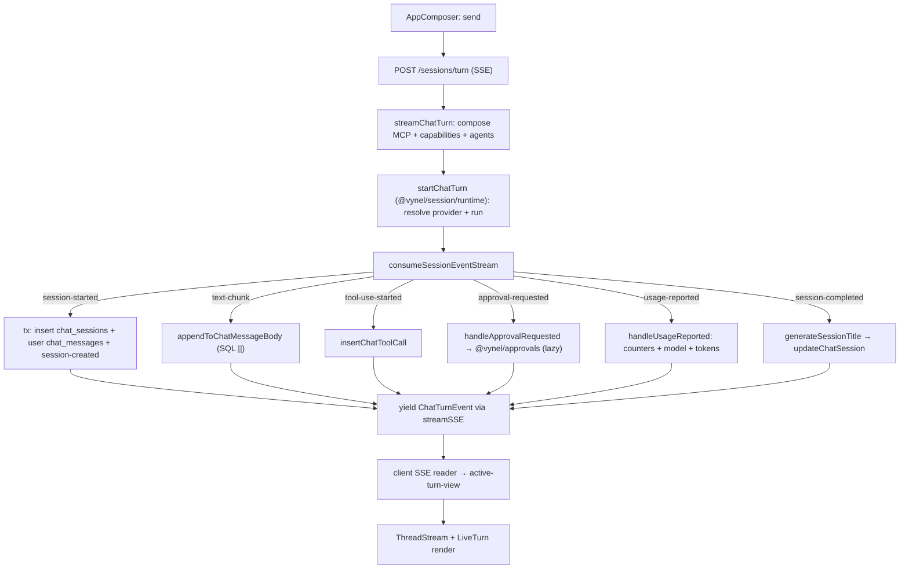
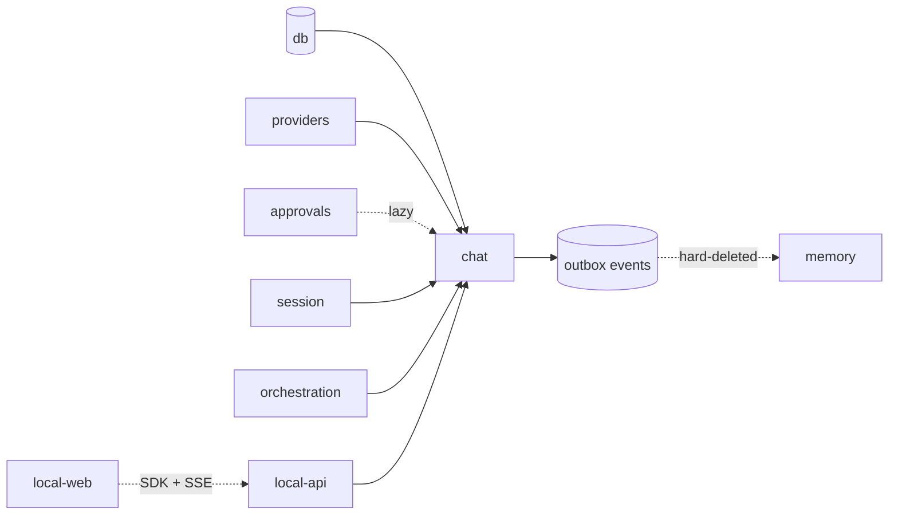

# Chat — Structure

> The code map and connections for the `chat` module. For the concepts behind it, see [overview.md](./overview.md).
>
> Folders touched: `packages/chat/src/{schema,repositories,turn-consumption,records,history,queries,context}/` · `packages/db/src/migrations-sqlite/` · `apps/local-api/src/routes/chat/` · `apps/local-api/src/streams/chat-turn.ts` · `apps/local-web/src/{components,composables}/chat/` · `apps/local-web/src/stores/`

`@vynel/chat` is a **vertical-slice leaf**: it owns its `schema/` + `repositories/` and all its logic under `packages/chat/src/`. It is **pure persistence + history** — it drains a provider's normalized event stream into rows and serves the reads. It does **not** run turns; the turn *runners* live in `@vynel/session` and drive `consumeSessionEventStream` from here. Package exports `.` (`./src/index.ts`) + `./repositories`.

## File map

`► ` = entry point.

| Path | Role |
|---|---|
| ► `packages/chat/src/index.ts` | public barrel (`@vynel/chat`) — types, event constants, turn-consumption, records, history, queries, context |
| `packages/chat/src/chat-types.ts` | re-exports row types + `StructuralLogger`, `NewSessionOptions` for the package |
| `packages/chat/src/chat-events.ts` | 4 outbox event constants + payload types |
| `packages/chat/src/chat-turn-event.ts` | `ChatTurnEvent` discriminated union (15 variants) — the SSE wire type |
| **schema** | |
| `packages/chat/src/schema/chat-sessions.ts` | `chat_sessions` table + `ChatSession`/`NewChatSession` + `ChatSessionVisibility`, `ChatSessionScope` unions |
| `packages/chat/src/schema/chat-messages.ts` | `chat_messages` table + `ChatMessageRole`, `ChatMessageSourceKind`, `ChatMessageOriginChannel` unions + `AttachedImageMetadata` |
| `packages/chat/src/schema/chat-tool-calls.ts` | `chat_tool_calls` table + `ToolCallStatus` + `ApprovalStatus` unions |
| `packages/chat/src/schema/index.ts` | schema barrel |
| **repositories** | |
| `packages/chat/src/repositories/chat-sessions.ts` | session CRUD + counters + soft/hard-delete + `ChatSessionListItem` (`lastMessagePreview` via correlated subquery) |
| `packages/chat/src/repositories/chat-messages.ts` | message read/insert/update + streaming appenders + partial-session/recent reads |
| `packages/chat/src/repositories/chat-tool-calls.ts` | tool-call read/insert/update (by-id, by-toolUseId, per-message, per-session) |
| `packages/chat/src/repositories/chat-search.ts` | `searchChatMessages` — FTS5 (SQLite) / tsvector (Postgres, throws in Phase 1) + `ChatMessageSearchResult` |
| `packages/chat/src/repositories/index.ts` | repo barrel (the `./repositories` export) |
| **turn-consumption** — the persistence engine the session runners drive | |
| ► `packages/chat/src/turn-consumption/consume-session-event-stream.ts` | translates `AsyncIterable<NormalizedSessionEvent>` → persisted rows + `AsyncIterable<ChatTurnEvent>`; per-turn caches (`assistantMessageByMessageId`, `toolCallByToolUseId`) |
| `packages/chat/src/turn-consumption/handle-session-started.ts` | co-commits session row + user message + `session-created` event in one tx (new); wraps user-message insert + `lastMessageAt` bump in one tx (resume) |
| `packages/chat/src/turn-consumption/handle-usage-reported.ts` | increments session counters + sets session `model` + assistant `inputTokens`/`outputTokens`; threads `sessionModel` in/out |
| `packages/chat/src/turn-consumption/handle-approval-requested.ts` | lazy-imports `@vynel/approvals`; yields `approval-requested` or `approval-auto-resolved` |
| `packages/chat/src/turn-consumption/ensure-assistant-message-row.ts` | upserts the assistant message row on first chunk for a `messageId`; carries `AssistantRowAttribution` |
| `packages/chat/src/turn-consumption/build-new-chat-session-row.ts` | the single builder for a new `chat_sessions` row (shared by first-turn + swap + leaf so they never drift) |
| `packages/chat/src/turn-consumption/attached-images.ts` | `persistAttachedImages` / `readAttachedImageBytes` / `imagesDirFor` / `attachedImagesMetadataFor` — writes base64 to `<workspace>/.vynel/transcripts/<sessionId>/images/` |
| `packages/chat/src/turn-consumption/generate-session-title.ts` | derives a title from the first user message body; called on `session-completed` for new sessions |
| **records** — the chat side of session-continuity swaps + brain-tree delegation | |
| `packages/chat/src/records/record-swap-segment-session.ts` | inserts the `chat_sessions` row for a continuity SWAP segment; emits `session-created` |
| `packages/chat/src/records/record-leaf-session.ts` | inserts the `chat_sessions` row for a `visibility:'hidden'` LEAF agent session; emits `session-created` |
| `packages/chat/src/records/record-pushed-report-message.ts` | pushes ONE attributed report onto the global root's current session; FK-id-gated (never mints a session) |
| `packages/chat/src/records/compose-manager-source-label.ts` | the `"persona · workspace"` label format — single home |
| **history** — session-list + detail CRUD | |
| `packages/chat/src/history/list-chat-sessions-for-workspace.ts` | thin workspace-scoped list wrapper over the repo |
| `packages/chat/src/history/get-chat-session-detail.ts` | two-query fetch (messages + tool calls); groups tool calls by `parentMessageId`; returns `ChatSessionDetail` |
| `packages/chat/src/history/search-chat-sessions.ts` | min-length guard + wrapper over `searchChatMessages` |
| `packages/chat/src/history/synchronize-chat-sessions-for-workspace.ts` | reconciles provider-persisted sessions; inserts stubs for unknown ids matching the workspace path |
| `packages/chat/src/history/rename-chat-session.ts` | find → 404 → `updateChatSession(title)` |
| `packages/chat/src/history/archive-chat-session.ts` | `archiveChatSession` / `unarchiveChatSession`; archive emits `session-archived` |
| `packages/chat/src/history/soft-delete-chat-session.ts` | find → 404 → soft-delete + `session-soft-deleted`; idempotent |
| `packages/chat/src/history/interrupt-chat-session.ts` | delegates to `provider.interruptChatSession` |
| `packages/chat/src/history/purge-deleted-chat-sessions.ts` | per-session tx: `hardDeleteChatSession` + `session-hard-deleted`; FK-cascades messages + tool calls |
| **queries** — cross-scope reads | |
| `packages/chat/src/queries/list-recent-chat-sessions-for-user.ts` | most-recently-active sessions across every scope (global + all workspaces) — backs the dashboard recent-activity feed |
| **context** — the MCP-readable read surface | |
| `packages/chat/src/context/get-session-context-report.ts` | resolves provider; calls `provider.getContextReport` with the session's model + pre-built MCP servers; null on failure |
| **HTTP surface** (`apps/local-api`) | |
| ► `apps/local-api/src/routes/chat/index.ts` | Hono sub-app — 12 chained routes; mounted at `/workspaces/:workspaceId/chat` |
| `apps/local-api/src/routes/chat/schemas.ts` | request/response Zod schemas + `x-sdk-name` shapes |
| `apps/local-api/src/routes/chat/fetch-context-report.ts` | builds the in-process MCP server; calls `getSessionContextReport`; keeps the route handler thin |
| ► `apps/local-api/src/streams/chat-turn.ts` | `streamChatTurn` — composes MCP + capabilities + agents; calls `startChatTurn` (**from `@vynel/session/runtime`**); pipes to `streamSSE` |
| `apps/local-api/src/middleware/chat-session-resolver.ts` | resolves + ownership-checks `c.var.chatSession` for session-scoped routes |
| **Web surface** (`apps/local-web`) | see [Web surface](#web-surface) |

## Data & persistence

Three tables, all owned in `packages/chat/src/schema/`. Loose refs out: `userId` → `users`, `workspaceId` → `workspaces` (both `@vynel/db/schema`, cascade) — these are the kernel's shared tables, not a sibling leaf.

### `chat_sessions` — one row per conversation, soft-deletable

| Column | Type | Notes |
|---|---|---|
| `id` | text (PK) | SDK-assigned session id — **not** a Vynel UUID (D2) |
| `userId` | id (FK, cascade) | → `users` |
| `workspaceId` | text (FK, cascade, **nullable**) | → `workspaces`; null for the GLOBAL root (brain above all workspaces) |
| `providerId` | text | `'claude'`/`'codex'`/…; validated at the app layer |
| `model` | text (null) | AI model captured from the assistant message; context-window denominator |
| `title` | text | auto-generated from first user message on `session-completed` |
| `visibility` | text `'listed'`/`'hidden'` | not null, default `'listed'` — sidebar curation (swap segments + leaves are `hidden`) |
| `scope` | text `'global'`/`'workspace'`/`'agent'` | not null, default `'workspace'` — explicit session-type discriminator |
| `isArchived` | boolean | hide from default list; independent of `deletedAt` |
| `deletedAt` | timestamp (null) | soft-delete (D14) |
| `totalMessageCount`, `totalInputTokens`, `totalOutputTokens` | integer | SQL-side incremented per usage report |
| `startedAt`, `lastMessageAt`, `updatedAt` | timestamp | |

Indexes: `userId`; `(workspaceId, isArchived)`; `(workspaceId, deletedAt)`; `lastMessageAt desc`.

### `chat_messages` — one row per user or assistant message

| Column | Type | Notes |
|---|---|---|
| `id` | text (PK) | assistant rows = provider's `messageId`; user rows = Vynel UUID (D15) |
| `sessionId` | text (FK, cascade) | → `chat_sessions` |
| `role` | text | `'user'`/`'assistant'`/`'system'` |
| `body` | text | SQL-side appended via `\|\|` during streaming |
| `sourceKind` | text (null) | brain-tree attribution: `'user'`/`'global-root'`/`'workspace-manager'`/`'agent'`; null on workspace-chat rows |
| `sourceLabel` | text (null) | workspace/agent name for manager/agent rows |
| `originChannel` | text (null) | `'voice'`/`'telegram'`/`'discord'`; null = the app composer |
| `partialSessionId` | text (null) | brain-tree correlation key linking one delegation chain |
| `thinkingBody` | text (null) | thinking content; `COALESCE(col,'') \|\| delta` |
| `inputTokens`, `outputTokens` | integer (null) | assistant-turn occupancy; null on user rows |
| `attachedImagesMetadata` | json (null) | `AttachedImageMetadata[]` — opaque, never filtered |
| `errorCode`, `errorMessage` | text (null) | set on `session-errored` on the last open assistant message |
| `startedAt`, `completedAt`, `createdAt` | timestamp | `completedAt` null while streaming |

Indexes: `(sessionId, startedAt)`; `(sessionId, role)`; `(partialSessionId, startedAt)`.

**`chat_messages_fts`** — external-content FTS5 virtual table over `body`, with three sync triggers (`after insert`/`update of body`/`delete`). Hand-authored (drizzle-kit does not model virtual tables/triggers) — appended to the baseline migration. No `sqlite-vec` index — chat has no semantic search.

### `chat_tool_calls` — one row per tool invocation, child of an assistant message

| Column | Type | Notes |
|---|---|---|
| `id` | id (PK) | Vynel UUID |
| `parentMessageId` | text (FK, cascade) | → `chat_messages` |
| `toolUseId` | text | provider-supplied; correlates `tool-use-completed` |
| `toolName` | text | |
| `toolInput` | json | opaque, tool-specific |
| `toolOutput` | json (null) | null while running |
| `status` | text | `started`/`completed`/`failed`/`denied`/`cancelled` |
| `approvalStatus` | text (null) | `approved`/`denied`/`timed-out`/`cancelled`; null if no approval needed |
| `isErrorResult` | boolean | |
| `startedAt`, `completedAt` | timestamp | |

Indexes: `parentMessageId`; `(parentMessageId, startedAt)`; `toolUseId`.

**Migrations** (`packages/db/src/migrations-sqlite/`): all three tables + the FTS5 virtual table + triggers land **baseline-folded** in `0000_baseline.sql`; `0001_chat-message-origin-channel.sql` is an incremental `ALTER TABLE chat_messages ADD origin_channel text`. (Migrations live in the shared `@vynel/db` kernel, not in the leaf — one physical DB per invariant #3.)

## Repositories

Functional, `db`-first, stateless. `findX` → null; hard-throws live in the core ops layer.

| Function | Purpose |
|---|---|
| `findChatSessionById` | one session or null |
| `listChatSessionsForWorkspace` | ordered by `lastMessageAt desc`; joins `lastMessagePreview` (correlated subquery) |
| `listRecentChatSessionsForUser` | cross-scope recent feed (all workspaces + global root) |
| `insertChatSession` / `updateChatSession` | create / patch |
| `incrementChatSessionCounters` | SQL-side `col + delta` for message/token counters |
| `softDeleteChatSession` / `listChatSessionsDeletedBefore` / `hardDeleteChatSession` | retention lifecycle |
| `findChatMessageById` / `listChatMessagesForSession` / `listRecentChatMessagesForSession` | reads |
| `listChatMessagesByPartialSessionId` | brain-tree delegation-trace read |
| `insertChatMessage` / `updateChatMessage` | create / patch |
| `appendToChatMessageBody` | `body \|\| delta` — safe under concurrent chunks |
| `appendToChatMessageThinking` | `COALESCE(thinking,'') \|\| delta` |
| `findChatToolCallById` / `findChatToolCallByToolUseId` | reads (by-toolUseId for stream correlation) |
| `listChatToolCallsForMessage` / `listChatToolCallsForSession` | reads (session join via `chat_messages`) |
| `insertChatToolCall` / `updateChatToolCall` | create / patch |
| `searchChatMessages` | FTS5 `MATCH` + workspace + soft-delete filter + `snippet()` highlights |

## Core operations

| Operation | What it does | Key calls (incl. outbox / tx) |
|---|---|---|
| `consumeSessionEventStream` | translates each `NormalizedSessionEvent` kind → DB writes + `ChatTurnEvent` yields; per-turn caches; image persistence on `session-started` | all repo functions, `handleSessionStarted`, `handleUsageReported`, `handleApprovalRequested`, `ensureAssistantMessageRow` |
| `handleSessionStarted` | new: **tx** {insert session + user message + `session-created`}; resume: **tx** {insert user message + bump `lastMessageAt`} | `insertChatSession`, `insertChatMessage`, `insertOutboxEvent` |
| `handleUsageReported` | increments session counters, sets session `model` + assistant token columns | `incrementChatSessionCounters`, `updateChatMessage`/`updateChatSession` |
| `handleApprovalRequested` | records the approval request; returns `approval-requested` or `approval-auto-resolved` | `@vynel/approvals` (lazy `await import`) |
| `recordSwapSegmentSession` / `recordLeafSession` | insert a `chat_sessions` row for a continuity swap / hidden leaf | `buildNewChatSessionRow`, **tx** + `session-created` |
| `recordPushedReportMessage` | push one attributed report onto the global root's current session (FK-id-gated) | `insertChatMessage`, `composeManagerSourceLabel` |
| `getChatSessionDetail` | two-query messages + tool calls; groups tool calls by `parentMessageId` | `listChatMessagesForSession`, `listChatToolCallsForSession` |
| `searchChatSessions` | min-length guard + wrapper | `searchChatMessages` |
| `synchronizeChatSessionsForWorkspace` | inserts stubs for provider sessions unseen locally | `provider.synchronizePersistedSessions`, `insertChatSession` |
| `renameChatSession` | find → 404 → update title | `findChatSessionById`, `updateChatSession` |
| `archiveChatSession` / `unarchiveChatSession` | toggle `isArchived`; archive: **tx** + `session-archived` | `updateChatSession`, `insertOutboxEvent` |
| `softDeleteChatSession` | find → 404 → **tx** {soft-delete + `session-soft-deleted`}; idempotent | `insertOutboxEvent` |
| `interruptChatSession` | delegate to provider | `provider.interruptChatSession` |
| `purgeDeletedChatSessions` | per-session **tx** {hard-delete + `session-hard-deleted`}; FK-cascades | `listChatSessionsDeletedBefore`, `insertOutboxEvent` |
| `getSessionContextReport` | resolve provider, dispatch `/context` read with session model + MCP servers | `findChatSessionById`, `resolveAiAgentProvider` |

## HTTP surface

Mounted at `/workspaces/:workspaceId/chat` (from `apps/local-api/src/app.ts`). Workspace-scoped routes use `...workspaceScoped`; session-scoped use `...sessionScoped` (triple-checks user + workspace + session ownership via `chat-session-resolver.ts`).

| Method | Path | Bundle | Purpose | MCP tool |
|---|---|---|---|---|
| GET | `/sessions` | workspace | list sessions (optionally include archived) | `list_chat_sessions` |
| GET | `/sessions/search` | workspace | FTS5 search across messages | `search_chat_messages` |
| GET | `/continuing` | workspace | resolve the workspace's continuing primary conversation (via `@vynel/session/continuity`) | — |
| POST | `/sessions/turn` | workspace | start/resume a turn; **SSE stream** | — (SSE) |
| GET | `/sessions/:sessionId` | session | full detail: messages + grouped tool calls | `get_chat_session` |
| GET | `/sessions/:sessionId/images/:filename` | session | serve a persisted attached image (`nosniff`) | — |
| GET | `/sessions/:sessionId/context` | session | `/context` markdown breakdown | — |
| PATCH | `/sessions/:sessionId` | session | rename | — |
| POST | `/sessions/:sessionId/archive` | session | archive | — |
| POST | `/sessions/:sessionId/unarchive` | session | unarchive | — |
| POST | `/sessions/:sessionId/interrupt` | session | interrupt active turn | — |
| DELETE | `/sessions/:sessionId` | session | soft-delete | — |

> SSE transport for `POST /sessions/turn` uses `streamSSE` from `hono/streaming`. The stream body lives in `apps/local-api/src/streams/chat-turn.ts`, which composes the MCP servers + capabilities + agents and calls `startChatTurn` from **`@vynel/session/runtime`** — the runner is not in `@vynel/chat`. On the client, a `fetch`-based reader parses frames (EventSource is GET-only).

## MCP surface

Chat has **no `McpFeatureDescriptor`** yet — its tools are exposed via `x-mcp` annotations on three read-only HTTP routes (`list_chat_sessions`, `search_chat_messages`, `get_chat_session`), all owner-scoped and non-mutating. Mutating routes (rename/archive/interrupt/delete) defer `x-mcp` to Phase 1.5 per D26. A dedicated descriptor (backed by `getSessionContextReport` / `getChatSessionDetail` / `searchChatSessions` so a post-swap session can recall its own prior context) **lands with the `@vynel/session` pull** — see `docs/module-notes/chat.md` decision 3.

## Worker / background jobs

`purgeDeletedChatSessions` (core op, `history/purge-deleted-chat-sessions.ts`) is the daily-retention operation, written as a thin-delegator-ready core op. **It is not yet wired into `apps/worker`** — the only worker job present today is `generate-knowledge-embeddings`; `apps/worker/src/factory.ts` names chat purge only as the delegator precedent. *Defined but not yet wired.*

## Web surface

`apps/local-web` — Vue 3 `<script setup>` + Pinia + vue-query.

**Stores:** `stores/live-sessions-store.ts` (live/active session + turn state), `stores/ui-store.ts` (UI layout state incl. chat panels).

**Composables** (`composables/chat/`):

| File | What it does |
|---|---|
| `use-session-list.ts` | the session-list read (vue-query) |
| `use-session-detail.ts` | one session's messages + tool calls |
| `use-chat-turn.ts` | the active-turn orchestration — send / interrupt / optimistic echo |
| `chat-turn-stream.ts` + `sse-frames.ts` | `fetch`-based SSE reader + frame parser for `POST /sessions/turn` |
| `active-turn-view.ts` | pure fold of `ChatTurnEvent[]` → the live-turn view |
| `turn-attachments.ts` | draft image attachment state (pick / paste / validate) |
| `use-continuing-conversation.ts` | resolves `/continuing` for landing |
| `session-keys.ts` / `session-scope.ts` | query-key + scope helpers |

**Components** (`components/chat/`): `AppComposer.vue` (input + attachments + send/interrupt), `ThreadStream.vue` (scrollable message region), `LiveTurn.vue` (in-flight assistant block), `SessionsPanel.vue` (session-list rail), `GlobalWelcomeHero.vue` (global-root landing), `channel-presentation.ts` (origin-channel badge mapping).

## Pipeline — "user sends a message → streamed turn persisted"

1. `components/chat/AppComposer.vue` (send) → `use-chat-turn.ts` sets optimistic user state + opens the stream.
2. `POST /workspaces/:id/chat/sessions/turn` → `apps/local-api/src/routes/chat/index.ts:177`.
3. `apps/local-api/src/streams/chat-turn.ts` — composes MCP servers (`@vynel/mcp` `vynelWorkspaceDescriptor` + `@vynel/instructions` notebook), enabled capabilities, session agents, then calls `startChatTurn` from `@vynel/session/runtime`.
4. `startChatTurn` resolves the provider and drives `consumeSessionEventStream` (`packages/chat/src/turn-consumption/consume-session-event-stream.ts:88`).
5. Per `NormalizedSessionEvent` kind (`consume-session-event-stream.ts:130`):
   - `session-started` → `handleSessionStarted` (tx) + best-effort `persistAttachedImages`.
   - `text-chunk` → `ensureAssistantMessageRow` → `appendToChatMessageBody`; on `isFinalChunk` set `completedAt`.
   - `thinking-chunk` → `appendToChatMessageThinking`.
   - `tool-use-started` → `insertChatToolCall(status:'started')`; `tool-use-completed` → `updateChatToolCall`.
   - `approval-requested` → `handleApprovalRequested`; `usage-reported` → `handleUsageReported`.
   - `session-completed` → title new sessions; `session-errored` → mark last open assistant message.
6. `streamSSE` (`streams/chat-turn.ts`) writes each `ChatTurnEvent` as a frame.
7. Client `sse-frames.ts` parses frames → `active-turn-view.ts` folds them → `ThreadStream.vue` + `LiveTurn.vue` render.

## Connections

**Summary:** chat is a **foundation leaf** — the first substrate pulled beneath `@vynel/session`. Read-side it imports the kernel + `@vynel/providers` + (lazily) `@vynel/approvals`; event-side it publishes four lifecycle outbox events. Its biggest **consumer** is `@vynel/session` (runtime + delegation), plus `@vynel/orchestration`, the `apps/local-api` routes/streams, and `packages/contracts`.

| Unit | Direction | Mechanism | What crosses |
|---|---|---|---|
| [db](../_platform/database/overview.md) | out | import | row types, repo helpers, `withTransaction`, dialect, shared `insertOutboxEvent`, `users`/`workspaces` tables |
| [providers](../providers/overview.md) | out | import | `resolveAiAgentProvider`, `NormalizedSessionEvent`, `interruptChatSession`, `getContextReport`, `ApprovalDecision` |
| [approvals](../approvals/overview.md) | out | **lazy import** | `recordApprovalRequest` — only when `approval-requested` fires; the one deferred cross-feature edge (invariant #2), decouple at the session pull |
| errors / logger | out | import | `NotFoundError`, `StructuralLogger` |
| [session](../session/overview.md) | in | import | drives `consumeSessionEventStream`; calls the `record*` ops + `findChatSessionById`; **owns the turn runner** (`start-chat-turn`) |
| [orchestration](../orchestration/overview.md) | in | import | leaf/agent session records + delegation |
| [contracts](../_platform/contracts/overview.md) | in | import | `packages/contracts/src/chat/` wire schemas + model-context-window |
| [local-api](../_apps/local-api/overview.md) | in | route mount + SSE | 12 routes + `streamChatTurn`; `workspaceScoped`/`sessionScoped` bundles |
| [local-web](../_apps/local-web/overview.md) | in | SDK + SSE | vue-query SDK calls + `fetch`-based SSE reader |
| [memory](../memory/overview.md) | both (loose) | loose ids + outbox | stores `sessionId`/`messageId` as loose `text()`; `cleanupMemoryForChatSessionHardDeleted` consumes `chat.session-hard-deleted` — *written, not yet wired to a dispatcher* |
| worker | in (future) | import | `purgeDeletedChatSessions` delegator — *not yet wired* |

**Events published** (each co-committed in the same `db.transaction` as its state change):
- `chat.session-created` — `handleSessionStarted` (new session), `recordSwapSegmentSession`, `recordLeafSession`
- `chat.session-archived` — `archiveChatSession`
- `chat.session-soft-deleted` — `softDeleteChatSession`
- `chat.session-hard-deleted` — `purgeDeletedChatSessions` (one per purged session)

**Events consumed:** none. Chat publishes; it registers no outbox consumer.

## Config & gotchas

- **The turn runner is not here.** `start-chat-turn.ts` lives in `@vynel/session/runtime` (it touches session-continuity); excluding it keeps chat cycle-free. Anyone tracing "who starts a turn" must jump to `@vynel/session`.
- **`@vynel/approvals` is a lazy `await import`** inside `handle-approval-requested.ts` — the one deferred cross-feature edge (there is no injection seam today because the only caller, the runner, lives in session). Decouple via injection/outbox when the seam materializes; confirmed one-directional (approvals never imports chat).
- **Session id comes from the SDK, not Vynel.** `chat_sessions.id` is `text()`; a new session's id is unknown until the `session-started` event, so `handleSessionStarted` defers the user-message insert until then.
- **`workspaceId` is nullable** — the GLOBAL root (brain) sits above all workspaces. Consumers must narrow per row; `ChatSessionCreatedPayload.workspaceId` is `string | null`.
- **`scope` + `visibility` drive curation, not access.** `visibility:'hidden'` (swap segments, leaf agents) means "recorded + browsable but off the sidebar list" — *"everything is recorded; the list is curated."*
- **Search is dialect-gated.** `chat-search.ts` branches on `activeDialect`; the Postgres path (`searchChatMessagesPostgres`) throws unconditionally — Phase 2 only. FTS5 virtual table + triggers are hand-authored (baseline-folded), not drizzle-modelled.
- **Migrations are baseline-folded.** All chat DDL is in `0000_baseline.sql` (+ the `0001` origin-channel `ALTER`). A running dev DB predating a folded change can stale — delete `.data/vynel.dev.db*` + restart.
- **Purge + memory-cleanup are both written but unwired.** The purge core op has no worker job yet; memory's `chat.session-hard-deleted` consumer has no dispatcher registration yet. Neither runs in production today.
- **`ChatTurnEvent` has 15 variants** (incl. `approval-resolved`, `approval-auto-resolved`, `session-interrupted`) — more than the persisted-message set; some are pure UI signals with no row write.

---
*Mapped from the code on disk, 2026-07-14. If you change this module, update this file and [overview.md](./overview.md).*
