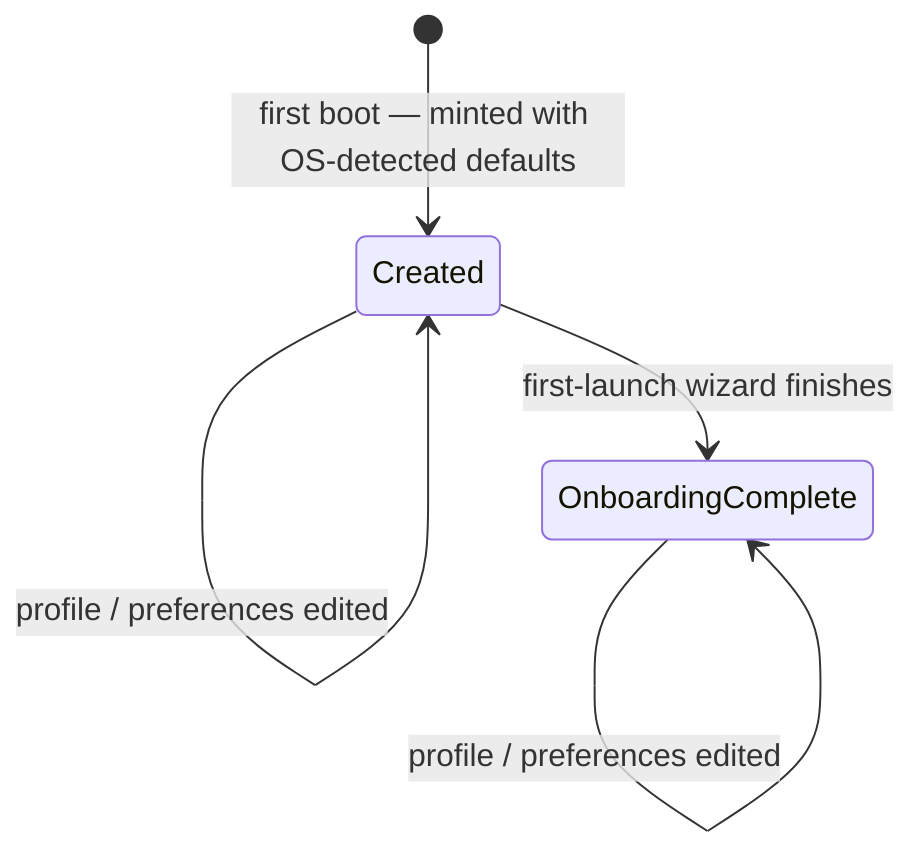

# Core — Overview

> The kernel-core layer just above the database: it owns the single local user everything else is tagged to, and holds the generic relay that turns committed outbox events into side effects.
>
> **Status:** partial — the user domain is shipped and tested; the outbox relay is built and tested but dormant (empty consumer registry, no runtime caller yet) · **Depends on:** [db](../_platform/database/overview.md) (kernel), [errors](../_platform/primitives/overview.md), [logger](../_platform/primitives/overview.md) · **Code map:** [structure.md](./structure.md)

## Purpose

Core is the thin layer of shared logic that sits directly on top of the database kernel — the first place a feature reaches when it needs something everyone needs. Two very different things live here, and it helps to keep them apart.

The first is the **user** domain: the answer to "who is using Vynel." In Phase 1 that answer is a single **local user** on this machine, created the first time the app boots from OS-detected defaults (username, locale, timezone). This is less a product surface the user visits and more the **identity backbone** of the whole system — every row in every other feature carries this user's id, so that the day Vynel moves to a multi-user server (Phase 2) nothing has to be torn out. Alongside identity, the domain holds the user's **profile**, their **preferences**, and the flag that says whether they've finished onboarding.

The second is pure plumbing: the generic **outbox relay**. Features never call each other directly; instead each one, when it changes state, co-commits an outbox event in the same transaction, and something later reads those events and acts on them. That "something" is the relay that lives here — the single, feature-agnostic mechanism that drains unprocessed events and hands each one to its registered consumer. **As of this writing the relay is dormant:** its consumer registry is empty and nothing schedules it to run. It is a seam built ahead of the features that will light it up (schedules delivering to channels), not a live delivery path.

## What it can do

- **Get-or-create the local user** — on first boot, mint the one local user with OS-detected defaults and seed a few starting preferences; every call after that returns the same row (idempotent).
- **Resolve a user's preferences** into a typed object with sensible defaults filled in, ignoring anything stored that it doesn't recognize.
- **Set preferences** — take a partial set of known preference keys and upsert each one in a single transaction.
- **Update the user's profile** — display name, email, locale, timezone.
- **Mark onboarding complete** — flip the one-way flag when the first-launch wizard finishes.
- **Find a user by id** — a null-safe read another feature can use without risking a throw.
- **Detect OS defaults** — best-effort username, locale, and timezone used only to seed a brand-new user.
- *(background, currently dormant)* **Dispatch outbox events** — drain unprocessed events of the registered types and invoke each consumer, marking each event processed atomically. The registry is empty and no timer calls this yet.

## Responsibilities

**Owns** — the single local user and everything attached to it: creating it on first boot, reading and updating its profile, the onboarding-complete flag, the preferences store together with its default values and typed resolution (defaults live here, not in the database), and best-effort OS detection of a new user's defaults. It also owns the *generic* outbox relay — the drain-and-dispatch mechanism and the (presently empty) map of event type to consumer.

**Does not own** —
- the user and preference tables and their SQL — the kernel ([db](../_platform/database/overview.md));
- *who* is allowed to create the local user — that boundary (first-boot and the per-request resolver) lives in the API app ([local-api](../_apps/local-api/overview.md)); everywhere else takes a user id as input;
- the first-launch wizard that decides when onboarding is done — [onboarding](../onboarding/overview.md); core just flips the flag;
- *publishing* outbox events — every feature co-commits its own events in its own transaction; core only relays them;
- the timer that would run the relay on a tick, and the consumers it will eventually call — an app-level scheduler plus [schedules](../schedules/overview.md) / [channels](../channels/overview.md), none of it wired yet;
- workspaces, chat, memory, knowledge and every other feature — they depend on core, not the reverse.

## Concepts & vocabulary

| Term | Meaning |
|---|---|
| **Local user** | The single person using Vynel on this machine in Phase 1. Has a stable id, a display name, an optional email, a locale and timezone, and an onboarding flag. |
| **userId** | The loose reference every other feature's rows carry back to the local user. The seam that makes the code multi-user-ready without a rewrite. |
| **Profile** | The editable identity fields: display name, email, locale, timezone. |
| **Preference** | One key/value setting, stored JSON-encoded. The store is open — unknown keys are kept but ignored on read. |
| **Resolved preferences** | The typed view of preferences with defaults filled: theme, default workspace, chat streaming, reduced motion. |
| **Default preferences** | The canonical defaults, defined in core rather than the database, so a new key can be added without a migration. |
| **Onboarding-complete flag** | A one-way marker set when the first-launch wizard finishes. |
| **OS-detected defaults** | Best-effort username, locale, and timezone read from the operating system to seed a brand-new user. Never authoritative. |
| **Outbox event** | A record a feature commits alongside a state change, describing something that happened, for later delivery. |
| **Outbox consumer** | The function that reacts to one event type's payload. |
| **Consumer registry** | The map from event type to consumer. Currently empty — consumers register as their features land. |
| **Outbox relay / dispatch** | The generic job that drains unprocessed events and runs their consumers. Built and tested, not yet running anywhere. |

## Rules & invariants

- **One local user per machine.** Get-or-create is idempotent — the first call mints the user, every later call returns the same row.
- **Everything is tagged to a userId.** Every feature's rows carry the user's id, so Phase 1 code doesn't have to be rewritten for a multi-user Phase 2.
- **Defaults live in core, not the database.** Preferences resolve against defaults defined here; a future version can add a key without touching stored data.
- **Reads are forgiving.** An unknown preference key, a value of the wrong shape, or malformed JSON is silently ignored and the default stands — so an old client and a new one can share one database.
- **Creating the user is allowlisted.** Only first-boot and the per-request resolver may create the local user; every other code path receives a user id as input or reads the already-resolved user.
- **OS detection is best-effort, never authoritative.** Each probe falls back to a safe constant on failure, and its results only ever seed a new user.
- **Reads split by contract.** A cross-feature read is null-safe (returns nothing when absent); the throwing variants live on the user's own routes.
- **The relay is exactly-once-ish per event.** Each event's consume-and-mark happen in one transaction, so a poison event can't roll back the good ones and a crash between consuming and marking can't duplicate a side effect. A persistently-throwing consumer retries every tick — a known, deliberately-deferred limitation.
- **The relay is dormant today.** Its registry is empty and nothing schedules it. It exists as a seam ahead of the features that will use it — documented honestly so no one assumes events are being delivered.

## Lifecycle

## Where it sits in the bigger picture

Core is the floor every feature stands on. It imports down only into the kernel ([db](../_platform/database/overview.md)) and the shared [errors](../_platform/primitives/overview.md) and [logger](../_platform/primitives/overview.md) packages, and it is imported by nearly everything above it whenever they need the user behind a request. [Onboarding](../onboarding/overview.md) drives the user through first launch and asks core to flip the completed flag; the [local-api](../_apps/local-api/overview.md) app creates the local user at boot, resolves it on every request, and hosts the routes that edit profile and preferences. The outbox relay that also lives here is the quiet delivery seam meant for [schedules](../schedules/overview.md) and [channels](../channels/overview.md) — real code, tested, but waiting on those features and an app-level timer before it carries a single event.

---
*Mapped from the code on disk, 2026-07-14. If you change this module, update this file and [structure.md](./structure.md).*
