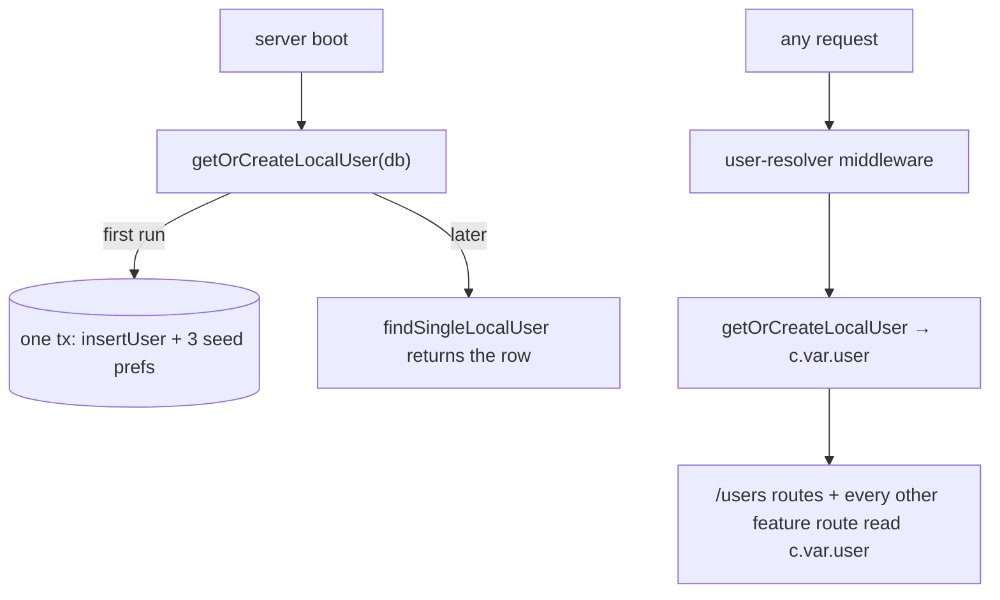
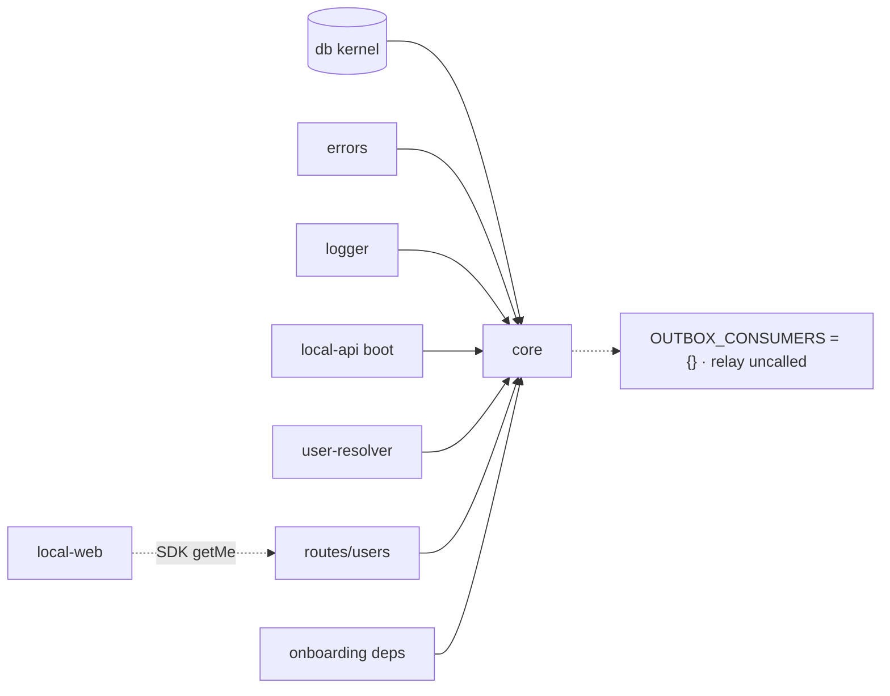

# Core — Structure

> The code map and connections for the core module. For the concepts behind it, see [overview.md](./overview.md).
>
> Folders touched: `packages/core/src/` · `apps/local-api/src/routes/users/` · `apps/local-api/src/{server.ts,middleware/user-resolver.ts,factory.ts}` · `apps/local-api/src/routes/onboarding/` · `apps/local-web/src/composables/users/`

`@vynel/core` is what's **left** of the old central-core spine after the module-by-module decomposition — a two-folder package: the `users/` domain (thin operations over the kernel) and `_shared/` (the generic outbox relay + its registry). It owns **no tables and no repositories** — the `users` / `user_preferences` tables and their repos live in the `@vynel/db` kernel; core's ops are thin, stateless wrappers around them. Deps: `@vynel/db`, `@vynel/errors`, `@vynel/logger` (`packages/core/package.json`). Its `exports` map is `.` → `src/index.ts` (empty barrel by design) + `./*` → `src/*/index.ts`, so consumers import per-domain subpaths: `@vynel/core/users`, `@vynel/core/_shared`.

## File map

► = entry point (subpath barrel).

| Path | Role |
|---|---|
| `packages/core/src/index.ts` | root barrel — **empty by design** (`export {}`); consumers import per-domain subpaths |
| ► `packages/core/src/users/index.ts` | `users` public surface — six user operations + the three `detectOs*` helpers + `DEFAULT_PREFERENCES` + row-type re-exports; imported as `@vynel/core/users` |
| `packages/core/src/users/get-or-create-local-user.ts` | returns the single local user, creating it (OS-detected defaults + 3 seed prefs) on first run; **D7-allowlisted** to boot + user-resolver only; one tx on create |
| `packages/core/src/users/find-user-by-id.ts` | null-safe cross-domain read (schedules' prompt renderer); wraps the kernel repo |
| `packages/core/src/users/update-user-profile.ts` | patch profile fields (displayName/email/locale/timezone); `NotFoundError` if missing |
| `packages/core/src/users/mark-user-onboarding-complete.ts` | flips `hasCompletedOnboarding`; `NotFoundError` if missing; called by onboarding |
| `packages/core/src/users/get-user-preferences.ts` | resolves stored prefs → typed object with `DEFAULT_PREFERENCES` filled; unknown keys ignored (forward-compat) |
| `packages/core/src/users/set-user-preferences.ts` | upserts each provided pref key in one tx; `ValidationError` on non-JSON-encodable value |
| `packages/core/src/users/os-detection.ts` | `detectOsUsername` / `detectOsLocale` / `detectOsTimezone` — best-effort, safe fallbacks; only consumer is `getOrCreateLocalUser` |
| `packages/core/src/users/users-types.ts` | row-type re-exports (`User`, `NewUser`, `UserPreference`, `NewUserPreference`) from the kernel + the `ResolvedUserPreferences` shape |
| ► `packages/core/src/_shared/index.ts` | `_shared` surface (`@vynel/core/_shared`) — `dispatchOutboxEvents`, `OUTBOX_CONSUMERS`, `OutboxConsumer`, re-exported `StructuralLogger` |
| `packages/core/src/_shared/dispatch-outbox-events.ts` | the generic outbox relay — reads unprocessed events of registered types, runs each consumer + marks processed atomically **per event** |
| `packages/core/src/_shared/outbox-consumer-registry.ts` | `OUTBOX_CONSUMERS: Record<string, OutboxConsumer> = {}` — **empty**; a plain map, not an event bus |

## Data & persistence

**Core owns no schema and no `repositories/` folder.** The two tables it operates on live in the kernel under `packages/db/src/schema/users/` and are reached through `@vynel/db/repositories/users`:

- **`users`** (`packages/db/src/schema/users/users.ts`) — the local user record; Phase 1 holds exactly one row generated on first boot. Columns: `id` (PK), `displayName`, `emailAddress` (null), `locale`, `timezone`, `hasCompletedOnboarding`, `createdAt`, `updatedAt`. This is the row every other feature's `userId` points at.
- **`user_preferences`** (`packages/db/src/schema/users/user-preferences.ts`) — extensible KV prefs; composite PK `[userId, preferenceKey]` (FK → `users.id`, cascade); `preferenceValue` is a JSON-encoded string. **Defaults are resolved in core** (`DEFAULT_PREFERENCES`), not looked up from the DB. First boot seeds three keys at their default values (`theme` / `chatStreamingEnabled` / `reducedMotion`, per D5); `defaultWorkspaceId` is never seeded and stays absent until explicitly set.

## Repositories

None in this package. Every op delegates to kernel repos in `@vynel/db/repositories/users`:

| Kernel repo function | Used by |
|---|---|
| `findSingleLocalUser` / `insertUser` | `getOrCreateLocalUser` |
| `findUserById` | `findUserById` (core wrapper) |
| `updateUser` | `updateUserProfile`, `markUserOnboardingComplete` |
| `listPreferencesForUser` | `getUserPreferences` |
| `upsertPreferenceForUser` | `setUserPreferences`, `getOrCreateLocalUser` (seed prefs) |

## Core operations

| Operation | What it does | Key calls |
|---|---|---|
| `getOrCreateLocalUser` | return the one local user, else create it (OS defaults + seed `theme`/`chatStreamingEnabled`/`reducedMotion`) — one tx on the create path; idempotent | `findSingleLocalUser`, `insertUser`, `upsertPreferenceForUser`, `detectOs*` |
| `findUserById` | null-safe read for other domains | `findUserById` (repo) |
| `updateUserProfile` | patch profile fields, `NotFoundError` on miss, `logger.info` | `updateUser` |
| `markUserOnboardingComplete` | set `hasCompletedOnboarding: true`, `NotFoundError` on miss | `updateUser` |
| `getUserPreferences` | fold stored rows onto `DEFAULT_PREFERENCES`; unknown keys skipped | `listPreferencesForUser` |
| `setUserPreferences` | upsert each provided key in one tx; `ValidationError` on non-encodable value | `upsertPreferenceForUser` |
| `dispatchOutboxEvents` | relay: list unprocessed events of registered types (batch 100), run each consumer + mark processed in one **per-event** tx; failures left unprocessed for next-tick retry | `listUnprocessedOutboxEvents`, `withTransaction`, `markOutboxEventProcessed` |

## HTTP surface

Mounted at `/users` — **no** workspace prefix; user-scoped (`apps/local-api/src/app.ts:162`, `app.route('/users', usersApp)`). Middleware: the `userScoped` bundle per route. No error mapping in the routes — typed `VynelError`s hit the global `onError` in `app.ts`. There is **no `/profile` route** — profile updates are `PATCH /me`.

| Method | Path | Purpose | MCP tool |
|---|---|---|---|
| GET | `/me` | the resolved user (`c.var.user`) | `get_current_user` (read) |
| PATCH | `/me` | `updateUserProfile` | — |
| GET | `/me/preferences` | `getUserPreferences` (defaults filled) | `get_user_preferences` (read) |
| PATCH | `/me/preferences` | `setUserPreferences` then re-read | — |

The single user row is put on `c.var.user` upstream by `middleware/user-resolver.ts` (the one middleware besides boot allowed to call `getOrCreateLocalUser`, per D7).

## MCP surface

Core ships no descriptor of its own — its two safe-read GETs carry an inline `x-mcp` block on the route (`get_current_user`, `get_user_preferences`), compiled into the route-derived `vynel` server. Both are reads; neither PATCH is exposed (mutating exposure deferred to a per-route scope review, per `sdk-mcp.md` "safe-by-default").

## Web surface

Minimal — no settings/preferences panel yet. The only consumer is `apps/local-web/src/composables/users/use-current-user.ts` (`useCurrentUser`), a vue-query read (`vynel.users.getMe()`, key `["users","me"]`, 5-min stale) whose display name feeds the greeting in `views/GlobalChatView.vue`. Preferences and profile-edit (`getPreferences` / `updatePreferences` / `updateMe`) have **no web caller** — they're API/MCP-only in the shipped app.

## Pipeline — "first boot resolves the one local user; every request re-resolves it"

1. `apps/local-api/src/server.ts:60` calls `getOrCreateLocalUser(db, { logger })` at boot — creates the row (OS defaults + seed prefs, one tx) if absent.
2. `apps/local-api/src/middleware/user-resolver.ts:15` re-resolves it per request onto `c.var.user` — cheap `findSingleLocalUser` after first run.
3. `apps/local-api/src/routes/users/index.ts` reads/patches that user; other features accept `userId` as input rather than resolving it themselves.

## Connections

**Summary:** core is a **read/write leaf the app boots on** — `users` ops are imported directly by the API's boot, middleware, routes, and onboarding-deps; `_shared` is the outbox-relay seam that **nothing wires yet**. It depends only on the kernel + shared packages and publishes no events of its own.

| Unit | Direction | Mechanism | What crosses |
|---|---|---|---|
| db kernel (`@vynel/db`) | out | import | `Database`, `withTransaction`, `users`/`user_preferences` repos, outbox repo |
| errors / logger | out | import / type-only | `NotFoundError`, `ValidationError`, `StructuralLogger` |
| local-api boot (`server.ts`) | in | import | `getOrCreateLocalUser` at startup |
| local-api middleware (`user-resolver.ts`) | in | import | `getOrCreateLocalUser` → `c.var.user` |
| local-api `routes/users` | in | import | `updateUserProfile`, `getUserPreferences`, `setUserPreferences`, `User` type |
| local-api `factory.ts` / `routes/users/serializers.ts` | in | type import | `User` |
| [onboarding](../onboarding/overview.md) | in | import (at deps-build) | `updateUserProfile` + `markUserOnboardingComplete` bound into `OnboardingDeps` (`routes/onboarding/build-onboarding-deps.ts`); the onboarding **leaf** never imports core |
| local-web | in | SDK | `useCurrentUser` calls `vynel.users.getMe()` for the greeting; no preferences/profile-edit UI |

**Events published:** none.
**Events consumed:** **none — `OUTBOX_CONSUMERS` is the empty map `{}`** (`packages/core/src/_shared/outbox-consumer-registry.ts:16`), and `dispatchOutboxEvents` has **no non-test caller anywhere in the repo** (only its own barrel export + `dispatch-outbox-events.test.ts`). This is the single source of every "consumer defined but not wired" / "the registry is empty" note across the doc book (e.g. memory's `cleanupMemoryForChatSessionHardDeleted`, schedules' `schedule.run-completed`): those consumers are exported and tested but have nowhere to register until this map and a caller (Phase-1 home: the per-minute `apps/worker` job) land.

## Config & gotchas

- **The root barrel is empty on purpose** (`src/index.ts` = `export {}`). Import per-domain subpaths (`@vynel/core/users`, `@vynel/core/_shared`); there is no `@vynel/core` value surface.
- **`getOrCreateLocalUser` is D7-allowlisted** — call it only from `server.ts` (boot) and `user-resolver.ts` (the request resolver). Everywhere else read `c.var.user` (routes) or accept a `userId`. The allowlist is documented in the op's own header.
- **The whole `_shared/` outbox relay is dark code.** `OUTBOX_CONSUMERS` is empty, `dispatchOutboxEvents` is never called outside tests, and nothing imports `@vynel/core/_shared` in production. It's a deliberately-landed seam waiting on channels/schedules + the worker job — not a bug, but treat it as inert when reasoning about event delivery.
- **Known relay limitation (flagged, not built):** a persistently-throwing consumer would retry every minute forever (log-spam). Acceptable now because there are no consumers; a max-attempts / dead-letter is the eventual fix (see the op's header comment).
- **Core owns no tables.** Editing `users` / `user_preferences` columns means touching `packages/db/src/schema/users/` and the kernel migrations, not this package.
- **`ResolvedUserPreferences` is declared twice** — in `get-user-preferences.ts` (the op) and `users-types.ts` (to avoid a circular import); keep them in sync if you add a preference key. Adding a key also means a `case` in `getUserPreferences`'s switch, or it's silently dropped.
- **This package is transitional.** It's the residue of the `@vynel/core` decomposition; the users domain and `_shared` are the last tenants. Rewiring importers to direct packages (and eventually retiring the `@vynel/core` name) is a deferred "improve" step, per `docs/pull-plan.md` + `.claude/STATE.md`.

---
*Mapped from the code on disk, 2026-07-14. If you change this module, update this file and [overview.md](./overview.md).*
