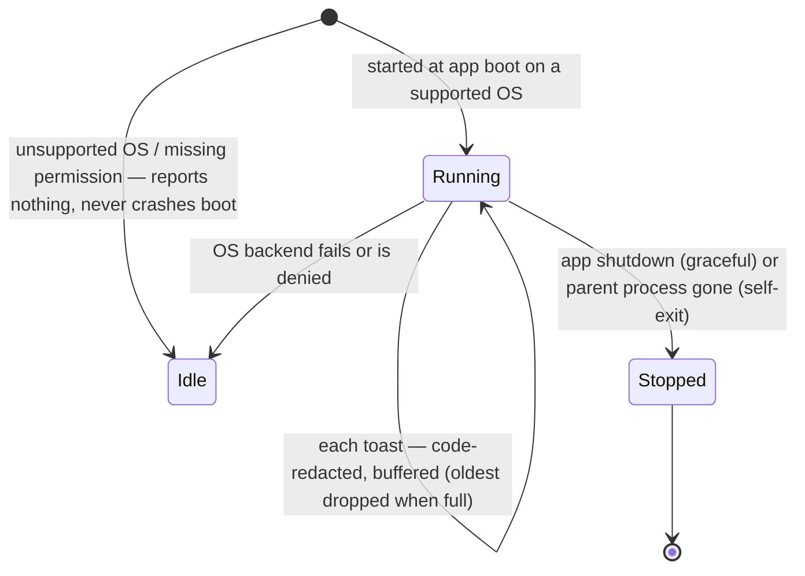

# Desktop control — Overview

> Vynel's desktop senses: the assistant can see what's happening on your computer — the notifications you got, the apps you have open, what's on a given app's screen — and, when explicitly switched on, act on it by clicking and typing.
>
> **Status:** partial · **Depends on:** [logger](../logger/overview.md), [mcp-contract](../mcp-contract/overview.md) · **Code map:** [structure.md](./structure.md)

## Purpose

Desktop control is what lets the always-on assistant answer "what did I miss?", "what's open right now?", or "read what's on my Slack" — questions about the *whole computer* rather than any one project. It reaches past Vynel's own data into the live desktop, and hands the assistant a small set of tools it calls mid-conversation.

What makes it a product surface rather than plumbing is that it is the assistant's only window onto the machine itself. Every other module answers questions about Vynel's own memory, knowledge, or sessions; this one observes the operating system — the toasts that popped up, the windows that are open, the on-screen contents of an app. It is deliberately framed to the assistant as *things you do yourself, not things you route to a workspace*.

The module has two halves that share a safety posture but little else: a **notification listener** that watches the OS notification stream, and an **accessibility bridge** that reads (and optionally drives) any open app's on-screen UI. Both are read-only by default; the ability to *act* is a separate, off-by-default capability.

## What it can do

- **Report the notifications you received** — the app, title, body, and time of each desktop toast, oldest last, optionally only those since a given moment.
- **List the apps and windows currently open**, so the assistant can discover what to look at instead of guessing window titles (which change constantly).
- **Read a named app's on-screen UI** as an accessibility tree — the roles, names, and values of its elements — so the assistant can "see" what's in it. Elements are addressed by accessibility selector, not by pixel coordinates.
- **Act on an element** — click it, type text into it, or set its value — *only when desktop actions are switched on*. This capability is fully built and tested but ships off by default (see Rules).
- *(background)* **Watch the OS notification stream continuously** while the app runs, redacting one-time codes and holding the rest in a small in-memory buffer that the reporting tool reads from.

Four tools make up the surface: three read-only, one mutating. The mutating one is present in a turn only when actions are enabled.

## Responsibilities

**Owns** — the assistant's entire view of the local desktop: the background notification watcher and its lifecycle, the redaction of one-time codes at the moment of capture, the bounded in-memory store of recent notifications, the bridge to a third-party accessibility engine (listing open apps, reading an app's UI tree, and performing element actions), the special handling that wakes otherwise-invisible Electron/Chromium apps so their UI can be read, the in-process MCP server that packages these as tools, and the system-prompt instructions that teach the assistant when and how to use them.

**Does not own** —
- whether the notification watcher is running and where its read interface is injected — the [local-api](../_apps/local-api/overview.md) app creates one process-wide watcher at boot and stops it at shutdown;
- whether desktop *actions* are enabled — that comes from an environment flag read in [local-api](../_apps/local-api/overview.md)'s config, not here;
- attaching the tool set to a conversation turn and assembling the system prompt — the session composer in [local-api](../_apps/local-api/overview.md), driven by the shared descriptor contract ([mcp-contract](../mcp-contract/overview.md));
- the hard approval-card gate that should front every irreversible desktop action — that safety step is specified but not yet built; the interim guard is the off-by-default flag plus an isolated environment.

## Concepts & vocabulary

| Term | Meaning |
|---|---|
| **Desktop notification** | A normalized OS toast the assistant can report: source app, title, body, capture time. Ephemeral — never written to any database. |
| **Redaction at ingest** | One-time / 2FA codes are stripped from a notification's text *before* it enters the buffer, so the raw code is never stored and never reaches the assistant. Best-effort, biased toward privacy — documented as no guarantee. |
| **Accessibility tree** | An app's on-screen UI expressed as nested elements (role, name, value) via a third-party accessibility engine — how the assistant "reads" a screen without pixels. |
| **Selector** | How an element is targeted for an action: by role-and-name, or by a stable per-element id taken from a prior snapshot for precision. |
| **Electron wake** | The recipe for reading Chromium-based apps (Discord, Slack, …) that don't expose a tree until an accessibility client is listening — reach the app by process id, attach, briefly focus it, let the tree build, then read. |
| **Observation vs. action** | The two modes. Observation (notifications, open apps, screen reads) is always on; action (click / type / set value) is a separate, off-by-default capability. |
| **The desktop server** | The in-process tool server these capabilities are exposed through; it is attached to a turn only when the notification watcher is present. |

## Rules & invariants

- **One watcher for the whole process, never one per conversation.** The notification watcher is a process-wide resource started once at boot; spawning one per session would leak a background helper process each time.
- **Notifications are ephemeral by design.** They live only in a small, bounded in-memory buffer — oldest dropped once it's full — and are *never* persisted. Persisting a 2FA code would itself be the leak the module exists to prevent.
- **One-time codes are removed before storage, not before display.** Redaction happens at the moment of capture; nothing downstream ever sees the raw code.
- **Acting on the desktop is off unless deliberately enabled.** The mutating capability is a real off-switch (an environment flag, default off), so a stray run can't silently touch the desktop. It is also declared as a mutating tool, so once the promised approval card lands it will gate automatically.
- **The read and mutating paths both fail closed on a blank target.** An empty app name matches every window, so both refuse it rather than acting on an arbitrary one.
- **An ambiguous action does nothing.** If a selector matches more than one element, no action fires; the candidates are returned so the assistant can re-target one precisely.
- **A desktop operation can never hang the assistant.** Every read or action is bounded by a timeout; a custom-drawn control that never responds surfaces an actionable error instead of leaving the turn pending forever.
- **The module is core-free and stores nothing.** It depends only on the logger and the tool-descriptor contract — no shared database, no persistence.
- **Only Windows has a backend today.** On macOS and Linux the notification watcher stays idle and reports nothing; the accessibility bridge requires the engine's prebuilt native binary for the running OS.

## A note on the current state

The code contradicts one of its own header comments, and the code wins: the package's entry comment describes actions as arriving "in a later increment," but the acting capability is in fact fully implemented and tested. What is *not* yet built is the hard approval-card gate meant to front every irreversible action. So the accurate picture is **landed but gated** — in normal operation the module is read-only, and turning actions on today relies on the flag plus an isolated environment as interim safety, not on a per-action user confirmation. That, together with the Windows-only backend, is why this overview marks the module *partial* rather than *shipped*.

## Lifecycle

The notification watcher is the module's one stateful thing; its life mirrors the mic precedent — deliberately started, visibly running, degrading to idle rather than crashing when the OS won't cooperate.

## Where it sits in the bigger picture

Desktop control is the assistant's reach beyond Vynel's own world into the machine it runs on. It is one of the tool-bearing features the [local-api](../_apps/local-api/overview.md) session composer attaches to a conversation, alongside the route-derived Vynel tools — declared once through the shared [mcp-contract](../mcp-contract/overview.md) descriptor so its senses ride along on every channel (web, messaging, voice) uniformly, rather than being hand-wired into one turn. Unlike almost every other feature, it touches no shared database and persists nothing: notifications are held only in memory, and the accessibility bridge reads the live OS through a third-party engine. Its nearest conceptual sibling is the voice surface — both are always-on senses of the whole computer, both modeled on a "visibly listening, user-controllable" posture rather than a silent background tap.

---
*Mapped from the code on disk, 2026-07-14. If you change this module, update this file and [structure.md](./structure.md).*
