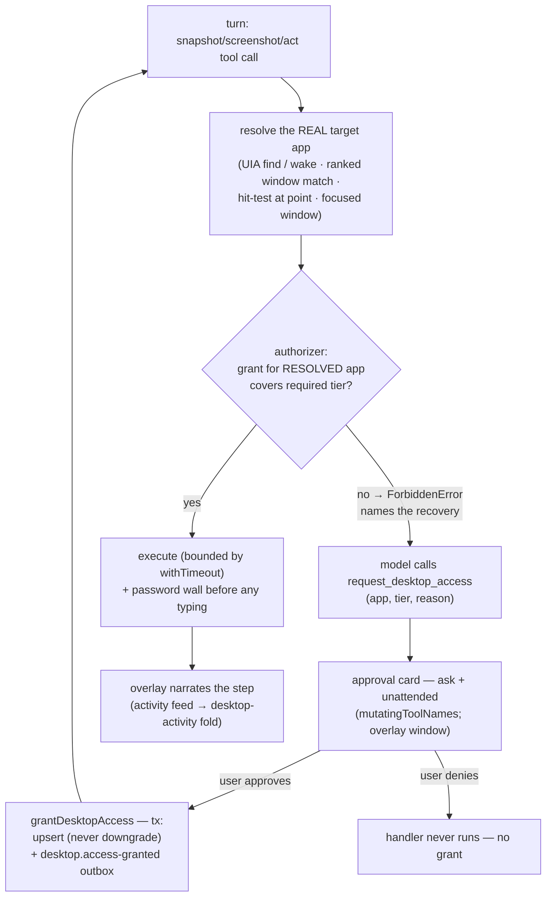
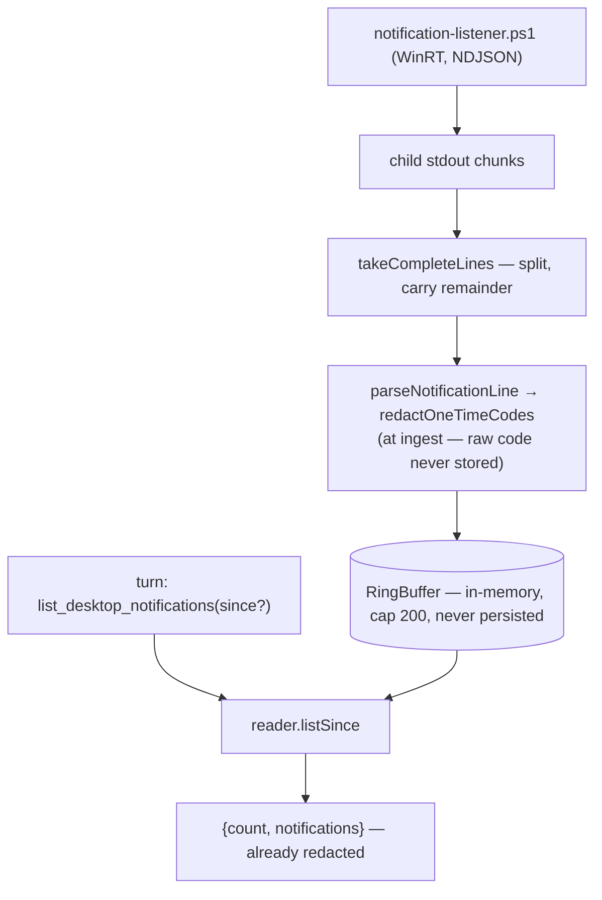
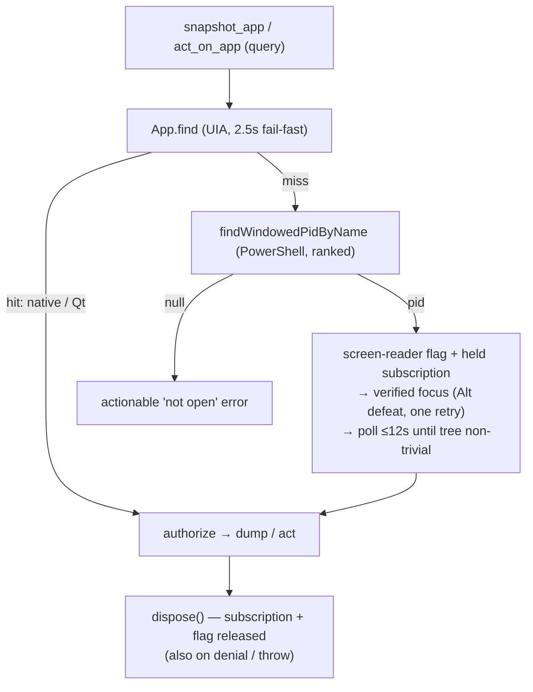
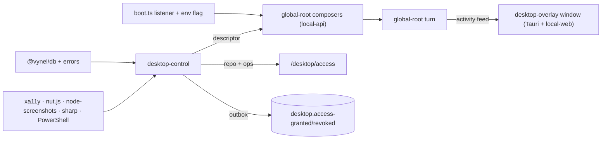

# Desktop-control — Structure

> The code map and connections for the desktop-control module. For the concepts behind it, see [overview.md](./overview.md).
>
> Folders touched: `packages/desktop-control/src/` (`notifications/` · `a11y/` · `input/` · `access/` · `schema/` · `repositories/` · `mcp/`) · `apps/local-api/src/routes/desktop-access/` · boot/composer wiring in `apps/local-api/src/boot.ts`, `app.ts`, `streams/global-root-turn.ts`, `sessions/run-global-root-turn.ts` · web UI in `apps/local-web/src/` · overlay window in `apps/desktop/src-tauri/src/windows.rs` · presenters in `packages/ui/src/tool-cards/`.

Desktop-control gives the global-root brain senses **and hands** on the local machine — desktop notifications, open apps, an app's accessibility tree or pixels, element actions, coordinate input — exposed as an **in-process MCP server** (`desktop`, tools `mcp__desktop__*`) the agent calls mid-turn, plus **one process-wide notification listener**. Everything app-directed is gated by the **per-app access-grant model** (`src/access/` + the `desktop_app_grants` table): the user consents per app, per tier (`read` < `click` < `full`) via the always-carded `request_desktop_access` tool, and enforcement fails closed against the *resolved* target app. It touches the OS directly (three lazily-loaded native engines + PowerShell/WinRT), which is why its tools can't be route-derived like `vynel`'s. Deps: `@anthropic-ai/claude-agent-sdk` (MCP *builder* only), `@crowecawcaw/xa11y`, `@nut-tree-fork/nut-js`, `node-screenshots`, `sharp`, `@vynel/db`, `@vynel/errors`, `@vynel/logger`, `@vynel/mcp-contract`, `drizzle-orm`, `zod` (`packages/desktop-control/package.json`). The old "core-free / no `@vynel/db`" claim no longer holds — the access grants made it a normal kernel-backed leaf (kernel + shared only; no sibling-leaf imports).

## File map

► = entry point (public export from the barrel).

| Path | Role |
|---|---|
| ► `packages/desktop-control/src/index.ts` | public barrel — listener factory, a11y ops, screenshot ops, `actOnDesktop`, `buildDesktopMcpServer`, `desktopFeatureDescriptor`, the access model (`tierAllows`/`normalizeDesktopAppKey`/`assertDesktopAccess`/`makeDesktopAccessAuthorizer`/`grantDesktopAccess`/`revokeDesktopAccess`), grant reads, the two event constants, `resolveDesktopOs` |
| `packages/desktop-control/src/platform.ts` | `resolveDesktopOs()` — `process.platform` → `'windows' \| 'macos' \| 'linux'`; a runtime fact, deliberately NOT in `env.ts` |
| `packages/desktop-control/src/desktop-control-events.ts` | outbox event constants + payloads: `desktop.access-granted` (create OR upgrade, carries `previousTier`) and `desktop.access-revoked` |
| **access/** | the per-app grant model |
| `packages/desktop-control/src/access/desktop-access-tiers.ts` | pure tier model: `DESKTOP_ACCESS_TIERS` (`read`<`click`<`full`), `tierAllows`, `maxTier` (upserts never downgrade), `normalizeDesktopAppKey` (trim + casefold + strip `.exe` — exact-match by design), the `DesktopAccessAuthorizer` callback type |
| `packages/desktop-control/src/access/assert-desktop-access.ts` | THE enforcement gate: `assertDesktopAccess` throws `ForbiddenError` naming the `request_desktop_access` recovery path; `makeDesktopAccessAuthorizer(db, userId)` binds it into the callback the adapters call |
| `packages/desktop-control/src/access/grant-desktop-access.ts` | the ONLY writers of `desktop_app_grants`: `grantDesktopAccess` (created/upgraded/unchanged; `maxTier` — never narrows) + `revokeDesktopAccess`; each co-commits its outbox event in one `withTransaction` |
| **schema/ · repositories/** | |
| `packages/desktop-control/src/schema/desktop-app-grants.ts` | the `desktop_app_grants` drizzle table (see Data & persistence) |
| `packages/desktop-control/src/schema/index.ts` | schema barrel (re-export only) |
| `packages/desktop-control/src/repositories/desktop-app-grants.ts` | functional repo, `db` first: `findDesktopAppGrant`, `listDesktopAppGrants`, `insertDesktopAppGrant`, `updateDesktopAppGrantTier`, `deleteDesktopAppGrant` (names arrive pre-normalized) |
| **notifications/** | |
| ► `packages/desktop-control/src/notifications/listener.ts` | `createDesktopNotificationListener` — process-wide engine: spawns the PowerShell helper, splits/parses/redacts each line into a ring buffer; `start`/`stop`/`listSince`; resilient (missing PowerShell / denied grant → idle, never crashes boot) |
| `packages/desktop-control/src/notifications/desktop-notification.ts` | the normalized `DesktopNotification` event + `DesktopNotificationReader` read interface — **not** a DB row |
| `packages/desktop-control/src/notifications/notification-listener.ps1` | vendored Windows WinRT `UserNotificationListener` poller, NDJSON on stdout, self-exits when `-ParentPid` is gone |
| `packages/desktop-control/src/notifications/ndjson-line-splitter.ts` | `takeCompleteLines` — complete lines + carried remainder, so a split notification is never half-parsed |
| `packages/desktop-control/src/notifications/parse-notification-line.ts` | NDJSON line → normalized + **redacted** event (redaction at ingest) |
| `packages/desktop-control/src/notifications/redact-one-time-codes.ts` | strips 2FA/OTP codes before buffering (best-effort, privacy-biased) |
| `packages/desktop-control/src/notifications/ring-buffer.ts` | bounded `RingBuffer<T>` (default 200) with time-based `listSince` |
| **a11y/** | the accessibility + screenshot boundary |
| `packages/desktop-control/src/a11y/xa11y-loader.ts` | the SINGLE xa11y `createRequire` point (lazy, native CJS); `dumpApp`, `withTimeout`, `closeSubscription`, the binding types |
| `packages/desktop-control/src/a11y/xa11y-adapter.ts` | composes the a11y ops the tools call: `listOpenApps`, `snapshotApp` (depth default 12 / 25 on the wake path / cap 40; 25 s timeout), `actOnApp` (`press`/`type_text`/`set_value`, 15 s; ambiguous ⇒ NO action + candidates; password wall before typing; `requiredTierForAction`: press=`click`, text=`full`), `DESKTOP_ACTIONS`, authorizer enforced against the RESOLVED app inside the `try` |
| `packages/desktop-control/src/a11y/electron-wake.ts` | app resolution + the Chromium tree wake: UIA `App.find` (2.5 s fail-fast) → pid fallback → screen-reader flag + held subscription + verified focus + poll loop (`runWakeLoop`, 12 s deadline, 750 ms interval, bounded probes); returns `wakeIncomplete`/`focusSucceeded` so tools give actionable guidance; injectable seams for binary-free tests |
| `packages/desktop-control/src/a11y/window-focus.ts` | observable focus for the wake (PowerShell): activate → verify against the real foreground pid; Alt-keypress defeat of focus-stealing prevention; best-effort throughout |
| `packages/desktop-control/src/a11y/screen-reader-flag.ts` | refcounted `SPI_SETSCREENREADER` system flag — the missing half of the wake (Chromium keys full-tree build off screen-reader detection); global OS setting, set-then-cleared per wake, self-healing after a crash |
| `packages/desktop-control/src/a11y/app-name-match.ts` | `isAppNameMatch` — the ONE case-insensitive-substring matching rule every resolution path shares |
| `packages/desktop-control/src/a11y/windowed-process.ts` | PowerShell `Get-Process` listing for the pid fallback; ranked pure `selectWindowedPid` (process-name match beats title-only) |
| `packages/desktop-control/src/a11y/screenshot-adapter.ts` | the SINGLE node-screenshots point (lazy): `screenshotApp` (BitBlt-class capture WITHOUT focusing; zoom via `cropSync` at full res; full window downscaled), `findAppWindowBounds` (the act coordinate frame, carries `appName` for enforcement), `findFocusedWindowAppName` (focus-directed enforcement target), `findWindowAppNameAtPoint` (topmost-window hit-test for absolute coords), pure `selectWindowId`/`clampZoomRegion` |
| `packages/desktop-control/src/a11y/screenshot-scale.ts` | capture fidelity: `computeCaptureScale`/`scaledCaptureSize` toward 1280×800 (WXGA), `downscalePngToFit` via lazily-loaded `sharp` — degrades to full resolution if sharp is absent |
| `packages/desktop-control/src/a11y/password-control-guard.ts` | the credentials HARD WALL: `isPasswordControl` (role + raw UIA `IsPassword`-style keys) → `passwordControlRefusal`; detection = refusal, no override |
| **input/** | coordinate input (the screenshot-paired hands) |
| `packages/desktop-control/src/input/nut-input-loader.ts` | the SINGLE nut.js `createRequire` point (lazy, native CJS) — mouse/keyboard/Point/Button/Key subset |
| `packages/desktop-control/src/input/desktop-input.ts` | `actOnDesktop` — click/type/press/scroll/drag at a pixel; `planDesktopAction` validates BEFORE any native load; window-relative coords translate via `findAppWindowBounds` + the SAME `computeCaptureScale` factor (`translatePoint` divides by it); enforcement: mouse actions → resolved frame app or `findWindowAppNameAtPoint` (`click` tier; a drag authorizes BOTH ends), type/press → `findFocusedWindowAppName` (`full` tier); every op `withTimeout` 15 s |
| `packages/desktop-control/src/input/key-combo.ts` | `parseKeyCombo` — "ctrl+c"/"alt+f4" → nut.js Key values; unknown tokens throw |
| **mcp/** | |
| ► `packages/desktop-control/src/mcp/build-desktop-mcp-server.ts` | `buildDesktopMcpServer({ reader, db, userId, enableActions })` → `createSdkMcpServer({ name: 'desktop' })`; builds the authorizer + tier reader; 5 tools always, +2 act tools when `enableActions`; `desktopToolFactories` exported for tests |
| ► `packages/desktop-control/src/mcp/desktop-mcp-feature-descriptor.ts` | `desktopFeatureDescriptor` — `build` returns `null` when `context.desktopReader === undefined`; `mutatingToolNames: ['mcp__desktop__request_desktop_access']` (cards in ask + unattended; uncarded in user auto/bypass); `askModeApprovalToolNames: ['mcp__desktop__act_on_app', 'mcp__desktop__act_on_desktop']`; `contributePrompt` |
| `packages/desktop-control/src/mcp/list-desktop-notifications-tool.ts` | read tool over the reader; optional ISO `since`; ungated (redacted at ingest) |
| `packages/desktop-control/src/mcp/list-open-apps-tool.ts` | read tool → `listOpenApps`, each app annotated `accessTier` (`read`/`click`/`full`/`none`) via the bound grant reader; ungated (names only) |
| `packages/desktop-control/src/mcp/snapshot-app-tool.ts` | grant-gated (`read`) tree read; `maxDepth`; turns `wakeIncomplete`/`focusSucceeded` into actionable guidance; `readOnlyHint` |
| `packages/desktop-control/src/mcp/screenshot-app-tool.ts` | grant-gated (`read`) PNG capture; optional `region` zoom (full-res, captioned read-only detail — act coords come from a FULL capture); returns an image content block; `readOnlyHint` |
| `packages/desktop-control/src/mcp/request-desktop-access-tool.ts` | the CONSENT tool — resolves the query against the LIVE open-app list (`resolveRequestedApp`: none/ambiguous ⇒ no grant), then `grantDesktopAccess`; `destructiveHint`; every-mode card via the descriptor |
| `packages/desktop-control/src/mcp/act-on-app-tool.ts` | **mutating** element action → `actOnApp`; ambiguous-match retry payload; `destructiveHint`; registered only when actions enabled |
| `packages/desktop-control/src/mcp/act-on-desktop-tool.ts` | **mutating** coordinate action → `actOnDesktop`; `destructiveHint`; registered only when actions enabled |
| `packages/desktop-control/src/mcp/desktop-tool-instructions.ts` | `DESKTOP_TOOL_INSTRUCTIONS` (observe + the per-app access model + the prompt-injection boundary) and `DESKTOP_ACT_INSTRUCTIONS` (both act paths + the prohibited-action canon: credentials/CAPTCHA/financial/agreements + ask-before-irreversible) |
| `packages/desktop-control/src/mcp/mcp-tool-fn.ts` | `McpToolFn` + `McpToolContent` (text \| image) — widened type over the SDK's overloaded `tool()` |
| **satellites** | |
| `apps/local-api/src/routes/desktop-access/index.ts` | `/desktop/access` routes (see HTTP surface) |
| `apps/local-api/src/routes/desktop-access/schemas.ts` | wire-shape Zod projection of the tier model |
| `packages/ui/src/tool-cards/desktop-step-presenter.ts` | two voices from one parse: `describeDesktopStep` (overlay, progressive) + `presentDesktopToolCall` (transcript card, past tense) + `tierDisplay` ("look only" / "look + click" / "look, click + type") |
| `apps/local-web/src/stores/desktop-activity-fold.ts` | pure fold: activity-feed events → overlay state; continuous visibility (up while running/approval pending, 20 s idle hide, `turn-ended` hides immediately); 50-step cap evicting settled first |
| `apps/local-web/src/stores/desktop-activity-store.ts` | Pinia wrapper holding the fold state; fed by the shared `/activity/stream` subscription |
| `apps/local-web/src/views/DesktopControlOverlayView.vue` | the overlay view (bare route `/desktop-control`): current step, settled log, pinned approval card, Stop lever; own feed subscription; never steals focus |
| `apps/local-web/src/components/sections/DesktopAccessSection.vue` | "Desktop access" settings section — list + hover-reveal two-step revoke; NO add button by design |
| `apps/local-web/src/composables/desktop-access/` | `use-desktop-access.ts` (list query) · `use-revoke-desktop-access.ts` (mutation) · `desktop-access-keys.ts` |
| `apps/desktop/src-tauri/src/windows.rs` | the `desktop-overlay` Tauri window: 380×360, transparent, always-on-top, skip-taskbar, no set-focus permission, created hidden in BOTH modes (a voice-driven desktop turn must surface it with the main window closed) |

## Data & persistence

One owned table — `desktop_app_grants` (`packages/desktop-control/src/schema/desktop-app-grants.ts`, migration `packages/db/src/migrations-sqlite/0031_loud_shiver_man.sql`, registered in `drizzle.sqlite.config.ts:65`):

| Column | Type | Notes |
|---|---|---|
| `id` | text PK | uuid |
| `user_id` | text FK → `users.id` | kernel FK (allowed — users is `@vynel/db`), `ON DELETE cascade` |
| `app_name` | text | the **normalized** grant key (`normalizeDesktopAppKey`), never the raw query |
| `tier` | text | `read` \| `click` \| `full` |
| `created_at` / `updated_at` | timestamp | |

Indexes: `idx_desktop_app_grants_user` (userId) · `uniq_desktop_app_grants_user_app` (userId, appName — one grant per app per user).

Notifications remain **ephemeral by design**: a bounded in-memory `RingBuffer` (default 200), never persisted — persisting a captured 2FA code would itself be the leak.

## Repositories

`packages/desktop-control/src/repositories/desktop-app-grants.ts` — functional, `db` first, Phase-1 sync:

| Function | Purpose |
|---|---|
| `findDesktopAppGrant(db, userId, appName)` | one grant by normalized key, or null |
| `listDesktopAppGrants(db, userId)` | all grants, appName-ascending (the settings list) |
| `insertDesktopAppGrant(db, {…})` | create (internal to the grant op) |
| `updateDesktopAppGrantTier(db, {…})` | tier upgrade (internal to the grant op) |
| `deleteDesktopAppGrant(db, userId, appName)` | delete, returning the deleted row or null |

## Core operations

| Operation | What it does | Key calls |
|---|---|---|
| `grantDesktopAccess` | upsert a grant that only moves UP (`maxTier`); outcomes `created`/`upgraded`/`unchanged`; publishes `desktop.access-granted` on create/upgrade, co-committed | `withTransaction`, repo writes, `insertOutboxEvent` |
| `revokeDesktopAccess` | delete the grant (normalized key); publishes `desktop.access-revoked` co-committed; null when none existed | `withTransaction`, `deleteDesktopAppGrant`, `insertOutboxEvent` |
| `assertDesktopAccess` / `makeDesktopAccessAuthorizer` | the enforcement gate: resolved app + required tier in, silence or `ForbiddenError` (naming the `request_desktop_access` recovery) out; empty resolved name also denies | `normalizeDesktopAppKey`, `findDesktopAppGrant`, `tierAllows` |
| `createDesktopNotificationListener` | process-wide engine; `start` spawns the ps1 helper with `-ParentPid`; stdout → split → parse+redact → buffer; `stop` kills the child | `spawn`, `takeCompleteLines`, `parseNotificationLine`, `RingBuffer` |
| `listOpenApps` | apps xa11y can enumerate (name + pid), blank names filtered | `App.list` (lazy) |
| `snapshotApp(query, opts, authorize?)` | resolve (UIA → Electron wake) → **authorize resolved name at `read`** (inside `try`, so a denial still disposes the wake) → bounded `dumpApp` | `resolveAppWithFallback`, `withTimeout` 25 s |
| `actOnApp(app, selector, action, value?, authorize?)` | fail closed on blank app/selector/value → resolve → **authorize at `requiredTierForAction`** (press=`click`, text=`full`) → ambiguous (>1) ⇒ NO action + candidates → **password wall** before any typing → act, 15 s bounds, `never` exhaustiveness guard | `resolveAppWithFallback`, locator ops, `isPasswordControl` |
| `screenshotApp(query, authorize?, {region?})` | ranked window match → **authorize resolved appName at `read` before any pixel** (even the minimized-hint leaks existence, so it authorizes first) → capture without focus → zoom crop full-res OR downscale toward WXGA | `selectWindowId`, `captureImageSync`, `cropSync`, `downscalePngToFit` |
| `actOnDesktop(params, authorize?)` | validate plan (native-free) → resolve coordinate frame (`findAppWindowBounds` + `computeCaptureScale`) → **authorize**: mouse → frame app or topmost-at-point (`click`; drags both ends), type/press → focused app (`full`); unidentifiable target ⇒ refuse | `translatePoint`, nut.js ops, `withTimeout` 15 s |
| `resolveAppWithFallback` *(internal)* | UIA `App.find` (2.5 s fail-fast) → pid fallback + wake: screen-reader flag → held subscription → verified focus (one halfway retry) → poll until the tree turns non-trivial or the 12 s deadline; deadline expiry returns the partial app with `wakeIncomplete` | `runWakeLoop`, `ensureForeground`, `screenReaderFlag` |

## HTTP surface

Mounted at `/desktop/access` (`apps/local-api/src/app.ts:314`), locked Hono chain, `userScoped` bundle:

| Method | Path | Purpose | SDK name |
|---|---|---|---|
| GET | `/desktop/access/` | list the user's grants (app + tier + timestamps) | `desktopAccess.list` |
| DELETE | `/desktop/access/:appName` | revoke a grant (404 when none) | `desktopAccess.revoke` |

**Grants are never created here** — the only creation door is the carded `request_desktop_access` tool. The routes are the see-and-revoke management surface.

## MCP surface

Server `desktop` → tools `mcp__desktop__*`, a separate in-process server from `vynel`, attached by both global-root composers via `desktopFeatureDescriptor`.

| Tool | Kind | Grant gate | Included when |
|---|---|---|---|
| `list_desktop_notifications` | read (`readOnlyHint`) | none (redacted at ingest) | always (reader present) |
| `list_open_apps` | read (`readOnlyHint`) | none (names only) — annotates each app's `accessTier` | always |
| `snapshot_app` | read (`readOnlyHint`) | `read` on the resolved app | always |
| `screenshot_app` | read (`readOnlyHint`) | `read` on the resolved window's app | always |
| `request_desktop_access` | **mutating** (`destructiveHint`) | — it CREATES grants; resolves against the live app list, ambiguity grants nothing | always — the consent path must always exist |
| `act_on_app` | **mutating** (`destructiveHint`) | `click` (press) / `full` (type/set) on the resolved app | only when `enableActions === true` |
| `act_on_desktop` | **mutating** (`destructiveHint`) | `click` (mouse) / `full` (type/press) on the resolved/hit-tested/focused app | only when `enableActions === true` |

- **Applicability gate.** `build(context)` returns `null` when `context.desktopReader === undefined` (tests / off-Windows / listener idle) — the composer skips the whole feature.
- **Two approval tiers, disjoint by design.** `mutatingToolNames: ['mcp__desktop__request_desktop_access']` — the consent tool cards in **every** permission mode (a grant born without a card would hollow out the model). `askModeApprovalToolNames: ['mcp__desktop__act_on_app', 'mcp__desktop__act_on_desktop']` — the act tools card in ask mode only (Chad 2026-07-26: "ask mode gates through approval; auto and bypass, no approval"). Both declared unconditionally; the tiers are additive so declaring an unregistered tool is harmless.
- **Prompt contribution.** `contributePrompt` returns `DESKTOP_TOOL_INSTRUCTIONS` always (the access model, the prompt-injection boundary, "observe directly, don't route"), appending `DESKTOP_ACT_INSTRUCTIONS` (both act paths + the prohibited-action canon) only when actions are enabled.

## Web surface

- **Attention overlay** — `DesktopControlOverlayView.vue` on the bare `/desktop-control` route inside the Tauri `desktop-overlay` window (`windows.rs`): mounts its own `/activity/stream` subscription; `desktop-activity-fold.ts` (pure) folds only `mcp__desktop__*` events into `desktop-activity-store.ts`; visible continuously while a desktop step runs or a desktop approval waits, hiding 20 s after the last activity or immediately on `turn-ended`. Step labels come from `describeDesktopStep` (`packages/ui/src/tool-cards/desktop-step-presenter.ts`); the same parse renders the transcript card via `presentDesktopToolCall`.
- **Desktop access settings** — `DesktopAccessSection.vue` + the `desktop-access` composables over the two routes: list with human tier chips (`tierDisplay` words), hover-reveal two-step revoke, deliberately no add button.

## Native / OS integration

Four independent OS integrations, all Windows-only today, all degrading gracefully, all natives loaded **lazily** via `createRequire` (importing any adapter in tests or off-Windows never pulls a binary):

1. **Notifications (PowerShell + WinRT)** — `notification-listener.ps1` under Windows PowerShell 5.1 polls `UserNotificationListener`, dedups, streams NDJSON; spawned as a direct child with `-ParentPid` so an abrupt api crash can't orphan it; macOS/Linux short-circuit to idle.
2. **Accessibility (`xa11y`)** — `xa11y-loader.ts` is the single touchpoint. Electron/Chromium apps need the wake: pid resolution (`windowed-process.ts`), refcounted screen-reader flag (`screen-reader-flag.ts`), held UIA subscription, *verified* focus with the Alt-keypress defeat of focus-stealing prevention (`window-focus.ts`), then a bounded poll loop instead of a fixed sleep.
3. **Screenshots (`node-screenshots` + `sharp`)** — BitBlt/PrintWindow capture **without focusing**; every binding field is a *method*, so windows are read into plain `WindowInfo` at the boundary; `sharp` downscales toward 1280×800 and its absence degrades to full resolution, never a failure.
4. **Input (`@nut-tree-fork/nut-js`)** — synthetic mouse/keyboard for the coordinate path; `nut-input-loader.ts` is the single touchpoint.

`withTimeout` (25 s snapshot / 15 s act & input / 4 s wake probes) is the hard "never hang the brain" backstop throughout.

## Pipeline — a grant-gated desktop action

The module's central flow now: how consent, resolution, and enforcement compose on every app-directed call.

1. Both global-root composers list the descriptor (`apps/local-api/src/streams/global-root-turn.ts:163-195` for the web stream, `apps/local-api/src/sessions/run-global-root-turn.ts:203-211` for the channel root), passing `desktopReader` + `enableDesktopActions` from context wired at boot (`apps/local-api/src/boot.ts:143-149` creates the listener on Windows; `boot.ts:226-227` threads reader + env flag).
2. A tool call resolves its target: `resolveAppWithFallback` (`a11y/electron-wake.ts`) for tree ops, `selectWindowId` (`a11y/screenshot-adapter.ts`) for capture, `findWindowAppNameAtPoint` / `findFocusedWindowAppName` for coordinate input.
3. The adapter calls the injected authorizer (`access/assert-desktop-access.ts`) with the **resolved** name + required tier — inside the `try`, so a denial still releases any held wake subscription.
4. Denial throws `ForbiddenError` whose message names `request_desktop_access({app, tier, reason})`; the model's retry raises the every-mode card (`mcp/request-desktop-access-tool.ts`), and only an approved card reaches `grantDesktopAccess` (`access/grant-desktop-access.ts`) — one transaction, outbox event co-committed.
5. Meanwhile every `mcp__desktop__*` step rides the activity feed into the overlay (`apps/local-web/src/stores/desktop-activity-fold.ts` → `DesktopControlOverlayView.vue`), narrated by `packages/ui/src/tool-cards/desktop-step-presenter.ts`.

## Pipeline — notification ingest ("what did I miss?")

## Pipeline — a11y resolution with Electron wake

## Connections

**Summary:** a kernel-backed OS-facing leaf — one table, two published outbox events, no consumed events; consumed by `apps/local-api` (boot + both root composers + routes), `apps/local-web`, `packages/ui`, and the Tauri shell.

| Unit | Direction | Mechanism | What crosses |
|---|---|---|---|
| `@vynel/db` | out | import (kernel) | `Database`, `withTransaction`, `insertOutboxEvent`, dialect builders, `users` FK |
| `@vynel/errors` | out | import | `ForbiddenError` (the deny), `NotFoundError` (routes) |
| `@vynel/mcp-contract` | out | import (type) | `McpFeatureDescriptor`, `SessionToolContext` (`db`/`desktopReader` as `unknown` — producer-boundary casts here), `askModeApprovalToolNames` |
| `@vynel/logger` | out | import (type) | `StructuralLogger` |
| `@anthropic-ai/claude-agent-sdk` | out | import (MCP **builder** only) | `tool`, `createSdkMcpServer`, `SdkMcpToolDefinition` |
| `xa11y` / `nut-js` / `node-screenshots` / `sharp` | out | lazy native `require` | trees + locators / synthetic input / window capture + geometry / PNG resampling |
| Windows PowerShell 5.1 / WinRT | out | `spawn` / `execFile` | notification NDJSON; `Get-Process`; focus + screen-reader flag |
| local-api boot | in | app wiring | `createDesktopNotificationListener` at boot (`boot.ts:143-149`), stopped at shutdown (`boot.ts:343`); reader + `VYNEL_DESKTOP_ACT_ENABLED` (`env.ts:56`) into the factory context (`app.ts:212-217`) |
| local-api composers | in | descriptor in the list | `desktopFeatureDescriptor` in BOTH global-root compositions (`streams/global-root-turn.ts:186`, `sessions/run-global-root-turn.ts:205`) |
| local-api routes | in | import | `/desktop/access` list + revoke over the repo + revoke op |
| [approvals](../approvals/overview.md) | both (indirect) | descriptor declarations → composer → approval backstop | every-mode card for `request_desktop_access`; ask-mode cards for the act tools |
| local-web + `@vynel/ui` + Tauri shell | in | import / feed events / window | overlay fold + view, settings section, step presenters, the `desktop-overlay` window |

**Events published** (both co-committed with the grant change in one `withTransaction`):
- `desktop.access-granted` — create or tier upgrade; payload carries `previousTier` (null on first grant).
- `desktop.access-revoked` — payload carries the tier held at revocation.

**Events consumed:** none (Phase 1 has no consumer; future: channel notifications / audit surfaces).

## Config & gotchas

- **`VYNEL_DESKTOP_ACT_ENABLED`** (`apps/local-api/src/env.ts:56`, default `'0'`) is the ONLY env switch: it registers the two act tools + appends the act instructions. It is a real off-switch on top of — not instead of — the per-app grants and the ask-mode approval cards.
- **The feature is fully wired** — the old docs' "NOT YET WIRED" state is history: boot creates the listener (Windows guard at boot, so off-Windows the whole feature excludes itself via the descriptor's `null`), both composers list the descriptor, the env flag is consumed. What remains open is Chad's smoke test + the commit of this worktree branch.
- **Enforcement is at execution time, against the resolved app.** Never assume the query string is the authorized thing — `snapshotApp`/`actOnApp` authorize `resolved.app.name`, screenshots authorize the winning window's `appName` (before even the "it's minimized" hint — existence is information), absolute-coordinate actions hit-test the topmost window at the point, and type/press authorize the *focused* window. Unidentifiable target = refusal.
- **Grant keys are exact-match by design.** `normalizeDesktopAppKey` (trim/casefold/strip `.exe`) unifies xa11y vs node-screenshots naming, but matching stays exact — fuzzy grant matching would be a security hole ("Word" must never cover "PasswordSafe").
- **Grants never silently downgrade.** `grantDesktopAccess` keeps the higher of existing vs requested tier; narrowing is only the explicit DELETE route. `unchanged` publishes no event.
- **The password wall has no override.** `isPasswordControl` detection ⇒ refusal on `type_text`/`set_value`; pressing (focusing) a password field is deliberately allowed so the user can type it themselves. Detection is best-effort — instructions + cards remain the outer layers.
- **Coordinate fidelity is a contract between two files.** `screenshot_app` downscales full-window captures toward 1280×800 (`screenshot-scale.ts`), and `actOnDesktop` divides incoming window-relative coords by the SAME `computeCaptureScale` recomputed from the live window bounds — coherent unless the window was resized between capture and click. Zoom regions are full-resolution *reading* detail; act coordinates must come from a full capture (the tool caption says so).
- **DPI precondition:** window-relative clicks are verified coherent at 100% display scaling; on 125%/150% displays physical pixels and nut.js's coordinate space can diverge (`desktop-input.ts` `resolveFrame` comment) — a scale factor in `translatePoint` is the planned fix if drift shows.
- **Reading an Electron app steals focus; the wake mutates a global OS flag.** `snapshot_app` on Discord/Slack foregrounds the window (required) and sets the refcounted `SPI_SETSCREENREADER` flag for the wake window — reversible, self-healing after a crash, disclosed in the tool description. Screenshots capture *without* focusing — that's their point.
- **Timeouts bound, they don't cancel** — a hung native op may keep running after the tool returns its actionable error.
- **Redaction is best-effort** and remains the whole notification privacy story together with never persisting the buffer.
- **Overlay linger drift:** `DesktopControlOverlayView.vue`'s header comment still says "lingers ~8s"; the shipped rule is `IDLE_HIDE_MS = 20_000` with continuous visibility (`desktop-activity-fold.ts`) — trust the fold.
- **Migrations:** never hand-write — the table landed via drizzle generate (`0031_loud_shiver_man.sql`); the schema file is registered in `drizzle.sqlite.config.ts:65`. A running dev DB predating 0031 needs the stale-DB reset recipe.
- **Module notes:** the security-model design intent lives in `docs/module-notes/desktop-control-security.md` (untracked on this branch alongside the code).

---
*Mapped from the code on disk, 2026-08-04. If you change this module, update this file and [overview.md](./overview.md).*
