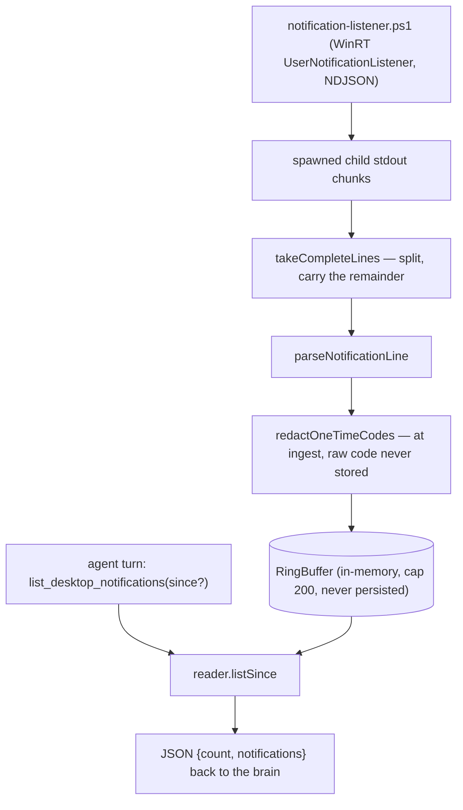
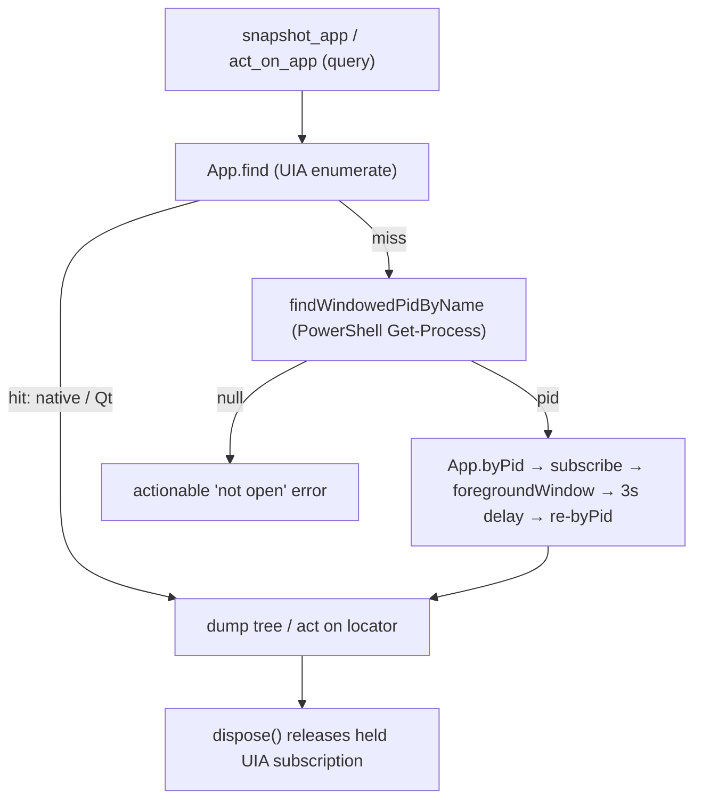
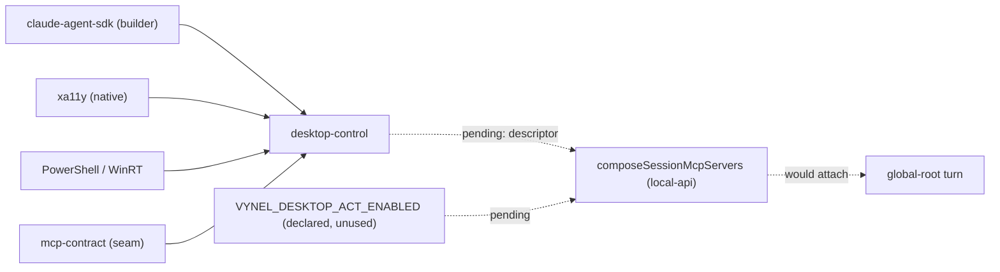

# Desktop-control — Structure

> The code map and connections for the desktop-control module. For the concepts behind it, see [overview.md](./overview.md).
>
> Folders touched: `packages/desktop-control/src/` (`notifications/` · `a11y/` · `mcp/`) · seams pre-cut in `apps/local-api/src/env.ts` and `packages/mcp-contract/src/` — **not yet wired into any turn** (see Connections).

Desktop-control is an unusual vertical-slice leaf: it owns **no database table, no HTTP route, and no web surface**. It gives Vynel's global-root ("hey jarvis") brain senses and hands on the *local machine* — desktop notifications, the list of open apps, an app's accessibility tree, and (default-off) element actions — exposed as an **in-process MCP server** the agent calls mid-turn, plus **one process-wide notification listener**. It touches the OS directly (Windows PowerShell + WinRT; the `xa11y` native accessibility engine) rather than a Vynel route, which is why it can't be generated from an `x-mcp` route annotation like the `vynel` server. Deps: `@anthropic-ai/claude-agent-sdk` (MCP *builder* primitives only — `tool`, `createSdkMcpServer`, permitted in the MCP layer), `@crowecawcaw/xa11y`, `@vynel/mcp-contract`, `@vynel/logger`, `zod` (`packages/desktop-control/package.json`). Notably **core-free** — no `@vynel/db`.

## File map

► = entry point (public export from the barrel).

| Path | Role |
|---|---|
| ► `packages/desktop-control/src/index.ts` | public barrel — the only subpath export (`.`); re-exports the listener factory, the four a11y functions (`listOpenApps`/`snapshotApp`/`actOnApp` + helpers + `DESKTOP_ACTIONS`), `buildDesktopMcpServer`, `desktopFeatureDescriptor`, `resolveDesktopOs` |
| `packages/desktop-control/src/platform.ts` | `resolveDesktopOs()` — `process.platform` → `'windows' \| 'macos' \| 'linux'`; picks the notification backend (a runtime fact, deliberately NOT in `env.ts`) |
| **notifications/** | |
| ► `packages/desktop-control/src/notifications/listener.ts` | `createDesktopNotificationListener` — the process-wide engine: spawns the PowerShell helper, splits/parses/redacts each line, holds results in a ring buffer; `start`/`stop`/`listSince`. Resilient: missing PowerShell or a denied grant logs and leaves it idle |
| `packages/desktop-control/src/notifications/desktop-notification.ts` | the normalized `DesktopNotification` event (`id`/`app`/`title`/`body`/`timestamp`) + the `DesktopNotificationReader` read interface (`listSince`) — **not** a DB row |
| `packages/desktop-control/src/notifications/notification-listener.ps1` | vendored asset — Windows WinRT `UserNotificationListener`, polls `GetNotificationsAsync` + dedups by id, emits one JSON object per line (NDJSON); self-exits when `-ParentPid` is gone |
| `packages/desktop-control/src/notifications/ndjson-line-splitter.ts` | `takeCompleteLines` — split accumulating stdout into complete lines + a carried remainder so a notification split across two reads is never half-parsed |
| `packages/desktop-control/src/notifications/parse-notification-line.ts` | `parseNotificationLine` — one NDJSON line → normalized + **redacted** `DesktopNotification` (or `null` for blank/malformed); redaction applied HERE, at ingest |
| `packages/desktop-control/src/notifications/redact-one-time-codes.ts` | `redactOneTimeCodes` — strips 2FA/OTP codes before they enter the buffer (best-effort; privacy-biased) |
| `packages/desktop-control/src/notifications/ring-buffer.ts` | generic bounded `RingBuffer<T>` (default capacity 200) with time-based `listSince` |
| **a11y/** | |
| `packages/desktop-control/src/a11y/xa11y-adapter.ts` | **the ONLY file that touches `xa11y`** — lazy `createRequire` load; `listOpenApps` / `snapshotApp` / `actOnApp`; the Electron-wake fallback; `withTimeout` backstop; `DESKTOP_ACTIONS` |
| `packages/desktop-control/src/a11y/windowed-process.ts` | OS window helpers for the Electron fallback (PowerShell, NOT xa11y): `findWindowedPidByName`, `foregroundWindow`, pure `selectWindowedPid` |
| **mcp/** | |
| ► `packages/desktop-control/src/mcp/build-desktop-mcp-server.ts` | `buildDesktopMcpServer({ reader, enableActions })` → `createSdkMcpServer({ name: 'desktop' })`; tools become `mcp__desktop__*`. 3 read tools always; `act_on_app` only when `enableActions` |
| ► `packages/desktop-control/src/mcp/desktop-mcp-feature-descriptor.ts` | `desktopFeatureDescriptor` — the shared `McpFeatureDescriptor` the composer attaches to a turn; `build` returns `null` when no reader is present; `mutatingToolNames: ['mcp__desktop__act_on_app']`; `contributePrompt` |
| `packages/desktop-control/src/mcp/list-desktop-notifications-tool.ts` | read tool over a `DesktopNotificationReader`; optional ISO `since` |
| `packages/desktop-control/src/mcp/list-open-apps-tool.ts` | read tool → `listOpenApps` (name + pid) |
| `packages/desktop-control/src/mcp/snapshot-app-tool.ts` | read tool → `snapshotApp`; `maxDepth` (default 12 / 20 Electron, cap 40); `readOnlyHint` |
| `packages/desktop-control/src/mcp/act-on-app-tool.ts` | **mutating** tool → `actOnApp`; `destructiveHint`; renders the ambiguous-match retry payload |
| `packages/desktop-control/src/mcp/mcp-tool-fn.ts` | `McpToolFn` — widened type over the SDK's overloaded `tool()`, shared by every factory |
| `packages/desktop-control/src/mcp/desktop-tool-instructions.ts` | `DESKTOP_TOOL_INSTRUCTIONS` (observe) + `DESKTOP_ACT_INSTRUCTIONS` (act) — the feature's own system-prompt contribution, moved here byte-for-byte from local-api in the C4 build |

## Data & persistence

**None — by design.** Desktop-control owns no table, no migration, no `@vynel/db` dependency. Notifications are **ephemeral**: held in a bounded in-memory `RingBuffer` (`ring-buffer.ts`, default 200) and **never persisted** — persisting a captured 2FA code would itself be the leak (the locked "visible + redact codes" privacy posture). The accessibility tree and open-app list are read live from the OS on each tool call; nothing is stored.

## Core operations

The unit's "operations" are OS reads/actions, not DB transactions. No outbox, no tx boundaries.

| Operation | What it does | Key calls |
|---|---|---|
| `createDesktopNotificationListener(...)` | build the process-wide engine; `start` spawns the PowerShell helper (Windows only; no-op logged elsewhere) with `-ParentPid`; stdout → `takeCompleteLines` → `parseNotificationLine` → `buffer.push`; `stop` kills the child; `listSince` reads the buffer | `spawn`, `takeCompleteLines`, `parseNotificationLine`, `RingBuffer` |
| `parseNotificationLine` | one NDJSON line → normalized event, **redacting at ingest**; `null` for blank/malformed | `redactOneTimeCodes` |
| `listOpenApps()` | apps xa11y can enumerate (name + pid), blank names filtered | `App.list` (lazy xa11y load) |
| `snapshotApp(query, opts)` | resolve the named app (UIA enumerate → Electron-wake fallback), dump its a11y tree; depth default 12 (20 on the wake path), cap 40; `withTimeout` 25 s backstop; always `dispose()` | `resolveAppWithFallback`, `dumpApp`, `withTimeout` |
| `actOnApp(app, selector, action, value?)` | **mutating** — fails closed on blank app/selector; locate by `role[name="…"]`/`[stable_id="…"]`; **ambiguous (>1) ⇒ NO action**, return candidates + stable_ids; else `press`/`typeText`/`setValue` (15 s timeout); exhaustiveness `never` guard | `resolveAppWithFallback`, `locator.count/elements/press/typeText/setValue` |
| `resolveAppWithFallback` *(internal)* | UIA `App.find` first (native + Qt, e.g. Telegram); on miss reach by pid (`findWindowedPidByName`) and **wake** an Electron renderer tree: `subscribe` → `foregroundWindow` → 3 s delay → re-`byPid`; subscription HELD in `dispose` until the caller finishes | `App.find`, `App.byPid`, `findWindowedPidByName`, `foregroundWindow` |

## MCP surface

Desktop-control ships its **own** `McpFeatureDescriptor` (`desktopFeatureDescriptor`) — unlike memory/knowledge whose tools are route-derived, desktop tools touch the OS so they can't come from an `x-mcp` annotation. Server name `desktop` → tools are `mcp__desktop__*`. A separate server from `vynel`, forwarded into the SDK session's `options.mcpServers` alongside the others.

| Tool | Kind | Annotation | Included when |
|---|---|---|---|
| `list_desktop_notifications` | read | `readOnlyHint` | always (reader present) |
| `list_open_apps` | read | `readOnlyHint` | always |
| `snapshot_app` | read | `readOnlyHint` | always (foregrounds an Electron window to wake its tree — a visible side effect, disclosed, not a data mutation) |
| `act_on_app` | **mutating** | `destructiveHint` | **only when `enableActions === true`** (default off) |

- **Applicability gate.** `desktopFeatureDescriptor.build(context)` returns `null` when `context.desktopReader === undefined` (tests / off-Windows / idle) — the composer then skips the feature entirely (no server, no allow pattern, no prompt).
- **Mutating gate.** `mutatingToolNames: ['mcp__desktop__act_on_app']` is declared **unconditionally** on the descriptor so that, once the composer feeds it into the approval backstop, `act_on_app` cards automatically *whenever it is present* — closing the spec'd act-approval gap by the same general mechanism as every other mutating tool. Today the tool's presence is itself gated by the default-off `enableActions` flag.
- **Prompt contribution.** `contributePrompt` returns `DESKTOP_TOOL_INSTRUCTIONS` always, plus `DESKTOP_ACT_INSTRUCTIONS` appended only when actions are enabled — mirroring the registered toolset.

## HTTP surface

**None.** Desktop-control exposes no routes in `apps/local-api` (or any app). It reaches the agent purely through the in-process MCP server; tool calls execute in-process against the OS, not over HTTP. (Contrast memory/knowledge, whose MCP tools re-enter through their own HTTP routes.)

## Web surface

**None yet.** No store, composable, or component imports `@vynel/desktop-control`. The README's user-facing on/off control + "listening" affordance (mirroring the voice-mic precedent) are described as intended but are not built in this package.

## Native / OS integration

This is the module's substance — two independent OS integrations, both Windows-only today, both degrading gracefully elsewhere.

**1. Notification pipeline (PowerShell + WinRT).**
- `notification-listener.ps1` runs under built-in Windows PowerShell 5.1, drives the WinRT `UserNotificationListener` (polls `GetNotificationsAsync`, dedups by id), and streams NDJSON on stdout. Needs the OS notification-access grant (Settings → Privacy & security → Notifications); exits non-zero to stderr if denied.
- Spawned as a **direct child** with args (not a shell string) so `stop()`'s `child.kill()` terminates it. `-ParentPid` is this process's pid — the helper self-exits when the parent is gone, so an abrupt api crash (where graceful `stop()` never runs) can't orphan the poller.
- macOS / Linux: **no backend** — `resolveDesktopOs()` short-circuits `start()`, `listSince` returns `[]`.

**2. Accessibility engine (`xa11y`, native CJS).**
- `xa11y-adapter.ts` is the single touchpoint; the native module is loaded **lazily** via `createRequire` on the first desktop op, so merely importing the adapter (tests, or a platform with no prebuilt binary) never pulls the binary. Load failure throws an actionable "needs the prebuilt native binary" error.
- Electron/Chromium apps don't appear in `App.list()` / `App.find` (their renderer tree is off until a UIA client listens). The fallback resolves them by pid via `windowed-process.ts` (PowerShell `Get-Process` filtered to windowed processes; `AppActivate` to foreground) and runs the **wake recipe** — see the second pipeline diagram.
- `withTimeout` (25 s snapshot / 15 s act) is a hard backstop: a custom-drawn control (Telegram/Qt, some Electron) can make xa11y's `press`/`dump` block indefinitely; the tool returns an actionable error instead of leaving the turn pending forever.

## Pipeline — notification ingest ("what did I miss?")

The central end-to-end flow: OS toast → redacted, buffered, agent-readable.

1. `notification-listener.ps1` streams one JSON object per toast on stdout (`listener.ts:79` spawns it once at start).
2. `listener.ts:96` accumulates chunks → `takeCompleteLines` (`ndjson-line-splitter.ts`) yields complete lines + a carried remainder.
3. Each line → `parseNotificationLine` (`parse-notification-line.ts`), which calls `redactOneTimeCodes` (`redact-one-time-codes.ts`) **before** the event is built — the raw code is never stored and never reaches the agent.
4. Valid events `push` into the `RingBuffer` (`ring-buffer.ts`); the oldest drops past capacity. Never written to a DB.
5. On a turn, `list_desktop_notifications` (`list-desktop-notifications-tool.ts`) calls `reader.listSince(since?)` and returns `{ count, notifications }` as text — already redacted.

## Second path — a11y read/act with Electron wake

The wake subscription is **held** (Chromium drops the woken tree once no UIA client listens) until the caller reads/acts and calls `dispose()` in a `finally` — `snapshotApp`/`actOnApp` both do. A throw between `subscribe()` and handing back `dispose` releases it in place so the listener can't leak.

## Connections

**Summary:** desktop-control is a **pure OS-facing leaf** — no DB, no outbox, no events published or consumed. Its intended consumer is the global-root turn in `apps/local-api` (via the shared `McpFeatureDescriptor` composed by `composeSessionMcpServers`). **The package is code-complete and tested but NOT YET WIRED into any running turn** — the seams are cut, the part isn't plugged in.

| Unit | Direction | Mechanism | What crosses |
|---|---|---|---|
| `@anthropic-ai/claude-agent-sdk` | out | import (MCP **builder** only) | `tool`, `createSdkMcpServer`, `SdkMcpToolDefinition` — no SDK runtime |
| `@crowecawcaw/xa11y` | out | lazy native `require` | `App.list/find/byPid`, locators, subscriptions |
| `@vynel/mcp-contract` | out | import (type) | `McpFeatureDescriptor`, `SessionToolContext`, `SessionMcpServer` |
| `@vynel/logger` | out | import (type) | `StructuralLogger` |
| Windows PowerShell 5.1 / WinRT | out | `spawn` / `execFile` | notification NDJSON; `Get-Process`; `AppActivate` |
| [mcp-contract](../_platform/contracts-and-sdk/overview.md) | in (pre-cut seam) | contract fields | `SessionToolContext.desktopReader?: unknown` + `enableDesktopActions?` already declared ahead of the wiring |
| local-api env | in (pre-cut seam) | env var | `VYNEL_DESKTOP_ACT_ENABLED` declared + Zod-validated in `apps/local-api/src/env.ts:55` — **consumed nowhere yet** |
| [session](../session/overview.md) global-root | in (**pending**) | descriptor in a composer list | the desktop prompt guide *moved out of* `packages/session/src/runtime/global-root-instructions.ts` into this package (C4); the descriptor is not yet added to any `composeSessionMcpServers([...])` call |
| local-api global-root turn | in (**pending**) | boot wiring | `global-root-turn.ts:15-18` documents the wait: the reader must return to `AppEnv` + the dependency land in local-api, "it joins the descriptor list then" |

**Events published:** none — the package has no `@vynel/db` and no outbox.
**Events consumed:** none.

The four wiring legs, all currently **absent** from `apps/local-api`:
1. No `createDesktopNotificationListener(...)` created at boot (nothing spawns the listener).
2. No `desktopNotifications`/`desktopReader` on `AppEnv` (only a comment references it, `factory.ts:12`).
3. `desktopFeatureDescriptor` in no descriptor list — the composers pass `[vynelRoutingDescriptor, notebookFeatureDescriptor]` (global root) / `[vynelWorkspaceDescriptor, notebookFeatureDescriptor]` (workspace).
4. `VYNEL_DESKTOP_ACT_ENABLED` declared but consumed nowhere (never mapped to `enableDesktopActions`).

## Config & gotchas

- **The whole package is unwired.** Everything here is code-complete and unit-tested, but no `apps/local-api` file imports `@vynel/desktop-control`, creates the listener, or lists the descriptor. Read the Connections wiring checklist before assuming any of it runs in the app today.
- **"Shipped" vs "later increment" — reconcile, don't pick.** The README marks `act_on_app` **shipped** while `index.ts`'s header says desktop *actions* "arrive in a later increment." Both are true at different layers: the **code** (`actOnApp` + `makeActOnAppTool`, wired into `buildDesktopMcpServer` when `enableActions`) is complete and tested; but it's (1) default-OFF behind `VYNEL_DESKTOP_ACT_ENABLED`, (2) the hard approval card is spec-only (`.claude/ceo/desktop-control/act-approval-hook-spec.md`), and (3) the package is unwired. "Shipped" = code-complete; the header = not in the default runtime.
- **Redaction is best-effort, not a guarantee** (`redact-one-time-codes.ts`) — biased toward privacy (a 6-digit order number may occasionally be redacted); single/short digit runs ("3 new messages", years) are deliberately preserved. It is the *only* code-defense: notifications are never persisted, so the buffer plus this filter are the whole privacy story.
- **`enableActions` is a real off-switch, not the safety gate.** Until the approval card lands, the interim safety for `act_on_app` is an isolated environment + the default-off flag, NOT the "ask before irreversible" prompt instruction. Don't treat the prompt text as the guardrail.
- **Ambiguous selectors do nothing.** `actOnApp` with a selector matching >1 element runs NO action and returns the candidates with `stable_id`s to re-target — a deliberate fail-safe on the mutating path. Both mutating and read paths also fail **closed** on a blank app name (`isAppNameMatch(name, '')` would otherwise match every window).
- **Reading an Electron app steals focus.** `snapshot_app` on Discord/Slack briefly foregrounds the window (required to wake the Chromium a11y tree). Disclosed in the tool description; acceptable for a user-asked "look at Discord," but it is a visible side effect on an otherwise read-only tool.
- **xa11y loads lazily and can be absent.** The native binary loads on the first desktop op, not at import — so tests and non-Windows platforms import the adapter freely. A missing prebuilt binary throws an actionable error only when a tool is actually called.
- **Timeouts bound, they don't cancel.** `withTimeout` makes the tool *return* on a hung xa11y call; the underlying native op may keep running in the background. Custom-drawn controls (Telegram/Qt) can hit this.
- **PowerShell is best-effort throughout.** A missing/failing `powershell.exe` degrades to "not found"/idle (both `windowed-process.ts` and `listener.ts` swallow-and-log by design) — desktop control never crashes boot or a turn.

---
*Mapped from the code on disk, 2026-07-14. If you change this module, update this file and [overview.md](./overview.md).*
