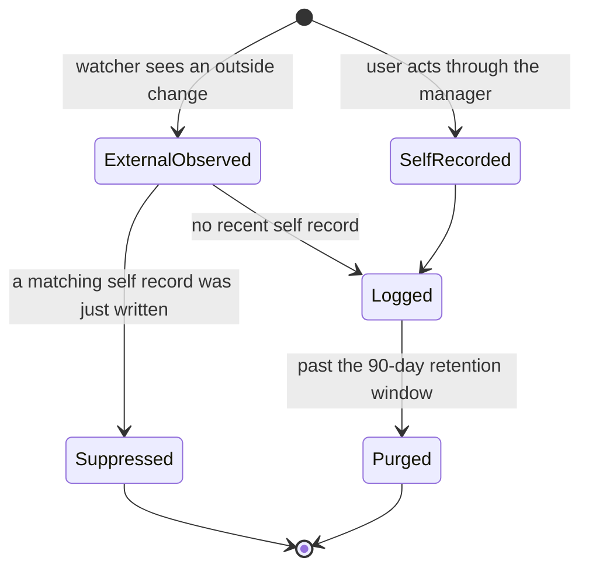

# Files — Overview

> The workspace file manager: browse, preview, edit, and reorganize the files inside a workspace's folder — and a running audit log of every change, whoever made it — all fenced strictly inside that one directory.
>
> **Status:** shipped · **Depends on:** [db](../_platform/database/overview.md) (kernel), errors · **Code map:** [structure.md](./structure.md)

## Purpose

Every Vynel workspace is backed by a real folder on the user's disk. Files is the module that lets a person *see and touch* that folder from inside the app — open the tree, drill into subfolders, preview a document, edit a text file, create / rename / move / delete things — without leaving Vynel for their operating system's file explorer.

What makes it a product surface rather than plumbing is **trust through visibility**. The workspace folder is not Vynel's private scratch space: the user's own files live there, and Vynel's AI agent writes into it too. So the module does two things at once — it gives the user a familiar manager over that folder, and it keeps an honest, append-only **activity log** of every change, tagged by who caused it (the user clicking a button, versus anything external — the agent, an outside editor, a script). The user can always answer "what happened to my files, and who did it."

The other half of the module's identity is its **containment posture**. Because an AI agent and outside tools operate on the same folder, the module treats every path as hostile until proven contained: nothing it does can ever read or write a byte outside the workspace directory, and it refuses to touch Vynel's own managed state even from within.

## What it can do

- **Browse one folder level** — list the immediate children of any directory, folders first then alphabetical, each row carrying size, modified time, and a visible-child count for folders. The tree expands lazily, one level per request.
- **Preview a file** — text files (markdown, plain text) come back as in-app content; images and PDFs come back as metadata so the surface can render or embed them; anything else is offered as a download.
- **Edit and save a text file** — open it, change it, write it back as UTF-8, capped at a 1 MB editable size.
- **Create a file or a folder** — a new (optionally seeded) file, or a directory.
- **Move or rename** a file or folder in one operation.
- **Delete** a file or folder (folders require an explicit recursive intent).
- **Stream raw bytes** of any file — the path behind image previews, PDF embeds, and downloads.
- **Read the activity log** two ways: a recent-activity feed for the whole workspace, and the full history of one specific file, both newest-first and cursor-paginated.
- *(background)* **Watch the folder** — a per-workspace file watcher notices changes made outside the manager (by the agent or any other tool) and records them as external activity, de-duplicating against the app's own just-made changes.
- *(background)* **Purge old activity** — a maintenance job hard-deletes activity records past a 90-day retention window.

## Responsibilities

**Owns** — the whole read/write surface over a workspace's on-disk folder (listing, preview, raw streaming, create, edit, move, delete), the path-containment guarantee that fences every one of those operations inside the workspace directory, the file-content classification and editable-size rules, the append-only activity log and its two-origin (self / external) bookkeeping, the folder watcher that captures external changes, and the retention purge. The disk is the single source of truth for the tree — the module keeps **no mirror** of the folder structure in the database; only the activity log is persisted.

**Does not own** —
- the workspace itself — its identity, and the on-disk location the module operates on, belong to [workspaces](../workspaces/overview.md); this module is handed a workspace's path and works within it;
- indexing file *content* for search — that is [knowledge](../knowledge/overview.md), which runs its own separate watcher over the same folder for a different purpose (searchable content, not an activity audit);
- the AI agent that writes into the folder from outside the manager — those writes arrive through the provider / tool surface ([providers](../providers/overview.md)) and are simply observed here as external activity;
- the HTTP surface and the timers that drive its background jobs — the local API app hosts the routes and schedules the watcher and the purge;
- the approval-card flow — file operations here are user-initiated and confirmed in the UI, so they deliberately do **not** go through [approvals](../approvals/overview.md).

## Concepts & vocabulary

| Term | Meaning |
|---|---|
| **Workspace path** | The absolute on-disk folder a workspace is backed by. Every operation is expressed relative to it and provably contained within it. |
| **Relative path** | How files are named everywhere in this module: forward-slash, workspace-relative, no leading slash — the same convention the database and wire use. The empty string means the workspace root. |
| **Containment** | The guarantee that a resolved path lives inside the workspace. Enforced in two layers: a syntactic check (rejecting absolutes, NUL bytes, and `..` escapes) and a filesystem check that follows symlinks to their real target and re-verifies. |
| **Reserved / managed path** | Vynel's own internal state folder inside a workspace. It may be *shown* when hidden entries are opted in, but writes and deletes targeting it are always refused, as is writing to the workspace root directly. |
| **Hidden entry** | Dotfiles and well-known noise folders, filtered out of listings by default and opt-in to reveal. |
| **File content kind** | How a file is meant to be presented: markdown, plain-text, image, pdf, or unsupported — derived from its extension, with a UTF-8 sanity check that demotes a mis-typed "text" file to unsupported. |
| **Activity record** | One append-only entry in the audit log: what changed, at which path, how big, when, and by whom. |
| **Activity kind** | The six changes tracked: file created / edited / moved / deleted, and folder created / deleted. |
| **Editor origin** | Who caused a change: *self* (the user, through Vynel's own manager) or *external* (the AI agent, an outside editor, a script — anything else). |
| **Dedup window** | The short interval in which the watcher suppresses an *external* record because a matching *self* record for that path was just written — so a manager action isn't logged twice. |
| **Retention window** | The age past which activity records are hard-deleted by the purge job. |

## Rules & invariants

- **Nothing escapes the workspace.** Every filesystem touch passes the two-layer containment guard first — syntactic rejection of traversal inputs, then a real-path check that defeats symlink escapes. A missing containment check is treated as a critical defect.
- **The disk is the source of truth.** The folder tree is never mirrored in the database; listings read live from disk every time. Only the activity log is stored.
- **Vynel-managed state is read-only from here.** Writes, moves, and deletes into the reserved internal folder — and any write to the bare workspace root — are refused, even after containment is proven.
- **Every mutation logs who did it.** The user-driven operations record *self* activity synchronously in the same transaction; the watcher records *external* activity for everything else, de-duplicated against a recent *self* record for the same path.
- **The audit log never blocks the user.** Recording activity is best-effort: if the log insert fails, the file operation still succeeds — the user's intended change to their own file is never reversed by an audit hiccup.
- **Text editing is capped.** Files past the 1 MB editable ceiling preview truncated and cannot be saved through the app; larger content is meant to be handled outside it.
- **Overwrites and recursive deletes are never implicit.** Creating over an existing file, moving onto an existing target, or deleting a non-empty folder all require an explicit intent — the module refuses the destructive shorthand.
- **The activity log stands apart from the outbox.** Unlike most state changes in Vynel, file activity is a plain retention-managed audit table, not an outbox-published event — it is a local record, not a cross-feature signal.

## Lifecycle

The workspace folder itself has no state machine — the disk simply is what it is. What moves through states is an **activity record**:

## Where it sits in the bigger picture

Files is the manager over a workspace's disk-backed folder, so it sits directly downstream of [workspaces](../workspaces/overview.md), which owns that folder's identity and location. It shares the *same physical folder* with [knowledge](../knowledge/overview.md) but keeps a clean division of labor: knowledge watches the folder to index searchable content, while files watches it to audit activity — two independent watchers, two different questions. The AI agent that Vynel runs through [providers](../providers/overview.md) writes into the folder from outside this manager, and those writes surface here as *external* activity, which is exactly what makes the log worth reading. The routes, the watcher's schedule, and the purge job are all wired up by the local API app; the manager UI is what the user actually sees. Unlike the irreversible actions that flow through [approvals](../approvals/overview.md), file operations here are direct and user-confirmed, and unlike [memory](../memory/overview.md), the module publishes nothing to the outbox — its record of the world is the local audit log alone.

---
*Mapped from the code on disk, 2026-07-14. If you change this module, update this file and [structure.md](./structure.md).*
