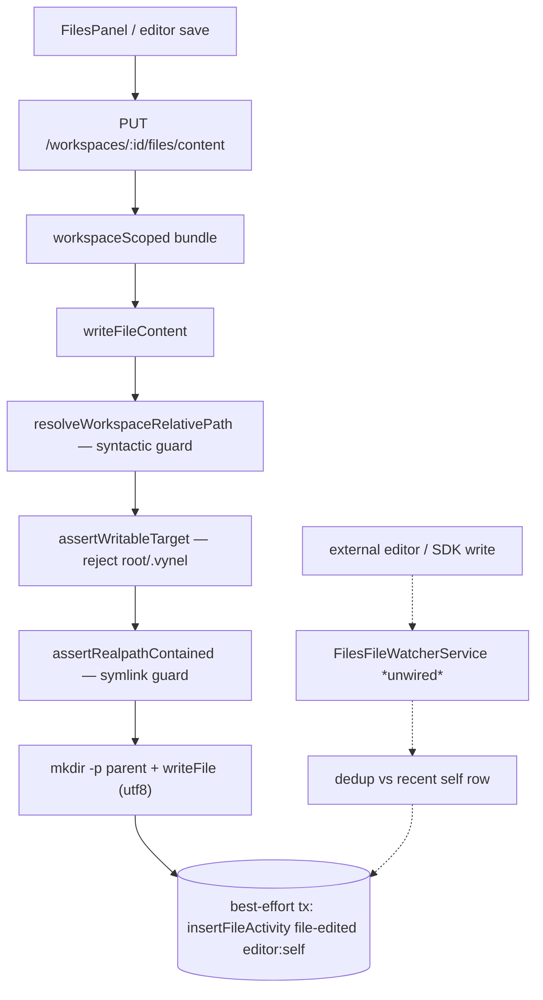
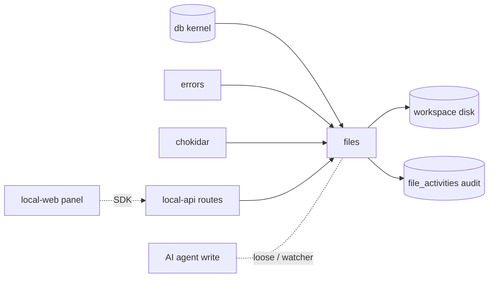

# Files — Structure

> The code map and connections for the files module. For the concepts behind it, see [overview.md](./overview.md).
>
> Folders touched: `packages/files/src/` · `packages/db/src/{schema,repositories}/files/` · `apps/local-api/src/routes/files/` · `apps/local-web/src/{components/workspace,composables/files}/`

Files is a vertical-slice leaf that treats **the disk as the source of truth** — the folder tree is read live from `fs` every call, never mirrored in the DB. The package owns its fs operations (`path/` guards + `operations/`), a background watcher, and one owned table — `file_activities`, an append-only audit log — over the shared `@vynel/db` kernel. Deps are unusually thin: `@vynel/db`, `@vynel/errors`, `chokidar` (`packages/files/package.json`). It takes **no** logger dep — core ops accept a structural `{ info, warn }` shape the app injects at the boundary.

## File map

► = entry point.

| Path | Role |
|---|---|
| ► `packages/files/src/index.ts` | public barrel — the single `.` export; re-exports every op, the two path guards, the watcher class, and domain types |
| `packages/files/src/files-types.ts` | domain types — row-type re-exports from `@vynel/db/schema/files`, `StructuralLogger`, `ResolvedWorkspacePath`, `FileContentKind`, `FileContent`, `FileActivityCursor` |
| `packages/files/src/path/resolve-workspace-relative-path.ts` | **syntactic** containment guard — the single chokepoint before every fs touch; rejects NUL / absolute / `..`-escape (see Data & the containment note) |
| `packages/files/src/path/assert-realpath-contained.ts` | **symlink** containment guard — resolves the real on-disk path (`fs.realpath`, ancestor-walk for not-yet-created paths) and re-applies the containment predicate |
| `packages/files/src/path/path-safety.ts` | pure policy guards — `isHiddenEntry` / `isUnderHiddenFolder` (default-hidden filter) + `assertWritableTarget` (rejects workspace root + `.vynel/` writes) |
| `packages/files/src/operations/file-content-kind.ts` | pure ext→kind + MIME map; `MAX_EDITABLE_BYTES` (1 MB); `deriveFileContentKind`, `isTextKind`, `contentTypeForRawResponse` |
| `packages/files/src/operations/list-directory.ts` | one-level directory listing (lazy UI expansion); hidden filter, dirs-first sort, per-dir visible-child count |
| `packages/files/src/operations/read-file-content.ts` | read for preview/edit — text kinds return UTF-8 (truncated at cap, `fatal` decode check → falls back to `unsupported`); binary kinds return metadata only |
| `packages/files/src/operations/stream-file-bytes.ts` | resolve + stat + content-type for the route to stream raw bytes (images / PDF / download) |
| `packages/files/src/operations/write-file-content.ts` | save text file; ensures parent dir; records `file-edited`/`file-created` (`editor: 'self'`) — best-effort audit |
| `packages/files/src/operations/create-file.ts` | create new file (`wx` exclusive — `ConflictError` if it exists); records `file-created` |
| `packages/files/src/operations/create-directory.ts` | `mkdir -p` (idempotent); records `folder-created` only when it didn't previously exist |
| `packages/files/src/operations/move-entry.ts` | rename/move; refuses to clobber unless `overwrite`; records `file-moved` (carries `fromPath`) |
| `packages/files/src/operations/delete-entry.ts` | hard delete; non-empty dirs require `recursive: true`; records `file-deleted`/`folder-deleted` |
| `packages/files/src/activity/list-recent-activity.ts` | cursor-paginated workspace activity feed (ISO↔Date, `nextCursor` envelope) |
| `packages/files/src/activity/list-file-history.ts` | cursor-paginated activity for one `(workspaceId, relativePath)` |
| `packages/files/src/activity/purge-old-file-activities.ts` | worker core op — hard-delete rows older than 90 d; *defined, not yet wired* (see Gotchas) |
| `packages/files/src/file-watcher.ts` | `FilesFileWatcherService` — one chokidar watcher per workspace; records `editor: 'external'` rows with a 5 s self-dedup; *defined, not yet wired* |
| `packages/db/src/schema/files/file-activities.ts` | the `file_activities` table + `FileActivityKind` / `FileActivityEditor` union types |
| `packages/db/src/repositories/files/file-activities.ts` | functional repo — insert / list-for-workspace / list-for-path / recent-self dedup / hard-delete-before |
| ► `apps/local-api/src/routes/files/index.ts` | HTTP entry — composes 5 sub-apps into 10 routes; **no `x-mcp` anywhere** (deliberate) |
| `apps/local-api/src/routes/files/{tree,content,raw,mutations,activity}.ts` | the route sub-apps (split for the ≤300-line cap) |
| `apps/local-api/src/routes/files/{schemas,serializers}.ts` | Zod request/response schemas · row→JSON serializers (Dates → ISO) |
| `apps/local-web/src/components/workspace/FilesPanel.vue` | the panel — root tree + empty/error states |
| `apps/local-web/src/components/workspace/FileTreeNode.vue` | recursive lazy tree row (drill-in fetches the child level) |
| `apps/local-web/src/components/workspace/file-colors.ts` | pure ext→color-family/icon lookup, shared by tree + editor header |
| `apps/local-web/src/composables/files/*.ts` | 3 vue-query composables — `use-file-tree`, `use-file-content`, `use-save-file` |

## Data & persistence

Files owns **one** table, registered in the kernel's `drizzle.sqlite.config.ts` (repo root, line 41) — the schema-parity check enforces exactly-one-config registration. DDL is hand-in-baseline: `packages/db/src/migrations-sqlite/0000_baseline.sql` (table L296–308, indexes L310–312). **The folder tree itself is never persisted** — `listDirectory` reads disk every call (D1). This table is purely the audit trail.

**`file_activities`** — one row per fs event. **Append-only, no `deletedAt`** — retention is by hard-delete (90 d, D13), not soft-delete.

| Column | Type | Notes |
|---|---|---|
| `id` | id (PK) | UUID supplied by the core op |
| `userId` | id (FK, cascade) | → `users` — kernel table; the tenant boundary |
| `workspaceId` | id (FK, cascade) | → `workspaces` — kernel table; the domain scope |
| `activityKind` | text | `file-created` / `file-edited` / `file-moved` / `file-deleted` / `folder-created` / `folder-deleted` |
| `editor` | text | `self` (Vynel files manager clicked a button) or `external` (SDK Write/Edit, outside editor, script) |
| `relativePath` | text | forward-slash, workspace-relative — a **loose string**, no FK (files live on disk, not in a table) |
| `fromPath` | text (null) | previous path for `file-moved`; null otherwise |
| `fileSizeBytes` | integer (null) | size at create/edit; null for moves/deletes/folders |
| `occurredAt` | timestamp | keyset-cursor sort key |

Indexes: `(workspaceId, occurredAt)` · `(workspaceId, relativePath, occurredAt)` · `userId`.

## Repositories

| Function (db-first) | Purpose |
|---|---|
| `insertFileActivity` | append one audit row (id supplied by caller) |
| `listFileActivitiesForWorkspace` | keyset cursor on `(occurredAt DESC, id DESC)`; caps 50/200 |
| `listFileActivitiesForPath` | same, filtered to one `relativePath` |
| `findRecentSelfActivityForPath` | most-recent `editor: 'self'` row within `sinceMs` — the watcher's dedup read |
| `hardDeleteFileActivitiesOccurredBefore` | retention purge; returns deleted count |

## Core operations

Every op resolves the path through **both** guards before any fs call. Mutating ops additionally call `assertWritableTarget`, and wrap the audit insert in `withTransaction` — but the audit write is **best-effort** (D7): a failed insert logs a warning and still returns success, because the fs mutation is the user's intended outcome and must not be reversed by an audit hiccup.

| Operation | What it does | Key calls |
|---|---|---|
| `listDirectory` | one disk level, hidden filter, dirs-first, per-dir visible-child count | `resolveWorkspaceRelativePath`, `assertRealpathContained`, `readdir`/`stat` |
| `readFileContent` | text → UTF-8 (truncate at 1 MB, `fatal` decode → `unsupported`); binary → metadata only | guards, `deriveFileContentKind`, `readFile`, `TextDecoder` |
| `streamFileBytes` | resolve + stat + content-type for the raw route; directories → 404 | guards, `contentTypeForRawResponse` |
| `writeFileContent` | size-check, `mkdir -p` parent, `writeFile`, audit `file-edited`/`file-created` | guards, `assertWritableTarget`, `insertFileActivity` (best-effort tx) |
| `createFile` | `wx` exclusive write (409 on exist), audit `file-created` | guards, `assertWritableTarget`, `ConflictError` |
| `createDirectory` | idempotent `mkdir -p`, audit `folder-created` only if newly created | guards, `assertWritableTarget` |
| `moveEntry` | validate both ends, refuse clobber unless `overwrite`, `rename`, audit `file-moved` | two-sided guards, `assertWritableTarget(to)`, `ConflictError` |
| `deleteEntry` | non-empty dir needs `recursive`, `rm`, audit `file-deleted`/`folder-deleted` | guards, `assertWritableTarget`, `rm({ force:false })` |
| `listRecentActivity` | ISO↔Date + `nextCursor` envelope | `listFileActivitiesForWorkspace` |
| `listFileHistory` | same, per path | `listFileActivitiesForPath` |
| `purgeOldFileActivities` | hard-delete > 90 d; sync; logs count | `hardDeleteFileActivitiesOccurredBefore` |

## Path containment — the key invariant

There is **no single "safe path" function**; containment is enforced in **three layers**, and every fs-touching op calls them in order:

1. **Syntactic** — `resolveWorkspaceRelativePath` (`path/resolve-workspace-relative-path.ts`). Rejects a NUL byte, an absolute path, and — after `path.resolve(root, relativePath)` normalizes `..`/`.` — any result that isn't the root. The predicate is `absolutePath === root || absolutePath.startsWith(root + path.sep)`. The **`+ path.sep` is load-bearing**: a bare `startsWith(root)` would let `${root}-sibling` pass. Returns `{ absolutePath, normalizedRelativePath }` (forward-slash relative). Pure, throws `ValidationError`.
2. **Symlink** — `assertRealpathContained` (`path/assert-realpath-contained.ts`). The syntactic guard sees only the string; a symlink `workspace/escape → /etc/passwd` would still pass it. This helper `realpath`s the target (and the root, so a symlinked workspace dir resolves consistently) and re-applies the **same** containment predicate. For not-yet-created paths it walks up to the nearest existing ancestor, realpaths *that*, then re-appends the unresolved suffix (which can't contain symlinks — those segments don't exist). Async, throws `ValidationError`. This is the fs-boundary half; the file's own comment flags a missing check here as "Critical-tier."
3. **Policy** — `assertWritableTarget` (`path/path-safety.ts`), on mutations only. After containment is proven, this rejects writing to the workspace root directly and to anything whose first segment is `.vynel/` (Vynel-managed internal state). Listing *can* surface `.vynel/` under `includeHidden`; mutations never touch it.

The HTTP Zod schemas deliberately do **not** validate containment — they check input *shape* only; the core op is the trust boundary (defense in depth, `schemas.ts` header comment).

## HTTP surface

Mounted at `/workspaces/:workspaceId/files` (`apps/local-api/src/app.ts:142`). **No `featureGate`** — unlike memory/knowledge/schedules, files is an always-on core surface (no entitlement tier). Each route carries the `workspaceScoped` bundle (user + workspace ownership); the workspace's on-disk `path` comes from `c.var.workspace.path`. Typed `VynelError`s hit the global `onError` — no in-route mapping.

| Method | Path | Purpose | `x-sdk-name` |
|---|---|---|---|
| GET | `/tree` | list one folder level (`path`, `includeHidden`) | `files.tree` |
| GET | `/content` | read a file for preview/edit | `files.readContent` |
| PUT | `/content` | save text (`editor: 'self'`) | `files.saveContent` |
| GET | `/raw` | stream raw bytes (image/pdf/download) | `files.raw` |
| POST | `/file` | create a file (409 if exists) | `files.createFile` |
| POST | `/directory` | create a folder (idempotent) | `files.createDirectory` |
| POST | `/move` | rename/move | `files.move` |
| POST | `/delete` | hard delete (recursive for non-empty dirs) | `files.delete` |
| GET | `/activity` | recent workspace activity feed | `files.listActivity` |
| GET | `/activity/file` | per-file history | `files.listFileHistory` |

## MCP surface

**None — deliberate.** No files route carries an `x-mcp` block, so no files MCP tool is generated (the index header, ported faithfully at D10, spells out why): the agent already has native Claude-Code `Read`/`Glob`/`Edit`/`Write` over the workspace, so an equivalent MCP surface would be redundant (same rationale as marketplace's D9). The `editor: 'external'` audit path is how the agent's own writes get logged — via the watcher, not an MCP tool.

## Worker / background jobs

Two background pieces exist in the package but **neither is wired into an app yet** (grep finds no instantiation of `FilesFileWatcherService` and no caller of `purgeOldFileActivities` outside the package). When wired they will be:

| Piece | Cadence (intended) | Runs |
|---|---|---|
| `FilesFileWatcherService` | live (chokidar, per active workspace) | inserts `editor: 'external'` rows; 5 s self-dedup; `followSymlinks: false`, 300 ms debounce, `awaitWriteFinish` |
| `purgeOldFileActivities` | periodic (worker) | hard-deletes `file_activities` > 90 d |

The watcher's dual-write pairing with the ops' `editor: 'self'` rows is the D16/D17 model: user-manager actions write `self` synchronously; the watcher would suppress the echoing `external` row via `findRecentSelfActivityForPath` within a 5 s window.

## Web surface

Read-first today: the panel browses the tree; content-preview + save composables exist, but the create/move/delete/activity surfaces aren't yet mounted in the UI. Everything speaks the generated SDK (`vynel.files.*`) through vue-query; cache keys under `["files", …]`.

- **Composables** (`apps/local-web/src/composables/files/`) — `use-file-tree.ts` (one directory level; `DirectoryEntry` derived from the SDK return type since no named schema is exported), `use-file-content.ts` (read one file, enabled only when a path is set), `use-save-file.ts` (PUT `/content`; on success invalidates the file's content key + the whole `["files","tree", ws]` family).
- **Components** — `FilesPanel.vue` (root query + `FileTreeNode` list, empty/error states), `FileTreeNode.vue` (recursive, drill-in lazily fetches the child level), `file-colors.ts` (pure ext→color/icon lookup shared with the editor header).

## Pipeline — "save a file, and it's audited"

1. `apps/local-api/src/routes/files/content.ts` (PUT `/content`) → `workspaceScoped` → `writeFileContent(c.var.db, …)` with `c.var.workspace.path`.
2. `packages/files/src/operations/write-file-content.ts` — `resolveWorkspaceRelativePath` (syntactic) → `assertWritableTarget` (policy) → `assertRealpathContained` (symlink) → size check.
3. `mkdir -p` the parent, `writeFile` UTF-8, `stat` for the fresh size/mtime.
4. Best-effort `withTransaction` → `insertFileActivity` (`file-edited` or `file-created`, `editor: 'self'`). An insert failure logs and continues — the file is already written (D7).
5. `serializeFileMetadata` → JSON; the web `use-save-file.ts` invalidates the file's content key + the tree family so the UI reflects the new size/mtime.
6. Independently, once wired, `FilesFileWatcherService` would observe the same write and *skip* the `external` row because step 4's `self` row is within the 5 s dedup window.

## Connections

**Summary:** files is a **thin leaf** — imported only by the local-api route files; it depends on the db kernel + errors (+ chokidar for the watcher). It publishes **no** outbox events and consumes none. Its only cross-module coupling is through kernel FKs (`users`/`workspaces`) and loose `relativePath` strings; the disk, not the DB, holds the tree.

| Unit | Direction | Mechanism | What crosses |
|---|---|---|---|
| db kernel (`@vynel/db`) | out | import | `Database`, `withTransaction`, `file_activities` schema + repo, `users`/`workspaces` FKs |
| errors (`@vynel/errors`) | out | import | `ValidationError`, `NotFoundError`, `ConflictError` |
| chokidar | out | import (npm) | fs event stream for the watcher |
| local-api routes | in | import | the 10 routes; `workspaceScoped` enforces access; `c.var.workspace.path` supplies the fs root |
| local-web | in | SDK | tree browse + content read + save (`vynel.files.*`) |
| the AI agent | in (loose) | native SDK tools + watcher | agent Write/Edit lands on disk → the (unwired) watcher would log it as `editor: 'external'` |

**Events published:** none — no op calls `insertOutboxEvent`; the only DB write is the audit row.
**Events consumed:** none.

## Config & gotchas

- **The disk is the source of truth** — there is no DB mirror of the folder tree; `listDirectory` re-reads `fs` every call. The only persistence is the append-only audit log.
- **Three containment layers, called in order** — syntactic → policy → symlink. Skipping `assertRealpathContained` reopens a symlink-escape hole the file's header calls Critical-tier. The `+ path.sep` in the containment predicate is not cosmetic (blocks `${root}-sibling`).
- **No `featureGate`** — files is always-on; only `workspaceScoped` guards it. Don't add an entitlement tier without a deliberate decision.
- **No MCP tools, on purpose** — the agent uses native Claude-Code file tools; a files MCP surface would duplicate them (D10). Adding `x-mcp` here would silently generate redundant tools.
- **Audit writes are best-effort (D7)** — every mutating op swallows an `insertFileActivity` failure with a `logger?.warn` and still returns success. The audit log can therefore under-count if the DB hiccups; never treat it as a guaranteed complete record.
- **The watcher and the purge worker are defined but unwired** — no app instantiates `FilesFileWatcherService` or calls `purgeOldFileActivities`. Until wired, no `editor: 'external'` rows are ever recorded and old audit rows are never purged. This is the sharpest drift to close next.
- **`editor: 'external'` covers everything non-manager** — SDK writes, outside editors, scripts all collapse to `external`; a finer `agent` vs `external` split is deferred (D16).
- **1 MB editable cap (`MAX_EDITABLE_BYTES`)** — enforced in `writeFileContent`/`createFile` and mirrored in `readFileContent` (larger text files preview-truncated with `isTruncated: true`; the editor refuses to save). Binary/unknown-but-non-UTF-8 files route to `/raw` for download.
- **Structural logger, not `@vynel/logger`** — core ops accept a `{ info, warn }` shape so the package keeps no hard logger dep; the app injects pino at the route boundary.

---
*Mapped from the code on disk, 2026-07-14. If you change this module, update this file and [overview.md](./overview.md).*
