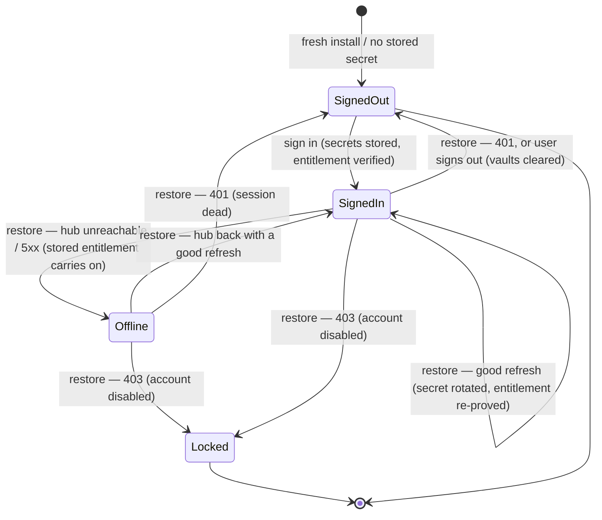

# Hub-account — Overview

> The desktop's own half of "my Vynel account on this device": it signs the user in to the Vynel hub, keeps the long-lived secret in the OS credential store, and proves the account's tier and features even when the hub is unreachable.
>
> **Status:** shipped (identity + entitlement proof land; feature *enforcement* is wired but deliberately permissive until the entitlements milestone) · **Depends on:** shared plumbing only — [contracts](../contracts/overview.md), errors, logger, the OS keyring, and offline JWT verification; no `db` kernel · **Code map:** [structure.md](./structure.md)

## Purpose

Vynel is a desktop app, but the account behind it lives in the cloud — the **hub** (the `accounts` / `registry` services fronted by the cloud API). Hub-account is the client that connects the two: it is the daemon's single source of truth for *who is signed in on this machine, what they're allowed to do, and whether we've heard from the hub lately*.

It exists so the rest of the desktop never has to think about tokens, credential stores, or JWT math. A feature that wants to know "is this user Pro?" or "is the marketplace available?" asks hub-account for the current status or entitlement and gets a plain answer. Everything underneath — the short-lived access token, the long-lived refresh secret rotating on every restore, the signed tier proof — is hidden.

What makes it a genuine product surface rather than pure plumbing is **offline dignity**. The app must keep working on a plane or a dead Wi-Fi connection. Hub-account holds a signed entitlement proof that it verifies entirely on-device against a pinned public key, so identity, tier, and features survive a roughly week-long grace window with no connectivity at all. The user is never kicked out just because the network blinked.

## What it can do

- **Sign in** with email and password plus a description of this device, receiving the session envelope and storing its secrets locally.
- **Sign out** — tell the hub to retire this device's session, then clear both local secrets. A failing hub never blocks the local sign-out.
- **Restore the session at boot** — the once-a-day / on-launch status check that rotates the refresh secret, re-proves the entitlement, and resolves the current status (this *is* the account-status check).
- **Report status** on demand — the daemon's routes and the desktop UI read the current link state (signed-out / signed-in / locked / offline).
- **Report the verified entitlement** — the feature gate reads the current tier and feature set, or nothing when unproven.
- **List this account's devices** and **revoke** any one of them, riding the short-lived access token (auto-restoring once if it has aged out).
- **Fetch the cloud catalog** and **download an item's artifact bytes** on the access token — tier-gating is enforced server-side.
- *(background)* **Verify the entitlement JWT offline** against the pinned public key on every adopt, restore, and offline boot — no network, no crash on a bad token.

## Responsibilities

**Owns** — the desktop end of the hub link: the typed HTTP client that maps every hub error response to the matching Vynel error and every network failure to "unreachable"; the two OS-keyring vaults (the refresh secret and the entitlement proof, each its own credential entry) behind a swappable contract; the offline entitlement verifier and the pinned-key trust decision; and the one stateful session service that holds the live status and entitlement, serializes every secret-mutating operation, and resolves the four session outcomes.

**Does not own** —
- issuing tokens, storing accounts, or the authentication and catalog endpoints themselves — that's the hub server side (`accounts` / `registry` / the cloud API), which lives outside this desktop docs book;
- the wire shapes and the tier-to-feature matrix — those are shared in [contracts](../contracts/overview.md) so both sides can't drift;
- deciding *whether a feature is on* for a workspace, and the routes that expose sign-in / status to the UI — the [local-api](../_apps/local-api/overview.md) app and its feature gate own that, reading hub-account's entitlement;
- what the catalog is *for* and installing from it — [marketplace](../marketplace/overview.md) consumes the fetch/download calls;
- scheduling the boot and daily restore ticks — the hosting app wires the interval; hub-account only exposes the operation.

## Concepts & vocabulary

| Term | Meaning |
|---|---|
| **Hub** | The cloud side of Vynel — the account, tier, and catalog authority this leaf talks to. |
| **Hub session** | The one stateful, per-process service that owns the live link: current status, current entitlement, and the serialized sign-in / restore / sign-out operations. |
| **Link status** | The desktop's view of the connection: *signed-out*, *signed-in*, *locked*, or *offline* (the wire type also carries *not-configured*, set upstream by the hosting app when no hub is wired). |
| **Refresh token** | The long-lived secret that buys new access tokens. Rotated on every restore, kept in the OS credential store, never in a plain file. |
| **Access token** | The short-lived bearer token for device, catalog, and download calls. Aged-out (401) triggers one restore-and-retry. |
| **Entitlement token** | A signed (~7-day) proof of identity + tier + features. Verified on-device against the pinned key; stored so offline boots still know the account. |
| **Vault** | The swappable home for a secret — the real one is the OS credential store; tests use an in-memory fake. |
| **Entitlement / claims** | The verified contents of the entitlement token: account id, email, display name, tier, features, and the grace-window expiry. |
| **Tier** | `basic` or `pro`. Basic unlocks channels only; pro unlocks everything. The matrix is the single source of truth in contracts. |
| **Grace window** | The ~7 days after issue during which the stored entitlement keeps proving tier + features with no connectivity; past it, features read as none. |
| **Device** | One signed-in machine in the account's device family, describable, listable, and revocable. |

## Rules & invariants

- **Secrets never touch a plain file.** The refresh token and the entitlement proof live only in the OS credential store, each as its own entry; the native dependency is quarantined to a single file and everything else programs against the vault contract.
- **The entitlement is verified before it is ever trusted.** Every token is checked against the *pinned* public key with the issuer and the token's declared purpose (entitlement, not access) both required — a token signed for any other purpose, or by any other key, is rejected. Verification is fully offline.
- **A key mismatch degrades, never blocks.** If the entitlement token fails to verify (e.g. the desktop's pinned key doesn't match the hub's), sign-in still succeeds — the account is proven, only the tier proof is missing, and features read as none rather than locking the user out.
- **Restore is the account verdict, and it distinguishes three outcomes.** A good refresh means signed-in (secret rotated, entitlement re-issued); a `401` means the session is dead server-side, so both vaults clear and the user is signed-out; a `403` means the account is disabled, so both vaults clear and the link goes *locked*. Anything else — an unreachable hub or a `5xx` — is **not** a verdict: the link goes *offline* on the stored entitlement.
- **Offline is a first-class state, not an error.** Unreachability keeps the cached identity and, inside the grace window, the tier and features; the app keeps working.
- **Every secret-mutating operation runs strictly serialized.** A daily restore in flight while the user signs out (or a boot restore racing a fresh sign-in) must never interleave — the loser could re-store a rotated token after a clear, or leak a duplicate device family.
- **Local sign-out cannot be held hostage by the hub.** If the hub call fails, the secrets are cleared locally anyway; the server-side family dies at its next contact or via device revocation.
- **Access-token calls self-heal once.** A device, catalog, or download call that meets a 401 restores a single time (rotating the token) and retries; a second failure surfaces.
- **Tier gating is permissive until enforcement lands.** The entitlement is read and reported, but an unproven tier reads as "don't gate" for both the UI and the daemon — no enforcement until the entitlements milestone.

## Lifecycle

## Where it sits in the bigger picture

Hub-account is a leaf with an unusually small footprint: it depends on no feature siblings and no `db` kernel — only the shared contracts, error, and logger packages, plus the OS keyring and offline JWT verification. It is the desktop mirror of a system that mostly lives elsewhere: the hub server (the `accounts` / `registry` services behind the cloud API) issues the tokens this leaf only *consumes and verifies*, and the two halves share their wire shapes and tier matrix through [contracts](../contracts/overview.md) precisely so they can't drift.

On the desktop side, the [local-api](../_apps/local-api/overview.md) app hosts the one hub session, exposes it through its hub routes to the [local-web](../_apps/local-web/overview.md) UI, and schedules the boot and daily restore ticks; its feature gate reads this leaf's entitlement to decide what a tier unlocks. [Marketplace](../marketplace/overview.md) rides the same session to fetch the cloud catalog and download artifacts. Everything the user sees about their account — the signed-in badge, the tier, the device list, the "you're offline" notice — traces back here.

---
*Mapped from the code on disk, 2026-07-14. If you change this module, update this file and [structure.md](./structure.md).*
