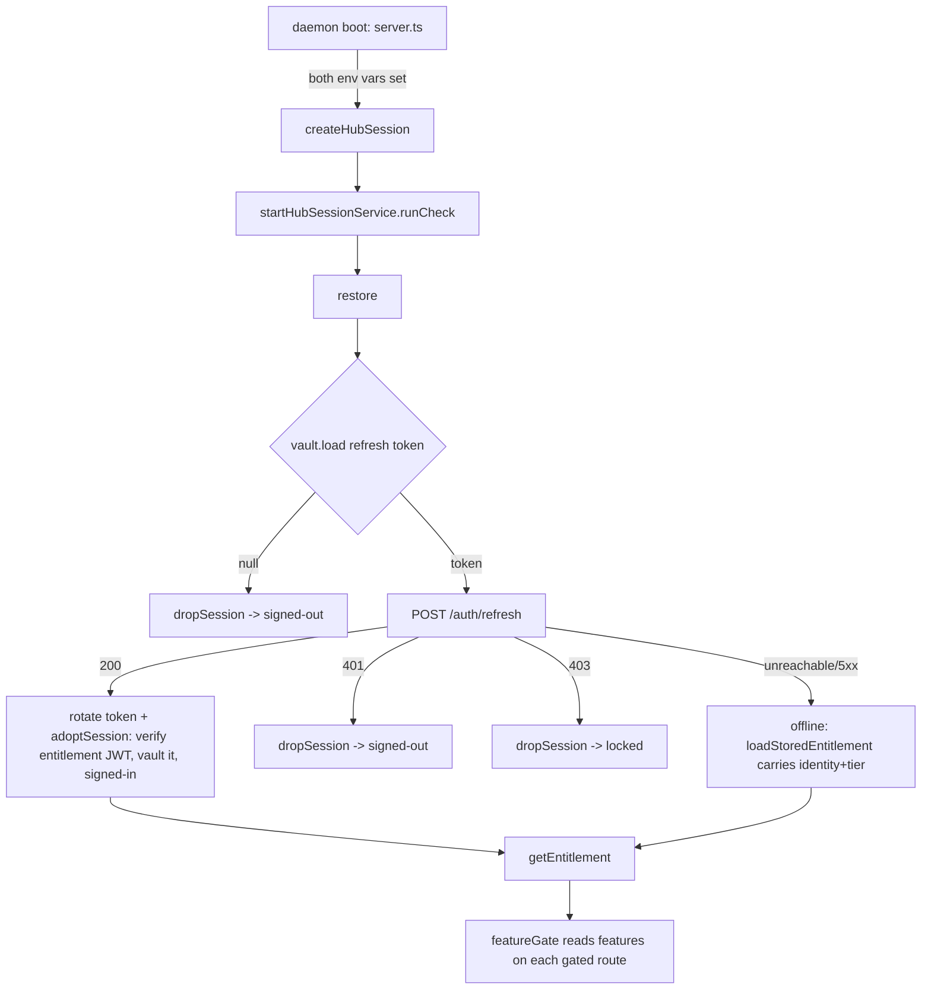
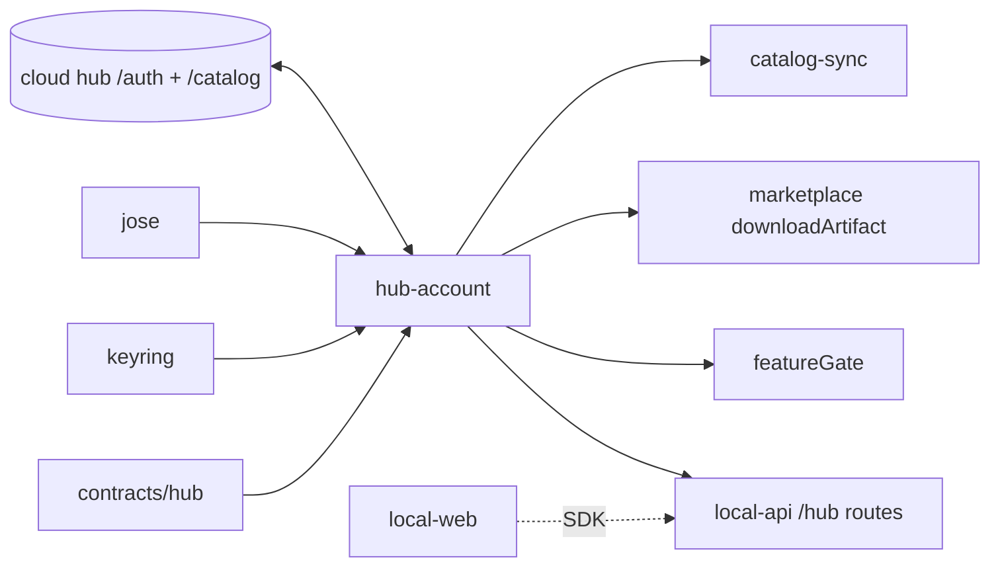

# Hub-account — Structure

> The code map and connections for the hub-account module. For the concepts behind it, see [overview.md](./overview.md).
>
> Folders touched: `packages/hub-account/src/` · `apps/local-api/src/routes/hub/` · `apps/local-api/src/services/` · `apps/local-api/src/middleware/feature-gate.ts` · `apps/local-web/src/{composables/hub,components/sections}/`

Hub-account is the **desktop side of the cloud link** — a client leaf, not a vertical DB slice. It owns **no SQLite table**: the long-lived secrets live in the OS credential store (Windows Credential Manager via `@napi-rs/keyring`), and the tier proof is a JWT verified offline against a pinned public key. Everything else — identity, tier, features, devices, catalog — is fetched from the hub (`apps/cloud-api`) over HTTP, typed against `@vynel/contracts/hub/*`. Deps: `@vynel/contracts`, `@vynel/errors`, `@vynel/logger`, plus two native/crypto libs (`@napi-rs/keyring`, `jose`) — no `@vynel/db` (`packages/hub-account/package.json`).

## File map

► = entry point.

| Path | Role |
|---|---|
| ► `packages/hub-account/src/index.ts` | public barrel — the only subpath export (`.`); re-exports the client, both vault factories, the entitlement verifier, and the session factory |
| `packages/hub-account/src/client/hub-client.ts` | the desktop's HTTP client for the hub's `/auth` + `/catalog` surface; maps HTTP status → `VynelError`, wraps network failure in `HubUnreachableError` (503); 15 s timeout |
| `packages/hub-account/src/vault/refresh-token-vault.ts` | the `RefreshTokenVault` contract (`load`/`store`/`clear`) + the in-memory fake used by tests |
| `packages/hub-account/src/vault/keyring-vault.ts` | the OS-keyring impl — **native dep (`@napi-rs/keyring`) quarantined to this file**; two factories (refresh-token entry + entitlement entry) over the `vynel-hub` service |
| `packages/hub-account/src/tokens/entitlement-verifier.ts` | verifies the hub's EdDSA entitlement JWT against the **pinned SPKI public key** — fully offline; asserts `token_use === 'entitlement'` + required claims |
| ► `packages/hub-account/src/session/hub-session.ts` | the stateful `HubSession` — one closure-store service per daemon; owns the sign-in/restore/sign-out/devices/catalog flows and the `HubLinkStatus` union |
| `packages/hub-account/src/session/hub-session.test.ts` | session flow tests (verdict matrix, serialization, offline grace) |
| `packages/hub-account/src/tokens/entitlement-verifier.test.ts` | verifier tests (valid / expired / wrong `token_use` / bad claims) |
| ► `apps/local-api/src/routes/hub/index.ts` | the `/hub` HTTP surface — 5 routes, **no MCP exposure** |
| `apps/local-api/src/routes/hub/schemas.ts` | Zod request/response schemas mirroring the `@vynel/contracts/hub/hub-auth` shapes at the parse boundary |
| `apps/local-api/src/services/hub-session-service.ts` | boot-check service — adaptive `restore()` cadence (daily when settled, 60 s when offline) |
| `apps/local-api/src/services/catalog-sync-service.ts` | 30 min cloud-catalog sync riding `hubSession.fetchCatalog()` |
| `apps/local-api/src/middleware/feature-gate.ts` | tier enforcement — reads `hubSession.getEntitlement()`, 403 `feature_locked` when a live entitlement lacks the key |

## Data & persistence

**Owns no SQLite table.** The leaf never imports `@vynel/db`; nothing is registered in `drizzle.sqlite.config.ts` and there are no migrations. Two kinds of state instead:

**OS keyring** (`keyring-vault.ts`, service name `vynel-hub`) — two entries, each a `RefreshTokenVault`:

| Entry name | Holds | Read by |
|---|---|---|
| `refresh-token` | the long-lived rotating refresh secret | `restore()` / `signOut()` |
| `entitlement` | the last-issued entitlement JWT (tier + features + identity) | offline boots, via `loadStoredEntitlement()` |

The keyring's "no entry" throw IS the signed-out / signed-out-of-that-entry state — both `load()` (returns `null`) and `clear()` (already absent = success) swallow it deliberately.

**In-process session state** (`hub-session.ts` closure) — `status: HubLinkStatus`, `accessToken`, `entitlement`. The access token is short-lived and **never persisted** (only the refresh token + entitlement JWT are vaulted).

**Loose refs / no FKs:** identity is an `accountId` string from the JWT `sub`; it is not a local `userId` and there is no cross-table foreign key. The wire types (`HubSessionResponse`, `HubDeviceView`, `HubEntitlementClaims`, `HubLinkStatus`) are shared contracts in `packages/contracts/src/hub/`, so the desktop client and the hub routes cannot drift.

## The vault contract (in place of repositories)

`RefreshTokenVault` is the swap seam that keeps the native credential store out of every other file:

| Function | Purpose |
|---|---|
| `load(): Promise<string \| null>` | read the secret, or `null` when absent (= that entry is signed out) |
| `store(secret): Promise<void>` | write / overwrite the secret |
| `clear(): Promise<void>` | delete the entry (idempotent) |

Two impls: `createInMemoryRefreshTokenVault` (tests) and `createKeyring*Vault` (production). The session takes **two** vaults — one per keyring entry — via `CreateHubSessionOptions.vault` + `.entitlementVault`.

## Core operations (the `HubSession`)

`createHubSession(options)` returns the interface below. Every vault-mutating op runs through a `serialized()` promise queue so a daily `restore()` can't interleave with a user `signOut()` (the loser would re-store a rotated token after the vault was cleared).

| Operation | What it does | Key calls |
|---|---|---|
| `getStatus()` | current `HubLinkStatus` (sync) | — |
| `getEntitlement()` | the verified claims backing the status, or `null`; the daemon's feature gate reads this | — |
| `signIn({email,password})` | POST `/auth/sign-in` with `device`, store the rotated refresh token, adopt the session | `client.signIn`, `vault.store`, `adoptSession` |
| `restore()` | **the boot-time account-status check** — load refresh token → `/auth/refresh` → rotate + re-adopt; maps 401 → signed-out, 403 → locked, unreachable → offline (stored entitlement carries identity) | `vault.load/store`, `client.refresh`, `adoptSession` / `dropSession` / `loadStoredEntitlement` |
| `signOut()` | best-effort `/auth/sign-out` (failure logged, never blocks), then clear both vaults → signed-out | `client.signOut`, `dropSession` |
| `listDevices()` / `revokeDevice(id)` | access-token calls with **restore-and-retry on 401** | `withAccessToken` → `client.listDevices` / `revokeDevice` |
| `fetchCatalog()` | the hub's cloud catalog on the access token (restore-and-retry); throws `UnauthorizedError` when signed out | `withAccessToken` → `client.getCatalog` |
| `downloadArtifact(itemId, version)` | raw artifact bytes for a catalog item version (tier-gated server-side; 403 → `ForbiddenError`) | `withAccessToken` → `client.downloadArtifact` |

Internal helpers: `adoptSession` (verify + vault the entitlement JWT, build `signed-in` status — a **verify failure does not block sign-in**, tier reads `null`), `dropSession` (clear both vaults + set the terminal status), `loadStoredEntitlement` (offline identity), `withAccessToken` (lazy restore + single 401 retry).

## HTTP surface

Mounted at `/hub` (the daemon's local API). The session var (`c.var.hubSession`) is set only when a hub is configured (`app.ts:102`); every mutating route funnels through `requireHubSession`, which throws `ValidationError` (→ 400) with the `VYNEL_HUB_URL` hint when it's absent. No error mapping in the routes — typed `VynelError`s hit the global `onError`.

| Method | Path | Purpose | SDK name | MCP tool |
|---|---|---|---|---|
| GET | `/session` | current `HubLinkStatus` (`not-configured` when unset — never throws) | `hub.getSession` | — |
| POST | `/sign-in` | email + password against the hub | `hub.signIn` | — |
| POST | `/sign-out` | clear this device's session (local + hub) | `hub.signOut` | — |
| GET | `/devices` | the account's live devices | `hub.listDevices` | — |
| DELETE | `/devices/:deviceId` | revoke one device | `hub.revokeDevice` | — |

## MCP surface

**None — by design.** Account management is a user action, never an agent tool; the route file states it explicitly and no `x-mcp` block is present. The tier proof this leaf yields is what *gates* other features' MCP tools (via `featureGate`), but hub-account exposes nothing of its own to the agent.

## Boot & background services

The daemon wires the session once at boot, only when both env vars are set (`server.ts:76-91`):

```
createHubSession({
  client: createHubClient({ baseUrl: VYNEL_HUB_URL }),
  vault: createKeyringRefreshTokenVault(),
  entitlementVault: createKeyringEntitlementVault(),
  entitlements: await createEntitlementVerifier({ publicKeyPem: VYNEL_HUB_PUBLIC_KEY }),
  device, logger,
})
```

Two services then ride that one session:

| Service | Cadence | Runs |
|---|---|---|
| `startHubSessionService` | **adaptive** — 24 h when settled, 60 s while `offline` (a wifi blip at boot must not strand the user on the offline card for a day) | `hubSession.restore()` |
| `startCatalogSyncService` | 30 min (+ once at boot) | `hubSession.fetchCatalog()` → `syncCloudCatalog`; **clears** cache only on a definitive `signed-out`/`locked` verdict, keeps it on `offline`/transient failure |

## Web surface

The desktop UI speaks the generated SDK (`vynel.hub.*`) through vue-query; cache keys under `hub-keys.ts`.

- **Composables** (`apps/local-web/src/composables/hub/`) — `use-hub-session.ts` (the status query), `use-hub-sign-in.ts`, `use-hub-sign-out.ts`, `use-hub-devices.ts`, `use-revoke-hub-device.ts`, `use-hub-features.ts` (reads `features`/`tier` off the status for UI gating), `hub-keys.ts` (query-key factory).
- **Components** — `AccountSection.vue` (the account panel — status, devices, sign-out), `AccountSignInForm.vue` (email + password).
- **Mounting** — `GlobalChatView.vue` + `WorkspaceSectionPanel.vue` reference the session; `MarketplaceSection.vue` reads hub features to show cloud items.

## Pipeline — "daemon boots, restores the vaulted session, gates features"



1. `apps/local-api/src/server.ts:76` — if `VYNEL_HUB_URL` **and** `VYNEL_HUB_PUBLIC_KEY` are set, build the client, two keyring vaults, the verifier, and the session; else `hubSession` stays `undefined` (dev without a hub keeps working).
2. `apps/local-api/src/services/hub-session-service.ts:54` — `runCheck()` fires immediately (async, non-blocking) → `hubSession.restore()`.
3. `packages/hub-account/src/session/hub-session.ts:122` `restoreNow` — `vault.load()`; `null` → `dropSession({signed-out})`; else `client.refresh({refreshToken})`.
4. On success: `vault.store(session.refreshToken)` (rotation) → `adoptSession` verifies the entitlement JWT (`entitlement-verifier.ts`), vaults it, and sets `signed-in` with `tier`/`features` (or `null` on a key mismatch).
5. On 401 → `signed-out`; 403 → `locked`; unreachable → `offline` with the **stored** entitlement's identity + tier read back through the grace window.
6. Each gated route: `apps/local-api/src/middleware/feature-gate.ts:29` reads `getEntitlement()`; a live entitlement missing the feature 403s `feature_locked` (permissive when there's no entitlement at all).

## Connections

**Summary:** hub-account is a **pure client leaf** — it publishes and consumes **no outbox events** and owns no DB row. It sits at the top of the account/tier read-side: the daemon reads its status (`/hub` routes), its entitlement (`featureGate`), and its access token (marketplace downloads + catalog sync). It depends only on shared contracts/errors/logger plus two external libs.

| Unit | Direction | Mechanism | What crosses |
|---|---|---|---|
| `@vynel/contracts` (`hub/*`) | out | import (type-only) | `HubSessionResponse`, `HubLinkStatus`, `HubDeviceView`, `HubEntitlementClaims`, `HubCatalogItem` |
| `@vynel/errors` | out | import | `Unauthorized`/`Forbidden`/`Validation`/`RateLimited`/`NotFound`Error, `VynelError` |
| `@vynel/logger` | out | import (type-only) | `StructuralLogger` |
| `@napi-rs/keyring` | out | import (**quarantined** to `keyring-vault.ts`) | OS credential store `Entry` |
| `jose` | out | import | `jwtVerify`, `importSPKI` (EdDSA) |
| hub / `apps/cloud-api` | out | HTTP | `/auth/*` + `/catalog/*`; the entitlement JWT is signed hub-side (`@vynel/accounts`), verified here |
| local-api `/hub` routes | in | import (`HubSession` type + `c.var.hubSession`) | the 5 routes |
| local-api services | in | import | boot-check restore + catalog sync |
| local-api `featureGate` | in | import | `getEntitlement().features` → tier gate |
| [marketplace](../marketplace/overview.md) | in | injected dep | `hubSession.downloadArtifact` in `item-lifecycle.ts`; `fetchCatalog` in `catalog-sync-service.ts` |
| local-web | in | SDK | `vynel.hub.*` composables |

**Events published:** none. **Events consumed:** none (this leaf never touches the outbox).



## Config & gotchas

- **No tokens are ever logged.** Every log call in the leaf carries only an error message or a plain string — refresh tokens, access tokens, and entitlement JWTs never enter a log payload. The verify-failure warning logs guidance (check the key), not the token.
- **Two env vars, both required to enable the hub** — `VYNEL_HUB_URL` (base URL) **and** `VYNEL_HUB_PUBLIC_KEY` (SPKI PEM for the pinned verifier). Missing either → `hubSession` is `undefined`; `GET /hub/session` answers `not-configured`, mutations 400 with the env hint. Dev without a hub is a first-class path.
- **Native keyring is quarantined** — `@napi-rs/keyring` is imported only in `keyring-vault.ts`; everything else programs against `RefreshTokenVault`, so tests never touch the OS store and a platform without a keyring fails loud in exactly one place.
- **A key mismatch does NOT block sign-in** — if the entitlement JWT fails verification (hub/desktop key drift), `adoptSession` keeps the account signed-in with `tier: null` / `features: null`; the UI reads `null` as "don't gate" and `featureGate` stays permissive. The account is proven; only the tier proof is missing.
- **Access token is never vaulted** — only the refresh token and entitlement JWT persist. A 401 on any access-token call triggers a single `restore()`-and-retry (`withAccessToken`); a second 401 rethrows.
- **`offline` is not a verdict** — anything that isn't a 401 or 403 during `restore()` (unreachable hub, 5xx, timeout via `HubUnreachableError`) stays `offline` and reads identity/tier from the stored entitlement through the ~7-day grace window; past expiry, features read as none.
- **Serialized vault ops** — sign-in / restore / sign-out share one promise queue so a boot restore can't re-store a rotated token after a concurrent sign-out cleared the vault. Don't add a vault-mutating path that bypasses `serialized()`.
- **`featureGate` gates HTTP only** (known M3 limitation, per the file's header): a pro→basic downgrade doesn't stop already-scheduled fires or the knowledge file watcher (they run via direct package calls in boot services, outside HTTP), and it 403s the whole subtree including disable/delete.
- **Catalog cache safety** — `catalog-sync-service` clears the local cloud-catalog cache **only** on a definitive `signed-out`/`locked` status; a transient network failure keeps `signed-in` status, so the cache survives a hub blip (offline browse).

---
*Mapped from the code on disk, 2026-07-14. If you change this module, update this file and [overview.md](./overview.md).*
