# Instructions — Overview

> Vynel's notebook: a shelf of curated *playbooks* — books of current, task-specific guidance — that the assistant opens on demand when a matching job starts, plus the reserved seam for always-on user instructions that comes later.
>
> **Status:** shipped (the notebook half — reading verified books *and* authoring your own — is landed end-to-end with routes and UI; only the always-on instructions half is deferred, its column reserved in the schema) · **Depends on:** [db](../db/overview.md) (kernel) · **Code map:** [structure.md](./structure.md)

## Purpose

Instructions exists to give a non-technical user a way to hand the assistant *policy and know-how* it wouldn't otherwise have — without them needing to understand prompts, context windows, or how any of it is wired. The founding example: someone asks Vynel to build a web app; the assistant should already hold the scaffold-and-roadmap playbook and apply the discipline, invisibly.

The package draws a hard line between two primitives that share a shape but differ in *how they reach the model*:

- **Notebook (books, on-demand).** Long task recipes the model retrieves *itself* when a matching task begins. Injecting them into every turn would burn context on recipes that mostly don't apply, so instead the model gets a tiny standing nudge plus tools to list the shelf and open the one book that fits. This is what ships today.
- **Instructions (always-on).** Short standing documents that would ride *every* turn of their scope ("reply in plain language", "this workspace is a Nuxt shop"). This half is **deliberately deferred** — the data shape reserves a slot for it so it needs no rework later, but nothing in this slice injects, composes, or even lists an always-on document.

What makes the notebook a product surface rather than plumbing is *trust and freshness*: verified books are maintained by the Vynel team to carry current best practice ("research with the latest data"), and the user can grow their own shelf beside them — while the assistant is held to reading only, never rewriting the guidance it's given.

## What it can do

- **Offer the assistant a shelf of playbooks** — each a book with a title and a one-line summary — that it can browse mid-task through a read-only notebook tool, then open in full to follow.
- **Nudge the assistant to check the shelf** — one standing line rides each eligible turn: before a multi-step project or task, list the notebook and, if a book matches, prefer its guidance over your own assumptions.
- **Merge two sources into one shelf** — team-shipped *verified* books plus the user's own enabled documents for the turn's scope, presented as a single list the tools read from.
- **Let a user author their own books** — create, edit (title, body, on/off, ordering), and delete their own documents, scoped to the whole brain or to one workspace. The routes and the notebook UI section that drive this are landed.
- **Scope what a turn sees** — a global-root turn sees only global books; a workspace turn sees global plus that workspace's own.
- *(background)* Load the verified shelf from disk on first use and cache it for the process, failing loudly on a malformed book rather than silently dropping it.

## Responsibilities

**Owns** — the user-authored guidance documents and their whole lifecycle: the one table that stores them, the two retrieval modes it distinguishes (only the notebook mode is live; the always-on mode is a reserved column), create / edit / delete with per-owner tenancy enforced at the operation, the three lifecycle events it announces through the outbox, the length and non-empty rules on title and body, the verified-book shelf loaded from a repo directory and its frontmatter contract, the merge of verified plus user books into one shelf (and the rule that a verified book wins an id collision), and the read-only notebook tool surface — its two tools, the standing prompt line, and the capability that gates them.

**Does not own** —
- whether the notebook is switched *on* for a scope, and the default-on catalog entry — [capabilities](../capabilities/overview.md);
- attaching the notebook tools to an actual turn and composing the standing line into the system prompt — the [local-api](../_apps/local-api/overview.md) turn composer and the [session](../session/overview.md) runtime;
- the always-on *injection* of standing instructions into every turn — that arc lives in [session](../session/overview.md) and is deferred, untouched by this slice;
- the self-curated *facts* the assistant writes about you — that's [memory](../memory/overview.md), a different primitive (assistant-authored recollection vs. human-authored policy);
- the large searchable document corpus — [knowledge](../knowledge/overview.md);
- the workspaces a document may point at — kernel hub tables in [db](../db/overview.md).

## Concepts & vocabulary

| Term | Meaning |
|---|---|
| **Instruction document** | One user-authored guidance row: a title, a markdown body, a scope, a retrieval mode, an on/off flag, and an ordering hint. The unit the write operations manage. |
| **Notebook** | The on-demand shelf of playbooks the assistant consults itself — books, not memory. The one primitive live in this slice. |
| **Playbook** | An entry on the shelf as the assistant sees it: id, title, one-line summary, a *verified* flag, and (when opened) the full markdown body. |
| **Verified (system) book** | A team-shipped, immutable book loaded from a repo directory — never editable in the UI, never a database row. Two ship today (a web-app scaffold and a communicating-with-users guide). |
| **User document** | A book the user wrote through the create/edit operations. Lives in the table, editable and deletable by its owner only. |
| **Retrieval mode** | The switch that distinguishes the two primitives — *notebook* (on-demand, live) vs. *always* (injected every turn, reserved and deferred). Same shape, different delivery. |
| **Scope** | *Global* (rides every turn) or *workspace* (only that workspace's turns). A global book carries no workspace; a workspace book dies with its workspace. |
| **One-liner** | The shelf summary the assistant reads to judge relevance before opening a book — declared for verified books, derived from the first meaningful line of a user document. |
| **Notebook capability** | The on-by-default toggle that gates the two notebook tools; off means the assistant can't reach the shelf at all. |

## Rules & invariants

- **The assistant reads, it never writes.** The notebook tool surface is read-only in this version — no mutating tools, not even carded ones. Users author their own books through the write operations; the model only lists and opens. "Claude can make mistakes," so guidance stays human-owned.
- **Verified books are immutable everywhere.** They ship from a repo directory, are never editable in the UI, and are never database rows. A team book cannot be shadowed: on an id collision the verified book wins and the colliding user document is dropped, so the shelf listing and the open-by-id tool always tell the same story.
- **One table, two modes, only one live.** Every write operation pins the notebook mode; nothing in this slice writes or lists an always-on document. The always-on column exists solely so the deferred instructions arc needs no migration.
- **Ownership is the gate, and misses are indistinguishable.** Every read and write is filtered by the caller's user id at the operation itself, so every surface inherits the tenant boundary. A document you don't own returns the same not-found as one that never existed — no enumeration leak.
- **Global books ride every scope; workspace books only their own.** A turn's shelf is assembled from the verified books plus the user's global documents, plus — on a workspace turn — that workspace's documents.
- **On by default, and the global brain gets it too.** The notebook capability is enabled by default; because the global root has no place to store toggle overrides, its turns fall back to the default-enabled set so the notebook tools aren't wrongly denied there.
- **Books stay book-sized.** Title and body are length-capped and must be non-empty at a single shared validation gate, so a runaway paste can't balloon the table.
- **Hard delete, no second life.** Deleting a document removes the row outright — there's no soft-delete-and-retention lifecycle like memory's, because these are few, human-curated rows.
- **Every state change co-commits its event.** Create, edit, and delete each land their row and their outbox event in one transaction, or neither does. No consumer reads these yet; they're published from day one so future subscribers need no producer-side change.

## Lifecycle

```mermaid
stateDiagram-v2
    [*] --> Authored: user creates a book (global or workspace scope)
    Authored --> Authored: user edits title / body / ordering
    Authored --> Disabled: user toggles it off
    Disabled --> Authored: user toggles it on
    Authored --> Shelved: enabled book appears on matching turns' shelf
    Shelved --> Read: assistant opens it mid-task and follows it
    Read --> Shelved: task ends; book waits on the shelf
    Authored --> Deleted: owner hard-deletes
    Disabled --> Deleted: owner hard-deletes
    Deleted --> [*]
```

*(Verified books skip the authoring states entirely — they arrive already shelved, loaded from the repo directory, and are never edited, disabled, or deleted through this lifecycle.)*

## Where it sits in the bigger picture

Instructions is a pure leaf on the kernel: it stores its own documents and ships a self-contained notebook tool surface, and other modules reach *down* into it rather than the reverse. [Capabilities](../capabilities/overview.md) carries the on-by-default toggle that decides whether a scope's turns can see the notebook. The [local-api](../_apps/local-api/overview.md) turn composer, working through the [session](../session/overview.md) runtime, is what actually attaches the two notebook tools to a turn — on both workspace and global-root turns — and folds the one standing line into the system prompt.

It rounds out a trio of "what Vynel knows," each a distinct primitive: [memory](../memory/overview.md) holds the assistant-authored facts it curates about you and injects as standing context; [knowledge](../knowledge/overview.md) holds the large, searchable corpus; and the notebook holds the human-authored, on-demand *how-to* — books the assistant opens only when the task calls for one. The still-deferred always-on half of this package is the fourth corner: standing human policy injected every turn, planned to sit above memory's recollection in the eventual prompt-composition order.

---
*Mapped from the code on disk, 2026-07-14. If you change this module, update this file and [structure.md](./structure.md).*
