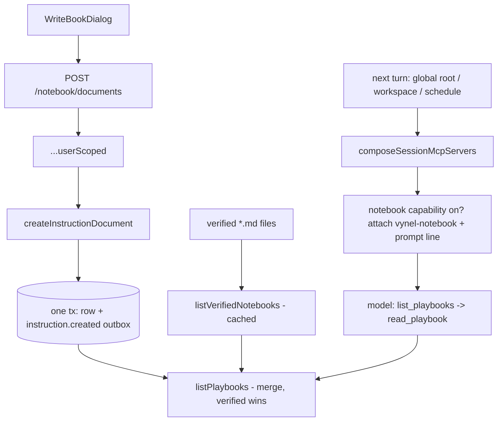
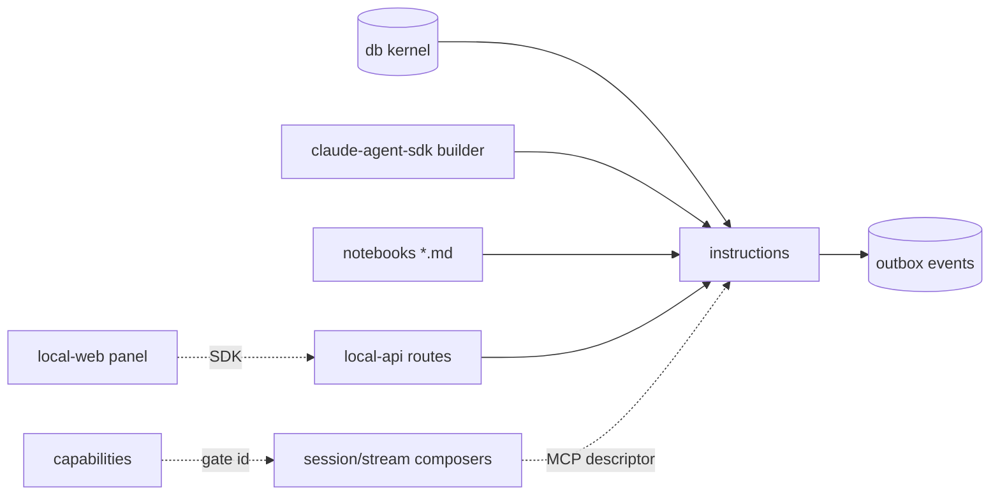

# Instructions — Structure

> The code map and connections for the instructions module. For the concepts behind it, see [overview.md](./overview.md).
>
> Folders touched: `packages/instructions/src/` · `packages/instructions/notebooks/` · `apps/local-api/src/routes/notebook/` · `apps/local-api/src/sessions/` · `apps/local-api/src/streams/` · `apps/local-web/src/components/sections/` · `apps/local-web/src/composables/notebook/`

Instructions is a vertical-slice leaf: the package owns its own `schema/`, `repositories/`, ops (`lifecycle/` · `queries/`), the verified-book loader (`notebooks/`), and the `vynel-notebook` MCP descriptor (`mcp/`) over the shared `@vynel/db` kernel. Deps: `@anthropic-ai/claude-agent-sdk` (builder exports only — `tool`, `createSdkMcpServer`), `@vynel/db`, `@vynel/errors`, `@vynel/mcp-contract`, `drizzle-orm`, `zod` (`packages/instructions/package.json`).

**Two primitives, one table, one shipped in v1.** The schema carries `mode 'always'|'notebook'`; only `'notebook'` (on-demand reference "books") is live. The `'always'` injected-instructions arc is deferred — this slice touches `@vynel/session` **not at all** (no prompt injection). See Config & gotchas for the doc-drift note: `docs/module-notes/instructions-notebook.md` still reads "PLANNED — not started", but the notebook half is fully shipped.

## File map

► = entry point.

| Path | Role |
|---|---|
| ► `packages/instructions/src/index.ts` | public barrel — the only subpath export (`.`); re-exports types, events, write/read ops, the verified shelf, the merged playbook shelf, and the MCP descriptor |
| `packages/instructions/src/schema/instruction-documents.ts` | `instruction_documents` table + `InstructionScope` / `InstructionMode` types |
| `packages/instructions/src/schema/index.ts` | schema barrel |
| `packages/instructions/src/instructions-events.ts` | 3 outbox event constants + payload types (`instruction.created/updated/deleted`) |
| `packages/instructions/src/repositories/instruction-documents.ts` | functional repo — insert / find / list (scope-visibility filter) / update / hard-delete; caps list at 200 |
| `packages/instructions/src/repositories/index.ts` | repo barrel (+ type re-exports) |
| `packages/instructions/src/queries/list-instruction-documents.ts` | read op — pins `mode='notebook'`; scope + visibility narrowing |
| `packages/instructions/src/lifecycle/create-instruction-document.ts` | validate + scope/workspace pairing + ownership gate → insert + `instruction.created` outbox (one tx) |
| `packages/instructions/src/lifecycle/update-instruction-document.ts` | ownership-gated patch (title/body/enabled/sortOrder) + `…updated` outbox (one tx) |
| `packages/instructions/src/lifecycle/delete-instruction-document.ts` | ownership-gated hard-delete + `…deleted` outbox (one tx) |
| `packages/instructions/src/lifecycle/validate-instruction-document.ts` | shared title (≤ 120) / body (≤ 50 000) boundary validation — one home for both write ops |
| `packages/instructions/src/notebooks/verified-notebooks.ts` | the VERIFIED shelf loader — reads `packages/instructions/notebooks/*.md`, hand-parses frontmatter, caches for process lifetime; loud fail on malformed/duplicate-id |
| `packages/instructions/src/mcp/playbook-shelf.ts` | the MERGE — verified books ∪ the user's enabled notebook docs; verified WINS an id collision; `deriveOneLiner` for user docs |
| `packages/instructions/src/mcp/notebook-mcp-feature-descriptor.ts` | the `vynel-notebook` `McpFeatureDescriptor` + `NOTEBOOK_PROMPT_INSTRUCTIONS` standing line; read-only, `notebook`-capability-gated |
| `packages/instructions/src/mcp/build-notebook-mcp-server.ts` | assembles the in-process `vynel-notebook` SDK MCP server from the two tool factories |
| `packages/instructions/src/mcp/list-playbooks-tool.ts` | `list_playbooks` read tool (id/title/one-liner/verified) |
| `packages/instructions/src/mcp/read-playbook-tool.ts` | `read_playbook` read tool (full markdown body by id) |
| `packages/instructions/src/mcp/mcp-tool-fn.ts` | `McpToolFn` cast type for the SDK `tool()` builder boundary |
| `packages/instructions/notebooks/*.md` | the shipped verified books — `web-app-scaffold.md`, `communicating-with-users.md` (+ `README.md`, the frontmatter contract; skipped by the loader) |
| ► `apps/local-api/src/routes/notebook/index.ts` | HTTP entry — 6 user-scoped routes; NO MCP exposure (the model reads via the descriptor) |
| `apps/local-api/src/routes/notebook/{schemas,serializers}.ts` | Zod request/response schemas · row→JSON serializer |
| `apps/local-api/src/sessions/compose-session-mcp-servers.ts` | attaches the descriptor, applies the capability gate + drops the prompt line when fully denied |
| `apps/local-web/src/components/sections/NotebookSection.vue` | the panel — verified shelf + own books, on both surfaces |
| `apps/local-web/src/components/sections/{ReadBookDialog,WriteBookDialog}.vue` | read a book · write/edit an own book |
| `apps/local-web/src/composables/notebook/*.ts` | 6 vue-query composables — shelf, playbook, own-documents, create, update, delete (+ `notebook-keys.ts`) |

## Data & persistence

One owned table, registered in the kernel's `drizzle.sqlite.config.ts` (repo root, line 52) — the schema-parity check enforces exactly-one-config registration. Migration is **`0005_instruction_documents.sql`** — an **INCREMENTAL** migration (not folded into the baseline; the first table to land after the `0000` baseline series here).

**`instruction_documents`** — one row per USER-AUTHORED book. No soft-delete (small human-curated rows; hard-delete only). Verified team books are **never** rows — they live in the repo directory.

| Column | Type | Notes |
|---|---|---|
| `id` | id (PK) | UUID supplied by the op |
| `userId` | id (FK, cascade) | → `users` — the kernel's hub table |
| `scope` | text | `global` / `workspace` (app-enforced union, no DB CHECK) |
| `workspaceId` | text (null, FK cascade) | → `workspaces`; **null for global**. Uses `text().references(...)` because `id()` is NOT NULL by dialect contract (onboarding-runs nullable-FK precedent) |
| `mode` | text (default `notebook`) | `always` / `notebook`. **`always` is RESERVED** — the deferred injected-instructions arc; no op in this slice writes or lists it |
| `title` | text | ≤ 120 chars (op layer) |
| `body` | text | markdown, ≤ 50 000 chars (op layer) — cap so a runaway paste can't balloon the table |
| `enabled` | boolean (default true) | the shelf shows enabled; the management list shows all |
| `sortOrder` | integer (default 0) | list ordering |
| `createdAt` / `updatedAt` | timestamp | |

Indexes: `(userId, mode)` — `idx_instruction_documents_user_mode` (the list read's leading filter) · `(workspaceId)` — `idx_instruction_documents_workspace`.

Both FKs point at **kernel hub tables** (`users`, `workspaces`), not another leaf — so direct FKs, not loose refs (loose refs are only for sibling-leaf targets). No loose refs into other modules.

**Verified-book source** — `packages/instructions/notebooks/*.md`, each opening with a `--- id / title / oneLiner ---` frontmatter block (hand-parsed — three known string keys don't justify a YAML dep). Loaded lazily and cached for the process lifetime (the `VERIFIED_SKILL_CATALOG` precedent). Ids must be kebab-case and unique across the shelf; a malformed file or a duplicate id is a **loud** error naming the file.

## Repositories

| Function (db-first) | Purpose |
|---|---|
| `insertDocument` | create (id supplied by caller); returns the row |
| `findDocumentById` | one document or `null` |
| `listDocumentsForUser` | user's docs; optional `mode` / `enabledOnly` / `visibleFrom` (`'global'` = global only; a workspace id = global ∪ that workspace's); ordered `sortOrder, createdAt`; caps 200 |
| `updateDocument` | patch `title`/`body`/`enabled`/`sortOrder` + bump `updatedAt`; `null` if the id is gone |
| `deleteDocument` | hard-delete; returns whether a row went |

The `mode='notebook'` policy of this slice lives at the **op** layer (`queries/list-instruction-documents.ts` pins it), not the repo — so the deferred `always` arc reuses these repo functions unchanged.

## Core operations

| Operation | What it does | Key calls |
|---|---|---|
| `createInstructionDocument` | validate title/body, enforce the scope↔workspaceId pairing (400), workspace existence + ownership (404), then insert + `instruction.created` — one tx; **pins `mode: 'notebook'`** | `validateTitle/Body`, `findWorkspaceById`, `insertDocument`, `insertOutboxEvent` |
| `updateInstructionDocument` | ownership-gated (op IS the tenant boundary); rejects an empty patch (400); validate before the tx; patch + `…updated` with `updatedFields` — one tx | `findDocumentById`, `updateDocument`, `insertOutboxEvent` |
| `deleteInstructionDocument` | ownership-gated hard-delete + `…deleted` — one tx | `findDocumentById`, `deleteDocument`, `insertOutboxEvent` |
| `listInstructionDocuments` | the UI list + the notebook tools' user-doc source; pins `mode='notebook'`; optional scope/visibility/enabled narrowing | `listDocumentsForUser` |
| `listVerifiedNotebooks` / `findVerifiedNotebookById` | cached read of the repo-shipped verified shelf | `loadVerifiedNotebooksFromDirectory` |
| `listPlaybooks` / `findPlaybookById` | the MERGED shelf — verified ∪ the caller's enabled notebook docs, **verified wins an id collision**; one home shared by the MCP tools and the HTTP routes | `listVerifiedNotebooks`, `listInstructionDocuments`, `deriveOneLiner` |

Ownership pattern: not-found and not-owned both throw the identical `NotFoundError('instruction-document', id)` (no enumeration leak). Verified books have no row, so PATCH/DELETE on a verified id 404s **by construction** — immutability is structural, not a guard.

## HTTP surface

Mounted at **`/notebook`** (`apps/local-api/src/app.ts:160`) — **user-scoped, no workspace prefix** (books live at either scope, like `/schedules`). Bundle: `describeRoute → validator → ...userScoped → handler` on `factory.createApp()`; handlers **throw** typed `VynelError`s (the global `onError` maps them). **No MCP exposure** on any route.

| Method | Path | Purpose | MCP tool |
|---|---|---|---|
| GET | `/playbooks` | the merged shelf (verified first, then own); `?workspaceId` widens to that workspace | — |
| GET | `/playbooks/:playbookId` | one book, full body (verified or own); 404 off-shelf | — |
| GET | `/documents` | the user's own books — every scope, disabled included (management view) | — |
| POST | `/documents` | create a book (global, or into one owned workspace) → 201 | — |
| PATCH | `/documents/:documentId` | edit an OWN book (title/body/enabled); verified id → 404 | — |
| DELETE | `/documents/:documentId` | hard-delete an OWN book → 204 | — |

Each route carries an `x-sdk-name` (`notebook.listPlaybooks`, `notebook.getPlaybook`, `notebook.listDocuments`, `notebook.createDocument`, `notebook.updateDocument`, `notebook.deleteDocument`) for the generated web SDK.

## MCP surface

The **`vynel-notebook`** `McpFeatureDescriptor` (`packages/instructions/src/mcp/notebook-mcp-feature-descriptor.ts`) — a **separate** in-process SDK server from the route-derived `vynel` server, because the notebook has no `x-mcp` route annotations (its HTTP surface exists but isn't MCP-exposed). Mirrors `@vynel/desktop-control`'s shape.

- **2 tools, both READ-ONLY** — `mcp__vynel-notebook__list_playbooks` (id/title/one-liner/verified) and `mcp__vynel-notebook__read_playbook` (full body by id). Both carry `annotations.readOnlyHint: true`.
- **No mutating tools, ever, in v1** (settled fork #1: "claude can make mistakes"). `mutatingToolNames: []`. Users write books through the UI; the model only reads.
- **Standing prompt line** — `contributePrompt` returns `NOTEBOOK_PROMPT_INSTRUCTIONS`: "before starting a multi-step project or task, call list_playbooks; if a book matches, read it and prefer its guidance." The one line a turn carries — everything else is fetched on demand.
- **Capability gate** — `capabilityGatedTools.notebook` lists both tools. `composeSessionMcpServers` (`apps/local-api/src/sessions/compose-session-mcp-servers.ts`) denies them when the `notebook` capability is off, and — crucially — **drops the prompt line too** when every gated tool is denied (`everyGatedToolDenied`, line 76–81), so a disabled turn doesn't steer the model into calls that can only fail. The `notebook` capability is first-party, workspace-scoped, `defaultEnabled: true` (`packages/capabilities/src/catalog.ts:31`).
- **Producer-boundary cast** — the descriptor casts `context.db` (`unknown` in the dependency-light contract) to `Database` once, documented (the `vynel` descriptor precedent).

**Attached at five turn/report points** (all via dynamic `import('@vynel/instructions')` to keep the SDK out of module load):

| Site | Turn |
|---|---|
| `apps/local-api/src/sessions/run-global-root-turn.ts:144` | global-root turn (with `vynelRoutingDescriptor`) |
| `apps/local-api/src/streams/global-root-turn.ts:99` | streaming global-root turn |
| `apps/local-api/src/streams/chat-turn.ts:48` | streaming workspace chat turn (with `vynelWorkspaceDescriptor`) |
| `apps/local-api/src/sessions/build-schedule-fire-deps.ts:36` | scheduled-task fire turn |
| `apps/local-api/src/routes/chat/fetch-context-report.ts:18` | `/context` report (so tool counts match the live turn) |

On the **global root** (no workspace → no capability override rows can exist), the composer passes `defaultEnabledCapabilityIds()` so the notebook's `defaultEnabled` tools aren't spuriously denied (`catalog.ts:52`).

## Web surface

Everything speaks the generated SDK (`notebook.*`) through vue-query; no Pinia store — keys under `notebook-keys.ts`.

- **Composables** (`apps/local-web/src/composables/notebook/`) — `use-playbook-shelf.ts` (the merged shelf per scope), `use-playbook.ts` (one full book), `use-notebook-documents.ts` (own books), `use-create-notebook-document.ts`, `use-update-notebook-document.ts`, `use-delete-notebook-document.ts`.
- **Components** — `NotebookSection.vue` (verified shelf + own books; verified are read-only badges, own are editable), `ReadBookDialog.vue` (open a book), `WriteBookDialog.vue` (write/edit an own book).
- **Mounting** — global surface: `GlobalChatView.vue` (menu section `notebook`, "Playbooks Claude reads on demand"); workspace surface: `WorkspaceSectionPanel.vue`. A workspace surface shows global ∪ that-workspace's own books (mirrors what Claude sees from that workspace).

## Pipeline — "a user writes a book, Claude opens it mid-task"

1. `apps/local-web/.../WriteBookDialog.vue` → `use-create-notebook-document.ts` → `POST /notebook/documents` → `...userScoped` → `createInstructionDocument(c.var.db, …)`.
2. `packages/instructions/src/lifecycle/create-instruction-document.ts` — validate, pairing/ownership gate, one tx: `insertDocument` (`mode: 'notebook'`) + `insertOutboxEvent('instruction.created')`.
3. On any composed turn, `apps/local-api/src/sessions/compose-session-mcp-servers.ts` attaches `notebookFeatureDescriptor` **iff** the `notebook` capability is enabled — building the `vynel-notebook` server and appending `NOTEBOOK_PROMPT_INSTRUCTIONS`.
4. The model calls `list_playbooks` → `packages/instructions/src/mcp/playbook-shelf.ts#listPlaybooks` — `listVerifiedNotebooks()` (cached repo `.md` shelf) ∪ the caller's enabled notebook docs, verified winning any id collision.
5. The model calls `read_playbook` with an id → `findPlaybookById` returns the full markdown body; the model prefers the book's guidance.

## Connections

**Summary:** instructions is a **read-side leaf that plugs into the AI seam** — consumed by the session/stream composers (as an MCP descriptor), the API routes, capabilities (the gate), and the web panel; it depends only on the kernel + shared packages + the SDK's *builder* exports. It publishes three lifecycle events; none are consumed yet.

| Unit | Direction | Mechanism | What crosses |
|---|---|---|---|
| db kernel (`@vynel/db`) | out | import | `Database`, `withTransaction`, `insertOutboxEvent`, `findWorkspaceById`, `users`/`workspaces` FKs |
| errors (`@vynel/errors`) | out | import | `NotFoundError`, `ValidationError` |
| mcp-contract (`@vynel/mcp-contract`) | out | import | `McpFeatureDescriptor`, `SessionToolContext` |
| claude-agent-sdk | out | import (**builder only**) | `tool`, `createSdkMcpServer`, `SdkMcpToolDefinition` — the permitted MCP-layer primitives, no runtime |
| local-api routes | in | import | the 6 routes + serializers; `userScoped` enforces the caller |
| local-api sessions/streams | in | import (dynamic) | `notebookFeatureDescriptor` attached at 5 turn/report points |
| [capabilities](../capabilities/overview.md) | in | id string | `'notebook'` in the catalog gates the 2 MCP tools + the prompt line |
| local-web | in | SDK | the panel calls list/read/create/update/delete |
| notebooks/*.md | out | filesystem | verified books read from the repo directory at boot |

**Events published** (each co-committed in the mutating tx): `instruction.created` · `instruction.updated` (carries `updatedFields`) · `instruction.deleted`. Payloads carry loose refs + scalars only — **never the document body**.
**Events consumed:** none — Phase 1 has no consumers; published from day one so a future subscriber (sync, activity feed) needs no producer-side migration.

## Config & gotchas

- **Doc-drift: the module note is stale.** `docs/module-notes/instructions-notebook.md` reads "**Status: PLANNED — not started**", but the **notebook half is fully shipped** — package, migration `0005`, routes, capability, MCP descriptor (attached at 5 sites), and web UI all exist and are tested. The note's *plan of record* (the two primitives, the settled forks, the scope correction) matches the shipped code; only its status line is out of date. The **always-on instructions half remains genuinely deferred** — the `always` mode column ships but no op writes/lists it and `@vynel/session` is untouched.
- **`always` mode is reserved, not wired.** Every op pins `mode='notebook'`. The column exists so the deferred injected-instructions arc needs no migration. Don't assume an `always` row does anything today — nothing reads it.
- **Verified books are structurally immutable.** They have no DB rows, so PATCH/DELETE on a verified id 404s by construction — not a guard that could be bypassed. Editing a verified book means editing its `.md` file in the repo and shipping.
- **Verified wins an id collision.** In `listPlaybooks`/`findPlaybookById` a user doc whose id matches a verified id is dropped/shadowed. User ids are UUIDs, so this only guards a deliberately crafted collision — but the list and `read_playbook` can never disagree.
- **The prompt line drops when the capability is off** — the notebook is the first descriptor combining `capabilityGatedTools` + `contributePrompt`, and `composeSessionMcpServers` special-cases it (`everyGatedToolDenied`): with `notebook` off, the turn carries neither the tools nor the "call list_playbooks" line, so the model isn't steered into denied calls.
- **Malformed verified `.md` = loud boot failure.** A missing frontmatter block, a non-kebab id, an empty field, or a duplicate id throws an error naming the file (fail-fast at first read). Cached for the process lifetime after the first successful load.
- **`/notebook` is user-scoped, not workspace-prefixed** — books live at either scope; the workspace narrowing is a `?workspaceId` query param on the shelf reads, and the scope↔workspaceId pairing is enforced in the create op (400), not the route.
- **No MCP exposure on the HTTP routes** — deliberate. The model reaches the notebook only through the `vynel-notebook` descriptor's two read tools; the HTTP surface is for the human UI. The routes carry `x-sdk-name` (web SDK) but no `x-mcp`.
- **Length caps enforced twice** — Zod at the wire (title ≤ 120, body ≤ 50 000) and again in `validate-instruction-document.ts` (the core re-validates; the wire just bounds).

---
*Mapped from the code on disk, 2026-07-14. If you change this module, update this file and [overview.md](./overview.md).*
