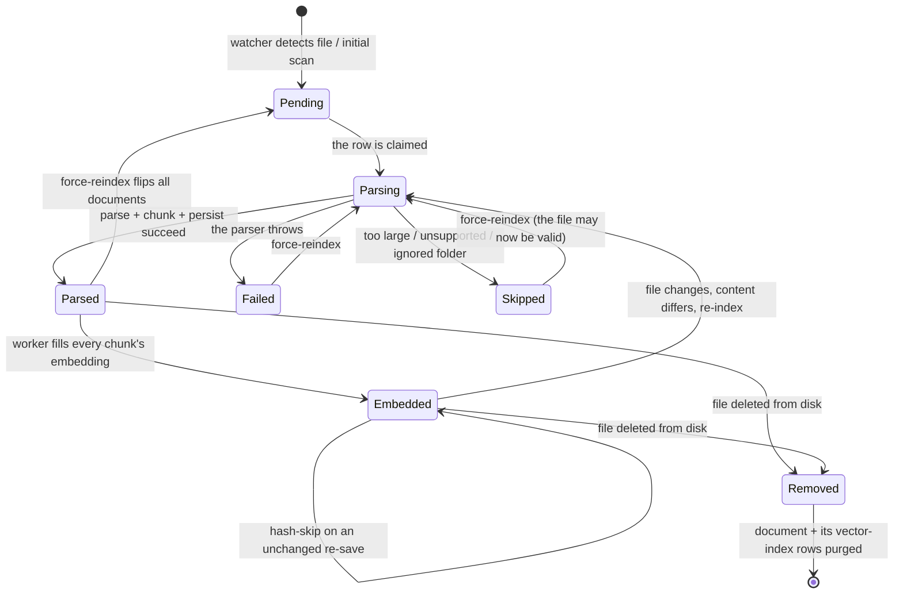

# Knowledge — Overview

> Vynel's search index over the documents on a user's disk: it watches the directories (and single files) a user has registered, parses and chunks each document, embeds the chunks, and lets the user or the assistant search that content by keyword, by meaning, or by both at once.
>
> **Status:** shipped (core package landed green; app-level wiring of the workspace-lifecycle consumers and the mutating add-to-knowledge tool is deferred) · **Depends on:** [workspaces](../workspaces/overview.md), [users](../core/overview.md) · **Code map:** [structure.md](./structure.md)

## Purpose

Knowledge is what lets Vynel understand the documents a user cares about. The user registers one or more locations on disk — a whole directory, or a single file — and knowledge takes over from there: it notices every add, change, and delete, reads each document, splits it into chunks, and eventually embeds each chunk so queries can find content by meaning rather than only exact words. The result is a searchable, always-current snapshot derived automatically from disk — the user never curates it by hand.

Two boundaries matter most. First, knowledge is the *search index*, not the file manager: it never edits a file, renames a folder, or browses the workspace tree — it only tells the user what has been indexed and lets them find it. Second, knowledge is built around a **source** — a registered location. A location can be scoped to a single workspace, or scoped **globally** to the user so it is searchable from every workspace they own. This is the deliberate improvement this rebuild makes over the old per-workspace-only design: a user can now say "add this directory to my knowledge base" and choose where it lives.

## What it can do

- **Register a source** — add a directory or a single file to knowledge at either workspace scope or global (user-level) scope. This is the mutating "add to my knowledge base" action.
- **Search** across the in-scope content by keyword, by meaning, or by both fused together (the default). A search from within a workspace spans that workspace's own sources *plus* the user's global sources.
- **Browse indexed documents** in a paginated, filterable list.
- **View a document's detail** — its metadata plus every chunk, with the character offsets that let the UI highlight what matched.
- **See indexer activity** — per-location counts of documents in each parse state, how many chunks still await embedding, and when the location was last indexed.
- **Force a re-index** of a workspace — flip every one of its documents back to pending and re-scan, for when a parser changes or the embedding model is bumped.
- **List and remove sources** the user has registered.
- **Watch each source continuously** *(background)* — pick up file adds, changes, and deletes shortly after the filesystem event, collapsing rapid saves into one indexing pass.
- **Initial-scan a source** *(background)* when it is first registered, walking its whole tree.
- **Parse seven document formats** *(background)* — markdown, plain text, PDF, Word, HTML, CSV, and JSON — reusing the shared parsers, and gracefully skipping anything too large, in an ignored folder, or in an unsupported format.
- **Embed chunks** *(background)* in a periodic worker pass, using the embedding model shared with [memory](../memory/overview.md).

## Responsibilities

**Owns** — the entire lifecycle of the three things it stores: the registered sources, the indexed documents, and their chunks, along with the two behind-the-scenes search indices (one for keyword search, one for vector similarity). It owns the file-watcher, the initial scan, every parse-and-chunk pass, the hash-skip idempotency check, the embedding worker pass, scope-fused search, and the read/list/detail/status queries. It also owns the two consumers that react to a workspace's birth and removal.

**Does not own** —
- the file *manager* — browsing, opening, editing, or renaming files is the [files](../files/overview.md) domain;
- the *parsing and chunking algorithms* — those are pure, database-free helpers in the shared indexer package;
- the *embedding model itself* — that is a shared infrastructure package, also used by [memory](../memory/overview.md); knowledge is simply its first real consumer;
- workspace creation, archival, and hard-delete — that is [workspaces](../workspaces/overview.md); knowledge only *reacts* to those events;
- the user and tenancy model — that is [users](../core/overview.md);
- the periodic scheduler that fires the embedding worker pass — that belongs to the worker app;
- exposing its capabilities to the assistant as tools, and putting an approval card in front of the mutating add action — that is the MCP and approvals layers wiring the core in.

## Concepts & vocabulary

| Term | Meaning |
|---|---|
| **Source** | A location on disk the user has registered to index — a whole directory, or a single file. Everything else hangs off a source. Carries a scope and, for workspace sources, the workspace it belongs to. |
| **Scope** | Where a source lives: **workspace** (searchable only within that workspace) or **global** (searchable from all of the user's workspaces). Global sources have no workspace attached. |
| **Source kind** | Whether the source points at a directory (index the whole tree) or a single file (index just that one document). A single-file source must be a format the parsers understand, or registration is refused. |
| **Document** | One indexed file. Tracks its path relative to the source, its kind, size, modified time, parse status, content hash, and chunk count. No soft-delete — documents are re-derivable from disk. |
| **Parse status** | A document's lifecycle: pending → parsing → parsed (success), or failed (the parser threw), or skipped (too large, unsupported, or in an ignored folder). |
| **Document kind** | The format derived from the file's extension: markdown, plain text, PDF, Word, HTML, CSV, JSON — or unsupported. |
| **Chunk** | One slice of a parsed document: a contiguous span of text with start/end character offsets, a rough token estimate, and eventually an embedding. |
| **Content hash** | A fingerprint taken over the *parsed text* (not the raw bytes). Drives the hash-skip: unchanged content means no re-chunking and no announcement. |
| **Embedding** | The numeric vector for a chunk, produced by the shared model, empty until the worker fills it. It also lives in the vector search index. |
| **Hash-skip** | When a re-index produces the same content fingerprint as before and the document was already parsed, only file metadata is refreshed — no chunk churn, no event. The property that makes the watcher safe. |
| **Hybrid search** | The default search mode: run keyword search and meaning search independently, then fuse their ranked lists with Reciprocal Rank Fusion (the same fusion constant memory uses). |
| **The watcher** | A stateful service holding one file-watcher per active source, a short debounce timer per path, and a small in-memory ring of recent activity events per source. |

## Rules & invariants

- **Everything hangs off a source.** A document and its chunks belong to exactly one source; a search resolves the in-scope sources first (this workspace's own plus the user's global ones) and only ever looks inside those.
- **Every document belongs to exactly one user.** The user is the tenant boundary and is always present, even for global content that has no workspace.
- **No soft-delete on documents or chunks.** They are fully re-derivable from disk, so they are hard-deleted when their source or workspace goes away; the only lifecycle states are the parse-status values.
- **Slow work never happens inside a database transaction.** Filesystem reads, parser calls, and model inference all run outside the transaction; only the quick, synchronous writes go inside it — a locked constraint of the database runtime.
- **Each filesystem event is debounced.** Rapid saves from an editor collapse into a single indexing pass, and a write-settling guard avoids reading a half-written file.
- **The hash-skip is an idempotency guarantee.** Re-indexing identical content never churns chunks and never fires an event — essential, because the watcher sees every single save.
- **Every state change announces itself atomically.** The write and its outbox event are committed together in one transaction, so a consumer can never see a change that was never announced.
- **A registered path is validated before it is trusted.** It must be an absolute, existing, readable path; a filesystem root or the home-directory root is refused outright; a single-file source must be a parseable format.
- **The vector search index is not automatically cleaned by the database.** Removing a document cascades to its relational chunk rows, but the vector-index rows are deleted explicitly by code.

## Lifecycle

## Where it sits in the bigger picture

Knowledge is a quiet but load-bearing part of the workspace experience. When [workspaces](../workspaces/overview.md) reports that a workspace was created, knowledge reacts by registering that workspace's folder as its first source, arming the watcher, and running the initial scan — so a fresh workspace is searchable without the user doing anything. When the workspace is archived or deleted, knowledge stops its watchers and lets the cascade clean up the rows. These reactions are written and tested; the shared machinery that delivers those events to them is deferred wiring in this rebuild, shared with the memory and approvals consumers.

Knowledge shares its embedding model with [memory](../memory/overview.md) through a common infrastructure package, and its parsers and chunker through a shared indexer package — both database-free and cross-domain-safe. The model loads lazily on first use, so whichever domain's worker pass fires first pays the one-time warm-up for both. Knowledge is the first domain to exercise the real model.

The assistant reaches knowledge through the MCP layer: reading tools for search, listing, document detail, and indexer status, plus the mutating add-to-knowledge action that registers a new source — which, because it writes, is meant to sit behind an approval card. That mutating tool and its card are the deliberate improvement flagged for follow-up; the old design exposed only read tools and never let the assistant grow the knowledge base itself.

---
*Mapped from the code on disk, 2026-07-14. If you change this module, update this file and [structure.md](./structure.md).*
