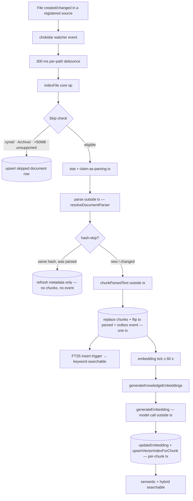
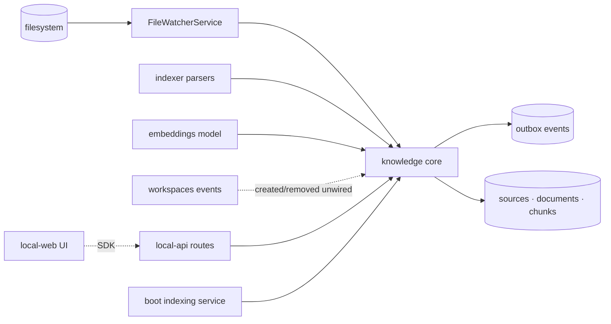

# Knowledge — Structure

> The code map and connections for the knowledge module. For the concepts behind it, see [overview.md](./overview.md).
>
> Folders touched: `packages/knowledge/src/` · `apps/local-api/src/routes/knowledge/` · `apps/local-api/src/services/knowledge-indexing-service.ts` · `apps/local-web/src/{components/sections,composables/knowledge}/` · `apps/worker/src/jobs/knowledge/` · `packages/db/src/migrations-sqlite/`

Knowledge is a **vertical-slice leaf**: one package (`@vynel/knowledge`) owns its schema (`sources` + `documents` + `chunks`), its repositories, and every core operation. The `apps/local-api` routes, the `apps/local-web` UI, and the MCP tool registry are thin surfaces over it. It depends outward only on the kernel (`@vynel/db`), shared (`@vynel/errors`, `@vynel/logger`), and two sibling utility packages (`@vynel/indexer` for parsing/chunking, `@vynel/embeddings` for the model).

## File map

`► ` = entry point.

| Path | Role |
|---|---|
| ► `packages/knowledge/src/index.ts` | public barrel for `@vynel/knowledge` — re-exports every op, type, and the watcher |
| `packages/knowledge/src/knowledge-types.ts` | domain-only types: `SkipReason`, `SearchMode`, `ListDocumentsCursor`, `ActivityEvent`, `IndexerStatus`, `KnowledgeSearchResult`; re-exports row types + `StructuralLogger` |
| `packages/knowledge/src/knowledge-events.ts` | 3 outbox event constants (`indexed`/`updated`/`removed`) + payload types |
| **schema** | |
| `packages/knowledge/src/schema/sources.ts` | `knowledge_sources` table — the registered-directory registry; `KnowledgeSourceScope` (`workspace`/`global`), `KnowledgeSourceKind` (`directory`/`file`); two partial-unique indexes |
| `packages/knowledge/src/schema/documents.ts` | `knowledge_documents` table · `DocumentKind` + `ParseStatus` enums · row types |
| `packages/knowledge/src/schema/chunks.ts` | `knowledge_chunks` table · row types · `bytes()` embedding column |
| `packages/knowledge/src/schema/index.ts` | schema barrel |
| **repositories** (functional, `db`-first) | |
| `packages/knowledge/src/repositories/index.ts` | repo barrel (sources + documents + chunks + search) |
| `packages/knowledge/src/repositories/sources.ts` | source repo — insert / find-by-id / find-by-path / list-for-workspace (scope-fused) / list-all / list-global / list-in-scope-ids / delete |
| `packages/knowledge/src/repositories/documents.ts` | document repo — find (by source-path / workspace-path / id) / list (cursor) / insert / update / hard-delete / mark-all-pending / `summarizeKnowledgeDocumentsBySource` / status-rollup |
| `packages/knowledge/src/repositories/chunks.ts` | chunk repo — insertMany / deleteForDocument / listForDocument / listNeedingEmbedding / updateEmbedding / countUnindexed |
| `packages/knowledge/src/repositories/search.ts` | hybrid search + `upsertVectorIndexForChunk` / `deleteVectorIndexForDocument` / `deleteVectorIndexForSource` — wraps `knowledge_chunks_fts` (FTS5) + `knowledge_chunks_vec` (sqlite-vec); dialect branch (Postgres path throws in Phase 1) |
| **indexing ops** | |
| `packages/knowledge/src/indexing/index-file.ts` | `indexFile` — load-bearing orchestrator: skip-check → stat → claim-as-parsing → parse → hash-skip-or-chunk → persist + outbox, in ordered async/sync phases |
| `packages/knowledge/src/indexing/index-workspace.ts` | `indexSource` — initial scan of a source; walks dir (concurrency 4), calls `indexFile` per file (a `file`-kind source is a single doc, no walk) |
| `packages/knowledge/src/indexing/force-reindex-workspace.ts` | `forceReindexWorkspace` — flip a workspace's docs to pending, then re-scan its own workspace-scoped source(s) |
| `packages/knowledge/src/indexing/remove-file-from-index.ts` | `removeFileFromIndex` — hard-delete document + explicit `deleteVectorIndexForDocument` + outbox event |
| `packages/knowledge/src/indexing/upsert-skipped-document.ts` | insert-or-update helper for the three skip paths in `indexFile` |
| `packages/knowledge/src/indexing/content-hash.ts` | `sha256` over parsed text — drives hash-skip on re-index |
| `packages/knowledge/src/indexing/generate-knowledge-embeddings.ts` | `generateKnowledgeEmbeddings` — batch op; model call outside tx; per-chunk tx: `updateEmbedding` + `upsertVectorIndexForChunk` |
| `packages/knowledge/src/indexing/file-watcher.ts` | `FileWatcherService` — stateful; one chokidar watcher per *source*; 300 ms per-path debounce; 100-event activity ring buffer per source |
| **queries** | |
| `packages/knowledge/src/queries/search-knowledge.ts` | `searchKnowledge` — embed query if semantic/hybrid, resolve in-scope source ids, delegate to search repo |
| `packages/knowledge/src/queries/list-documents-for-workspace.ts` | `listDocumentsForWorkspace` — cursor ISO↔Date conversion + `nextCursor` envelope |
| `packages/knowledge/src/queries/get-document-detail.ts` | `getDocumentDetail` — document + ordered chunks, throws `NotFoundError` |
| `packages/knowledge/src/queries/get-indexer-status.ts` | `getIndexerStatus` — combines document-count rollup with unindexed-chunk count |
| **sources ops** | |
| `packages/knowledge/src/sources/register-knowledge-source.ts` | `registerKnowledgeSource` — validate path → insert source → start watcher → initial `indexSource` scan |
| `packages/knowledge/src/sources/remove-knowledge-source.ts` | `removeKnowledgeSource` — stop watcher → purge vec rows → delete source (cascades docs+chunks); idempotent |
| `packages/knowledge/src/sources/list-knowledge-sources.ts` | `listKnowledgeSources` (scope-fused) + re-exports `summarizeKnowledgeDocumentsBySource` |
| `packages/knowledge/src/sources/path-safety.ts` | `resolveIndexableSourceKind` — validates absolute/existing/readable, refuses fs-root & home-root, resolves directory-vs-file, rejects unsupported single files |
| `packages/knowledge/src/sources/source-paths.ts` | the ONE home for path resolution: `sourceRootFor` + `sourceRelativePathFor` (directory vs single-file) |
| **lifecycle** (outbox consumers, *written + exported, not dispatcher-wired*) | |
| `packages/knowledge/src/lifecycle/handle-workspace-created.ts` | `handleWorkspaceCreated` — ensure workspace-folder source + start watcher + initial scan |
| `packages/knowledge/src/lifecycle/handle-workspace-removed.ts` | `handleWorkspaceRemoved` — stop the workspace's watchers idempotently |
| **surfaces** | |
| ► `apps/local-api/src/routes/knowledge/index.ts` | HTTP entry — 8 routes (7 exposed as MCP tools) |
| `apps/local-api/src/routes/knowledge/schemas.ts` | Zod request/response schemas |
| `apps/local-api/src/routes/knowledge/serializers.ts` | row → JSON serializers (document, chunk, search result, indexer status, source, source-list-item) |
| `apps/local-api/src/services/knowledge-indexing-service.ts` | in-process boot service: restore watchers + catch-up scan + 60 s embedding tick |
| `apps/worker/src/jobs/knowledge/generate-knowledge-embeddings.ts` | split-process cron twin — thin `(db, logger) → generateKnowledgeEmbeddings(...)` delegator |
| `apps/local-web/src/components/sections/KnowledgeSection.vue` | the knowledge vault UI (both surfaces) — source list + indexing rollup + add/remove |
| `apps/local-web/src/components/sections/AddKnowledgeDialog.vue` | filesystem-walking add dialog — pick a folder or single file + choose scope |
| `apps/local-web/src/composables/knowledge/use-knowledge-sources-in-scope.ts` | vue-query read — a workspace's sources + user's global (global surface merges all workspaces, dedupes) |
| `apps/local-web/src/composables/knowledge/use-add-knowledge-source.ts` | vue-query mutation — `knowledge.addSource` |
| `apps/local-web/src/composables/knowledge/use-remove-knowledge-source.ts` | vue-query mutation — `knowledge.removeSource` |

## Data & persistence

Three owned tables, all under one `@vynel/db` kernel. Everything hangs off a **source** — the registry row that names a directory (or single file) the user registered at `workspace` or `global` scope.

**`knowledge_sources`** — the registered-directory registry.

| Column | Type | Notes |
|---|---|---|
| `id` | id (PK) | |
| `userId` | id (FK → users, cascade) | tenant boundary |
| `workspaceId` | text (FK → workspaces, cascade, **nullable**) | non-null for a workspace source; NULL for a global source |
| `scope` | text (not null) | `'workspace'` \| `'global'` |
| `absolutePath` | text (not null) | the directory or single file on disk |
| `sourceKind` | text (not null, default `'directory'`) | `'directory'` \| `'file'` (added in migration `0003`) |
| `createdAt`, `updatedAt` | timestamp | |

Indexes: `userId`; `workspaceId`; partial unique `(workspaceId, absolutePath) WHERE scope='workspace'`; partial unique `(userId, absolutePath) WHERE scope='global'`. Two partial uniques because SQLite treats NULLs as distinct — a plain unique can't pin NULL-workspace global rows.

**`knowledge_documents`** — one row per indexed file. No `deletedAt` (hard-delete only — re-derivable from disk).

| Column | Type | Notes |
|---|---|---|
| `id` | id (PK) | |
| `userId` | id (FK → users, cascade) | |
| `workspaceId` | text (FK → workspaces, cascade, **nullable**) | NULL for a global document |
| `sourceId` | id (FK → knowledge_sources, cascade) | the source this doc belongs to |
| `scope` | text (not null, default `'workspace'`) | denormalized from the source |
| `relativePath` | text (not null) | forward-slash-normalized; **relative to the source dir** |
| `documentKind` | text | `DocumentKind` enum |
| `contentHash` | text (not null) | SHA-256 of parsed text; drives hash-skip; `''` for skipped docs |
| `fileSizeBytes` | integer | |
| `fileModifiedAt` | timestamp | |
| `chunkCount` | integer | denormalized; saves a join on the list view |
| `parseStatus` | text | `pending`/`parsing`/`parsed`/`failed`/`skipped` |
| `parseErrorMessage` | text (null) | non-null only when `parseStatus === 'failed'` |
| `indexedAt` | timestamp (null) | null while pending; set when `parsed`; keyset cursor column |
| `createdAt`, `updatedAt` | timestamp | |

Indexes: `userId`; `workspaceId`; `(workspaceId, parseStatus)`; `(workspaceId, indexedAt)`; `sourceId`; **unique `(sourceId, relativePath)`** (uniqueness moved off `workspaceId` — a path is now relative to its source, and global docs have no workspace).

**`knowledge_chunks`** — one row per chunk. No `userId` and **no `workspaceId`** column (tenant + workspace scope flow transitively via `documentId → knowledge_documents`; scope filtering in search flows via `documentId → sourceId`).

| Column | Type | Notes |
|---|---|---|
| `id` | id (PK) | |
| `documentId` | id (FK → knowledge_documents, cascade, not null) | |
| `chunkIndex` | integer | 0-based; preserves chunk sequence |
| `startCharOffset`, `endCharOffset` | integer | span into parsed text |
| `chunkText` | text | drives FTS5 (via trigger) + embedding |
| `chunkTokenEstimate` | integer | ≈ `characterCount / 4` |
| `embedding` | bytes (null) | 384 × float32 = 1536 bytes; null until worker fills it |
| `embeddingModelVersion` | text (null) | e.g. `all-MiniLM-L6-v2/v1` |
| `createdAt` | timestamp | |

Index: `(documentId, chunkIndex)`.

**Two virtual search indices**, created in raw SQL migration DDL (not Drizzle schema files):

- **`knowledge_chunks_fts`** — FTS5, **external-content** over `knowledge_chunks` (`content='knowledge_chunks'`, `content_rowid='rowid'`). The only indexed column is `chunk_text` (column index 0). Maintained by three triggers: `knowledge_chunks_fts_insert` (AFTER INSERT), `_delete` (AFTER DELETE), `_update` (AFTER UPDATE OF chunk_text). `snippet(knowledge_chunks_fts, 0, '<mark>', '</mark>', '…', 32)` emits marked snippets.
- **`knowledge_chunks_vec`** — `sqlite-vec` `vec0` table: `(chunk_id TEXT PRIMARY KEY, source_id TEXT, document_id TEXT, embedding float[384])`. **No FK cascades** — rows must be explicitly deleted by code (`deleteVectorIndexForDocument` / `deleteVectorIndexForSource`).

**Migrations** are baseline-folded: all three tables + both virtual tables + the FTS triggers live in `packages/db/src/migrations-sqlite/0000_baseline.sql`; `0003_knowledge_source_kind.sql` adds `source_kind`.

## Repositories

| Function | Purpose |
|---|---|
| `insertKnowledgeSource` / `findKnowledgeSourceById` / `deleteKnowledgeSource` | source CRUD |
| `findWorkspaceSourceByPath(db, {workspaceId, absolutePath})` | one workspace source or null |
| `listKnowledgeSourcesForWorkspace(db, {userId, workspaceId})` | workspace's sources + user's global sources |
| `listAllKnowledgeSources(db)` | every source (boot-time watcher restore) |
| `listGlobalKnowledgeSourcesForUser(db, userId)` | the user's global sources |
| `listInScopeSourceIds(db, {userId, workspaceId})` | the source-id set a workspace search spans |
| `findKnowledgeDocumentBySourcePath` / `findKnowledgeDocumentByWorkspacePath` / `findKnowledgeDocumentById` | one document or null |
| `listKnowledgeDocumentsForWorkspace(db, workspaceId, opts)` | keyset cursor `(indexedAt DESC NULLS LAST, id DESC)` |
| `insertKnowledgeDocument` / `updateKnowledgeDocument` / `hardDeleteKnowledgeDocument` | document writes |
| `markAllKnowledgeDocumentsPendingForWorkspace` | force-reindex prep |
| `summarizeKnowledgeDocumentsBySource(db, sourceIds[])` | per-source doc/indexed/failed rollup for the sources list |
| `getKnowledgeIndexerStatusForWorkspace` | one-query conditional-SUM status rollup |
| `insertKnowledgeChunks` / `hardDeleteKnowledgeChunksForDocument` / `listKnowledgeChunksForDocument` | chunk writes + read |
| `listKnowledgeChunksNeedingEmbedding(db, {limit})` | `embedding IS NULL` (returns `{chunk, sourceId}` for vec upsert); default 100 |
| `updateKnowledgeChunkEmbedding` | set embedding + model tag |
| `countUnindexedKnowledgeChunksForWorkspace` | `embedding IS NULL` count for the status dashboard |
| `searchKnowledgeChunks(db, input)` | FTS5 / semantic / hybrid; dialect-branch (Postgres throws) |
| `upsertVectorIndexForChunk` | DELETE + INSERT on `knowledge_chunks_vec` (vec0 has no ON CONFLICT) |
| `deleteVectorIndexForDocument` / `deleteVectorIndexForSource` | purge vec rows (not FK-cascaded) |

## Core operations

| Operation | What it does | Key calls (outbox / tx) |
|---|---|---|
| `indexFile(db, {source, relativePath})` *(async)* | skip-check → stat → claim-as-parsing → parse → hash-skip-or-chunk → persist. Async I/O outside tx; DB writes inside 2–3 sync txs. | `upsertSkippedDocument`, `resolveDocumentParser`, `chunkParsedText`, `sha256`, `insertKnowledgeChunks`, `updateKnowledgeDocument`, `insertOutboxEvent` (indexed/updated) |
| `indexSource(db, source)` *(async)* | walk the source dir (concurrency 4) or one file, call `indexFile`, count parsed/skipped/failed | `indexFile` |
| `forceReindexWorkspace(db, input)` *(async)* | mark the workspace's docs pending, then re-scan the workspace's OWN sources only (global sources excluded — reindexed separately) | `markAllKnowledgeDocumentsPendingForWorkspace`, `listKnowledgeSourcesForWorkspace` + filter `workspaceId`, `indexSource` |
| `removeFileFromIndex(db, {source, relativePath})` | hard-delete document → explicit vec purge → outbox event | `hardDeleteKnowledgeDocument`, `deleteVectorIndexForDocument`, `insertOutboxEvent` (removed) |
| `registerKnowledgeSource(db, input, deps)` *(async)* | validate path → insert source → start watcher → initial scan | `resolveIndexableSourceKind`, `insertKnowledgeSource`, `FileWatcherService.startWatchingSource`, `indexSource` |
| `removeKnowledgeSource(db, sourceId, deps)` *(async)* | stop watcher → tx: purge vec rows + delete source (cascades docs+chunks) | `stopWatchingSource`, `deleteVectorIndexForSource`, `deleteKnowledgeSource` |
| `searchKnowledge(db, input)` *(async)* | embed query if semantic/hybrid, resolve in-scope sources, search | `generateEmbedding`, `listInScopeSourceIds`, `searchKnowledgeChunks` |
| `listDocumentsForWorkspace` / `getDocumentDetail` / `getIndexerStatus` | read queries; detail 404s if missing | repo reads |
| `generateKnowledgeEmbeddings(db)` *(async)* | batch 50 chunks; model call outside tx; per-chunk tx: update embedding + upsert vec row; aborts the batch if the first chunk fails (model unavailable) | `listKnowledgeChunksNeedingEmbedding`, `generateEmbedding`, `updateKnowledgeChunkEmbedding`, `upsertVectorIndexForChunk` |
| `FileWatcherService` | stateful; one chokidar watcher per *source*; 300 ms debounce; 100-event ring buffer | `indexFile`, `removeFileFromIndex` |
| `handleWorkspaceCreated(db, payload, deps)` *(async)* | ensure the workspace-folder source + start watcher + initial scan — *written, not dispatcher-wired* | `FileWatcherService.startWatchingSource`, `indexSource` |
| `handleWorkspaceRemoved(payload, deps)` *(async)* | consumes `workspace.archived` / `workspace.hard-deleted` → stop every watcher of the workspace (doc/chunk/source rows drop via FK cascade) — *written, not dispatcher-wired* | `FileWatcherService.stopWatchingWorkspace` |

## HTTP surface

Mounted at `/workspaces/:workspaceId/knowledge` from `apps/local-api/src/app.ts`. The whole subtree runs `featureGate('knowledge')` (entitlement tier gate) then the per-route `...workspaceScoped` bundle. Every response typed; the chain is `describeRoute → validator → workspaceScoped → handler`.

| Method | Path | Purpose | MCP tool |
|---|---|---|---|
| GET | `/documents` | list; kind filter, exact-path filter, cursor | `list_knowledge_documents` (read) |
| GET | `/documents/:documentId` | document + ordered chunks (404 if cross-workspace) | `get_knowledge_document` (read) |
| GET | `/search` | FTS / semantic / hybrid; `documentKindFilter` comma-list | `search_knowledge` (read) |
| GET | `/status` | indexer status counts + `lastIndexedAt` | `get_indexer_status` (read) |
| POST | `/reindex` | force-reindex the workspace | *not exposed (mutating, per D16)* |
| POST | `/sources` | register a directory/file at a scope; injects `c.var.fileWatcher` | `add_to_knowledge` (**mutating**) |
| GET | `/sources` | list in-scope sources + per-source indexing summary | `list_knowledge_sources` (read) |
| DELETE | `/sources/:sourceId` | stop watching + purge the source | `remove_knowledge_source` (**mutating**) |

## MCP surface

Knowledge does not ship a hand-wired descriptor; its tools are **generated from route `x-mcp` metadata** into `apps/mcp/src/generated/api-tools.ts` (schema/MCP parity is part of the gate). Seven tools total: four read GETs plus `add_to_knowledge`, `list_knowledge_sources`, and `remove_knowledge_source`. The two mutating tools (`add_to_knowledge`, `remove_knowledge_source`) declare `mutatingApproved: true` in their `x-mcp` block. `POST /reindex` is deliberately **not** exposed. The capability/entitlement gate is the `featureGate('knowledge')` middleware on the route subtree — in-process MCP tool calls re-enter through the same routes, so agent and UI share one rulebook.

## Background jobs & the in-process service

The **desktop app runs no `apps/worker`**, so `apps/local-api/src/services/knowledge-indexing-service.ts` (`startKnowledgeIndexingService`, started in `server.ts`) is what keeps knowledge live:

| Task | Trigger | Runs |
|---|---|---|
| watcher restore | boot | `listAllKnowledgeSources` → `fileWatcher.startWatchingSource` per source (watchers are in-memory, don't survive restart) |
| catch-up scan | boot (background) | `indexSource` per source — a file added/edited while the app was closed still lands; hash-skip keeps unchanged files cheap; then one embedding tick |
| embedding tick | every 60 s (`setInterval`) | `generateKnowledgeEmbeddings` (batch 50); an `inFlight` guard prevents overlap during the ~1 s model warm-up |

`apps/worker/src/jobs/knowledge/generate-knowledge-embeddings.ts` is the split-process cron twin (per-minute) — idempotent per chunk, so an overlap with the in-process tick is harmless. No purge job — knowledge hard-deletes.

## Web surface

`KnowledgeSection.vue` is the vault UI on both the workspace and global surfaces: it reads `useKnowledgeSourcesInScope(scope)`, renders each source with a plain-words indexing rollup (`N files indexed · M failed · updated …`), and offers add (`AddKnowledgeDialog.vue`) + remove. The dialog walks the real filesystem (`use-directory-listing`), lets you pick a folder or a single file, and choose `workspace`/`global` scope. Every knowledge route is workspace-anchored even for a global source — the composables pass an `anchorWorkspaceId`; `scope` decides where the source actually lives. The global surface has no single anchor, so `use-knowledge-sources-in-scope` merges every workspace's `listSources` and dedupes (global sources appear in each). All three composables invalidate the `["knowledge"]` query key on mutation.

## Pipeline — "file changes on disk → searchable"

1. `FileWatcherService` (chokidar, `ignoreInitial: true`, `followSymlinks: false`) → 300 ms debounce → `indexFile(db, { source, relativePath })` — `packages/knowledge/src/indexing/file-watcher.ts:99`.
2. Skip checks in `index-file.ts:84`: `.vynel/` / `Archive/` prefix → `in-skipped-folder`; size > 50 MB → `too-large`; unsupported extension → `unsupported-format`. Each lands via `upsertSkippedDocument`.
3. Eligible: `stat` + claim-as-`parsing` tx (insert or update, keyed on `(source, path)`) — `index-file.ts:122`.
4. Parse + SHA-256 outside the tx. Hash-skip (`index-file.ts:165`): if `contentHash` unchanged and previous status was `parsed`, only file metadata is refreshed — no chunk ops, no event.
5. `chunkParsedText` outside tx → one tx (`index-file.ts:182`): `hardDeleteKnowledgeChunksForDocument` + `insertKnowledgeChunks` + `updateKnowledgeDocument` (→ `parsed`) + `insertOutboxEvent` (`indexed` if new, else `updated`). The FTS5 insert trigger fires inside the same tx.
6. Within a minute: `generateKnowledgeEmbeddings` (`indexing/generate-knowledge-embeddings.ts:34`) → for each chunk with `embedding IS NULL`: `generateEmbedding` (outside tx) → per-chunk tx: `updateKnowledgeChunkEmbedding` + `upsertVectorIndexForChunk` (DELETE + INSERT on `knowledge_chunks_vec` with `source_id`).
7. `GET /search?query=…` → `searchKnowledge` (`queries/search-knowledge.ts:40`) → embeds query (semantic/hybrid) → resolves `listInScopeSourceIds` (workspace's sources + user's global) → `searchKnowledgeChunks` fuses FTS5 + sqlite-vec via RRF (k=60) → JSON with `<mark>` snippets.

The initial source scan follows the same `indexFile` path from `indexSource` (concurrency 4), triggered on `registerKnowledgeSource`, `handleWorkspaceCreated`, and the boot catch-up scan.

## Connections

**Summary:** knowledge is a **filesystem-driven, self-maintaining leaf**. It depends outward on the kernel, the indexer parsers, the embeddings model, and workspaces (for lifecycle signals). It publishes three outbox events but no Phase-1 domain consumes them. Its only inbound cross-domain coupling is at the surfaces: routes, the boot service (injects the `FileWatcherService`), the generated MCP tools, and the web UI.

| Unit | Direction | Mechanism | What crosses |
|---|---|---|---|
| `@vynel/db` | out | import | `Database`, `withTransaction`, dialect, `users`/`workspaces` schema, `insertOutboxEvent` |
| `@vynel/indexer` | out | import | `resolveDocumentParser`, `deriveDocumentKindFromPath`, `chunkParsedText` (pure helpers, no db) |
| `@vynel/embeddings` | out | import | `generateEmbedding`, `EMBEDDING_MODEL_VERSION` (shared singleton) |
| `@vynel/errors` | out | import | `NotFoundError`, `ValidationError` |
| `@vynel/logger` | out | import (type) | `StructuralLogger` |
| workspaces | in (event) | outbox consumer *(unwired)* | `workspace.created` → source + watcher + scan; `workspace.archived`/`hard-deleted` → stop watchers |
| local-api routes | in | route mount | 8 routes; `featureGate('knowledge')` + `workspaceScoped` |
| local-api boot service | in | import + injected dep | restores watchers, catch-up scan, 60 s embedding tick; owns the `FileWatcherService` instance |
| worker | in | import | `generate-knowledge-embeddings` cron twin |
| mcp | in | generated tools | 7 tools from route `x-mcp` |
| local-web | in *(frontend)* | SDK | sources list + add/remove composables |
| `@vynel/files` (test) | in *(test only)* | import | shared test helper |

**Events published** (each co-committed in the state-change tx):
- `knowledge.document-indexed` — new document parsed and chunked
- `knowledge.document-updated` — existing document re-parsed with a new content hash
- `knowledge.document-removed` — document hard-deleted from the index

**Events consumed:** `workspace.created` (→ `handleWorkspaceCreated`) and `workspace.archived`/`workspace.hard-deleted` (→ `handleWorkspaceRemoved`). Both handlers are written and exported but **not yet wired to an outbox dispatcher** — the workspace-folder source is auto-registered / watched via the boot service and `registerKnowledgeSource` instead.

## Config & gotchas

- **`sqlite-vec` must be loaded at connection** or any query/migration touching `knowledge_chunks_vec` fails with `no such module: vec0`.
- **Dialect:** the Postgres branch of `searchKnowledgeChunks` throws ("Phase 2 only"). Phase 1 is SQLite-only.
- **`knowledge_chunks_vec` has no FK cascade** — vec rows must be explicitly purged (`deleteVectorIndexForDocument` on file removal, `deleteVectorIndexForSource` on source removal). Forgetting this leaves orphan vec rows returning stale results.
- **Semantic search queries per-source, not per-`IN`-set.** `vec0`'s KNN pre-filter takes a single-equality metadata match, so `searchSemanticOnly` loops each in-scope `source_id`, runs a separate `v.source_id = ?` KNN, and merges + re-sorts in app. Do not "optimize" to a single `IN (...)` without verifying vec0 supports it as a pre-filter.
- **FTS5 phrase escaping** (`quoteFtsPhrase`): doubles embedded `"` and wraps the phrase — DSL escaping, not SQL escaping. Raw input like `foo()` or an unclosed quote would otherwise crash the FTS5 parser.
- **Embedding model:** `all-MiniLM-L6-v2` (via `@vynel/embeddings`), 384 dims, lazy process-wide singleton (~25 MB download + ~1 s warm-up on first call). The version tag `all-MiniLM-L6-v2/v1` is written per chunk — bump the suffix, not the model name, when chunking changes incompatibly. `generateKnowledgeEmbeddings` aborts the whole batch if the *first* chunk fails (that's the model, not the chunk) and retries next tick.
- **Workspace-event consumers are written but not dispatcher-wired** — the workspace folder becomes a source via the boot service, not via `handleWorkspaceCreated` firing off the outbox.
- **Feature-gate is HTTP-only** (recorded in the gate file): a pro→basic downgrade does *not* stop the running file watcher or the boot embedding tick — they run via direct package calls in the boot service, outside HTTP. Pausing background execution per-entitlement is a deliberate follow-on.
- **Global-scope documents are unreachable via the detail route.** `GET /documents/:documentId` (`routes/knowledge/index.ts:147`) 404s when `detail.document.workspaceId !== c.var.workspace.id`. A global document has `workspaceId = null`, so it can never satisfy that check — the detail route (and `get_knowledge_document` tool) only ever returns workspace-scoped documents. Global knowledge is reachable through `search` and `list_knowledge_sources`, but not document-detail. Sharp edge / latent gap the next editor should weigh.
- **Stale in-code comments (drift to fix):** `schema/chunks.ts` header still says "`workspaceId` IS denormalized (without FK)" but the column was removed in the sources rebuild — chunks scope now flows via `documentId → sourceId`. `repositories/search.ts` header lists FTS column indices `0=chunk_id, 1=workspace_id, 2=document_id, 3=chunk_text`, but the shipped FTS5 table is external-content with `chunk_text` as the sole column (index 0), which is what `snippet(...)` actually uses. Neither affects behavior; both are comment artifacts.

---
*Mapped from the code on disk, 2026-07-14. If you change this module, update this file and [overview.md](./overview.md).*
